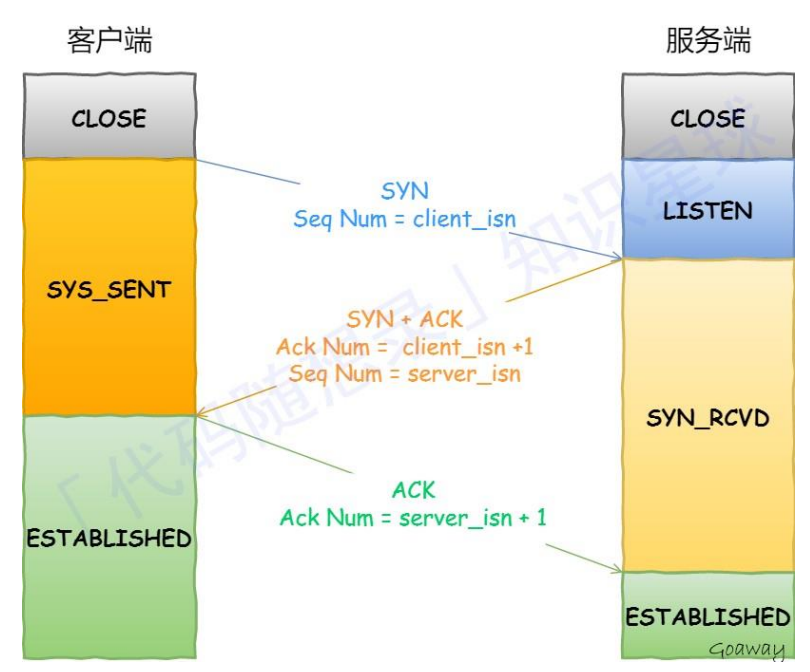
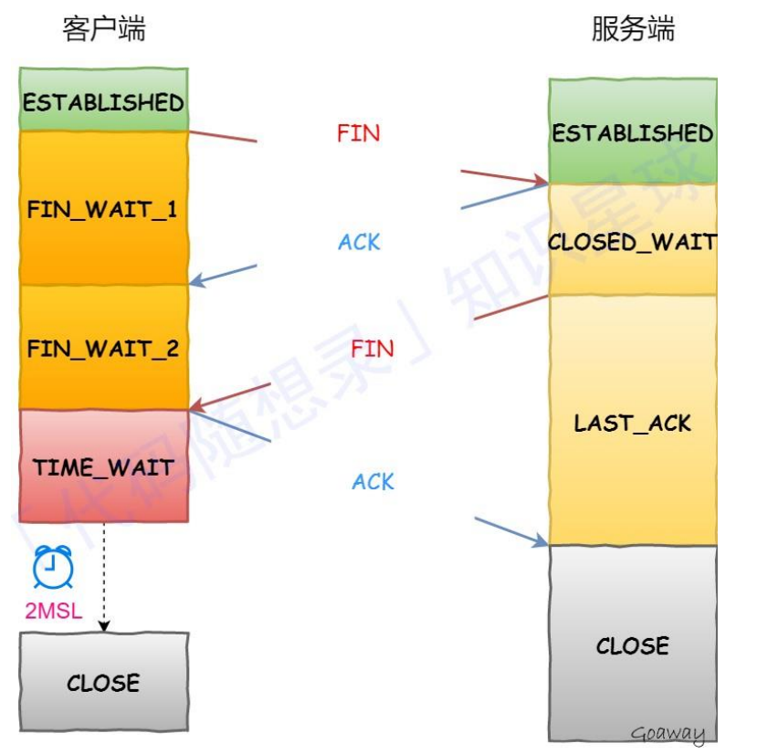

# TCP协议

## TCP的头部

相比 UDP 只有 8 字节，TCP 首部固定长度就有 **20 字节**。面试时，以下几个是**核心**：

- **序号 (Sequence Number, seq)**：本报文段发送数据的第一个字节的编号。解决**乱序**问题。
- **确认号 (Acknowledgment Number, ack)**：期望收到对方下一个报文段的第一个数据字节的编号。解决**丢包**问题。
- **标志位 (Flags)**：控制 TCP 的状态。
  - **SYN**：同步，用于建立连接。
  - **ACK**：确认，用于确认收到。
  - **FIN**：结束，用于断开连接。
  - **RST**：复位，强制重连（游戏异常断线常见）。
- **窗口 (Window)**：告知对方，我现在还能收多少字节。用于**流量控制**。

## TCP的三次握手

**第一次握手**：客户端发送 `SYN=1, seq=x`。客户端进入 `SYN_SENT` 状态。

- *潜台词*：“我想跟你连接，我的起始序号是 x。”

**第二次握手**：服务端返回 `SYN=1, ACK=1, seq=y, ack=x+1`。服务端进入 `SYN_RCVD` 状态。

- *潜台词*：“收到，我也想连你，我的起始序号是 y，我期待你下次发 x+1 给我。”

**第三次握手**：客户端发送 `ACK=1, seq=x+1, ack=y+1`。双方进入 `ESTABLISHED`。

- *潜台词*：“收到你的确认，我准备好发数据了。”

## 为什么握手非要是三次

### 为什么两次不行

假设两次可以

1. **客户端**发出了第一个连接请求 `SYN_1`。
2. 这个包在某个老旧路由器里**卡住了**，一直没到服务端。
3. 客户端等超时了，以为包丢了，于是**重发**了一个 `SYN_2`。
4. 这一次很快，服务端收到 `SYN_2`，回了 `ACK`，连接建立，数据传完，连接释放。
5. **变故发生：** 那个卡在路上的 `SYN_1` 突然“复活”了，传到了服务端。
   - **如果是两次握手：** 服务端收到 `SYN_1`，立刻进入 `ESTABLISHED` 状态，并回一个 `ACK`。但此时客户端根本不在连接状态，它会忽略这个莫名其妙的 `ACK`。
   - **如果是正常的三次握手**：旧的SYN报文先到达服务器，服务器返回一个ACK+SYN报文，客户端收到后可以根据自身的上下文判断这是一个历史连接（序列号过期或超时），那么客户端就会发送RST报文给服务器，表示终止这一次连接。服务器收到RST报文会释放链接。
   - **结果：** 服务端空守着一个根本没人用的连接，白白**浪费了 CPU 和内存资源**。

**结论：** 三次握手要求客户端必须对服务端的 `ACK` 再做一次确认，这样服务端收到第三次 `ACK` 后，才能确信：**“哦，客户端确实知道我要跟他建连接。”**

### 为什么四次挥手没必要

其实从逻辑上讲，建立一个全双工（双向通信）的连接，确实需要四个步骤：

1. A：我想连你。
2. B：收到，可以。
3. B：我也想连你。
4. A：收到，可以。

但在实际操作中，**第 2 步和第 3 步是可以合并的**。 服务端在给客户端回复 `ACK`（确认收到客户端请求）的同时，可以顺便把自己的 `SYN`（也想连客户端的请求）塞进同一个报文里发过去。

**结论：** 四次握手虽然更稳妥，但多发一个包就是多一次网络延迟。在能通过三次握手达成共识的情况下，四次握手显得**多余且低效**。

### 总结

**两次：** 容易产生“幽灵连接”，浪费服务端资源。

**三次：** 达成共识的最小次数，既能确认双向收发能力，又能同步序号。

**四次：** 属于“脱裤子放屁”，把能合并的包拆开了，增加了建立连接的时间。

1.三次握才可以阻止重复历史连接的初始化(主因)

2.三次握手才可以同步双方的初始序列号

3.三次握手才可以避免资源浪费

「两次握⼿」：⽆法防⽌历史连接的建⽴，会造成双⽅资源的浪费，也⽆法可靠的同步双⽅序列号；

「四次握⼿」：三次握⼿就已经理论上最少可靠连接建⽴，所以不需要使⽤更多的通信次数。

## 三次握手其它知识

### 半连接队列

半连接队列（SYN队列）⽤于存放已经发送了 SYN（同步）包，但还未完成三次握⼿的连接：服务器第⼀次收到客 户端的 SYN 之后，就会处于 SYN_RCVD 状态，此时双⽅还没有完全建⽴其连接，服务器会把此种状态下请求连接 放在⼀个队列⾥，我们把这种队列称之为半连接队列。 全连接队列（Accept队列）⽤于存放已经完成三次握⼿，处于完全建⽴连接状态的连接。

### SYN攻击

在 SYN 攻击中，攻击者发送⼤量伪造的 SYN 请求到⽬标服务器，但不完成后续的握⼿过程，从⽽让服务器⼀直等 待确认，消耗服务器的资源（如半连接队列和系统资源），当半连接队列满了之后，后续再收到SYN报⽂就会丢弃， 导致⽆法与客户端之间建⽴连接。

## 四次挥手

**一挥**：客户端发送 `FIN`，进入 `FIN_WAIT_1`。

**二挥**：服务端返回 `ACK`，进入 `CLOSE_WAIT`。此时**客户端到服务端**的通道关了，但服务端还能给客户端发数据。

**三挥**：服务端发完最后的数据，发送 `FIN`，进入 `LAST_ACK`。

**四挥**：客户端返回 `ACK`，进入 `TIME_WAIT`。服务端收到后直接 `CLOSED`。

为什么客户端要等待 2MSL 才彻底关闭？

**确保最后一个 ACK 到达**：如果服务端没收到最后一个 ACK，会重传 FIN。2MSL 足够让丢失的 ACK 确认或让重传的 FIN 到达。

**防止“过期包”干扰**：让本次连接产生的所有报文都在网络中消失，避免干扰下一个使用相同端口的新连接。

### 为什么是四次挥手

在**三次握手**时，服务端收到 `SYN`（连接请求）后，它回复的 `ACK`（确认）和它自己的 `SYN`（同步请求）是**合并在一个包里**发送的。

但在**四次挥手**时，情况发生了变化：

1. **一挥：** 客户端发 `FIN`，表示：“我没数据要发了，我想关了。”
2. **二挥：** 服务端回 `ACK`，表示：“收到，我知道你没数据发了。”
   - **关键点：** 此时服务端可能还有没发完的数据（比如刚才客户端请求的一个大文件还没传完）。所以，服务端**不能立刻关掉**自己的发送通道，它只能先给客户端一个确认。
3. **三挥：** 等服务端把剩下的数据全传完了，它才会发 `FIN`，表示：“好了，我也没数据发了，我也要关了。”
4. **四挥：** 客户端回 `ACK`，表示：“收到，再见。”

**结论：** 因为服务端在收到 `FIN` 时，往往还处于“半关闭”状态（收到对方的关闭请求，但自己可能还有话没说完），所以 **`ACK`（确认收到）和 `FIN`（我也要关）通常不能合并发送**。这就导致了比握手多出一次。

### 如果是三次挥手

如果强行把二、三步合并，即服务端收到 `FIN` 立刻回 `FIN+ACK`：

- **结果：** 服务端缓冲区里还没发完的数据会被强制“掐断”。
- **代价：** 数据的完整性无法保证。客户端可能会丢失最后一部分关键信息（比如游戏存档的最后几个字节）。

## 为什么四次挥手后TIME_WAIT还要等 2MSL？

如果四次挥手后直接关闭，不进行等待，会导致两个严重问题：

主动发起关闭连接的⼀⽅，才会有 TIME-WAIT 状态。

1. **最后一次 ACK 丢了怎么办？** 如果第四次的 `ACK` 丢了，服务端没收到，它会重传第三次的 `FIN`。如果客户端已经销毁了，就没人理这个 `FIN` 了，服务端会一直重传并报错。等待 2MSL 确保了如果 `ACK` 丢了，客户端还有机会收到重传的 `FIN` 并补发 `ACK`。
2. **“过期包”干扰新连接：** 网络中可能还有些迟到的旧数据包。如果客户端立刻用同样的端口开启新连接，这些旧包可能会被误认为是新连接的数据。2MSL 足够让本次连接产生的所有报文在网络中自然消失。

| **场景**       | **步骤数** | **为什么？**                                                 |
| -------------- | ---------- | ------------------------------------------------------------ |
| **握手 (SYN)** | 3 次       | 服务端的 `SYN` 和 `ACK` 可以合并发送（大家都没话要说，直接开聊）。 |
| **挥手 (FIN)** | 4 次       | 服务端的 `FIN` 和 `ACK` **通常不能**合并发送（客户端说完了，服务端可能还没说完）。 |
