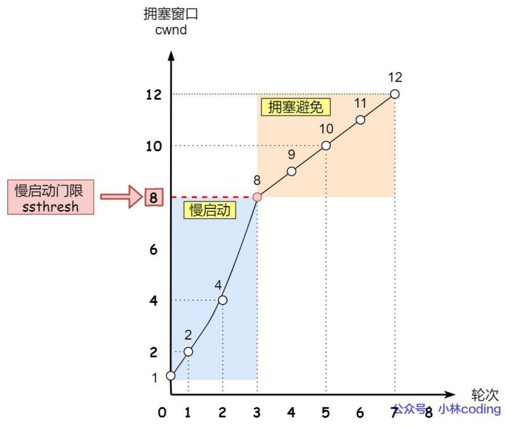
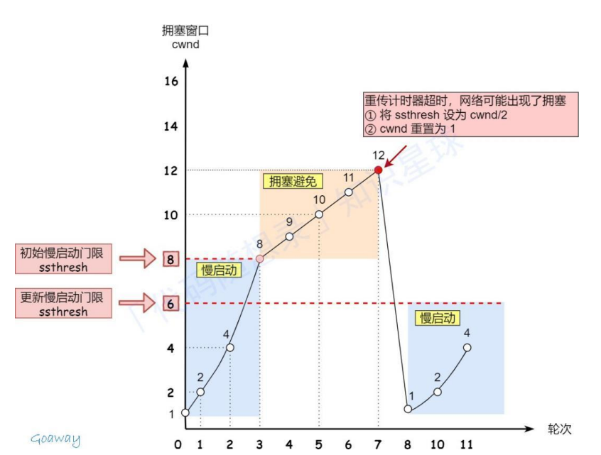
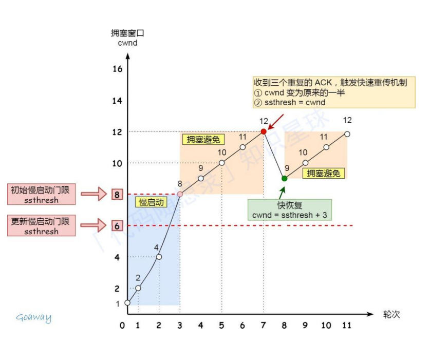

# TCP的重传机制

### 超时重传

这是最基础、最直观的重传方式。

- **原理：** 发送方发送一个报文段后，就启动一个**定时器**。如果在定时器到期（超时）前没有收到接收方的确认（ACK），就重发该报文。
- **面试点：超时时间（RTO）设为多少合适？**
  - 如果 RTO 太短：可能包还没到，发送方就急着重传，导致网络拥塞。
  - 如果 RTO 太长：网络反馈太慢，性能低下。
  - **结论：** RTO 是动态计算的，它略大于 **RTT**（Round Trip Time，往返时间）。

### 快速重传

超时重传有个缺点：如果网络稍微抖动一下，发送方就得等很久才能重传。**快速重传**利用了“数据驱动”来提高效率。

- **场景：** 假设发送方发了包 1, 2, 3, 4, 5。
- **原理：**
  1. 包 2 丢了，包 3 到了。接收方发现包 2 没来，于是不管收到 3, 4, 5 哪个包，都重复回：**“我想要包 2”**（发送 ACK 2）。
  2. 当发送方连续收到 **3 个重复的 ACK** 时，它就知道包 2 肯定丢了。 
  3. **动作：** 发送方不等定时器超时，**直接重传包 2**。
- **优点：** 极大地缩短了等待时间，不需要等那个死板的定时器。

### SACK

快速重传虽然快，但有一个尴尬的问题：如果包 2 和包 3 都丢了，发送方重传了包 2 后，它是该重传包 3，还是继续等？

- **解决方案：** 在 TCP 首部的“选项”字段里加入 **SACK**。
- **原理：** 接收方回 ACK 时，会顺便告诉发送方：“我已经收到包 1、包 4 和包 5 了，只有 2 和 3 没收到。”
- **结果：** 发送方一眼就能看出哪些是“坑”，**精确地只重传**丢失的那些包，而不会盲目地把已经收到的包再发一遍。这也是目前最主流的优化方式。

| **机制**     | **触发条件**         | **特点**               |
| ------------ | -------------------- | ---------------------- |
| **超时重传** | 定时器到期           | 万能但慢，作为保底方案 |
| **快速重传** | 3 个重复 ACK         | 响应快，不需要等定时器 |
| **SACK**     | ACK 中携带已收到区间 | 精确重传，效率最高     |

## 队头阻塞

 TCP 的重传会导致**队头阻塞**。

- 即使后面的包（比如包 3、4、5）已经到达了接收方的缓冲区，由于包 2 还没重传成功，TCP 协议栈为了保证顺序，**不会**把 3, 4, 5 交给游戏逻辑层。
- 在游戏中，这就表现为“画面卡住”，等包 2 重传成功后，画面突然“快进”补上之前的动作。
- **结论：** 所以对于对延迟极其敏感的游戏同步，我们会选择 UDP 并自己在应用层实现更灵活的重传逻辑（比如只重传重要的操作包，而不重传过时的坐标包）。

# TCP的滑动窗口

如果发送方发得太快，接收方处理不过来（缓冲区满了），数据包就会被丢弃。滑动窗口就是为了让发送方知道：**“对方还能收多少”**。

- **工作原理：**
  - 接收方在回 ACK 时，会通过 TCP 首部的 `Window` 字段告诉发送方自己的**接收窗口 (RWND)** 大小。
  - 发送方的窗口分为四部分：已发送已确认、**已发送未确认、允许发送未发送**、不允许发送。
  - 随着 ACK 的返回，窗口不断向右“滑动”，覆盖新的待发送数据。
- **面试点：** 窗口为 0 怎么办？
  - 如果接收方通告窗口为 0，发送方会停止发送，但会启动一个**持续计时器**，定期发送“窗口探测报文”，直到接收方腾出空间。

# TCP的拥塞控制

即使接收方能收，如果路上的路由器（网络环境）堵死了，发再多也是丢包。拥塞控制是为了探测**“网络能承载多少”**。

TCP 维护一个状态变量：**拥塞窗口 (CWND)**。发送方实际能发多少，取决于 `min(RWND, CWND)`。

## 慢启动

从 CWND = 1（个 MSS）开始，每收到一个 ACK，CWND **翻倍**（指数增长）。

目的：试探网络的承受能力。

## 拥塞避免

当 CWND 达到一个阈值（ssthresh）时，改为**线性增长**（每轮 +1）。

目的：稳步前进，防止突然撞墙。

## 拥塞发生	

如果发生了超时，说明网络真堵了：ssthresh 砍半，CWND 重置为 1，重新开始慢启动。

## 快速恢复

如果收到了 3 个重复 ACK（触发了快重传），说明网络虽然丢包但还没瘫痪。此时 CWND 砍半，直接进入拥塞避免，不再从 1 开始。

**滑动窗口**：是**一对一**的。解决的是发送方和接收方速度不匹配的问题（流量控制）。

**拥塞控制**：是**一对多（全局）**的。解决的是整个互联网中间链路堵塞的问题。