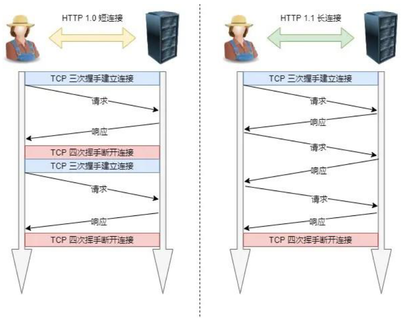
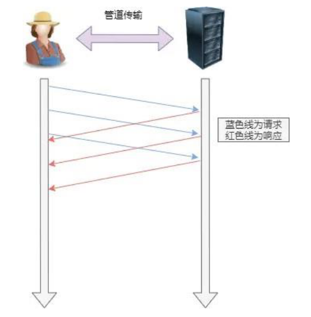
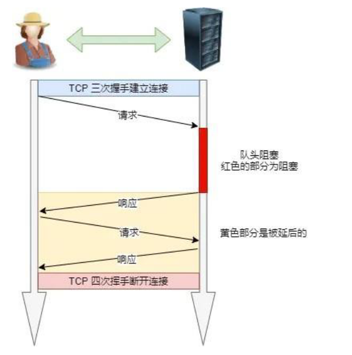
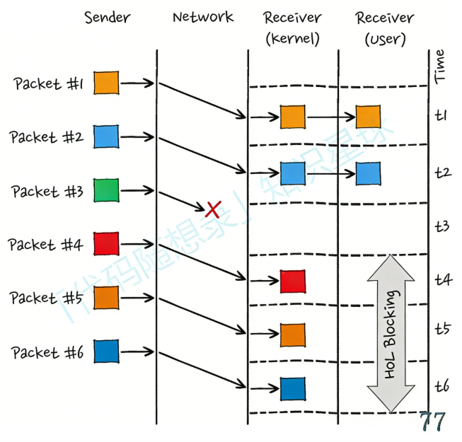
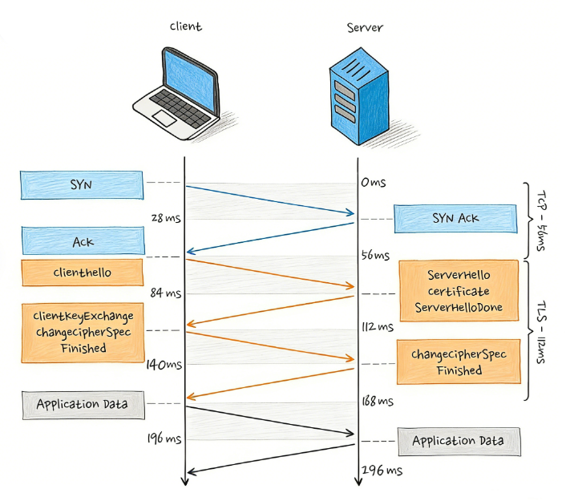
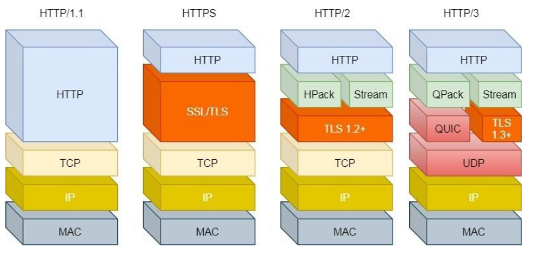
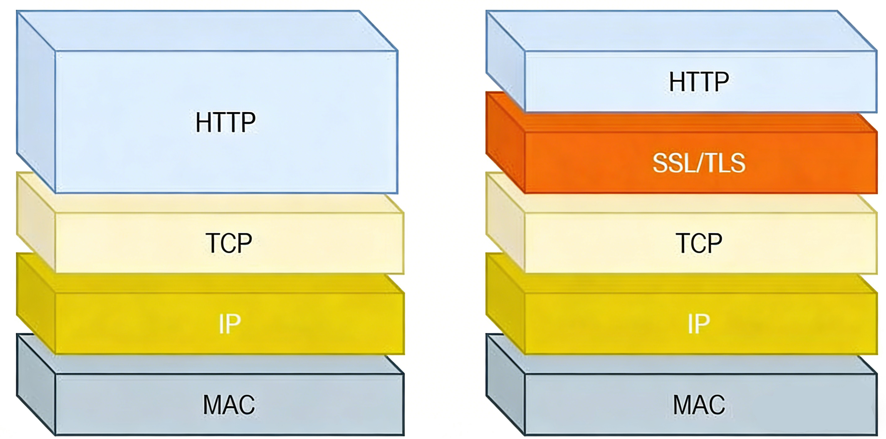
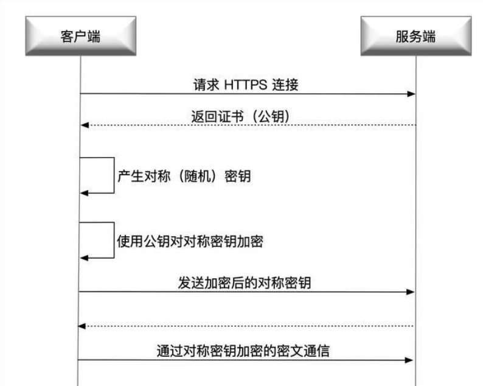

# HTTP

HTTP是基于 **TCP** 的协议。

HTTP**无状态、明文传输、不安全**。

**无状态**：服务器不会去记忆HTTP的状态，所以不需要额外的资源来记录状态信息，这能减轻服务器的负担。

**明文传输**：传输过程中的信息，是可⽅便阅读的，通过浏览器的F12控制台或Wireshark抓包都可以直接⾁眼查看。

**不安全：**

1. 使用明文传输（不加密）内容可能被窃听
2. 无法验证对方身份，因此可能遭遇伪装
3. 无法验证报文完整性，可能遭篡改。

# HTTP/1.0

# HTTP/1.1

**持久连接 (Keep-Alive)**：默认开启。同一个 TCP 连接可以发送多个请求，不用每次申请资源都握手。



**管道网络传输**



在同⼀个 TCP 连接⾥⾯，客户端可以发起多个请求，只要第⼀个请求发出去了，不必等其回来，就可以发第⼆个请求出去，可以减少整体的响应时间。

客户端需要请求两个资源。以前的做法是，在同⼀个 TCP 连接⾥⾯，先发送 A 请求，然后等待服务器做出回应，收到后再发出 B 请求。那么，管道机制则是允许浏览器同时发出 A 请求和 B 请求。

**但是服务器必须按照接收请求的顺序发送对这些管道化请求的响应。**

如果服务端在处理 A 请求时耗时⽐较⻓，那么后续的请求的处理都会被阻塞住，这称为「队头堵塞」。

所以，**HTTP/1.1 管道解决了请求的队头阻塞，但是没有解决响应的队头阻塞。**

HTTP/1.1 管道化技术不是默认开启，⽽且浏览器基本都没有⽀持。

## 队头阻塞

当顺序发送的请求序列中的⼀个请求因为某种原因被阻塞时，在后⾯排队的所有请求也⼀同被阻塞了，会招致客户端⼀直请求不到数据，这也就是**「队头阻塞」**。



## HTTP1.1的问题

但是 HTTP1.1 仍然存在着不少问题：

- 头部冗余：每个请求和响应都需要带有⼀定的头部信息，每次互相发送相同的⾸部造成的浪费较多；
- 服务器是按请求的顺序响应的，如果服务器响应慢，会招致客户端⼀直请求不到数据，也就是队头阻塞；
- 没有请求优先级控制；
- 请求只能从客户端开始，服务器只能被动响应

# HTTP/2.0

## HTTP2与HTTPS

HTTP2.0使用了HTTPS吗？

HTTP/2 标准（RFC 7540）来看，它定义了两种模式：

- **h2c (HTTP/2 over TCP)**：明文传输，不使用 TLS 加密。
- **h2 (HTTP/2 over TLS)**：基于 TLS 加密。

所以从“理论”上讲，HTTP/2 并不强制依赖 HTTPS。

但是，chrome等浏览器在实现HTTP2时只支持基于HTTPS的HTTP2，如果你尝试用浏览器通过不加密的 HTTP 协议访问一个支持 HTTP/2 的服务器，浏览器会自动降级使用 HTTP/1.1。

## HTTP2特点

1. 头部压缩（HPACK）：HTTP/2使压缩算法对请求和响应头部进⾏压缩，减少了传输的头部数据量，降低了延迟。
2. ⼆进制帧：HTTP/2 将数据分割成⼆进制帧进⾏传输，分为**头信息帧**（Headers Frame）和**数据帧**（DataFrame），增加了数据传输的效率。

2. 并发传输：引出了**Stream**概念，多个Stream**复⽤在⼀条 TCP 连接**，针对不同的HTTP请求⽤独⼀⽆⼆的**Stream ID**来区分，接收端可以通过 Stream ID 有序组装成 HTTP 消息，不同 Stream 的帧是可以乱序发送的，因此可以并发不同的 Stream ，也就是 HTTP/2 可以并⾏交错地发送请求和响应。
  - 这就实现了在**同一个 TCP 连接上并行传输多个请求**，且互不干扰。
  - 服务器可以交替发送 A 的帧和 B 的帧（比如 A1, B1, A2, B2...）。客户端收到后根据 ID 重组。这就不再需要等待 A 全发完才能发 B。所以在应用层解决了队头阻塞问题。
3. 服务器推送：在HTTP/2中，服务器可以对客户端的⼀个请求发送多个响应，即服务器可以额外的向客户端推送资源，⽽⽆需客户端明确的请求。

## HTTP2的问题

HTTP1.1基于请求-响应模型。同⼀个连接中，HTTP完成⼀个事务（请求与响应），才能处理下⼀个事务。即：再发出请求等待响应的过程种是没办法做其他事情的，会造成**队头阻塞**问题。

HTTP2通过Stream这个设计（多个Stream复用⼀条TCP连接，达到并发的效果），解决了**队头阻塞**的问题，提高了HTTP传输的吞吐量。

**HTTP2在传输层仍然存在队头阻塞。**

HTTP/2是基于TCP协议来传输数据的，TCP是字节流协议，TCP层必须保证收到的字节数据是完整且连续的，这样内核才会将缓冲区⾥的数据返回给 HTTP 应用，那么当「前 1 个字节数据」没有到达时，后收到的字节数据只能存放在内核缓冲区⾥，只有等到这 1 个字节数据到达时，HTTP/2应⽤层才能从内核中拿到数据，这就是 HTTP/2队头阻塞问题。

**缺点总结**:

1. 队头阻塞

   

2. TCP与TLS握手延迟

   

3. 网络迁移需重新连接

# HTTP/3.0

HTTP2的对头阻塞是因为传输层用TCP，所以HTTP/3把HTTP下层的TCP协议改为了UDP。



**HTTP/3 = HTTP/2 的语义 + QUIC 协议 + UDP**

## QUIC协议

### **零 RTT 建立连接**

- **TCP + TLS**：需要三次握手 + TLS 握手，通常需要 2-3 个 RTT（往返时间）才能开始发数据。
- **QUIC**：它把传输握手和加密握手**合并**了。
  - **首次连接**：1-RTT 就能通。
  - **再次连接**：由于缓存了服务端的参数，直接 **0-RTT** 就能发请求数据。这对于游戏频繁短连接请求（如拉取好友列表）提升巨大。

如何实现零RTT连接：

**第一步：首次连接留“信物”**

当客户端和服务器第一次完成 1-RTT 握手后，服务器会发给客户端一个加密的 **Session Ticket**（在 QUIC 中叫 **NST**, New Session Ticket）。 这个信物里记录了：

- 之前的加密套件。
- 一个**预共享密钥 (PSK, Pre-Shared Key)**。

**第二步：再次连接直接发数据**

当客户端下次想连接同一个服务器时：

1. **打包发送**：客户端不再等握手，而是直接把 **Session Ticket** 和 **应用层数据** 用之前存的 PSK 加密，一起塞进第一个 UDP 包里发出去。
2. **服务端解密**：服务器收到包，用自己的私钥解开 Ticket 拿到 PSK，直接就把应用层数据解出来了。
3. **结果**：在握手包发出的那一刻，数据也发出了。延迟为 **0-RTT**。

`0-RTT`请求通常只允许GET（请求资源），不允许POST等。

### **真正解决队头阻塞**

- **原理**：QUIC 原生支持多个 **流 (Stream)**。在 UDP 层面，不同流的数据包是并列的。
- **表现**：如果 Stream 1 的包丢了，只有 Stream 1 等重传。Stream 2 的包照样能立刻传给应用层。**TCP 的“连坐机制”彻底消失。**（而如果是HTTP2因为TCP的原因，一个包丢了，其它流也受影响）

### **连接迁移**

这是对**移动端游戏**最友好的特性。

- **TCP 的尴尬**：它是基于“四元组”（源IP、源端口、目的IP、目的端口）的。如果你从WiFi切换到 4G，IP变了，TCP连接必断，游戏就会转圈圈。
- **QUIC 的方案**：它使用一个64位的 **Connection ID** 来标识连接。只要ID没变，即便IP和端口都变了，连接依然能**无缝无感**地继续。

### **前向纠错 (FEC)**

- **机制**：QUIC 可以在发送数据时附带一些冗余纠错包。
- **效果**：如果网络偶尔丢一个小包，接收方可以通过剩下的包自己“算”出丢的是什么，而不需要等待重传。这对弱网下的实时性非常有帮助。

# HTTP缓存

能不传的就不传，非要传的传个编号。

## 强缓存

客户端直接看本地缓存，如果没过期，连服务器都不问，直接用。

**Cache-Control (HTTP/1.1，最常用)**：在响应的资源协商缓存多少秒。

- `max-age=3600`：表示资源在 3600 秒内有效。
- `no-cache`：它并不代表“不缓存”，而是代表“使用缓存前必须先去服务器验证（走协商缓存）。
- `no-store`：这才是真正的“不缓存”。

**Expires (HTTP/1.0，老旧)**：

- 记录一个绝对的时间点（本地时间戳）（如 `Wed, 21 Oct 2026 07:28:00 GMT`）。在此范围内，在内存中读取缓存并返回。
- **缺点**：如果客户端本地时间跟服务器时间不一致，缓存就会乱套。所以这个缓存基本被废弃了。

强缓存流程：

1. 当浏览器第⼀次请求访问服务器资源时，服务器会在返回这个资源的同时，在 Response 头部加上 Cache-Control，Cache-Control 中设置了过期时间大小；
2. 浏览器再次请求访问服务器中的该资源时，会先通过请求资源的时间与 Cache-Control 中设置的过期时间大小，来计算出该资源是否过期，如果没有，则使用该缓存，否则重新请求服务器；
3. 服务器再次收到请求后，会再次更新 Response 头部的 Cache-Control。

## 协商缓存

**逻辑：** 强缓存失效了（过期了），客户端拿着资源的“身份证”去问服务器：“这东西变过吗？”

- 如果没变，服务器回 **304 Not Modified**，不传数据体，客户端继续用旧的。
- 如果变了，服务器回 **200 OK**，并传回新的数据。

**基于时间的 `Last-Modified`：**

**第一次**：服务器发 `Last-Modified: [最后修改时间]`。

**第二次**：客户端发 `If-Modified-Since: [之前存的时间]`。

**缺点**：精度只到秒。如果文件在 1 秒内改了多次，或者文件只是被打开保存了但内容没变，它也会认为变了。

**基于内容的 `ETag`：**

**第一次**：服务器根据文件内容算一个 Hash 值，发 `ETag: "abc12345"`。

**第二次**：客户端发 `If-None-Match: "abc12345"`。

**优点**：只要内容不变，ETag 就不变，非常精准。

# HTTPS

HTTP：Hyper Text Transfer Protocol：超⽂本传输协议

HTTPS：Hyper Text Transfer Protocol Secure：超⽂本安全传输协议

SSL：Secure Socket Layer安全套接字

TSL：Transport Layer Security安全传输层协议

**HTTPS = HTTP+SSL/TSL**



## HTTPS特点

**混合加密**：采⽤对称加密+非对称加密的混合加密的方式，对传输的数据加密，实现信息的机密性，解决了窃听的风险。

**摘要算法**：⽤摘要算法为数据⽣成独一无二的「指纹」校验码，指纹⽤来校验数据的完整性，解决了被篡改的风险。

**数字证书**：将服务端的公钥放入到CA数字证书中，解决了服务端被冒充的⻛险。

## 三种加密技术

**对称加密**：

- **特点**：加密和解密用同一把钥匙。
- **优缺点**：计算速度极快，适合传输大数据（如游戏资源）。但**密钥分发不安全**，一旦钥匙在路上被截获，加密就废了。

**非对称加密**：

- **特点**：有公钥（公开）和私钥（保密）。用公钥加密只能用私钥解。
- **优缺点**：解决了密钥传输问题。但**速度极慢**，不适合传大量数据。

**摘要算法**：

- 如 SHA-256。给数据生成唯一的“指纹”，用于校验数据是否被篡改。

## SLL/TLS

HTTPS 的精髓在于：**先用“非对称加密”安全地交换钥匙，再用“对称加密”高效地传输数据。**

1. **Client Hello**：客户端给服务端发送随机数 $R_1$ 和支持的加密套件。
2. **Server Hello**：服务端给客户端发送随机数 $R_2$ 和**数字证书（含服务器公钥）**。
3. **密钥交换**：
   - 客户端校验证书合法性。
   - 客户端生成随机数 $R_3$（也叫 Pre-Master Secret），用证书里的**公钥**加密后发给服务端。
4. **生成对话密钥**：
   - 服务端用自己的**私钥**解开，得到 $R_3$。
   - 此时双方都有了 $R_1, R_2, R_3$，各自根据这三个数算出同一个**对称密钥**。
5. **开始加密传输**：之后的 HTTP 请求全部用这个对称密钥加密。

这就是TLS的四次握手

## 摘要算法

带密钥的哈希

混合加密解决了“**不被看见**”的问题，而摘要算法解决的是“**不被篡改**”的问题。

摘要算法（又称散列函数、Hash 函数）就像是给数据建立“**数字指纹**”。

**特性：**

1. **不可逆性**：你可以从数据算出指纹，但无法从指纹反推回原数据。
2. **确定性**：相同的数据，算出的指纹一定一模一样。
3. **抗碰撞性**：哪怕只改动一个字节（比如把游戏代码里的 `health=100` 改成 `health=101`），算出的指纹也会天差地别（雪崩效应）。
4. **固定长度**：无论数据是 1KB 还是 10GB，生成的摘要长度是固定的（如 SHA-256 永远是 256 位）。

摘要算法在HTTPS中作用于两个地方：

**保证数据的完整性 (MAC)**

在混合加密传输阶段，每一段加密数据都会附带一个 **MAC (Message Authentication Code)**。

1. 发送方：把（对称密钥 + 原始数据）进行 Hash，得到一个摘要。
2. 接收方：收到后，也用同样的（对称密钥 + 原始数据）算一遍。
3. **比对**：如果两个摘要一致，说明数据在路上**没被改过**，也不是伪造的。

**数字签名的基础**

这是 HTTPS 信任链条的关键。我们不能直接对整个证书进行非对称加密（太慢），而是：

1. 对证书内容算一个**摘要**。
2. 用 CA 的私钥对这个**摘要**加密。 这个加密后的摘要就叫**数字签名**。

## 数字证书

### 背景

想象这个场景：中间人攻击

1. 客户端请求服务器：“请把你的公钥发给我。”
2. **中间人**（**黑客**）截获了请求，把自己伪造的公钥发给了客户端。
3. 客户端毫无察觉，用黑客的公钥加密了秘密（$R_3$）并发出去。
4. 黑客用自己的私钥解密，拿到了秘密，然后再用真正的服务器公钥加密发给服务器。

**结果**：黑客神不知鬼不觉地完成了监听。

**根源**：客户端无法确认拿到的“公钥”到底是谁的。**数字证书就是为了给公钥做“背书”。**

### 内容

一张标准的证书（通常是 X.509 格式）包含以下核心信息：

**持有者信息**：域名（如 `login.game.com`）、公司名称。

**公钥**：这是最核心的，服务器用于交换密钥的公钥。

**证书颁发机构（CA）**：谁签发的这张证（如 DigiCert, Let's Encrypt）。

**有效期**：证书什么时候失效。

**数字签名**：CA 对以上所有内容进行的加密盖章。

### 数字签名何时生成

**Hash 摘要**：CA 把证书里的域名、公钥、有效期等信息合在一起，用摘要算法（如 SHA-256）算出一个 **指纹（Hash）**。

**私钥加密**：CA 用自己的**私钥**，对这个指纹进行加密。

**合成签名**：加密后的指纹就是**数字签名**，它被附加在证书末尾。

### 客户端如何验证

**拆解签名**：客户端找到对应的 **CA 公钥**（内置在操作系统或浏览器中），解密证书上的数字签名，得到 **原始指纹 A**。

**本地计算**：客户端用同样的 Hash 算法，对证书里的信息再算一遍，得到 **指纹 B**。

**对比**：如果 **A == B**，说明证书内容没被动过，且确实是这个 CA 签发的。

**CA 怎么签发证书？**

**Step1：对证书内容做哈希**

$h = H(\text{证书内容})$

**Step2：用 CA 私钥加密**

$\text{签名} = E_{\text{CA私钥}}(h)$

**浏览器拿到证书后：**

**Step1：自己算一遍 hash**

$h_1 = H(\text{证书内容})$

**Step2：用 CA 公钥解密签名**

$hh_2 = D_{\text{CA公钥}}(\text{签名})$

**Step3：比较**

$h_1 \stackrel{?}{=} h_2$

$H(m) = D_{\text{CA公钥}}(\text{签名})$

## HPPTS连接过程



# Nagle算法

在网络传输中，每个 TCP 报文段都有至少 40 字节的头部（TCP 20 + IP 20）。

- **场景**：如果你在玩游戏或用 Telnet 远程登录，每按一个键就发 1 字节的数据。
- **问题**：为了传 1 字节的数据，你得搭上 40 字节的包头。**有效载荷只有 2.4%**，网络上充斥着大量这种“小包”，会导致网络拥塞。

**Nagle 算法的逻辑：** 限制发送方发送微小分组。它要求：

1. 发送方如果有一个完整的报文段（MSS 大小）待发，立刻发。
2. 否则，必须等待之前发出的所有包的 **ACK（确认应答）** 全部回来，才能把缓冲区里攒的小包合在一起发出去。

**Nagle会导致延迟**

Nagle 算法对网页下载、文件传输没影响，但对**实时同步游戏**是致命的。

- **案例**：你点了一下鼠标“开火”。
- **过程**：
  1. 游戏逻辑产生了一个很小的“射击”指令包。
  2. 如果此时网络中还有一个还没被 ACK 的数据包，Nagle 算法会说：“等等！别急着发，等 ACK 回来或者攒够了再说。”
  3. **结果**：这一枪可能延迟了几十甚至上百毫秒才发出。在 144Hz 刷新率的今天，这种延迟是不可接受的。

```c++
int opt = 1;
setsockopt(sockfd, IPPROTO_TCP, TCP_NODELAY, &opt, sizeof(opt));
```

通常会通过`TCP_NODELAY`来禁用Nagle算法，不论包多小数据都立刻发出。

代价就是网络流量开销变多了，但是换来了实时性。

# TCP的粘包与拆包

为什么会有粘包和拆包？

**UDP（面向报文）**：像寄快递，一箱就是一个完整的礼物。你发一箱，我收一箱，边界清清楚楚。

**TCP（面向字节流）**：像自来水管。你往管子里倒了一杯水（数据包 A），紧接着又倒了一杯水（数据包 B）。在水管另一端的接收者看来，他只看到一股流出的水，**根本不知道哪滴水属于第一杯，哪滴水属于第二杯。**

为什么会“粘”在一起？

1. **发送方原因**：比如开启了我们刚聊过的 **Nagle 算法**，它把多个小包攒成一个大包发出去。
2. **接收方原因**：应用层没来得及读取缓冲区的数据，导致多个包在缓冲区里排队，结果一次 `recv` 抓出来一串。

假设客户端连续发送了两个数据包：`Packet1` 和 `Packet2`。

1. **正常情况**：两次读取，分别得到 `Packet1` 和 `Packet2`。
2. **粘包 (Sticky)**：一次读取，得到 `Packet1Packet2`。
3. **拆包 (Fragment)**：第一次读到 `Packet1` 的一半，第二次读到 `Packet1` 的另一半和 `Packet2` 全体。

## 解决方案：给数据划清界限

因为 TCP 不管边界，所以**边界必须由我们在应用层（游戏逻辑层）手动划分**。常见的方案有三种：

① 固定长度

- **方法**：规定每个包必须是 128 字节，不够的补空格。
- **缺点**：太死板，浪费带宽。

② 特殊分隔符

- **方法**：在包尾加特殊符号（如 `\n` 或 `[EOF]`）。
- **缺点**：如果数据本身包含这个符号（比如玩家聊天刚好打了一个 `\n`），就会误判。

③ 消息头 + 消息体—— **最常用、大厂首选**

这是游戏开发中的标准做法。

- **方法**：每个包分为“头”和“身”。头部固定长度（比如 4 字节），记录整个包的**总长度**。
- **逻辑**：
  1. 先读取 4 字节，解析出长度 $L$。
  2. 根据 $L$ 的大小，循环读取直到读够 $L$ 个字节。
  3. 这 $L$ 个字节就是一个完整的包，处理完后再读下一个 4 字节。

## 半包处理

如果你用“长度字段”法，但只读到了头部，后面的 Body 数据还在路上，你的代码怎么写？

**你的回答思路**：

1. **缓冲区暂存**：我会建立一个**应用层缓冲区**（通常是一个 `std::vector<char>` 或环形缓冲区）。
2. **状态检查**：每次收到数据，先存入缓冲区。检查长度是否达到头部约定的 $L$。
3. **不处理直接返回**：如果没达到，说明发生了“半包”，我的代码不进行逻辑处理，而是等待下一次网络事件触发，继续往缓冲区填数据，直到填够 $L$ 字节才“切”出一个完整的游戏指令。
