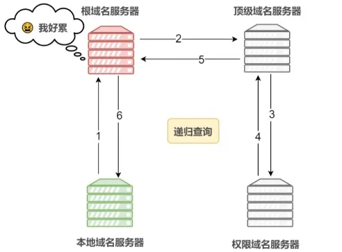
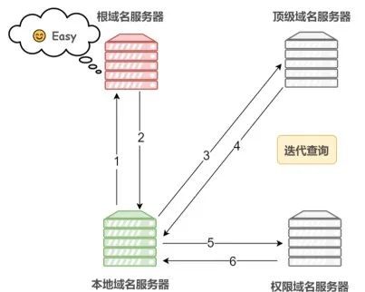

# DNS

域名系统：将域名转换为IP地址

在域名中，越靠右位置层级越高。

DNS解析过程：

1. 先查询浏览器缓存是否有该域名对应的IP地址。

2. 如果浏览器缓存中没有，会去计算机本地的Host⽂件中查询是否有对应的缓存。

3. 如果Host⽂件中也没有则会向本地的DNS服务器（通常由你的互联⽹服务提供商（ISP）提供， ⽐如中国移动）发送⼀个DNS查询请求。

4. 如果本地DNS解析器有该域名的ip地址，就会直接返回，如果没有缓存该域名的解析记录，它会向根DNS服务器发出查询请求。根DNS服务器并不负责解析域名，但它能告诉本地DNS解析器应该向哪个顶级域（.com/.net/.org）的DNS服务器继续查询。

5. 本地DNS解析器接着向指定的顶级域名DNS服务器发出查询请求。顶级域DNS服务器也不负责具体的域名解析，但它能告诉本地DNS解析器应该前往哪个权威DNS服务器查询下⼀步的信息。

6. 本地DNS解析器最后向权威DNS服务器发送查询请求。 权威DNS服务器是负责存储特定域名和IP地址映射的服务器。当权威DNS服务器收到查询请求时，它会查找"example.com"域名对应的IP地址，并将结果返回给本地DNS解析器。

7. 本地DNS解析器将收到的IP地址返回给浏览器，并且还会将域名解析结果缓存在本地，以便下次访问时更快地响应。

8. 浏览器发起连接： 本地DNS解析器已经将IP地址返回给您的计算机，您的浏览器可以使⽤该IP地址与⽬标服务器建⽴连接，开始获取网页内容

客户端到 LDNS 通常是**递归**；LDNS 到其他服务器通常是**迭代**。

## DNS使用UDP

DNS 为什么不像 HTTP 那样用 TCP？

- **效率**：DNS 查询包很小，一次往返就够。如果用 TCP，三次握手的开销比查询本身还大。
- **负载**：DNS 服务器每天处理海量请求，UDP 无连接状态，对服务器压力小。
- **特殊情况**：当返回的数据包超过 512 字节（如区域传输），DNS 也会切换到 TCP。

# 递归查询

在递归查询中，DNS客户端（通常是本地DNS解析器）向上层DNS服务器（如根域名服务器、顶级域名服务器）发起查询请求，并要求这些服务器直接提供完整的解析结果。递归查询的特点是，DNS客户端只需要发送⼀个查询请求，然后等待完整的解析结果。上层DNS服务器会⾃⾏查询下⼀级的服务器，并将最终结果返回给DNS客户端。

# 迭代查询

DNS客户端向上层DNS服务器发起查询请求，但不要求直接提供完整的解析结果。

DNS客户端只是询问上层服务器⼀个更⾼级的域名服务器的地址，然后再⾃⾏向那个更⾼级的服务器发起查询请求，以此类推，直到获取完整的解析结果为止。

# HTTPDNS

**DNS 劫持**

- **现象**：玩家输入游戏的官网，结果跳到了一个全是广告的假官网。
- **原因**：中间人（如不规范的运营商）篡改了 DNS 的返回结果。
- **对策**：使用 **HttpDNS**。

**HttpDNS**

- **原理**：不走系统的 53 端口 UDP 查询，而是直接向知名的 DNS 服务商（如腾讯、阿里）发一个 HTTP 请求来获取 IP。
- **优点**：绕过了运营商的劫持，且由于是 HTTP 请求，可以更精准地根据玩家地理位置分配最近的服务器 IP（调度更准）。