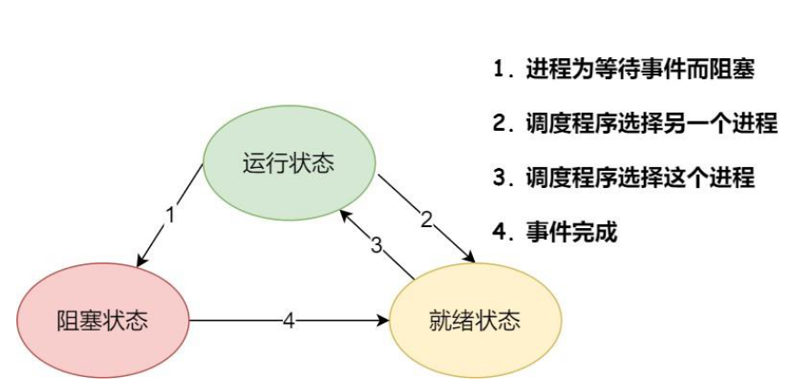
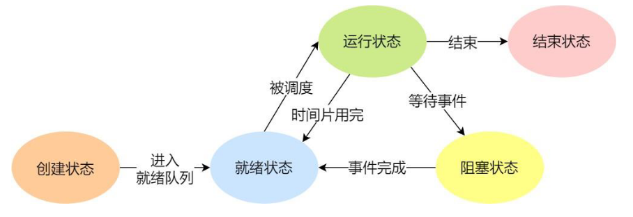

# 进程

**进程 (Process)**：是操作系统**资源分配**的最小单位。

**线程 (Thread)**：是操作系统**任务调度**的最小单位（也叫 CPU 执行的最小单位）。

每一个线程都有自己的函数调用链路。为了保证线程在被 CPU 切换回来后，能准确恢复到之前的执行位置、局部变量和返回地址，每个线程必须拥有独立的**栈和程序计数器（PC）**。

| **特性**     | **进程**                                                  | **线程**                                                     |
| ------------ | --------------------------------------------------------- | ------------------------------------------------------------ |
| **拥有资源** | 拥有独立的地址空间、文件句柄等。                          | 共享进程的资源（内存、代码段），但拥有自己的**栈**和**寄存器**。 |
| **通信方式** | 进程间通信（IPC）较慢且复杂（如信号量、消息队列、管道）。 | 线程间通信极快，直接读写共享内存即可。                       |
| **切换开销** | **大**。需要切换页表、刷新 TLB，开销昂贵。                | **小**。只需保存/恢复少量寄存器和栈信息。                    |
| **健壮性**   | **高**。一个进程崩了，不会影响其他进程（因为内存隔离）。  | **低**。一个线程发生非法访问（空指针），整个进程都会挂掉。   |

## 进程控制块

系统通过进程控制块 PCB 来描述进程的基本情况和运行状态，就进而控制和管理进程，它是进程存在的唯一标识。

其包括以下信息：

1. 进程描述信息：进程标识符、用户标识符
2. 进程控制和管理信息：进程当前状态，进程优先级
3. 进程资源分配清单：有关内存地址空间或虚拟地址空间的信息，所打开文件的列表和所使用的 I/O 设备信息。
4. CPU 相关信息：当进程切换时，CPU 寄存器的值都被保存在相应 PCB 中，以便 CPU 重新获得控制权时能从断点处继续执行；

PCB 通常是通过**链表**的方式进行组织，把**具有相同状态的进程**链在一起，组成各种队列。

## 并发与并行

并发：单个处理核在很短时间内分别执行多个进程，称为并发

并行：多个处理核同时执行多个进程称为并行

对于并发来说，CPU 需要从一个进程切换到另一个进程，在切换前必须要记录**当前进程中运行的状态信息，以备下次切换回来的时候可以恢复执行**。

## 进程状态切换

**运行态**：该时刻进程占用 CPU

**就绪态**：可运行，由于其他进程处于运行状态而暂时停止运行

**阻塞态**：该进程正在等待某一事件发生（如等待输入 / 输出操作的完成）而暂时停止运行

防止大量阻塞和就绪状态的进程占用内存空间，系统通常将其换到硬盘。没有占用实际的物理内存空间的情况就是挂起状态。

**阻塞挂起状态**：进程在外存（硬盘）并等待某个事件的出现；

**就绪挂起状态**：进程在外存（硬盘），但只要进入内存，即刻立刻运行；

## 进程的上下文切换

一个进程切换到另一个进程运行，称为进程的上下文切换，进程的上下文切换不仅包含了**虚拟内存、栈、全局变量**等用户空间的资源，还包括了内核堆栈、寄存器等内核空间的资源。

发生进程上下文切换有哪些场景？

- 进程的时间片耗尽
- 阻塞等待
- 高优先级进程运行
- 中断处理
- 进程通过睡眠函数 sleep 这样的方法将自己主动挂起

# 线程

线程是进程当中的一条执行流程，同一个进程内多个线程之间可以共享代码段、数据段、打开的文件等资源，但每个线程各自都有一套独立的寄存器和栈，这样可以确保线程的控制流是相对独立的。

线程的特点：

- 一个进程中可以有多个线程，线程不拥有系统资源，但是也有 PCB，创建线程使用的底层函数和进程一样，都是 clone
- 各个线程之间可以并发执行
- 同一个进程中的各个线程共享该进程所拥有的资源
- 进程可以蜕变成线程

## 用户线程

用户线程是在用户空间实现的线程，不是由内核管理的线程，整个线程管理和调度，操作系统是不直接参与的，而是由用户级线程库函数来完成线程的管理，包括线程的创建、终止、同步和调度等。

优点：

1. 线程切换不需要切换到内核空间中，节省了模式切换的开销。
2. 调度算法可以是进程专用的，不同的进程可根据自身的需要，对自己的线程选择不同的调度算法。
3. 用户级线程的实现与操作系统平台无关，对线程管理的代码是属于用户程序的一部分。

缺点：

1. 由于不由操作系统调度，一旦用户线程发起系统调用而阻塞，那么此进程下用户线程都无法运行；
2. 一旦某个用户线程正在运行，只有当其交出 CPU 执行权，其他用户线程才可以运行，无法被打断，因为只有操作系统才有权限打断运行，但是操作系统不直接参与调度；
3. 由于时间片分配给进程，故与其他进程比，在多线程执行时，每个线程得到的时间片较少，执行会比较慢；

## 内核线程

由操作系统管理、调度，其对应的 TCB 是存放在内核中，这样线程的创建、终止和管理都是由操作系统负责。

优点：

1. 当一个内核线程发起系统调用阻塞时不会影响其它内核线程的执行；
2. 分配给线程，多线程的进程获得更多的 CPU 运行时间；

缺点：

1. 在支持内核线程的操作系统中，由内核来维护进程和线程的上下文信息，如 PCB 和 TCB；
2. 线程的创建、终止和切换都是通过系统调用的方式来进行，因此对于系统来说，系统开销比较大；

## 轻量级线程

轻量级进程是内核⽀持的⽤户线程，⼀个进程可有⼀个或多个 LWP，每个 LWP 是跟内核线程⼀对⼀映射的，也就是 LWP 都是由⼀个内核线程⽀持，⽽且 LWP 是由内核管理并像普通进程⼀样被调度。

## 线程共享资源

- 文件描述符表
- 每种信号的处理方式
- 当前工作目录
- 用户 ID 和组 ID

## 线程非共享资源

- 线程 id

- 处理器现场和栈指针 (内核栈)

- 独立的栈空间 (用户空间栈)

- errno 变量

- 信号屏蔽字

- 调度优先级

# 进程与线程比较

进程是资源（包括内存、打开的文件等）分配的单位，线程是 CPU 调度的单位；

- 资源：进程是系统中拥有资源的基本单位，而线程不拥有系统资源（仅有一点必不可少的能保证运行的资源，比如寄存器和栈），但线程可以访问隶属进程的系统资源。
- 调度：线程切换的代价远低于进程，在同一个进程中，线程的切换不会引起进程切换，而从一个进程中的线程切换到另一个进程中的线程中，会引起进程切换。
- 并发：进程可以并发执行，而一个进程中的多个线程之间也能并发执行，甚至不同进程中的线程也能并发执行，从而使得操作系统拥有更好的并发性，提高了系统资源的利用率和系统的吞吐量。
- 独立性：每个进程都拥有独立的地址空间和资源，除了共享全局变量，不允许其他进程访问。某进程中的线程对其他进程都不可见，同一进程中的不同线程是为了提高并发性以及进行相互之间的合作而创建的，它们共享进程的地址空间和资源。
- 系统开销：线程所需要的开销比进程小
  - 线程的创建时间比进程快，因为进程在创建的过程中，还需要资源管理信息，比如内存管理信息、文件管理信息，而线程在创建的过程中，不会涉及这些资源管理信息，而是共享它们；
  - 线程的终止时间比进程快，因为线程释放的资源相比进程少很多；
  - 同一个进程内的线程切换比进程切换快，因为线程具有相同的地址空间（虚拟内存共享），这意味着同一个进程的线程都具有同一个页表，那么在切换的时候不需要切换页表。而对于进程之间的切换，切换的时候要把页表给切换掉，而页表的切换过程开销是比较大的；
  - 由于同一进程的各线程间共享内存和文件资源，那么在线程之间数据传递的时候，就不需要经过内核了，这就使得线程之间的数据交互效率更高了；

所以，不管是时间效率，还是空间效率线程比进程都要高。

