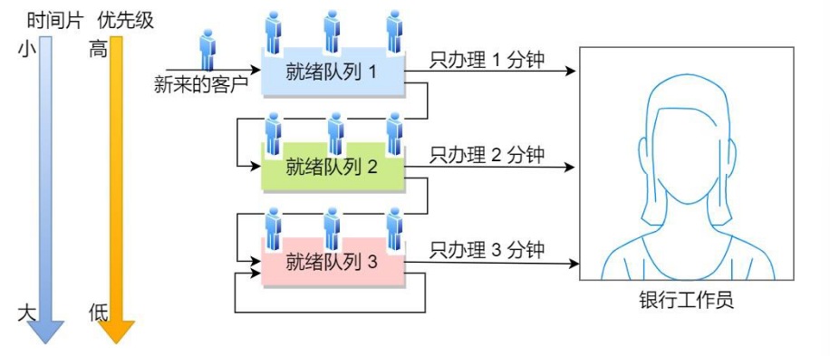

# 进程调度

**抢占与非抢占**：

- 非抢占调度方式：当一个进程正在处理中，即使有更为重要的进程进入到就绪队列中，仍然让正在执行的进程继续执行。
- 抢占调度方式：当一个进程正在处理中，如果有更为重要的进程进入到就绪队列中，则允许调度程序根据某种原则去暂停正在执行的进程，将处理机分配给这个更为重要或紧迫的进程。

## 先来先服务FCFS

每次从就绪队列选择最先进入队列的进程，然后一直运行，直到进程退出或被阻塞，才会继续从队列中选择第一个进程接着运行。**对短作业极不友好**。

## 短作业优先

**逻辑**：谁需要的 CPU 时间短，谁先插队执行。

**优点**：能带来最短的平均等待时间。

**痛点**：第一，OS 根本无法提前知道一个进程到底要运行多久；第二，如果短作业源源不断地来，长作业就会被“饿死”，永远得不到执行。

## 高相应比优先

$优先权=\frac{等待时间+要求服务时间}{要求服务时间}$

作业的等待时间相同时，如果要求服务时间越短，则响应比更高，有利于短作业执行。

当要求服务时间相同时，响应比由等待时间决定，如果等待时间越长，则响应比越高。

对于长作业，作业的响应比可以随着等待时间的增加而提高。

## 时间片轮转

这是**分时操作系统**（如我们用的 PC）的基础。

- **逻辑**：每个人发一个固定大小的“时间片”（比如 10ms）。时间一到，管你有没有跑完，立刻排到队伍末尾去。
- **时间片设多大合适？**
  - 设得太大：退化成 FCFS，响应太慢。
  - 设得太小：频繁发生上下文切换，CPU 的时间全浪费在切换上下文（保存/恢复寄存器）上了，真正在跑程序的时间反而少了。

## 优先级调度

从就绪队列中选择最高优先级的进程进行运行，但进程的优先级可以分为静态优先级和动态优先级

- 静态优先级：优先级在创建进程时已经确定，在进程运行期间保持不变，确定静态优先级的主要依据有进程类型，对资源的要求，用户要求。

- 动态优先级：进程运行过程中，根据进程运行时间和等待时间等因素调整进程的优先级

但是这种算法可能会导致低优先级的进程永远不被执行。

## 多级反馈队列调度

**设置多个队列**：优先级从高到低排列（如 Q1, Q2, Q3）。优先级越高的队列，分给它的时间片越短。

**新客优先**：新来的进程一律放进最高优先级队列 Q1 的末尾。

**惩罚机制（降级）**：如果一个进程在 Q1 的短时间片内没跑完（说明它是 CPU 密集型的计算大户），OS 就会把它降级，扔到 Q2 的末尾；如果 Q2 也没跑完，就扔到 Q3。

**补偿机制（I/O 友好）**：如果在时间片用完前，进程主动放弃 CPU（比如去读写文件或等网络包），OS 会认为它是“交互型进程”，不仅不降级，甚至可能给它升级。

这个算法让**短作业（如 UI 响应、键盘输入）能在高优先级队列迅速完成；让长作业（如后台解压文件）**在低优先级队列慢慢跑，互不干扰。

