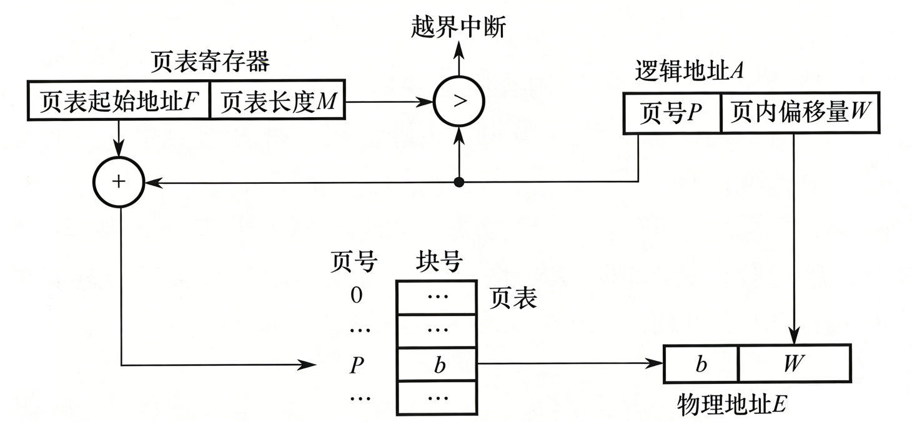
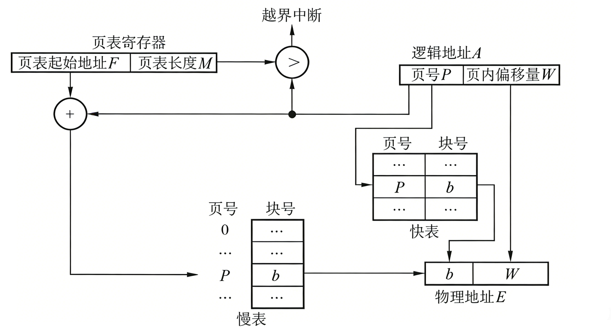
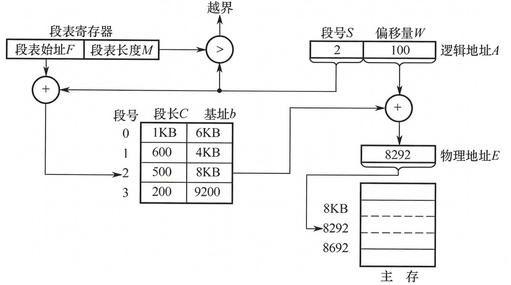
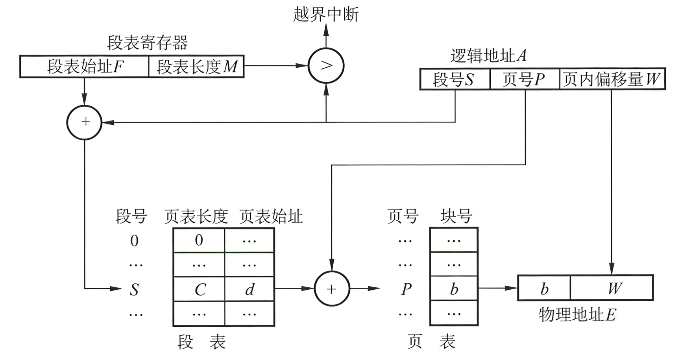

# 内存分区

**栈区**

- **由编译器自动分配和释放**。
- **存储内容**：函数参数、局部变量、返回地址。
- **特点**：空间有限（通常几 MB），**增长方向是由高向低**。它是连续的内存区域，访问极快（由 CPU 专用寄存器支持）。

**堆区**

- **由程序员手动管理**（`malloc`/`free`, `new`/`delete`）。
- **存储内容**：程序运行期间动态分配的大型数据。
- **特点**：空间巨大（受限于虚拟内存），**增长方向是由低向高**。是不连续的内存区域，容易产生内存碎片，访问速度慢于栈。

**全局/静态区**

- **在程序编译时分配**，程序结束后由系统释放。
- **存储内容**：全局变量、静态变量（`static`）。
- **细分**：在 C++ 中，初始化的变量放在 `.data` 段，未初始化的放在 `.bss` 段。

**常量区**

- **只读**。
- **存储内容**：字符串常量（如 `"Hello World"`）。

**代码区**

- **存储内容**：存放二进制机器代码。

| **维度**     | **栈 (Stack)**                               | **堆 (Heap)**                                                |
| ------------ | -------------------------------------------- | ------------------------------------------------------------ |
| **管理方式** | 编译器自动管理，无需人工介入。               | 程序员手动管理，容易造成**内存泄漏**。                       |
| **空间大小** | 很小（通常 Windows 下默认 1MB，Linux 8MB）。 | 非常大（4GB 甚至更多，取决于物理和虚拟内存）。               |
| **分配效率** | **极高**。CPU 有指令支持，入栈出栈极快。     | **较低**。需要复杂的搜索空闲块算法（如首次适配、最佳适配）。 |
| **增长方向** | 高地址向低地址。                             | 低地址向高地址。                                             |
| **碎片问题** | 无碎片。                                     | **碎片化严重**（频繁分配/释放小内存会导致空闲内存不连续）。  |

**为什么访问堆更慢？**

**址开销**：栈是直接寻址，地址在编译期或通过寄存器相对偏移就能确定；堆是间接寻址，往往需要先拿指针，再去读指针指向的地址。

**缓存不友好**：栈内存空间连续且局部性极强，极易命中 **CPU 缓存（L1/L2 Cache）**；堆内存分配分散，很容易导致 Cache Miss。

**分配机制**：栈的分配只是移动一下 `esp` 指针；堆分配需要查找、合并空闲内存块，甚至触发系统调用（`brk` 或 `mmap`）。

# 虚拟内存

**虚拟内存的本质：** 在进程和物理内存之间加了一个**中间层（映射层）**。

## 虚拟内存的作用

**内存隔离**

每个进程都有自己的页表。进程 A 的虚拟地址 `0x100` 映射到物理地址甲，进程 B 的 `0x100` 映射到物理地址乙。它们互不干扰，实现了彻底的安全隔离。

**扩大地址空间**

通过“换入/换出”机制，我们可以运行比物理内存大得多的程序。暂时不用的页丢到磁盘（Swap），要用时再捡回来。

**内存共享**

不同的进程可以把各自的虚拟页面映射到**同一个**物理页框上。这就是之前的**共享内存（IPC）和动态链接库（DLL/SO）**的实现原理：多个游戏进程共享同一份底层操作系统的机器码。

## 内存分页

在分页机制下，一个虚拟地址在**逻辑地址**被划分为两个部分：

```c++
31                12 11                0
┌───────────────────┬───────────────────┐
│      页号 P       │   页内偏移量 W      │
└───────────────────┴───────────────────┘
```

1. **页号 (Page Number, P)**：决定了你在虚拟内存的哪一页。
2. **页内偏移量 (Page Offset, W)**：决定了你在这一页内部的哪个位置。

**偏移量位数如何确定？**

偏移量的位数直接取决于**页面大小**。

- 如果页面大小是 **4KB** ($2^{12}$ 字节)，那么偏移量就占 **12 位**。
- 这 12 位可以表示从 $0$ 到 $4095$ 的每一个字节。

### 内存分页寻址步骤



**第一步：拆分虚拟地址**

将 `0x12345678` 转换为二进制，末尾 12 位是偏移量，前面 20 位是页号。

- **页号 (P)** = `0x12345`
- **偏移量 (W)** = `0x678`

**第二步：查找页表**

CPU 的内存管理单元（MMU）根据页号 `0x12345` 去内存里的**页表**查表。 页表就像一个数组，页号就是索引。

**第三步：获取物理页框号**

从页表中取出对应的条目（PTE）。条目里存储的是**物理页框号 (PFN)**，假设查到的结果是 `0xABCDE`。

**第四步：拼接地址**

物理地址的计算公式非常简单：**物理页框号直接拼接偏移量**。

- 因为页面和页框的大小完全一样（都是 4KB），所以偏移量在转换过程中**保持不变**。

**第五步：生成物理地址**

**物理地址 (PA)** = `0xABCDE` (页框号) + `0x678` (偏移量) = **`0xABCDE678`**。

### 页表条目PTE

**存在位**：该页是否在内存里。如果是 0，触发**缺页中断**。

**读写位**：该页是否允许写。如果是 0 但你强行写，触发 **Segmentation Fault**。

**访问位**：记录最近有没有被读写过。这是 **LRU 算法**的重要参考指标。

### 快表TLB



将虚拟地址直接映射到物理地址，而不必再访问页表，这种设备被称为转换检测缓冲区（TLB）、相联存储器或快表

⼯作过程：将⼀个虚拟地址放入MMU中进行转换时，硬件首先通过将该虚拟页号与TLB中所有表项同时进行匹配，判断虚拟页面是否在其中：

1. 虚拟页号在TLB中。如果MMU检测⼀个有效的匹配并且访问操作并不违反保护位，则将页框号直接从TLB中取出而不必访问页表。
2. 虚拟页号不在TLB中。如果MMU检测到没有有效的匹配项就会进行正常的页表查询。接着从TLB中淘汰⼀个表项，然后用新的页表项替换。

### 多级页表

**多级页表（类似书本目录）**

- 一级页表（目录）：指向二级页表。
- 二级页表（具体内容）：指向物理页。
- **核心优势：** 如果进程只用了很小一块内存，我们只需要建一级页表和极少数二级页表。**大部分没用到的内存不需要建页表。**

### 分页与内存对齐

为什么 C++ 结构体要做内存对齐？为什么高性能数组要按页边界对齐？

- **跨页访问：** 如果一个数据结构恰好跨越了两个虚拟页，CPU 可能需要查两次页表、触发两次内存访问，甚至可能其中一页在内存而另一页在硬盘（触发缺页中断）。
- **结论：** 保证频繁访问的数据不跨页，是极致性能优化的细节。

## 内存分段



分页对程序员是透明的，但**分段**是面向程序员的。它把程序按照逻辑关系划分为若干个段，比如：**代码段、数据段、栈段、堆段**。

- **地址结构**：虚拟地址由 **段号 (S)** 和 **段内偏移量 (W)** 组成。
- **段表**：记录了每个段的**起始物理地址（基址）和段的长度（限长）**。

| **维度**     | **分页 (Paging)**                    | **分段 (Segmentation)**                          |
| ------------ | ------------------------------------ | ------------------------------------------------ |
| **目的**     | 解决物理内存利用率，离散分配。       | **满足程序员编程需求**（逻辑共享、保护）。       |
| **单位**     | 物理单位，固定大小（如 4KB）。       | **逻辑单位**，大小不固定。                       |
| **地址空间** | 一维（只需要一个逻辑地址即可换算）。 | **二维**（必须显式给出段号和偏移量）。           |
| **碎片**     | 有内部碎片，无外部碎片。             | **有外部碎片**（段与段之间可能留下太小的空隙）。 |

## 段页式管理



 **思想：**

1. 先将程序按逻辑**分段**（代码段、数据段）。
2. 再把每一个“段”内部划分为固定大小的**页**。

**地址转换步骤（三步走）：**

1. **找段表**：根据段号找到该段对应的**页表起始地址**。
2. **找页表**：根据页号找到对应的**物理页框号**。
3. **找物理内存**：加上页内偏移量，得到最终物理地址。

**代价**：一次寻址需要访问 **3 次内存**（查段表 $\rightarrow$ 查页表 $\rightarrow$ 读数据）。当然，由于 **TLB (快表)** 的存在，实际性能依然很高。

# 页面置换

## 最佳置换算法OPT

- **逻辑**：**“上帝视角”**。踢走那个在**未来最长时间内**不再被访问的页面。
- **举例**：如果未来访问序列是 A, B, C, A，现在内存满了要踢一个，OPT 会踢走 B 或 C，因为 A 马上又要用了。
- **优缺点**：
  - **优点**：缺页率绝对最低。它是所有算法的性能上限（Benchmark）。
  - **缺点**：**无法实现**。操作系统无法预知未来。

## 先进先出FIFO

- **逻辑**：**“排队买票”**。最早进入内存的页面，最早被踢走。不论它现在是否还在被频繁访问。
- **优缺点**：
  - **优点**：实现极其简单，用一个队列就能维护。
  - **缺点**：**性能最差**。它经常会踢走那些虽然进去得早、但现在依然是“大红人”的核心数据。
- **特有 Bug（贝莱迪异常 Belady's Anomaly）**：正常来说，给进程分配的物理页框越多，缺页率应该越低。但 FIFO 可能会出现：**页框多了，缺页率反而上升**的奇葩现象。这是 408 考研的经典陷阱题。

## 最近最久未使用LRU

它的核心思想是：**“如果一个数据最近刚被访问过，那么它马上被再次访问的可能性很大。”**

- **逻辑**：踢走那个**过去最长时间内**没有被访问过的页面。它是 OPT 算法在现实中的最佳近似。

- **实现原理（面试加分项）**：

  1. **硬件支持**：需要 CPU 维护一个计数器或特殊的**栈**结构。每次访问一个页，就把它移到栈顶。踢人时踢栈底的。
  2. **开销**：每一次内存访问都要更新硬件状态，开销较大。

**LeetCode 手写实现（重要）**：

在Hot100的LRU缓存那道题，使用**双向链表+哈希表** 来实现 $O(1)$ 时间复杂度的 LRU 缓存。

  - 哈希表用于快速定位元素在链表中的位置。
  - 双向链表用于维护访问顺序，最近访问的移到表头，表尾就是待踢出的元素。

## 其它点缀算法

**最少使用 (LFU - Least Frequently Used)**

- **逻辑**：踢走那个**访问次数最少**的页面。
- **痛点**：一个页面如果在刚启动时被狂刷 1000 次，然后就再也不用了。它会因为访问次数高而长期赖在内存里不走。

**时钟置换算法 (Clock / NRU - Not Recently Used)**

- **逻辑**：**LRU 的廉价替代品**。它给每个页设一个“访问位（0/1）”。
- **过程**：像时钟的指针一样旋转。遇到 1（最近用过），把它清零（给你一次机会），继续走；遇到 0（最近没用过），直接踢走。

# 内存碎片

**内部碎片**：

- **发生地**：分页机制。
- **原因**：分配的固定块（如 4KB）没用完。比如你只要 1KB，但 OS 最小给 4KB，剩下的 3KB 别人也用不了。

**外部碎片：

- **发生地**：分段机制或原始的连续分配。
- **原因**：内存中有很多零散的小空隙，每个空隙都太小，无法装下任何一个新段，但总和其实很大。

**内存池**：

- **少碎片**：OS 只能管理 4KB 级别的页，但游戏里有数以万计的几字节、几十字节的小对象（如 `Vector3`, `Bullet`）。如果频繁申请释放，会产生海量碎片。

- **提升性能**：调用 `malloc` 是要进内核态的。内存池会先向 OS 申请一大块“匿名映射内存”，然后在用户态自行切分。

# 写时复制COW(Copy on write)

在 Linux 系统中，它是 `fork()` 系统调用能实现秒级响应的根本原因。如果你在面试中能结合**页表**和**权限控制**来讲解 COW，面试官会觉得你对操作系统的理解已经深入到了内核层面。

COW 的核心逻辑是：**“只读不写就不拷，要写才拷那一小块。”**

在传统的进程创建中，如果父进程占用了 10GB 内存，`fork` 子进程时理论上要拷贝这 10GB 数据，这会造成巨大的性能浪费和内存压力。

**COW 的做法是：**

1. **初始共享**：`fork` 时，子进程直接指向父进程的物理内存。父子进程共享同一份数据。
2. **权限设为只读**：OS 把父子进程涉及到的所有内存页的权限都设为**只读（Read-Only）**。
3. **触发异常**：当其中一个进程试图修改某页内存时，CPU 硬件检测到“写只读内存”，触发一个**保护异常（Trap）**。
4. **按需拷贝**：内核接管异常，发现是 COW 机制。于是，内核才真正为修改者申请一个新的物理页框，把原数据拷过去，并修改该进程的页表。
5. **恢复执行**：修改者在自己的私有副本上进行写操作，而另一个进程依然看的是原来的老数据。

COW的优势：

**减少内存占用**：如果子进程只是读取数据（比如启动一个更新器去检查版本），根本不需要额外的物理内存。

**极速响应**：`fork` 操作只需要拷贝页表（几 MB），而不是整个内存（几 GB），这让进程创建变成了毫秒级操作。

**安全性**：通过硬件权限位控制，确保了父子进程在逻辑上是数据隔离的，互不影响