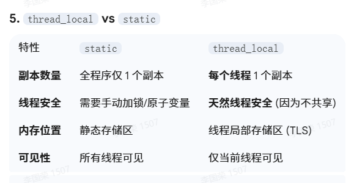

> [!NOTE]
>
> 线程库

# 线程库

简单示例：

~~~c++
#include <iostream>
#include <thread> // 必须包含这个头文件

void task() {
    std::cout << "子线程正在运行..." << std::endl;
}

int main() {
    // 1. 创建线程对象，并传入要执行的函数
    std::thread t1(task);

    // 2. 阻塞主线程，直到 t1 执行完毕
    t1.join(); 

    std::cout << "子线程已结束，主线程继续执行。" << std::endl;
    return 0;
}
~~~

`std::thread t(func)`: 创建一个线程并立即开始执行 `func`。

`t.join()`: “加入”。主线程会停在这里等待 `t` 线程执行完。如果不写 `join()`，主线程跑完了直接退出，程序会崩溃。

`t.detach()`: “分离”。线程在后台独立运行，主线程不再管它的死活。通常不推荐初学者使用，因为容易导致资源管理混乱。

## 线程对象构造

**调用无参构造线程对象**

使用thread提供的无参构造函数创建出来的线程对象没有任何关联的线程函数，没有启动任何线程。

```c++
thread t1;
```

**调用带参的构造函数创建线程对象**

```c++
template <class Fn, class... Args>
explicit thread (Fn&& fn, Args&&... args);
```

- `fn`：可调用对象，比如函数指针、仿函数、lambda表达式、被包装器包装后的可调用对象等。
- `args...`：调用可调用对象fn时所需要的若干参数。

使用带参的构造函数创建线程，能够将线程对象与线程函数fn进行关联。

```c++
void func(int n)
{
	for (int i = 0; i <= n; i++)
	{
		cout << i << endl;
	}
}
int main()
{
	thread t2(func, 10);

	t2.join();
	return 0;
}
```

**调用移动构造函数**

```c++
void func(int n)
{
	for (int i = 0; i <= n; i++)
	{
		cout << i << endl;
	}
}
int main()
{
	thread t3 = thread(func, 10);

	t3.join();
	return 0;
}
```

**调用移动赋值函数**

thread提供了移动赋值函数，因此当后续需要让该线程对象与线程函数关联时，可以以带参的方式创建一个匿名对象，然后调用移动赋值将该匿名对象关联线程的状态转移给该线程对象。

```c++
void func(int n)
{
	for (int i = 0; i <= n; i++)
	{
		cout << i << endl;
	}
}
int main()
{
	thread t1;
	//...
	t1 = thread(func, 10);

	t1.join();
	return 0;
}
```

## 成员函数

| 成员函数 | 功能                                                         |
| -------- | ------------------------------------------------------------ |
| join     | 对该线程进行等待，在等待的线程返回之前，调用join函数的线程将会被阻塞 |
| joinable | 判断该线程是否已经执行完毕，如果是则返回true，否则返回false  |
| detach   | 将该线程与创建线程进行分离，被分离后的线程不再需要创建线程调用join函数对其进行等待 |
| get_id   | 获取该线程的id                                               |
| swap     | 将两个线程对象关联线程的状态进行交换                         |

`joinable`函数还可以用于判定线程是否是有效的，如果是以下任意情况，则线程无效：

- 采用无参构造函数构造的线程对象。（该线程对象没有关联任何线程）
- 线程对象的状态已经转移给其他线程对象。（已经将线程交给其他线程对象管理）
- 线程已经调用join或detach结束。（线程已经结束）

## 获取线程ID

获取线程id的方式

```c++
void func()
{
	cout << this_thread::get_id() << endl; //获取线程id
}
int main()
{
	thread t(func);

	t.join();
	return 0;
}
```

| 函数名      | 功能                                               |
| ----------- | -------------------------------------------------- |
| yield       | 当前线程“放弃”执行，让操作系统调度另一线程继续执行 |
| sleep_until | 让当前线程休眠到一个具体时间点                     |
| sleep_for   | 让当前线程休眠一个时间段                           |

## 线程函数的参数问题

线程函数的参数是以值拷贝的方式拷贝到线程栈空间中的，就算线程函数的参数为引用类型，在线程函数中修改后也不会影响到外部实参，因为其实际**引用的是线程栈中的拷贝**，而不是外部实参。

```c++
void add(int& num)
{
	num++;
}
int main()
{
	int num = 0;
	thread t(add, num);
	t.join();

	cout << num << endl; //0
	return 0;
}
```

要通过线程函数形参改变外部实参，可以：

**方式一：借助std::ref**

当线程函数的参数类型为引用类型时，如果要想线程函数形参引用的是外部传入的实参，而不是线程栈空间中的拷贝，那么在传入实参时需要借助ref函数保持对实参的引用。

```c++
void add(int& num)
{
	num++;
}
int main()
{
	int num = 0;
	thread t(add, ref(num));
	t.join();

	cout << num << endl; //1
	return 0;
}
```

**方式二：地址的拷贝**

将线程函数的参数类型改为指针类型，将实参的地址传入线程函数，此时在线程函数中可以通过修改该地址处的变量，进而影响到外部实参。

```c++
void add(int* num)
{
	(*num)++;
}
int main()
{
	int num = 0;
	thread t(add, &num);
	t.join();

	cout << num << endl; //1
	return 0;
}
```

**方式三：借助lambda表达式**

将lambda表达式作为线程函数，利用lambda函数的捕捉列表，以引用的方式对外部实参进行捕捉，此时在lambda表达式中对形参的修改也能影响到外部实参。

```c++
int main()
{
	int num = 0;
	thread t([&num]{num++; });
	t.join();

	cout << num << endl; //1
	return 0;
}
```

## join与detach

**join**

主线程创建新线程后，可以调用join函数等待新线程终止，当新线程终止时`join`函数就会自动清理线程相关的资源。

`join`函数清理线程的相关资源后，thread对象与已销毁的线程就没有关系了，因此一个线程对象一般只会使用一次`join`，否则程序会崩溃。

```c++
void func(int n)
{
	for (int i = 0; i <= n; i++)
	{
		cout << i << endl;
	}
}
int main()
{
	thread t(func, 20);
	t.join();
	t.join(); //程序崩溃
	return 0;
}
```

但如果一个线程对象`join`后，又调用移动赋值函数，将一个右值线程对象的关联线程的状态转移过来了，那么这个线程对象又可以调用一次`join`。比如：

```c++
void func(int n)
{
	for (int i = 0; i <= n; i++)
	{
		cout << i << endl;
	}
}
int main()
{
	thread t(func, 20);
	t.join();

	t = thread(func, 30);
	t.join();
	return 0;
}
```

但采用`join`的方式结束线程，在某些场景下也可能会出现问题。比如在该线程被`join`之前，如果中途因为某些原因导致程序不再执行后续代码，这时这个线程将不会被`join`。

```c++
void func(int n)
{
	for (int i = 0; i <= n; i++)
	{
		cout << i << endl;
	}
}
bool DoSomething()
{
	return false;
}
int main()
{
	thread t(func, 20);

	//...
	if (!DoSomething())
		return -1;
	//...

	t.join(); //不会被执行
	return 0;
}
```

**以RAII的方式对线程对象封装**

因此采用`join`方式结束线程时，`join`的调用位置非常关键，为了避免上述问题，可以采用RAII的方式对线程对象进行封装，也就是利用对象的生命周期来控制线程资源的释放。比如：

```c++
class myThread
{
    public:
    myThread(thread& t)
        :_t(t)
        {}
    ~myThread()
    {
        if (_t.joinable())
            _t.join();
    }
    //防拷贝
    myThread(myThread const&) = delete;
    myThread& operator=(const myThread&) = delete;
    private:
    thread& _t;
};
```

- 每当创建一个线程对象后，就用myThread类对其进行封装产生一个myThread对象。
- 当myThread对象生命周期结束时就会调用析构函数，在析构中会通过`joinable`判断这个线程是否需要被`join`，如果需要那么就会调用`join`对其该线程进行等待。

```c++
int main()
{
	thread t(func, 20);
	myThread mt(t); //使用myThread对线程对象进行封装

	//...
	if (!DoSomething())
		return -1;
	//...

	t.join();
	return 0;
}
```

以刚才的例子：return-1后myThread析构，线程一定会析构。

main中的主线程声明周期长于MyThread才这么干的

```c++
// 注意：这里如果用引用，必须确保外部线程对象生命周期长于myThread
// 更安全的方式是用移动语义（推荐）
myThread(thread t)  // 改为值传递（配合移动）
    : _t(move(t))  // 转移线程所有权，避免引用的生命周期问题
    {}
```

**detach**

- 主线程创建新线程后，也可以调用`detach`函数将新线程与主线程进行分离，分离后新线程会在后台运行，其所有权和控制权将会交给C++运行库，此时C++运行库会保证当线程退出时，其相关资源能够被正确回收。

- 使用detach的方式回收线程的资源，一般在线程对象创建好之后就立即调用detach函数。
  否则线程对象可能会因为某些原因，在后续调用detach函数分离线程之前被销毁掉，这时就会导致程序崩溃。

- 因为当线程对象被销毁时会调用thread的析构函数，而在thread的析构函数中会通过joinable判断这个线程是否需要被join，如果需要那么就会调用terminate终止当前程序（程序崩溃）。

# 多线程的数据竞争

想象一下：有两个线程同时对一个全局变量 `count` 进行 `count++` 操作。

1. 线程 A 读取 `count` (值为 10)。
2. 线程 B 读取 `count` (值也是 10)。
3. 线程 A 把 10 加 1 得到 11，写回内存。
4. 线程 B 也把 10 加 1 得到 11，写回内存。

**结果**：我们加了两次，但 `count` 只增加了 1。这就是典型的 **数据竞争**。

# 向线程传递参数

## 使用std::ref

`std::thread` 的构造函数采用了**可变参数模板**。你可以像调用普通函数一样传参，但这里有一个底层细节需要注意：**参数默认会被拷贝到线程的独立内存空间中**。

~~~c++
#include <iostream>
#include <thread>
#include <string>

void changeValue(int& n) {
    n += 100;
}

int main() {
    int num = 10;
    
    // 错误写法：std::thread t(changeValue, num); // 编译报错，因为线程内部尝试拷贝 num
    
    // 正确写法：使用 std::ref 包装引用
    std::thread t(changeValue, std::ref(num)); 
    
    t.join();
    std::cout << "num 的值现在是: " << num << std::endl; // 输出 110
    return 0;
}
~~~

`std::thread` 的构造函数会把所有参数先**拷贝**一份。如果你传入的是 `int&`，它尝试**拷贝一个引用**，这在 C++ 中是**不允许**的。`std::ref` 会生成一个 `reference_wrapper` 对象，它是可以被拷贝的，从而绕过这个限制。

## 使用lambda表达式

当你写 `[&num]` 时，编译器会生成一个类，里面包含一个引用成员指向 `num`。当你把整个 Lambda 传给 `std::thread` 时，拷贝的是这个“捕获了引用的闭包对象”。

~~~c++
int main() {
    int num = 10;

    // 方式 A：通过 Lambda 引用捕获
    std::thread t1([&num]() {
        num += 100; // 直接操作外部的 num
    });

    // 方式 B：通过 Lambda 值捕获（内部修改不影响外部）
    std::thread t2([num]() mutable {
        // num += 100; // 这里的 num 是副本
    });

    t1.join();
    // t2.join();
}
~~~

## 使用指针传递

~~~c++
void work(int* p) {
    *p += 50;
}
std::thread t(work, &num); // 拷贝的是地址，线程通过地址找到原变量
~~~

## 使用移动语义

如果你要传递的是一个**大对象**（比如巨大的 `std::vector`）或者**唯一资源**（比如 `std::unique_ptr`），你既不想拷贝，也不想用引用（因为原对象不再需要了），那就用移动。

~~~c++
std::unique_ptr<int> p = std::make_unique<int>(100);
std::thread t(func, std::move(p)); // p 的所有权转移到了线程内部
~~~

# 在成员函数中使用多线程

如何在一个类的方法里启动一个线程运行另一个方法呢？

`std::thread t(&类名::函数名, &对象实例, 参数1, 参数2...)`

~~~c++
class GraphicsEngine {
public:
    void render(int frames) {
        std::cout << "正在后台渲染 " << frames << " 帧..." << std::endl;
    }

    void startBackgroundRender() {
        // 第一个参数：成员函数指针
        // 第二个参数：当前对象的地址 (this)
        // 后续参数：传给 render 的参数
        std::thread t(&GraphicsEngine::render, this, 60);
        t.join();
    }
};
~~~

## 那能传入处理右值引用的函数吗

编译器可以通过，但无法修改外部数据

`std::thread` 会在内部存储区创建一个 `num` 的副本（我们叫它 `copy_num`）。

当线程真正开始执行时，它调用 `changeValue` 的方式类似于： `changeValue(std::move(copy_num))`

因为 `copy_num` 是存储在线程对象内部的私有成员，`std::thread` 知道这个变量的生命周期仅限于此，所以它会以 **右值**的形式将其传递给任务函数。由于 `int&&` 能够绑定到右值，所以编译器完全支持这种写法。

1. **主线程**：变量 `num` 在栈上，值为 $10$。
2. **创建线程**：`std::thread` 把 `num` 拷贝了一份到它自己的内部存储区，此时 `copy_num = 10`。
3. **子线程运行**：调用 `changeValue(int&& n)`，这里的 `n` 绑定的是 `copy_num`。
4. **修改数据**：`n += 100` 实际上是让 `copy_num` 变成了 $110$。
5. **结束**：子线程函数运行完毕，`std::thread` 的内部存储区随之销毁，`copy_num` 消失了。
6. **结果**：主线程里的 `num` 依然是 $10$。

> **结论**：使用 `int&&` 配合 `std::thread` 传参，实际上是把参数**移动**给了子线程。如果你传入的是一个复杂的类（比如 `std::vector`），子线程会“偷走”这个副本的资源进行处理。但无论如何，它处理的都是**副本**，而不是主线程里的原始变量。

| **写法**     | **函数签名**  | **传参方式**                    | **结果**                                                     |
| ------------ | ------------- | ------------------------------- | ------------------------------------------------------------ |
| **错误引用** | `void(int&)`  | `std::thread(f, num)`           | **编译报错**。因为 `std::thread` 尝试把拷贝出的副本（右值）传给左值引用。 |
| **标准引用** | `void(int&)`  | `std::thread(f, std::ref(num))` | **成功**。修改的是主线程里的 `num` 原身。                    |
| **右值引用** | `void(int&&)` | `std::thread(f, num)`           | **编译通过**。但修改的是线程内部的**副本**，主线程无感知。   |

# 线程的生命周期与安全性

如果一个 `std::thread` 对象被销毁时，你既没有 `join()` 也没有 `detach()`，程序会直接调用 `std::terminate()` 崩溃。

**检查可结合性**

~~~c++
if (t.joinable()) {
    t.join();
}
~~~

# thread_local

- 如果一个变量被声明为 thread_local，那么**每个线程都会为它分配一份独立的内存**。线程 A 对该变量的修改，线程 B 无法看到，反之亦然
- 在多线程环境下，普通的全局变量或静态变量是共享的，必须加锁才能安全访问。而 thread_local 变量本质上是“线程私有”的，因此访问它**不需要加锁**，性能极高

```c++
#include <iostream>
#include <thread>
#include <vector>

// 每个线程进入时，都会初始化自己的一份 counter，初始值为 0
thread_local int counter = 0; 

void increase_counter(int id) {
    for (int i = 0; i < 3; ++i) {
        counter++; // 仅修改当前线程的副本
        std::cout << "Thread " << id << " counter: " << counter << "\n";
    }
}

int main() {
    std::thread t1(increase_counter, 1);
    std::thread t2(increase_counter, 2);

    t1.join();
    t2.join();

    return 0;
}
```

**输出结果：** 两个线程都会输出 1, 2, 3。如果 counter 是普通全局变量，结果会是 1 到 6 的乱序

- **创建时机：** 变量在线程启动（或者第一次使用该变量时）进行初始化
- **销毁时机：** 变量在线程退出（Thread Exit）时自动销毁
- **类的成员：** 如果类的静态成员是 thread_local，它的构造函数会在每个线程中各调用一次，析构函数也会在线程结束时相应调用



TLS 不是传统栈 / 堆 / 全局区的一部分，而是**操作系统为每个线程单独分配的独立内存区域**

核心特征：线程私有、连续内存、通过段寄存器快速访问，生命周期绑定线程

## 关于TLS

**TLS** **指针（线程控制块 TCB）**：

- 每个线程都有一个专属的**线程控制块（TCB）**，其中包含一个指向该线程 TLS 段的指针（TLS pointer）
- 这个指针是线程上下文的一部分，CPU 通过寄存器（如 Linux 的`fs`/`gs`段寄存器）快速访问，几乎无性能开销

**副本初始化**：

- 全局 / 静态`thread_local`变量：线程创建时，操作系统会从 TLS 模板中复制变量的初始值，为该线程创建独立副本
- 局部`thread_local`变量：第一次在该线程中执行到变量声明时初始化（懒加载），且仅初始化一次，类似于static变量

**变量访问**：

- 当线程访问`thread_local`变量时，编译器会生成代码：通过 TLS 指针找到该线程的 TLS 段，再定位到变量的专属副本
- 这个过程对开发者透明，语法上和访问普通变量无区别，但底层是 “线程专属地址”
