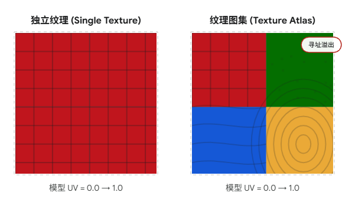
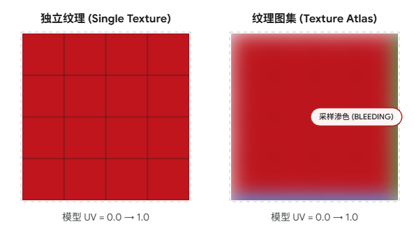

# DrawCall

Draw Call 就是 **CPU 向 GPU 发出的一条渲染指令**

CPU告诉GPU：用当前绑定的材质、纹理、着色器和顶点数据，将网格画到屏幕上。

# DrawCall是CPU瓶颈

CPU在下达指令前有一系列准备工作：

1. **状态切换：** CPU 需要告诉 GPU 这次绘制用什么着色器（Shader）、绑定哪些纹理（Textures）、设置怎样的混合模式（Blend State）等。这些状态的切换非常耗时。
2. **命令校验与提交：** 显卡驱动程序需要检查这些状态是否合法，并将命令放入命令缓冲区（Command Buffer）中，最后通过 PCIe 总线推送到 GPU。
3. **上下文切换开销：** 从用户态切换到内核态，再与硬件交互，这个链路本身就有固有开销。

# 静态合批

静态合批用于优化渲染管线中静态的物体。

静态合批是一种**空间换时间**策略。

在未优化的渲染管线中，假设场景里有 100 棵相同的树（属于静态物体，永远不动）。通常的做法是：

1. 在显存里存一份树的顶点数据（VBO）。

2. 循环 100 次：CPU 每次向 GPU 传递一个这棵树的 `Model Matrix`（模型矩阵，包含位置、旋转、缩放），然后调用一次 `glDrawElements`。

3. 结果： 1 份内存占用，100 次 Draw Call，100 次状态切换。

**静态合批**做法：在CPU端优化

1. **预处理：**在**场景加载或打包阶段**，CPU 读取这 100 棵树各自的 `Model Matrix`，然后将每一棵树的局部坐标（Local Space）直接乘以矩阵，转换成世界坐标（World Space）。
2. **合并网格：** 将这 100 棵树转换后的世界坐标顶点数据，全部塞进一个极其巨大的 VBO 和 IBO 中。
3. **渲染时：** 绑定这个巨大的 VBO，调用 **1 次** `glDrawElements`。由于顶点已经是世界坐标了，Shader 里甚至连模型矩阵的乘法都可以省去。
4. **结果：** 100 倍的内存占用，1 次 Draw Call。

**静态合批：** CPU 的计算发生在**游戏进度条（Loading）阶段**。一旦游戏画面亮起，真正进入每帧 `Update` 的循环时，CPU 对这些静态顶点**零计算**，仅仅是传一个显存指针给 GPU。这就是我们常说的“空间（显存）换时间（运行时算力）”。

## 静态合批与管线

静态合批并没有跳过渲染管线。合并后的顶点**依然要在每一帧重新跑一遍完整的 GPU 渲染管线**。

在普通的渲染管线中，一个顶点从模型局部空间（Local Space）最终显示到屏幕上（Clip Space），GPU 的顶点着色器需要对每一个顶点执行以下矩阵乘法：

$$V_{clip} = M_{projection} \cdot M_{view} \cdot M_{model} \cdot V_{local}$$

**$M_{model}$（模型矩阵）：** 把顶点从局部坐标系转换到世界坐标系。对于静态物体，这个矩阵是**永远不变**的。

**$M_{view}$（观察/摄像机矩阵）：** 把世界坐标系转换到摄像机坐标系。只要摄像机动了，这个矩阵**每一帧都在变**。

**$M_{projection}$（投影矩阵）：** 产生透视效果。

### 那静态合批到底**合**了什么？**省**了什么？

**静态合批的本质，是在 CPU 端提前把 $M_{model} \cdot V_{local}$ 给算完了。**

在游戏打包或加载阶段，CPU 就已经计算出了所有静态物体的**世界坐标**（$V_{world}$）：

$$V_{world} = M_{model} \cdot V_{local}$$

然后，CPU 把这些算好的 $V_{world}$ 塞进一个巨大的显存 Buffer 里。

到了游戏运行时的**每一帧**，由于顶点已经是世界坐标了，GPU 顶点着色器实际执行的代码变成

$$V_{clip} = M_{projection} \cdot M_{view} \cdot V_{world}$$

1. **省了 CPU 的 Draw Call 提交次数（这是最核心的目的）：** CPU 不需要再循环 1000 次去给 GPU 发送 1000 个不同的 $M_{model}$ 和绘制指令。它只需要发 1 次 Draw Call 告诉 GPU：“画这个装满世界坐标的大数组，用当前的摄像机矩阵 $M_{view}$”。

2. **省了 GPU 的一次矩阵乘法：** GPU 不需要再计算 $M_{model} \cdot V_{local}$ 了。

## 静态合批优点

**CPU减负**：Draw Call数量被压缩到极致，消除了CPU频繁切换状态，验证命令和提交指令瓶颈。

**运行时0开销**：因为所有顶点的坐标变换都在游戏打包或场景加载的**预处理阶段**（Baking）完成了，GPU 在运行时直接**拿到的就是世界坐标**，连 Shader 里的 MVP 矩阵乘法（Model Matrix）都省了。

## 静态合批缺点

**显存（VRAM）和包体暴增：** 如果一个 1 万面的房子模型在场景里摆了 100 次，原本显存只需存 1 份房子的数据，静态合批后，显存里必须实打实地存下 100 万个顶点数据。对于内存敏感的平台（如手机），极易导致 OOM（内存溢出）崩溃。

**破坏视锥体剔除：** 渲染引擎通常基于物体的包围盒（Bounding Box）进行视锥体剔除。合并成一个巨大的网格后，它的包围盒将覆盖整个合批区域。只要这个巨大包围盒的一角在摄像机视野内，**整个几百万个顶点的网格都会被送入 GPU 管线**。虽然 GPU 的裁剪阶段（Clipping）最终会剔除视野外的像素，但顶点着色器（Vertex Shader）的计算压力会被严重浪费。

## 什么时候不能静态合批

**物体有运动**：移动/旋转/缩放

**运动时可能变换**

**使用骨骼动画**

**材质不同**：这个已经讨论过了

**不同渲染队列**：不透明/透明

**需要单独剔除**：因为合批就成一个整体不能单独剔除了

## 纹理图集

### 优点

**突破合批限制，极致降 CPU 负载：** 最重要的意义。把几十上百个物体的贴图塞进一张大图后，它们就可以共用同一个材质状态。

只需要调用一次 `glBindTexture`（绑定纹理是非常昂贵的状态切换），然后就可以用一个 Draw Call 把它们全画出来。对于 UI 渲染（如游戏里的背包界面）或体素场景，这是绝对的核心优化方案。

**减少显存碎片，提高管线效率：** 显卡在分配和管理小块内存时会有一定的碎片和额外开销。将碎图合并为一张 1024x1024 或 2048x2048 的大图，对 GPU 的缓存（Cache）更加友好，采样效率通常更高。

### 缺点

**硬件纹理寻址（平铺）失效**

在普通的渲染中，如果我们想让一面长长的墙壁贴满砖块，只需要把墙壁顶点的 UV 坐标设置得大于 1（比如 0 到 5），然后把纹理寻址模式设为 `GL_REPEAT`。GPU 硬件会自动帮你把砖块完美平铺 5 次。 **但在图集中，这个机制彻底失效了。** 因为硬件的 `GL_REPEAT` 是针对**整张大图**生效的。如果砖块贴图只占了图集左上角的四分之一，当你的 UV 大于图集分给砖块的范围时，GPU 会直接采样到图集里相邻的其他贴图（比如采样到了旁边的草地贴图），导致模型上出现极其诡异的图案拼接。

- **妥协方案：** 只能在 Shader 中用数学函数（如 `fract`）手动计算子 UV 的循环，这不仅增加了 Fragment Shader 的指令消耗，还破坏了 Mipmap 的导数计算。或者，只能增加墙壁网格的顶点数，用更多的顶点来强行对齐 UV。

**Mipmap 边缘渗色 (Bleeding)**

当物体离摄像机很远时，GPU 会使用 Mipmap（纹理的多级渐远层级）来抗锯齿。同时，GPU 会使用双线性或三线性过滤（Bilinear/Trilinear Filtering）来平滑像素。 这就导致在图集的子贴图边界处，GPU 在做过滤插值时，会不小心把**相邻那张贴图的边缘像素颜色给“吸”过来**，导致模型边缘出现一条难看的杂色黑线或白线。

- **妥协方案：** 在生成图集时，必须在每两张子贴图之间留出**“出血线”**，即复制边缘像素把缝隙填满。这会浪费大量的纹理空间。

如图所示纹理图集的右侧和下侧出现了渗色。

**生命周期绑定（内存常驻）**

如果把“主角的脸部贴图”和“第一关某个杂兵的贴图”拼在了一张图集里，这就意味着：只要主角在屏幕上，杂兵的贴图就必须呆在显存里占用空间，即使第一关早就打完了。

- **妥协方案：** 引擎工具链需要非常智能，严格按照物体的“空间出现频率”或“生命周期”来进行图集打包（比如同一关卡的静态物件打成一张图集）。

# 动态合批

动态合批就是优化渲染管线中会动的物体。

与静态合批区别：静态合批是在**打包/加载时**把顶点焊死在世界坐标系中。但对于游戏里的怪物、飞行的子弹、散落的粒子，它们每一帧都在移动，不能预先写死。

动态合批发生在游戏主循环Update中。

动态合批的思路是：**让 CPU 在每一帧，实时地把这些小物体“捏”成一个大物体。**

1. **收集：** CPU 遍历场景，找到所有使用**相同材质**且**满足动态合批条件**的移动物体。

2. **CPU 顶点变换（核心耗时所在）：** CPU 读取这些物体各自的顶点数据（局部坐标），然后用它们当前的 Model Matrix（模型矩阵）对每一个顶点进行矩阵乘法计算，将其转换为**世界坐标**。

3. **填充显存：** CPU 将计算好的世界坐标顶点，强行拷贝（Copy）到一段预先分配好的、允许动态修改的 VBO（Vertex Buffer Object）中。

4. **一次提交：** CPU 向 GPU 发出 **1 次** Draw Call，把这个动态拼接好的 VBO 画出来。

## 动态合批有严格数量限制

为什么不能把 100 个拥有 2000 个顶点的角色动态合批？

**CPU 的算力是有限的。**

- **普通渲染：** CPU 只负责把 1 个模型矩阵和 1 个 Draw Call 指令发给 GPU，具体的顶点矩阵乘法由 **GPU 的顶点着色器（Vertex Shader）** 高速并行完成。
- **动态合批：** 为了省下那个 Draw Call，CPU 把原本属于 GPU 的工作（几千几万次顶点矩阵乘法）**抢过来自己串行算了**。

如果一个模型的顶点数很少（比如一个四边形面片只有 4 个顶点，100 个面片也就 400 次矩阵乘法），CPU 算起来毫无压力，省下 100 个 Draw Call 是血赚。 但是，如果模型有 2000 个顶点，100 个模型就是 20 万次矩阵乘法！还要把这 20 万个顶点数据通过 PCIE 总线重新拷贝到显存里。**此时，CPU 计算顶点和拷贝内存的耗时，远远超过了直接发送 100 次 Draw Call 的耗时。**

## 动态合批优点

极大地减少了海量**微小**动态物体的 Draw Call（例如：2D 精灵图/Sprite、简单的粒子系统、UI 元素、非常低模的飞镖/子弹）。

不像静态合批那样引起显存的几何级暴增（因为它复用的是同一块动态 Buffer）。

## 动态合批缺点

**极其消耗 CPU：** 顶点数稍多，就会导致 CPU 成为严重瓶颈。

**榨干CPU算力和PCle总线带宽：**场景里有 100 颗飞行的子弹。显存里只有 1 个动态 Buffer。但是在**每一帧**，CPU 都要做两件极其沉重的事：

1. **算力开销：** CPU 要手动执行所有顶点的矩阵乘法（这原本是 GPU 的强项）。
2. **带宽开销：** 算完之后，CPU 必须把这缝合好的数据，通过主板上的 PCIe 总线，大批量地拷贝传输到 GPU 的显存里覆盖旧数据。 它压榨的是 **CPU 的时间和系统带宽**。

**同样受限于同材质：** 和静态合批一样，必须是相同材质才能合。

## 什么时候不能动态合批

**材质不同**：不同贴图/不同Shader/不同透明模式

**顶点属性不同**：position + normal + uv/position + normal + uv + tangent

**顶点数太多**：太吃CPU性能

**渲染状态不同**：是否开启透明/深度写入/剔除方式

## 与静态合批区别

动态合批和静态合批中CPU都只在MVP变换中乘了M。

**静态合批的“静态”，是指显存（VRAM）里的数据被彻底焊死了。** 游戏加载时，100 棵树的顶点就已经变成了世界坐标，固化在 GPU 的显存里。运行的时候，CPU 连碰都碰不到它们。如果你想让其中一棵树移动，你就必须用 CPU 重新计算这棵树的顶点，然后把几兆的数据通过 PCIE 总线重新覆盖到显存里——这种大面积的 IO 拷贝会瞬间卡死游戏。

**如果不合批（正常渲染）：** 就是发 100 次 Draw Call，每次传一个矩阵。GPU 自己去算顶点。这就是正常画运动物体的方式，但缺点是 CPU 发指令频繁，会发生多次Draw Call。

**动态合批的意义：** 它是一种**妥协**。对于几百个很小的运动物体，CPU 觉得发 100 次 Draw Call 和 GPU 沟通的沟通成本太高。不如CPU在这个回合（这一帧）顺手算完，打包发送数据给GPU。

### 静态合批：把时间“压缩”到过去

静态合批其实是**把“计算时间”从运行时借到了预处理时**。 在时间轴上，静态合批的工作在游戏开始前就已经完成了。到了渲染管线真正跑起来的时候，它在时间轴上是“透明”的，CPU 只需要发个指令，就像是按下了一个早就设置好的开关。

### 动态合批：把时间“强制”嵌入到渲染管线

动态合批是**在渲染管线的“开始前”插入了一块强制性的 CPU 任务**。 这就是为什么动态合批会造成“CPU 瓶颈”的原因：在渲染管线开始前，必须先等 CPU 把顶点计算完。如果这个计算耗时超过了 16ms（对于 60FPS 的游戏），渲染管线后面的 GPU 阶段就得“干等着”（即 **GPU Idle**），导致画面卡顿。

## 既视感

**静态合批== `constexpr` / 宏展开 / 预编译。** 你在编译期（游戏打包或加载时）把所有的计算都做完了。运行时（GPU 渲染时）直接拿结果，性能开销为 0。代价是编译时间变长，生成的二进制文件（显存占用）变大。

**动态合批== 函数内联+ 循环展开。** 每一次 Draw Call 就像是一次极其昂贵的**跨系统边界的函数调用**（就像从用户态陷入内核态，或者通过 JNI 调用 Java）。 如果一个小函数要被调用 1000 次，上下文切换的开销会远超函数执行本身。动态合批就是 CPU 做的优化：它把这 1000 个小函数的操作，强行在本地（CPU 端）展开计算完毕，然后合并成一次大的系统调用交上去。虽然 CPU 多做了点运算，但省下了 999 次昂贵的边界切换开销。

**GPU 实例化（GPU Instancing） == 把计算下推给异构硬件 / SIMD 指令集。** CPU 发现自己算顶点还是太慢了，于是说：“我只准备好一个数组，里面装满 1000 个物体的坐标（状态），把这个数组丢给 GPU。GPU 你的核心多，你用 SIMD（单指令多数据流）的方式帮我把它们全画出来！”

# 为什么相同材质才能合批

OpenGL、Vulkan 以及 DirectX 本质上都是一个巨大的状态机。

**状态机模型**

所谓的**材质（Material）**，在底层并不是一个单一的对象，而是渲染管线当前的一组**状态集合**，主要包括：

1. 正在使用的着色器程序（Vertex/Fragment Shader）。

2. 绑定的纹理对象（Textures / Albedo / Normal Maps）。

3. 渲染状态配置（如深度测试方式、背面剔除模式、Alpha 混合模式等）。

CPU向GPU发送一次DrawCall的目的是：

让GPU按当前配置好的状态（Shader、纹理、混合模式），把传入的顶点画出来。

如果两个物体使用不同材质，CPU端合并成立一个大的顶点数组，那么GPU就会无法判断使用哪个渲染状态。

**GPU 无法在一次 Draw Call 的执行过程中动态地更换状态。**

如果必须要换材质，CPU 就必须介入，打断当前的绘制，执行以下流程：

1. Draw Call 1（画木头箱子部分）。
2. **State Change**：CPU 通知 GPU 绑定玻璃的 Shader 和纹理。
3. Draw Call 2（画玻璃杯部分）。

状态切换（State Changes，尤其是切换 Shader 和贴图）比发送 Draw Call 本身更加消耗 CPU 性能。

为了让不同贴图的物体也能被强行静态合批，图形工程师们发明了**纹理图集**。

原理非常简单暴力：把木头箱子的贴图和玻璃的贴图，用 Photoshop 或引擎工具拼合成**一张巨大的图片**。然后修改这两个物体各自的 UV 坐标，让它们指向大图的不同区域。

这样一来，由于贴图变成了同一张，Shader 也是同一个，状态机就不需要切换了，它们就能完美地被塞进同一个 Draw Call 里。

# 实例化渲染

既然 CPU 算顶点那么慢，Draw Call 提交又那么费事，有没有一种方法，既能只发 1 次 Draw Call，又能让 GPU 去算那些顶点变换呢？

这就是**实例化渲染**

正如其名：实例化渲染的核心哲学非常像面向对象编程中的“类”和“实例/对象”。

假设要画 10,000 个一模一样的草丛。

- **共性：** 这 10,000 个草丛的顶点相对位置、法线、UV 坐标都是一模一样的。
- **个性：** 它们在世界上的位置（$xyz$）、旋转角度、缩放大小、甚至颜色微调是不同的。

**实例化渲染的做法是：**

1. **显存里只存 1 份共性数据：** CPU 把草丛的网格（VBO）传给显存。**这就解决了静态合批“爆显存”的问题。**
2. **显存里再存 1 份轻量级的个性数据：** CPU 开辟一个专门的 Instance Buffer，里面只存放这 10,000 个草丛的变换矩阵（或者只是位置向量），也传给显存。**这就解决了动态合批“吃带宽”的问题，因为传矩阵比传所有顶点的世界坐标要小得多得多。**
3. **只发 1 次 Draw Call：** CPU 调用 `glDrawElementsInstanced(..., 10000)`。CPU 说：“GPU 兄弟，用这个草丛网格，给我画 10,000 遍。每画一遍，你就自己从那个 Instance Buffer 里取出一个新位置用上。”**这就解决了 CPU 提交 Draw Call 耗时的问题。**
4. **GPU 硬件级并行计算：** GPU 的 Vertex Shader 收到指令后，利用其成百上千个核心，极速且并行地完成所有顶点的矩阵乘法。**这就解决了动态合批“CPU 算力不足”的问题。**

实例化渲染是用在：

1. 大面积植被系统：森林里的树木，游戏里的草地。
2. 粒子系统：成千上万飞溅的火花、雨滴。
3. 。RTS类游戏中上万个一模一样的小兵。

局限性：

1. 必须是完全相同的Mesh
2. Instancing 虽然解决了 CPU 和显存问题，但如果这 10,000 棵树遍布整个地图，你发出了 1 个绘制 10,000 次的指令，GPU 还是得把它们全算一遍。通常的解法是结合**空间划分（如四叉树/八叉树）**，将地图切块（Chunk），只把视野内 Chunk 的 Instance Data 提交给 GPU。

| **技术**       | **介入时刻**                | **CPU 工作重点**     | **最终效果**                      |
| -------------- | --------------------------- | -------------------- | --------------------------------- |
| **静态合批**   | 渲染前（预处理）            | 提前焊死顶点         | 运行时 CPU 负载极低，但显存炸裂   |
| **动态合批**   | 渲染管线开头 (DrawCall前)   | **暴力计算顶点变换** | 运行时 CPU 负载极高，容易造成卡顿 |
| **实例化渲染** | 渲染管线入口 (DrawCall指令) | **数据排版打包**     | CPU 和 GPU 负载均衡，效率最高     |

| 技术           | 谁做合批 | 优点           | 缺点          |
| -------------- | -------- | -------------- | ------------- |
| 动态合批       | CPU      | 减少 draw call | CPU 开销大    |
| 静态合批       | 预处理   | 几乎无运行开销 | 占内存        |
| GPU Instancing | GPU      | 最优方案       | 需要相同 mesh |