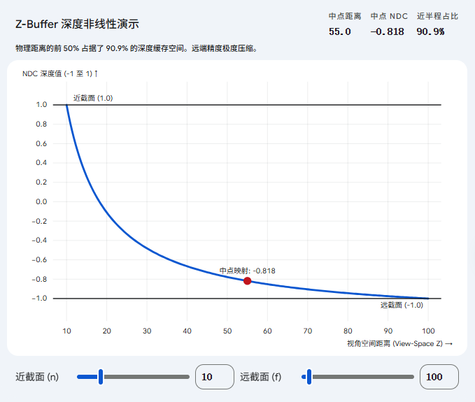
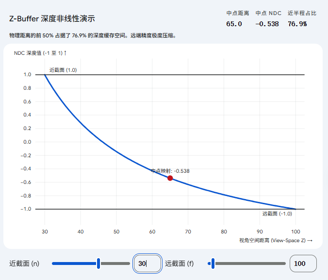
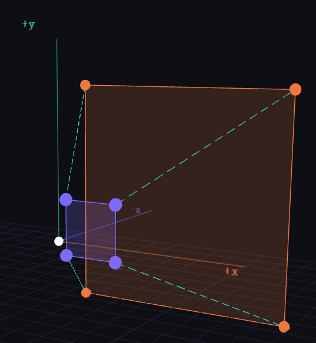
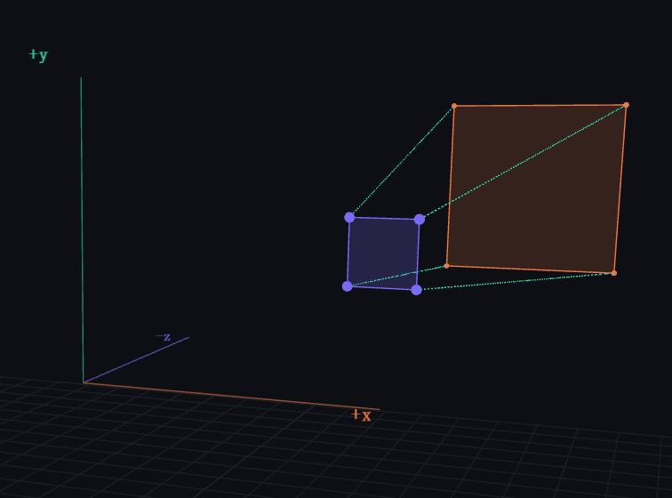
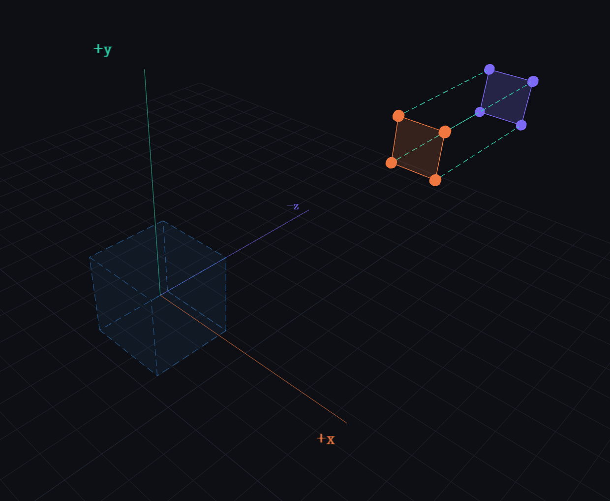

# MVP变换回顾

## 模型变换

模型变换的作用是将物体从**局部空间**放置到世界空间中，通常由缩放、旋转和平移组成。应用顺序通常是：先缩放，再旋转，最后平移。

**缩放矩阵S**

$$S = \begin{bmatrix} s_x & 0 & 0 & 0 \\ 0 & s_y & 0 & 0 \\ 0 & 0 & s_z & 0 \\ 0 & 0 & 0 & 1 \end{bmatrix}$$

**旋转矩阵R**

绕X轴：

$$R_x(\alpha) = \begin{bmatrix} 1 & 0 & 0 & 0 \\ 0 & \cos\alpha & -\sin\alpha & 0 \\ 0 & \sin\alpha & \cos\alpha & 0 \\ 0 & 0 & 0 & 1 \end{bmatrix}$$

绕Y轴：

$$R_y(\beta) = \begin{bmatrix} \cos\beta & 0 & \sin\beta & 0 \\ 0 & 1 & 0 & 0 \\ -\sin\beta & 0 & \cos\beta & 0 \\ 0 & 0 & 0 & 1 \end{bmatrix}$$

绕Z轴：

$$R_z(\gamma) = \begin{bmatrix} \cos\gamma & -\sin\gamma & 0 & 0 \\ \sin\gamma & \cos\gamma & 0 & 0 \\ 0 & 0 & 1 & 0 \\ 0 & 0 & 0 & 1 \end{bmatrix}$$

**平移矩阵T**

$$T = \begin{bmatrix} 1 & 0 & 0 & t_x \\ 0 & 1 & 0 & t_y \\ 0 & 0 & 1 & t_z \\ 0 & 0 & 0 & 1 \end{bmatrix}$$

最终模型矩阵$M_{model} = T \cdot R \cdot S$

## 视图变换

视图变换的作用是将世界坐标系转换到**摄像机坐标系**。

**眼睛位置:** $\vec{e} = (x_e, y_e, z_e)$

**观察方向:** $\hat{g}$ （单位向量）

**向上方向:** $\hat{t}$ （单位向量）

**摄像机平移$T_{view}$**

$$T_{view} = \begin{bmatrix} 1 & 0 & 0 & -x_e \\ 0 & 1 & 0 & -y_e \\ 0 & 0 & 1 & -z_e \\ 0 & 0 & 0 & 1 \end{bmatrix}$$

**摄像机旋转**$R_{view}$

正向旋转（世界轴对齐到相机轴）很难直接写，但它的逆变换（相机轴对齐到世界轴）非常容易写（将 $\hat{u}, \hat{t}, -\hat{g}$ 作为列向量）。因为旋转矩阵是正交矩阵，其逆矩阵等于转置矩阵，所以最终的旋转矩阵如下：

$$R_{view} = \begin{bmatrix} x_{\hat{u}} & y_{\hat{u}} & z_{\hat{u}} & 0 \\ x_{\hat{t}} & y_{\hat{t}} & z_{\hat{t}} & 0 \\ x_{-\hat{g}} & y_{-\hat{g}} & z_{-\hat{g}} & 0 \\ 0 & 0 & 0 & 1 \end{bmatrix}$$

## 投影变换

**正交投影**

正交投影是一个长方体视锥，它的思路是：**先平移使其中心与原点重合，再缩放使其变成 $[-1, 1]^3$ 的立方体**。

$$M_{ortho} = \begin{bmatrix} \frac{2}{r-l} & 0 & 0 & 0 \\ 0 & \frac{2}{t-b} & 0 & 0 \\ 0 & 0 & \frac{2}{n-f} & 0 \\ 0 & 0 & 0 & 1 \end{bmatrix} \begin{bmatrix} 1 & 0 & 0 & -\frac{r+l}{2} \\ 0 & 1 & 0 & -\frac{t+b}{2} \\ 0 & 0 & 1 & -\frac{n+f}{2} \\ 0 & 0 & 0 & 1 \end{bmatrix}$$

$$M_{ortho} = \begin{bmatrix} \frac{2}{r-l} & 0 & 0 & -\frac{r+l}{r-l} \\ 0 & \frac{2}{t-b} & 0 & -\frac{t+b}{t-b} \\ 0 & 0 & \frac{2}{n-f} & -\frac{n+f}{n-f} \\ 0 & 0 & 0 & 1 \end{bmatrix}$$

**透视投影**

透视投影的视锥体是一个四棱台。推导思路：**先通过一个“挤压”矩阵将四棱台压缩成长方体（正交视锥），然后再应用正交投影矩阵**。

$$M_{persp} = M_{ortho} \cdot M_{persp \to ortho}$$

利用相似三角形求出 $X, Y$ 的映射关系，同时利用近截面和远截面的 $Z$ 值不变的特性求出矩阵的第三行，最终推导出：挤压矩阵$M_{persp \to ortho}$

$$M_{persp \to ortho} = \begin{bmatrix} n & 0 & 0 & 0 \\ 0 & n & 0 & 0 \\ 0 & 0 & n+f & -nf \\ 0 & 0 & 1 & 0 \end{bmatrix}$$

最终矩阵$$M_{persp} = M_{ortho} \cdot M_{persp \to ortho}$$

将正交矩阵和挤压矩阵相乘最后得到透视投影矩阵

$$M_{persp} = \begin{bmatrix} \frac{2n}{r-l} & 0 & \frac{l+r}{l-r} & 0 \\ 0 & \frac{2n}{t-b} & \frac{b+t}{b-t} & 0 \\ 0 & 0 & \frac{n+f}{n-f} & -\frac{2nf}{n-f} \\ 0 & 0 & 1 & 0 \end{bmatrix}$$

## 透视除法

MVP变换之后，得到的是**裁剪空间**的坐标。

相当于MVP变换只是为缩放**准备了数据**，将顶点的深度信息存入齐次坐标的第四个分量。

矩阵乘法本质是线性变化，没有能力做除以Z这种非线性操作。

---

MVP变换后点的坐标为：

$$v_{clip} = \begin{bmatrix} \frac{2n}{r-l} & 0 & \frac{l+r}{l-r} & 0 \\ 0 & \frac{2n}{t-b} & \frac{b+t}{b-t} & 0 \\ 0 & 0 & \frac{n+f}{n-f} & -\frac{2nf}{n-f} \\ 0 & 0 & 1 & 0 \end{bmatrix} \begin{bmatrix} x \\ y \\ z \\ 1 \end{bmatrix}$$

$x_{clip} = \frac{2n}{r-l}x + \frac{l+r}{l-r}z$

$y_{clip} = \frac{2n}{t-b}y + \frac{b+t}{b-t}z$

$z_{clip} = \frac{n+f}{n-f}z - \frac{2nf}{n-f}$

$w_{clip} = z$

此时的 $w_{clip}$ 恰好等于该点在摄像机坐标系下的深度值 $z$。

---

透视除法：

图形硬件会将前三个分量统一除以第四个分量 $w_{clip}$（也就是除以 $z$），真正完成向 $[-1, 1]^3$ 空间的映射：

$$x_{ndc} = \frac{x_{clip}}{z} = \frac{2n}{r-l} \cdot \mathbf{\frac{x}{z}} + \frac{l+r}{l-r}$$

$$y_{ndc} = \frac{y_{clip}}{z} = \frac{2n}{t-b} \cdot \mathbf{\frac{y}{z}} + \frac{b+t}{b-t}$$

$$z_{ndc} = \frac{z_{clip}}{z} = \frac{n+f}{n-f} - \frac{1}{\mathbf{z}} \cdot \frac{2nf}{n-f}$$

**为什么会近大远小？**

因为x和y的坐标包含了$\mathbf{\frac{x}{z}}$和$\mathbf{\frac{y}{z}}$所以实现了近大远小

**为什么会Z-Fighting？**

看z的坐标，深度值 $z_{ndc}$ 与原始深度 $z$ 并不是线性关系，而是包含了一个 $\mathbf{\frac{1}{z}}$ 的**非线性关系**。

当物体离摄像机很近（$z$ 较小）时，$z$ 稍微变化一点点，$\frac{1}{z}$ 就会产生剧烈的变化，$z_{ndc}$ 的区分度非常高。

当物体离摄像机很远（$z$ 很大）时，$\frac{1}{z}$ 趋于平缓。远处的物体哪怕距离拉开了很远，它们映射到 NDC 后的 $z_{ndc}$ 值也会变得极其接近。

这种深度的“非线性映射”导致了浮点数精度的大量浪费（绝大部分精度都留给了近处的物体）。这也是为什么在渲染远处挨得很近的两个面时，由于深度值极其接近，浮点数无法区分谁在前谁在后，从而产生画面疯狂闪烁的现象，即图形学中著名的 **Z-Fighting**。

### 占用深度缓存比例

上图可以看出，深度缓存空间被前半部分占了大半。远处的精度非常低。

拉远近平面的距离，会降低前半部分对深度缓存的占用比例。

**物理深度（View Z）：** 物体在三维世界中距离摄像机的真实距离（例如从 $1$ 米到 $100$ 米）。

**深度缓存空间（Depth Buffer / Z-Buffer）：** 显存中用来记录深度的数组。它存储的值通常被映射在 $[0, 1]$ 之间。所谓“占了多少空间”，指的是占用了 $[0, 1]$ 这个数值区间里的**多少数字配额**（精度）。

例如：n=1、f=100、z=50.5
$$
d = \frac{1/z - 1/n}{1/f - 1/n}
$$
$$d = \frac{1/50.5 - 1/1}{1/100 - 1/1}$$

$$d = \frac{0.0198 - 1}{0.01 - 1}$$

$$d = \frac{-0.9802}{-0.99}$$

$$d \approx 0.9901$$

当物体距离 $1$ 米时，深度缓存值为 $0$。

当物体距离 $50.5$ 米时（刚好走完物理世界的一半），深度缓存值**已经飙升到了 $0.99$**。

当物体距离 $100$ 米时，深度缓存值为 $1.0$。

物理世界的前50%占了深度缓存的99%，而后50%占了1%。

当远处的两个物体距离稍近一点，深度缓存里算出的数字就会一样，就会数值不稳定，GPU分不清谁前谁后，所以导致Z-fighting。

# 关于P变换

$M_{p \rightarrow o} = \begin{bmatrix} n & 0 & 0 & 0 \\ 0 & n & 0 & 0 \\ 0 & 0 & n+f & -nf \\ 0 & 0 & -1 & 0 \end{bmatrix}$

P变换矩阵并不是一个非线性变换矩阵

这个矩阵本身：

- 满足叠加原理$M(u + v) = Mu + Mv$
- 满足齐次性$M(cv) = c(Mv)$

作为一个算子，它是线性的。

也就是说：**将视锥压缩成立方体的过程 并不是MVP变换中的P变换导致的**

MVP矩阵都是齐次线性变换，并没有导致非线性。后来的透视除法才破坏了线性，导致了非线性。

那么初学可能就奇了怪了

明明是通过将视锥压缩成立方体，通过侧视图的相似三角形，近平面点坐标值不变，远平面点z值不变，远平面点中点不变，来推导得到的P矩阵。为什么又说P矩阵本身没有压缩视锥，是个线性变换矩阵呢？

MVP变换之后的空间没有变方，它只是经过一次剪切和缩放，视锥的四个侧面仍是倾斜的。

或者可以这么理解：P矩阵**只是把透视除法需要的信息编码到w里**，本身仍是线性。真正让视锥变为立方体的是后面的透视除法。

**P只是把视锥映射到裁剪空间**

**真正的非线性发生在齐次除法**

**真正将视锥压缩成立方体也发生在齐次除法**

图解：

P变化前：是视锥

P变换后：还是视锥

透视除法：变为立方体

# 透视除法

MVP变换之后，会得到齐次坐标$$v' = [x', y', z', w']^T$$

为了将齐次坐标映射回笛卡尔坐标，图形管线会自动执行一次透视除法。
$$
x_{ndc} = \frac{x'}{w'} = \frac{x'}{-z}, \quad y_{ndc} = \frac{y'}{w'} = \frac{y'}{-z}, \quad z_{ndc} = \frac{z'}{w'} = \frac{z'}{-z}
$$

$$
v_{ndc} = \begin{bmatrix} x' / w' \\ y' / w' \\ z' / w' \end{bmatrix} = \begin{bmatrix} \frac{nx}{-z} \\ \frac{ny}{-z} \\ \frac{(n+f)z - nf}{-z} \end{bmatrix}
$$

这步除法，完成了从视锥到立方体的压缩。

**对于xy分量**：当物体距离相机越远（$z$ 越小，$-z$ 越大），除以一个更大的数值，坐标值就会向中心收缩。

**对于z分量**：经过除法后得到了$\frac{(n+f)z - nf}{-z} = -(n+f) + \frac{nf}{z}$。这是一个非线性函数，它将 $[n, f]$ 范围内的非线性深度映射到了 $[-1, 1]$（或 $[0, 1]$）的线性区间内。

为什么透视除法会导致非线性呢？

因为除以的z不是常数，它本身就是变量。

左边$f(p_1+p_2)=\frac{z_1+z_2}{x_1+x_2}$

右边$f(p_1)+f(p_2)=\frac{z_1}{x_1}+\frac{z_2}{x_2}$

左边不等于右边 因此不满足线性关系

但是1/Z在屏幕空间是保持线性的

# 深度的倒数保持线性

$1/Z$ 在屏幕空间保持线性，是因为**透视投影本质上是一个分式线性变换**。

在三维空间中的直线，经过透视除法后投影到二维屏幕上仍然是直线，而这种映射关系刚好使得深度的倒数（$1/Z$）与屏幕上的像素坐标（$x, y$）之间形成了完美的线性对应关系。

为什么1/Z是线性的，有一个复杂的数学推导过程。

最终有一个结论：

**在三维空间中对深度的倒数进行线性插值，等价于在二维屏幕空间中按像素距离进行线性插值。**

# 透视矫正

原则上，只要该属性是在三维空间（世界空间或观察空间）中线性变化的，那么在光栅化阶段使用屏幕空间的重心坐标进行插值时，就必须使用 $1/Z$ 进行透视矫正。

推导过程：

**空间中点的重心坐标并不是平面点的重心坐标**

三维空间中三角形顶点$P_1, P_2, P_3$。三角形面上有一点 $P$。

点 $P$ 的任何属性 $I$（比如 UV、法线、颜色）都可以用**三维空间的重心坐标**（假设为 $A, B, C$）进行完美的线性插值：

$$P = A \cdot P_1 + B \cdot P_2 + C \cdot P_3$$

$$I = A \cdot I_1 + B \cdot I_2 + C \cdot I_3$$

其中$A + B + C = 1$

经过透视投影后，这个三角形被拍到了二维屏幕上，顶点变成了 $p_1, p_2, p_3$，点 $P$ 变成了屏幕上的像素点 $p$。

光栅化遍历像素时，能很快的计算得出p在二维三角形屏幕空间重心坐标

$$p = \alpha \cdot p_1 + \beta \cdot p_2 + \gamma \cdot p_3$$

但是：

屏幕空间的重心坐标 $\alpha, \beta, \gamma$ 并不等于 三维空间的重心坐标 $A, B, C$！ 如果在屏幕上走到了一半的位置（$\alpha=0.5, \beta=0.5$），由于透视的“近大远小”，这对应的绝对不是三维空间中三角形边的中点。

如果我们图省事，直接用 $\alpha, \beta, \gamma$ 去插值 UV 坐标，就会出现经典的**仿射纹理扭曲**，直线纹理在视角倾斜时会变成折线。

**寻找空间重心坐标与屏幕重心坐标关系**

回顾透视除法，屏幕坐标 $p$ 是由三维坐标 $P$ 除以它的深度 $Z_P$ 得到的（假设投影平面在 $Z=1$）
$$
p = \frac{P}{Z_P}, \quad p_1 = \frac{P_1}{Z_1}, \quad p_2 = \frac{P_2}{Z_2}, \quad p_3 = \frac{P_3}{Z_3}
$$
代入屏幕重心坐标对应等式中
$$
\frac{P}{Z_P} = \alpha \frac{P_1}{Z_1} + \beta \frac{P_2}{Z_2} + \gamma \frac{P_3}{Z_3}
$$
把三维空间中的点$P = A \cdot P_1 + B \cdot P_2 + C \cdot P_3$代入左边
$$
\frac{A \cdot P_1 + B \cdot P_2 + C \cdot P_3}{Z_P} = \alpha \frac{P_1}{Z_1} + \beta \frac{P_2}{Z_2} + \gamma \frac{P_3}{Z_3}
$$
整理后可以得到：
$$
\frac{A}{Z_P} = \frac{\alpha}{Z_1} \implies A = \alpha \frac{Z_P}{Z_1}
\\
\frac{B}{Z_P} = \frac{\beta}{Z_2} \implies B = \beta \frac{Z_P}{Z_2}
\\
\frac{C}{Z_P} = \frac{\gamma}{Z_3} \implies C = \gamma \frac{Z_P}{Z_3}
$$
**见证 $1/Z$ 的矫正魔力**

因为$A + B + C = 1$

将上述ABC代入得到
$$
\alpha \frac{Z_P}{Z_1} + \beta \frac{Z_P}{Z_2} + \gamma \frac{Z_P}{Z_3} = 1
$$
两边同除以$Z_P$

可以得到
$$
\frac{1}{Z_P} = \alpha \frac{1}{Z_1} + \beta \frac{1}{Z_2} + \gamma \frac{1}{Z_3}
$$
**推广到任意熟悉I**

对任意属性$$I = A \cdot I_1 + B \cdot I_2 + C \cdot I_3$$

找到之前推导的ABC并替换可以得到
$$
I = \left(\alpha \frac{Z_P}{Z_1}\right)I_1 + \left(\beta \frac{Z_P}{Z_2}\right)I_2 + \left(\gamma \frac{Z_P}{Z_3}\right)I_3
$$

$$
I = Z_P \left( \alpha \frac{I_1}{Z_1} + \beta \frac{I_2}{Z_2} + \gamma \frac{I_3}{Z_3} \right)
$$

$$
I = \frac{\alpha \frac{I_1}{Z_1} + \beta \frac{I_2}{Z_2} + \gamma \frac{I_3}{Z_3}}{\alpha \frac{1}{Z_1} + \beta \frac{1}{Z_2} + \gamma \frac{1}{Z_3}}
$$

主要从顶点着色器进行光栅化插值，再传递给片元着色器。

只要是三维空间中的属性，都需要进行透视矫正。

**纹理坐标 (UV)：** 必须矫正，否则纹理会随着相机视角的倾斜而扭曲拉伸。

**顶点法线/切线向量：** 必须矫正。如果不矫正，计算出的光照（如高光反射）位置会在大三角形上出现严重的位移错位。

**顶点颜色：** 同样需要矫正，否则渐变色在屏幕上看起来是不均匀的。

**世界/观察空间坐标：** 如果在片段着色器中需要重新构建位置（例如用于延迟渲染的点光源计算），插值传过来的坐标必须是矫正过的。

再OpenGL或DirectX的底层硬件会自动处理这一切。