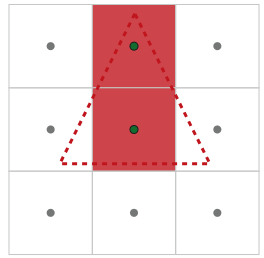
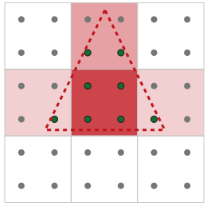
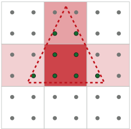
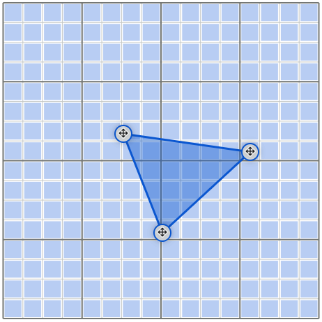
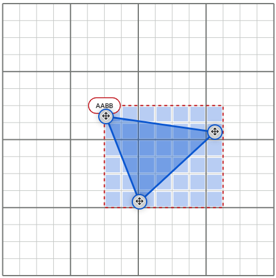
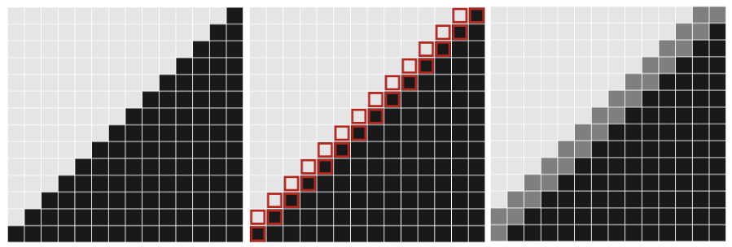
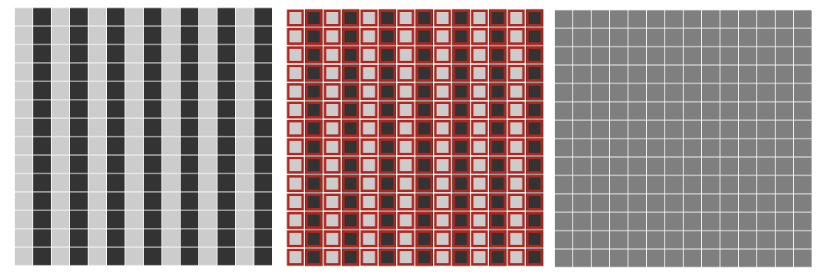

> [!NOTE]
>
> 反走样Anti-Aliasing AA

走样（Aliasing）是由于采样频率不足以捕捉信号的最高频率变化，违背了奈奎斯特采样定理（$f_s > 2f_{max}$），导致高频信号“伪装”成了低频信号。在图形学中，这通常表现为几何边缘的“锯齿”、纹理的高频闪烁等。

在光栅化前后，会发生这样的顺序：

1. 覆盖测试（三角形遍历）： 判断这个像素的采样点是否在三角形内部。
2. 片元着色： 如果在内部，计算这个像素的颜色（光照、纹理采样等）。

在没有反走样的情况下，GPU 默认只在每个像素的**正中心**进行一次采样。

- 如果三角形覆盖了像素中心，覆盖测试通过，执行 1 次片元着色，输出纯色。
- 如果没覆盖中心，输出背景色。 这种**“非 0 即 1”**的二元判定，就是导致几何边缘出现明显“阶梯状”锯齿的根本原因。

# 空间超采样类



没开反走样时：覆盖测试执行9次，着色执行2次。



四倍SSAA：覆盖测试执行9×4=36次，着色执行8次。



四倍MSAA：覆盖测试执行9×4=36次，着色执行4次。

可以看出，四倍MSAA承受了四倍的覆盖测试计算，但是在片元着色阶段只执行了4次。

## SSAA

既然 1 个采样点不够，那我就把每个像素拆成 4 个子像素（$2 \times 2$ 采样模式，即 4x SSAA）。

分辨率在内部被放大了 4 倍。不仅**覆盖测试**要执行 4 次，**片元着色**也要在每个被覆盖的子像素上独立执行 1 次。最后输出时，把这 4 个子像素的颜色求平均。

**代价：**着色器会被强制执行 4 次！片元着色通常是渲染管线中最耗时的部分（涉及复杂光照模型和贴图读取），性能开销直接翻了 4 倍。

## MSAA

MSAA认为：在同一个多边形内部，相邻子像素的着色结果是非常接近的。所以没必要计算四次着色信息。

**覆盖测试（依然是 4 次）：** 决定三角形的几何边缘。在一个像素内的 4 个采样点上，计算哪些点被覆盖。

**片元着色（只有 1 次！）：** 只要这 4 个采样点中有**任何一个**被覆盖，GPU 就只会在像素中心（或者覆盖区域的质心）执行**仅 1 次**片元着色。

**混合输出：** 将这 1 次的着色结果，写入到所有通过了覆盖测试的子像素中。最后再求平均。

## 关于覆盖测试/三角形遍历

三角形遍历不是用每个像素遍历所有三角形

```c++
// 效率极低的直觉逻辑，这其实是光线追踪（Ray Tracing）的底层逻辑
for (每个像素) {
    for (每个三角形) {
        if (三角形覆盖了该像素) { 渲染; }
    }
}
```

在光栅化管线中，采用以物体为中心遍历的逻辑。

```c++
// 光栅化的真实逻辑
for (每个三角形) {
    for (可能被该三角形覆盖的局部像素) {
        if (三角形覆盖了该像素) { 渲染; }
    }
}
```

GPU 每次只处理**一个三角形**，并且只在屏幕的一个**极小的局部区域**内进行覆盖测试。测试完这个三角形，把结果写进深度缓冲（Z-Buffer）和颜色缓冲（Color Buffer），再去处理下一个三角形。

**如何确定哪些像素可能被覆盖？**

**第一步：包围盒测试**在光栅化一个三角形之前，GPU 会先求出该三角形三个顶点在屏幕坐标系下的 $X_{min}, X_{max}, Y_{min}, Y_{max}$，从而得出一个与坐标轴对齐的矩形包围盒。

**结果：** GPU 绝不会测试包围盒之外的任何像素。屏幕上 99% 的像素在这个阶段就被直接剔除了。

**第二步：层次化分块光栅化**

即使在包围盒内部，依然可能有很多空白区域（尤其是对于细长的三角形）。现代 GPU 会将屏幕划分为一个个“宏块”或“图块”（Tile，通常是 $8 \times 8$ 或 $16 \times 16$ 像素）。

GPU 不会立刻进行像素级的测试，而是先进行 **Tile 级别的粗糙测试**。它会检查这个 Tile 的边界是否与三角形相交。

- 如果 Tile 完全在三角形外部：直接跳过整个 Tile 的 64 个像素测试。
- 如果 Tile 完全在三角形内部：直接确认这 64 个像素全部被覆盖，**甚至跳过边缘方程的计算**。
- 只有当 Tile 与三角形边缘相交时，GPU 才会深入到这个 Tile 内部，进行逐像素（或逐采样点）的精确覆盖测试。

大概过程如下图所示：



什么都不做 256个像素都要进行覆盖测试



使用AABB包围盒，那么有83.6%的像素被剔除了

## 八倍额外存储量

如果开启了八倍的SSAA/MSAA

| **性能/资源指标**                       | **无反走样 (1x)** | **8x SSAA** | **8x MSAA**            |
| --------------------------------------- | ----------------- | ----------- | ---------------------- |
| **覆盖测试 (几何算力)**                 | 1x                | **8x**      | **8x**                 |
| **片元着色执行次数 (着色算力)**         | 1x                | **8x**      | **1x (几乎不变)**      |
| **Depth/Stencil Buffer (深度缓冲显存)** | 1x                | **8x**      | **8x**                 |
| **Color Buffer (颜色缓冲显存)**         | 1x                | **8x**      | **8x (逻辑上)**        |
| **显存带宽消耗 (Bandwidth)**            | 1x                | **约 8x**   | **大幅增加 (远超 1x)** |

**覆盖测试变 8 倍：** 为了寻找更精细的几何边缘，GPU 必须在每个像素内部的 8 个子采样点上都代入边缘方程进行计算。所以 SSAA 和 MSAA 的覆盖测试计算量都是 8 倍。

**深度缓冲变 8 倍（极其关键）：** 既然要在 8 个不同的子采样点进行覆盖测试，就意味着**每个采样点都可能有自己独立的三维深度 (Z-value)**。想象一个倾斜穿过像素的三角形，这 8 个点的深度是绝对不同的。为了保证深度测试（Z-Test）的正确性，GPU **必须**为每个子采样点存储一个深度值。因此，深度缓冲的显存占用直接飙升到了 8 倍。

**片元着色次数**

**SSAA 是 8 倍，而 MSAA 保持 1x（不变）。**

这是 MSAA 唯一的胜利。对于一个完全落在三角形内部的像素，MSAA 只会在像素中心（或覆盖的质心）唤醒一次片元着色器，计算出光照和纹理颜色。

 *(注：在三角形边缘处，由于可能有多个不同的三角形共享这 8 个采样点，着色次数会略大于 1，但宏观上看依然极其接近 1x。)*

## SSAA缺陷

SSAA算法中不会因为高分辨率再压缩回原分辨率导致信号变化较快/原像素承载了更多信息而发生走样吗？（例如高频信号超出奈奎斯特极限，降采样时用了个拉跨滤波器）

在 SSAA 中，以 4x 分辨率渲染完画面后，需要将其压缩回 1x 的屏幕分辨率输出。这个过程叫做 **Resolve（混合/解析）**。

最简单、最直觉的 Resolve 算法就是**求平均值**：把 4 个子像素的颜色加起来除以 4。 数学上，这等价于在图像上应用了一个 **Box Filter（盒式/均值滤波器）**：

Box Filter 在空域（Spatial Domain）里看起来很合理，但在频域里，它的傅里叶变换是一个 Sinc 函数（$\frac{\sin(x)}{x}$）。Sinc 函数有无数个旁瓣，这意味着**它是一个极其糟糕的低通滤波器**。它根本无法干净利落地切断那些“变化极快的高频信号”。

此时就会发生：摩尔纹、高频闪烁。

**解决A**：换更好的滤波器

**解决B**：从源头扼杀高频信号，使用MipMap。

## MSAA缺陷

### MSAA无法延迟渲染

现代引擎为了处理成百上千盏动态光源，广泛采用了延迟渲染管线：

第一遍不计算光照，而是把场景的法线、粗糙度、反照率（Albedo）等属性存入一堆巨大的纹理中，这就是 **G-Buffer（几何缓冲）**。

第二遍再读取 G-Buffer 进行光照计算。

MSAA需要每个sample独立数据，每个sample都应该有自己的法线、深度、材质。

但是G-Buffer只有一份，这意味着一个像素只有一个法线，一个材质和一个深度。

假设一个像素内的 8 个采样点，可能有 3 个点被红色的背景三角形覆盖，5 个点被蓝色的前景三角形覆盖。 虽然红色和蓝色在着色时只各算了一次（1x 着色），但在最终的 Resolve（混合操作）发生之前，GPU **必须把这两种颜色分别存在对应的采样点位置上**。这意味着，硬件管线在渲染目标上，依然必须为这 8 个子像素预留完整的空间。

如果8个sample都存，显存爆炸。

如果G-buffer只存一个，那么混合错误，边缘变脏。

### MSAA无法处理穿孔

什么是Alpha穿孔：树叶、铁丝网、草

Alpha测试：如果一张贴图的α<threshold那么丢弃，一个三角是完整的，通过贴图在像素级挖洞。

MSAA 的覆盖掩码是靠“算几何方程”得来的，而 Alpha 穿孔的边缘是靠“读纹理贴图”得来的。MSAA 是个“瞎子”，它看不见贴图里的内容。

MSAA只对几何边界有效，而Alpha穿孔是像素内部的不连续，不属于几何边界，因此MSAA无法正确处理。

MSAA的作用是一个采样点能否被三角形覆盖，它解决的是几何边界的aliasing。

光栅化

- 产生 fragment

- 得到 coverage（MSAA在这里工作）

片元着色

- 采样纹理
- 做 alpha test（discard）

MSAA只能感知几何覆盖，但Alpha穿孔改变的是材质的可见性，它发生在更晚的阶段，MSAA根本不知道。

由于 MSAA 既救不了延迟渲染，又处理不了 Alpha 穿孔（比如树叶的贴图边缘），同时在如今 4K 时代带宽又极其昂贵，图形学界只能被迫寻找一种**“既不增加显存，又能干掉锯齿”**的魔法。

# 后处理类

后处理类的思想

既然在光栅化渲染的过程中搞抗锯齿代价太高，那我们能不能等整幅画面都渲染完，把它当作一张普通的 2D 照片，用纯粹的图像处理算法来“抹平”锯齿呢？

## FXAA

快速近似抗锯齿Fast Approximate Anti-Aliasing

完美兼容延迟渲染和 Alpha 穿孔

既然没有了 3D 几何信息，FXAA 怎么知道哪里是物体的边缘（锯齿）呢？**测算相邻像素的亮度对比度。**

1. **亮度转换：** 首先将 RGB 颜色转换为感知亮度。
2. **边缘检测：** 遍历屏幕上的每一个像素，对比它与上下左右相邻像素的亮度差。如果亮度差超过某个阈值，FXAA 就会判定：“这里存在一条高对比度的边缘，很可能是锯齿！”
3. **寻找走向：** 接着算法会进一步探测这条边缘是水平走向还是垂直走向，以及边缘的具体长度。
4. **定向模糊：** 一旦确定了边缘的方向和长度，FXAA 就会沿着垂直于边缘的方向，对相邻像素的颜色进行**插值混合**，强行把阶梯状的硬边缘抹平。

**FXAA缺陷**

成也图像处理，败也图像处理。FXAA 是一个“盲目”的 2D 滤镜。 它无法区分**真正的几何锯齿**和**“原本就长这样的高频纹理细节”**（比如地砖缝隙、文字UI、树皮纹理）。只要亮度对比度高，它就会毫不留情地进行模糊。因此，开启 FXAA 会让整个游戏画面看起来蒙上了一层纱，感觉“发软”、“发糊”。



此时消除锯齿是正常的



此时消除纹理细节是模糊的

## SMAA

引入了模式识别

FXAA 只是简单地找对比度，而 SMAA 会去**识别锯齿的形状**。 算法会在后台预计算几张特殊的查找表。当它在屏幕上找到边缘时，它会去匹配这些边缘的宏观形状——比如它是 Z 字型、L 字型，还是 U 字型？ 通过精准识别锯齿的“阶梯形态”，SMAA 能够计算出极其精确的混合权重，只在真正需要的地方进行颜色混合。

**结果：** SMAA 在消除锯齿的同时，比 FXAA 更好地保留了纹理的高频细节和画面的锐利度。

## 单帧时间抗锯齿的问题

不论是MSAA还是FXAA/SMAA都有一个局限性，它们都是**单帧**算法

它们只利用了当前这一帧信息。

当画面静止时，看起来很好。当移动摄像机时，细小高光、铁丝网、树叶边缘会有高频闪烁和像素若电脑。是因为细小物品的投影在像素网格之间来回横跳，这是**时间维度上的走样**。

既然一帧率的信息不够就将上一帧、上上帧的信息借过来用。

# 高频闪烁

高频闪烁的本质是时间域采样不足导致的。

# 时域类

## TAA

**TAA第一步：亚像素抖动**

在没有 TAA 时，如果摄像机和物体都不动，那么连续 100 帧里，每个像素中心的采样点打在物体上的位置是完全一样的。这 100 帧的信息是完全冗余的。

在每一帧生成投影矩阵时，引擎会人为加入一个极小的偏移量（通常小于一个像素的大小，按照 Halton 序列等低差异序列分布）。

- 第 1 帧：采样点在像素左上角偏一点。
- 第 2 帧：采样点在像素右下角偏一点。
- 第 3 帧：采样点在像素右上角偏一点...

这样一来，如果我们将连续 4 帧的图像叠加在一起，我们在每个像素里实际上就获得了 4 个不同位置的采样点！**这在物理意义上，等价于单帧的 4x SSAA！**

**TAA第二步：寻找上一个位置**

在几何渲染阶段，引擎会计算每个顶点的当前位置和上一帧位置，从而生成一张特殊的贴图：**运动矢量图**。

这张图记录了屏幕上每个像素相对于上一帧移动了多少个像素。 有了它，TAA 就能进行**重投影**：利用运动矢量，精准地去历史缓冲中“捞”出这个像素在上一帧的颜色。

**TAA第三步：时间累加**

捞出了上一帧的颜色后，TAA 终于可以进行最终的混合了。这通常是一个简单的线性插值（Lerp）公式：

$C_{final} = \alpha \cdot C_{current} + (1 - \alpha) \cdot C_{history}$

其中 $\alpha$ 通常是一个很小的值（比如 0.1 到 0.05）。这意味着当前帧的新信息只占 10%，而 90% 的颜色来自于历史累积。

TAA解决了高频闪烁，任何空间抗锯齿都做不到。

## TAA的缺点

上述公式建立在一个完美的假设上：历史颜色永远是正确的。但在实际游戏中，有些情况会彻底摧毁历史信息：

- **遮挡剔除：** 一个角色跑过一堵墙，墙后面的背景刚刚露出来。这个背景在上一帧被遮挡了，根本没有历史信息！
- **光影突变：** 关灯的一瞬间，历史缓冲里还是亮的。

如果在这种情况下继续混合，就会产生 TAA 最恶名昭著的副作用：**残影（拖尾）**。移动的物体身后会跟着一长串半透明的影子。为了解决这个问题，TAA 引入了极其复杂的**历史拒绝**算法，通过对比当前像素周围 $3 \times 3$ 范围的颜色包围盒，强制裁剪掉不合理的历史颜色。

# 深度学习类

## DLSS

**DLSS 思路：** 引擎在底层只以 1080P（甚至更低）的内部分辨率渲染画面 -> 把这堆低清像素和数据喂给 AI -> **AI 直接“脑补”并重构出一张完美的 4K、无锯齿的图像** -> 输出 4K。

**DLSS输入数据**

在每一帧，渲染引擎会把以下四个“低分辨率（如 1080P）”的缓冲数据打包，送进 GPU 的 Tensor Cores（张量核心）：

1. **当前帧的低清颜色缓冲：** 带有亚像素抖动的、充满锯齿的当前画面。
2. **深度缓冲：** 告诉 AI 场景的空间纵深。
3. **运动矢量：** 告诉 AI 屏幕上的像素相对于上一帧移动了多少，用于对齐历史帧。
4. **上一帧的高清输出：** 这是 TAA 的灵魂，也是 DLSS 的灵魂，是上一帧 AI 刚刚重构好的 4K 画面。

把数据喂进去之后，神经网络（一个经过高度优化的卷积自编码器）接管了传统 TAA 中最头疼的混合和历史拒绝工作。

- **线下超级计算机的残酷训练：** 在 NVDIA 的服务器里，AI 观看了数以万计的游戏画面。它会对比**低清输入 + 运动矢量和16K 分辨率、64x 超级采样完美无瑕的真实画面**。
- **学会“脑补”细节：** 通过不断的误差反向传播，神经网络学会了：当它看到几个低清的、闪烁的像素时，它能认出“哦，这其实是一根远处的铁丝网”，或者“这其实是角色飘动的头发”。
- **精准消除残影：** AI 能够比任何人工手写的 `Clamp` 函数更精准地判断出哪些历史像素失效了（比如由于遮挡导致的突变），从而果断丢弃它们，避免产生 TAA 那样恶心的拖尾残影。

DLSS必须绑定RTX显卡，因为依赖张量核心。

# 各反走样总结

| **类别**              | **算法名称**          | **核心原理 (它是怎么工作的？)**                              | **核心优点 (为什么用它？)**                                  | **致命缺点 (为什么淘汰/演进？)**                             | **适用时代 / 场景**                                       |
| --------------------- | --------------------- | ------------------------------------------------------------ | ------------------------------------------------------------ | ------------------------------------------------------------ | --------------------------------------------------------- |
| **纯空域** (力大砖飞) | **SSAA** 超级采样     | 将渲染分辨率翻倍（如 4x），执行完整的覆盖测试与片元着色，最后降采样输出。 | 画质完美，能解决几何边缘、高频纹理、着色闪烁等所有空间走样问题。 | 算力与显存带宽呈平方级爆炸（$O(N^2)$），在现代 3D 渲染中毫无实机可行性。 | 离线渲染、极早期老游戏、发烧友截图。                      |
| **纯空域** (硬件解绑) | **MSAA** 多重采样     | 解耦几何与着色。在像素内做多次覆盖测试，但只要有覆盖，仅在中心做 1 次片元着色。 | 极大地节省了 ALU 着色算力，同时获得了极其平滑的几何多边形边缘。 | 显存/带宽依然暴增；**与延迟渲染 (G-Buffer) 八字不合**；无法处理 Alpha 穿孔（需 A2C 续命）。 | 传统正向渲染 时代的主流、现代 VR 游戏。                   |
| **后处理** (图像识别) | **FXAA** 快速近似     | 抛弃 3D 信息，将画面当成 2D 图片。通过计算相邻像素的**亮度(Luma)对比度**寻找边缘并定向模糊。 | 极其轻量级（极低性能开销），完美兼容延迟渲染和 Alpha 穿孔测试。 | 纯二维盲目滤镜，会误伤高频纹理细节，导致**整体画面发软/发糊**；无法解决时域闪烁。 | 性能极度受限的移动端游戏、上世代主机游戏的兜底方案。      |
| **后处理** (形态学)   | **SMAA** 子像素形态学 | FXAA 的进阶版。利用预计算的查找表，识别锯齿的“Z/L/U”等**几何形态**，进行更精准的局部混合。 | 相比 FXAA 极大地保留了纹理的高频细节，画面更加锐利清晰。     | 依然是基于单帧的后处理，丢失的子像素信息无法找回，**无力解决摄像机移动时的时域高频闪烁**。 | 现代游戏中的备选轻量级方案，常作为 TAA 的补充或低配选项。 |
| **时域** (时间换画质) | **TAA** 时域抗锯齿    | 引入**亚像素抖动**，利用**运动矢量**寻找上一帧像素，将多重采样分摊到连续的历史帧中进行指数累加。 | 性能极佳；**唯一能解决高频时域闪烁（像素蠕动）的传统方案**；完美契合现代延迟管线。 | 极其容易产生**运动残影**；复杂的历史拒绝算法难以调优；画面微糊。 | **当前现代 3A 游戏（如 UE4/UE5）的绝对底层标配。**        |
| **AI时域** (降维打击) | **DLSS** 深度学习超分 | 底层低分辨率渲染，输入低清图像、深度图、运动矢量与历史帧，由**卷积神经网络**重构并输出高清抗锯齿画面。 | 打破性能天花板，以极低开销实现比肩甚至超越原生分辨率的画质；AI 精准消除残影与重构高频细节。 | 具有黑盒性质；**高度绑定特定硬件**（如 NVIDIA 的 Tensor Cores）；需要引擎底层数据支持。 | 现代光追游戏、次世代高分辨率大作的性能救星。              |
