# 纹理的应用

## 环境光照

假设环境光照只记录方向信息 在无限远处

环境光照可以记录在球面上 但是会发生扭曲 Spherical Environment Map

所以换了种方法 将环境光记录在球面的正方体包围盒的六个面上 Cube Map

## 凹凸贴图/法线贴图

之前用纹理是为了替换Biin-Phong模型的漫反射公式中的颜色项

但是贴图可以不仅仅记录颜色 也可以记录定义任何不同位置不同的属性

比如相对高度(沿着法线方向相对高度)

相对高度发生变化法线变化 那么Shading结果发生变化。

最后导致在不改变几何模型的情况下，表现出复杂的表面细节。

 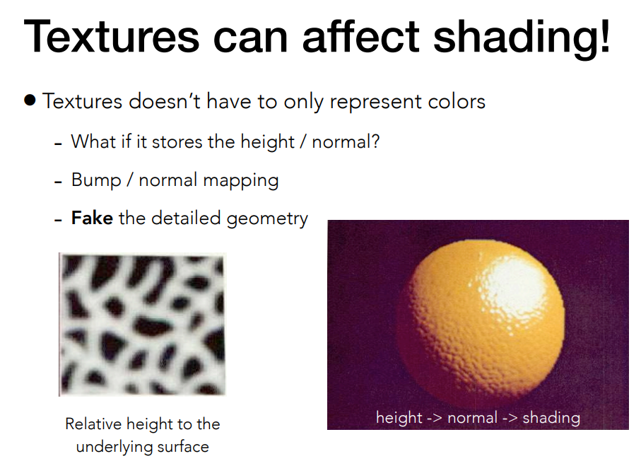

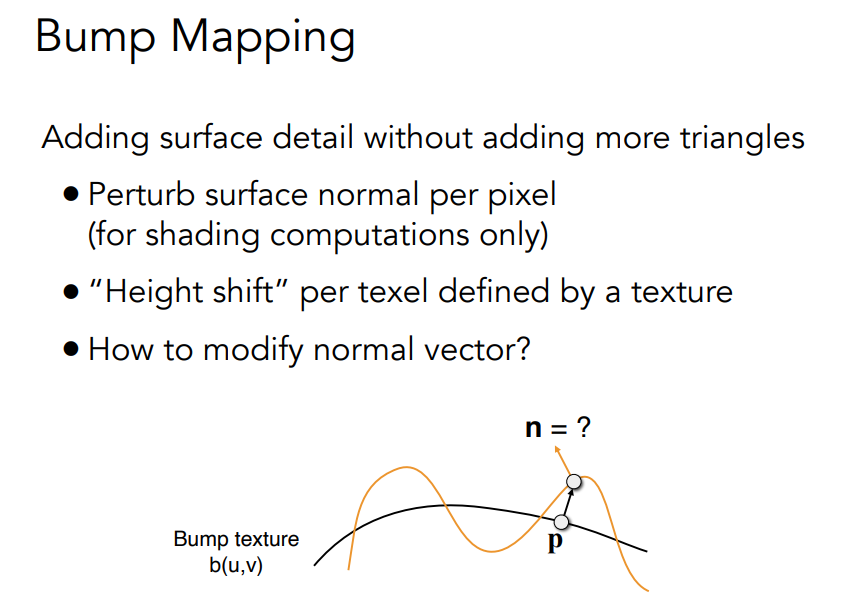

法线的方向如何计算？一维情况下

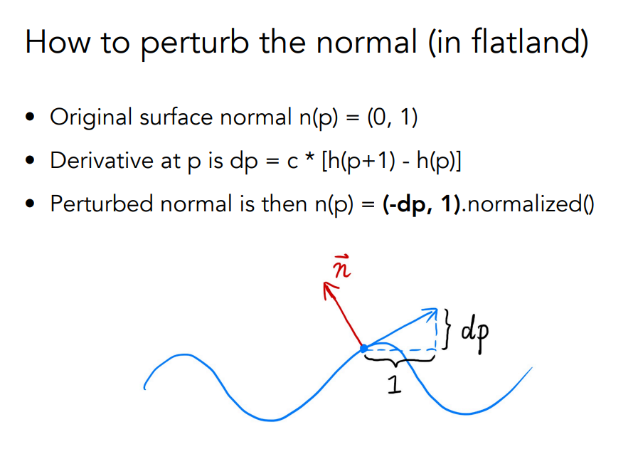

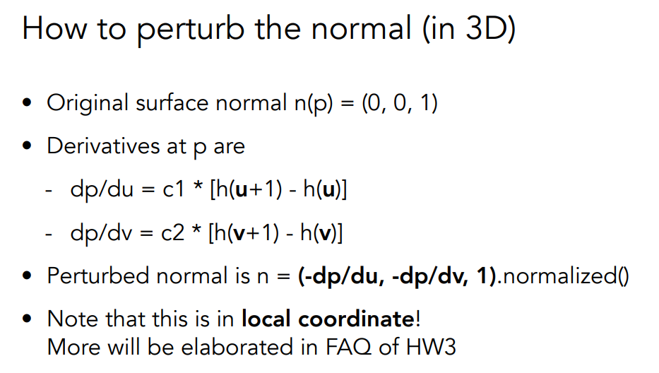

虽然世界坐标系中法线方向各不相同，单在局部坐标系中就认为是(0,0,1)

## 位移贴图

都是用纹理定义相对高度 单位移贴图实际上真的会移动三角形的顶点

位移贴图本身对三角形要求比较细

DirectX是在运行时直接细分

## 三维纹理

纹理不一定是一个图片，而是三维空间中的一个噪声函数。f(x,y,z)=Color

如柏林噪声

## 记录提前计算好的着色信息

比如阴影信息

着色时把着色好的结果乘以环境光遮蔽

## 体积渲染

渲染不止物体表面，还有三维整体。

# 几何

## 隐式几何

Implicit隐式几何 满足特定关系 比如Torus Sphere f(x,y,z)=0

Explicit显式几何 

通过参数映射的面

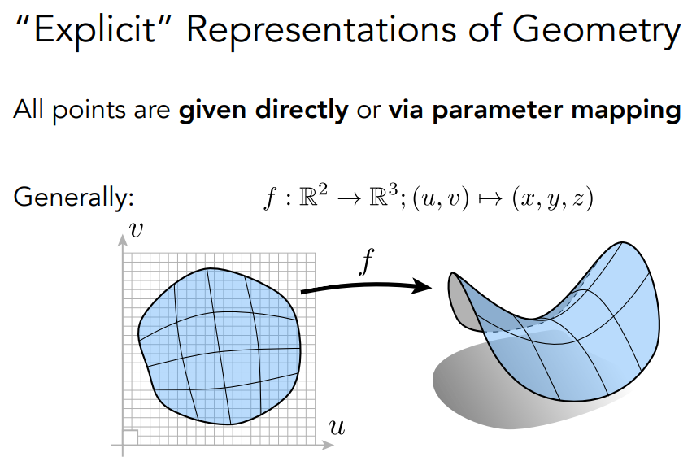

Constructive Solid Geometry构造实体几何 通过布尔运算组合简单的三维基本体元来构建复杂几何体

CSG与B-rep通常结合使用

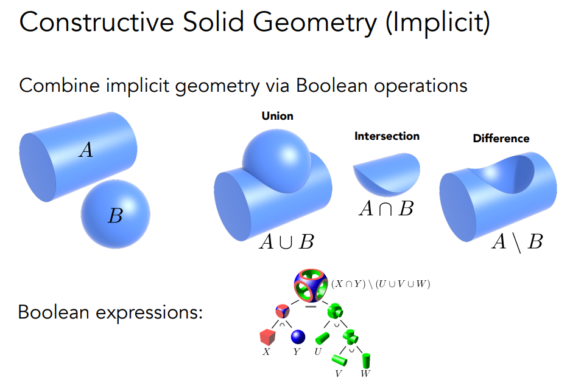

用距离函数表示几何：空间中任意一个点到你想要表示的几何形体上的任何一个点的最小距离

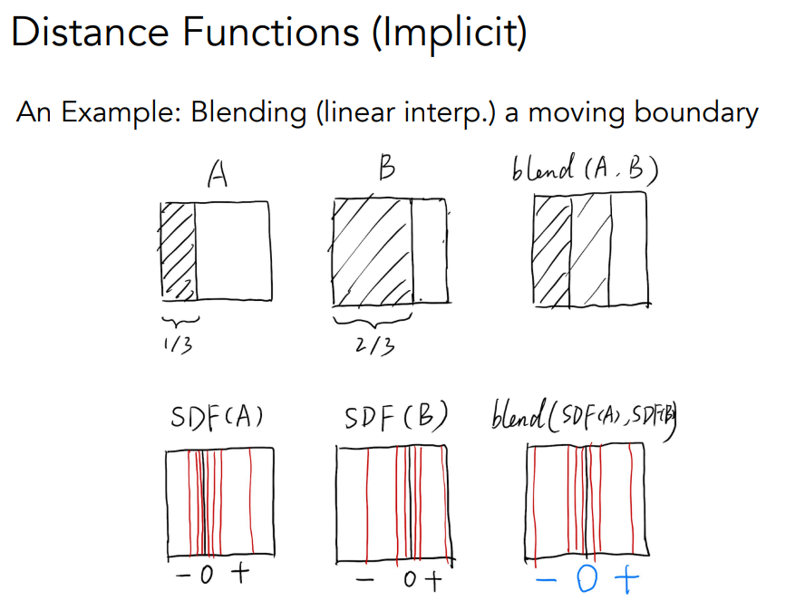

距离函数的blend，再恢复原来的状态。

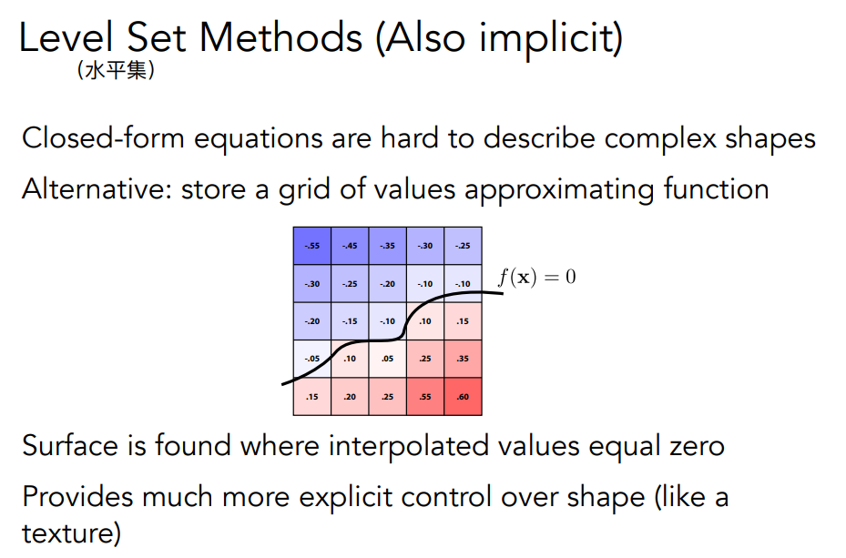

一种距离函数：水平集 

分形

## 显式几何

点云

多边形网格

三角形面文件：.obj 

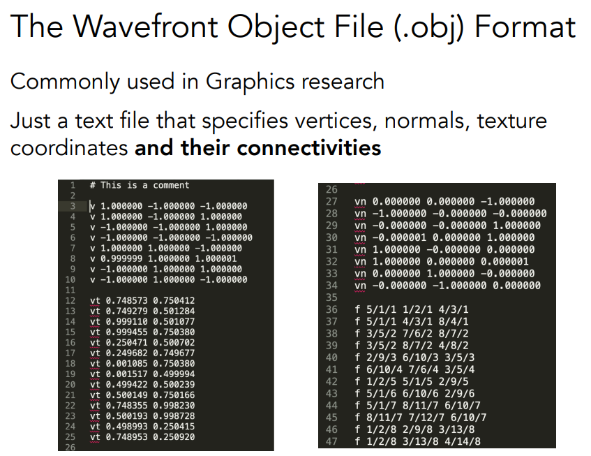

点/纹理坐标/法线

比如右图第一行 第一个三角形用由5 1 4个顶点构成 它们分别对应第1 2 3个纹理坐标和第1 1 1个法线

### 曲线

用在Camera Paths

模型沿着曲线移动Animation Curves

### 贝塞尔曲线

生成贝塞尔曲线的递归算法

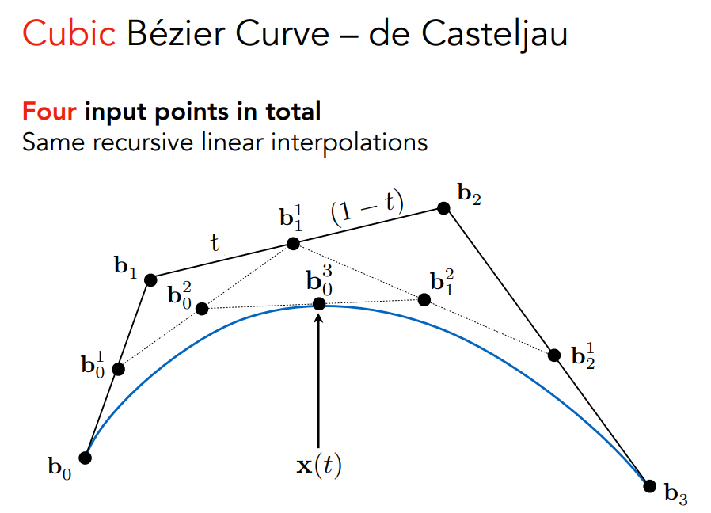

公式的推导

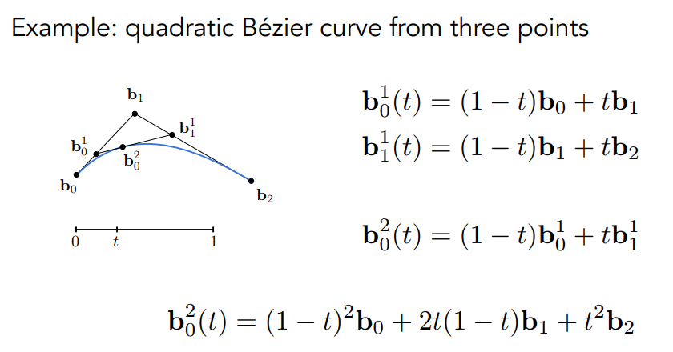

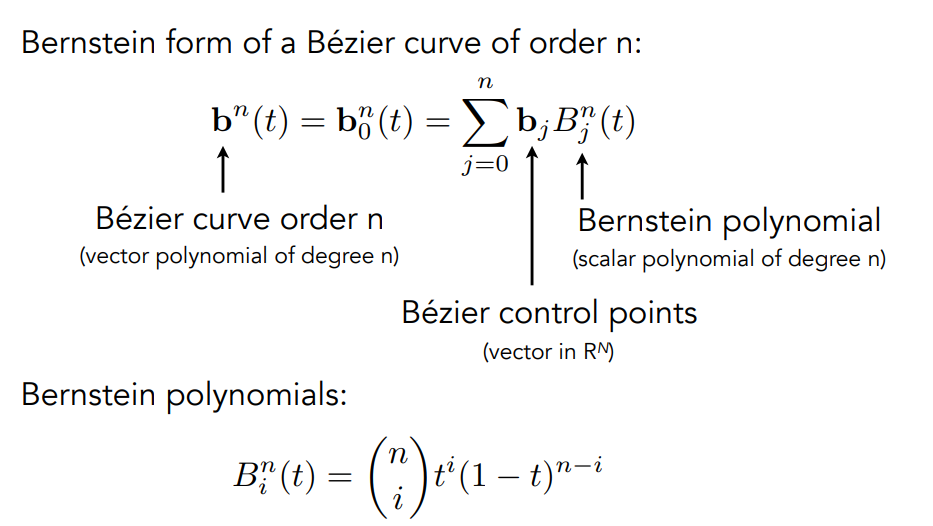

n+1个控制点可以得到一个n阶的贝塞尔曲线

性质：

1. 贝塞尔曲线一定过起点终点
2. 仿射变化下贝塞尔不变
3. 贝塞尔曲线一定在它的几何控制点形成的凸包内

如果所有控制点都在一条线上 那么贝塞尔曲线本身是一条曲线（因为凸包性）

当贝塞尔曲线控制点过多时，形状不太容易把控

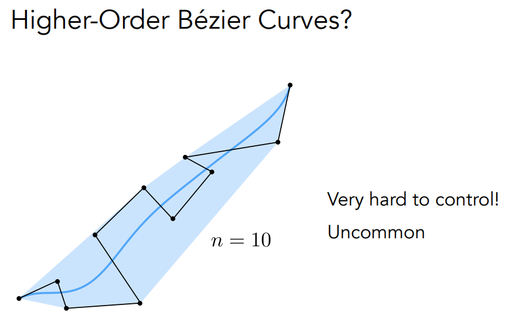

所以定义逐段贝塞尔曲线并拼接起来

PhotoShop中的钢笔工具就是这个原理

如何保证连起来的曲线是光滑的？

起始方向和结束方向的切线方向已知，起点和终点已知。

规定导数连续：控制点方向相反大小相同

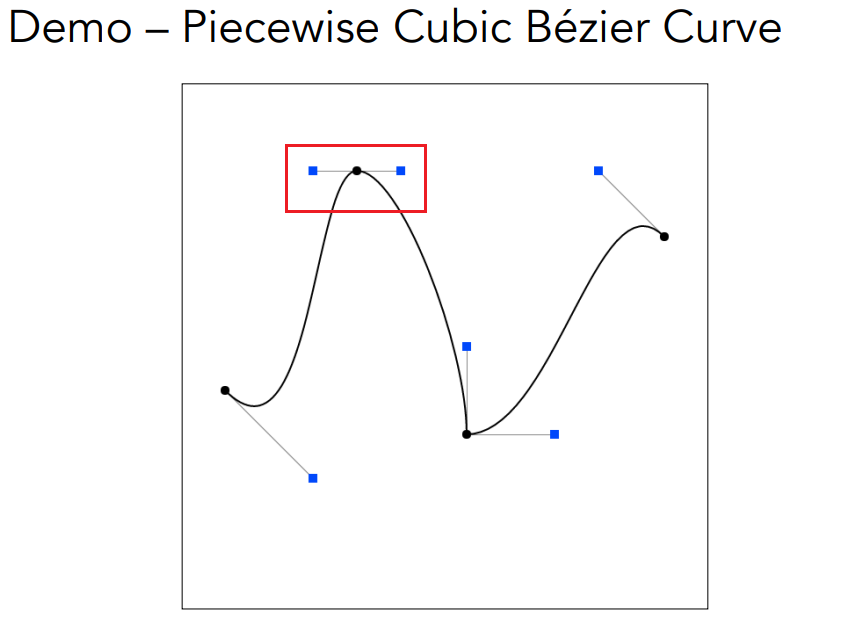

连续性规定：

C0连续：函数值连续

C1连续：一阶导数连续

Spline样条 遇到老本行了 另一篇文章详细写B样条

为什么要用样条？因为贝塞尔曲线没有局部性 想要局部性必须分段

> 闫老师原话：B样条极其复杂,很有可能是图形学里最复杂的一块.

### 贝塞尔曲面

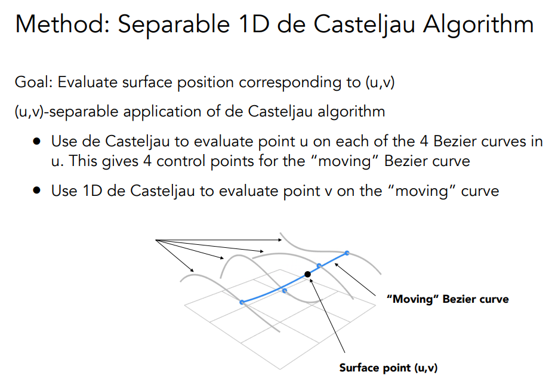

对空间中的贝塞尔曲线采用双线性插值的思想
