# 网格细分

## Loop(人名)细分

对新的顶点：

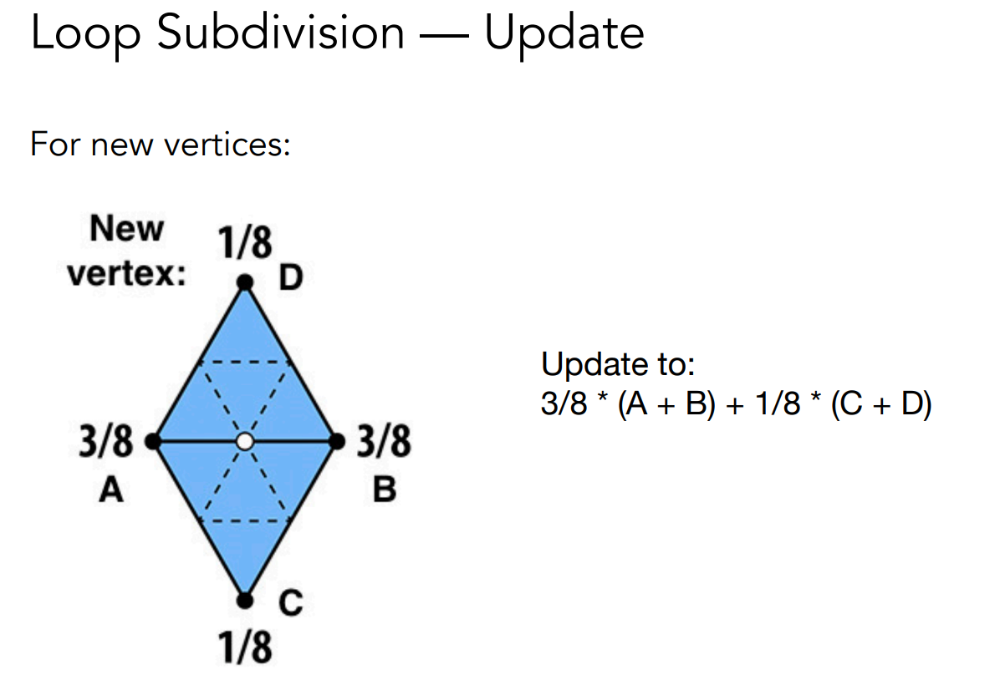

对旧的顶点：
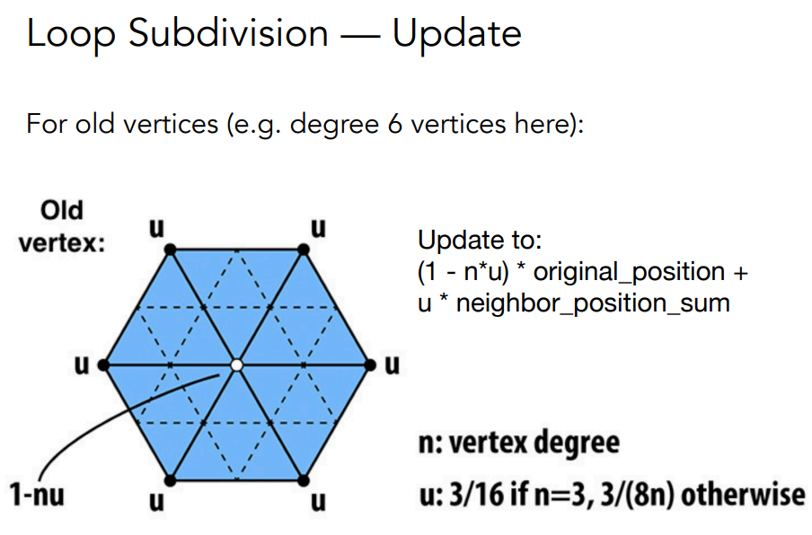

若度越大，连接的老顶点越多。老顶点的影响也越大。

## Catmull-Clark细分

Loop细分是针对三角形网格的

定义四边形面和非四边形面

奇异点：度不是4的点

非奇异点：度为4的点

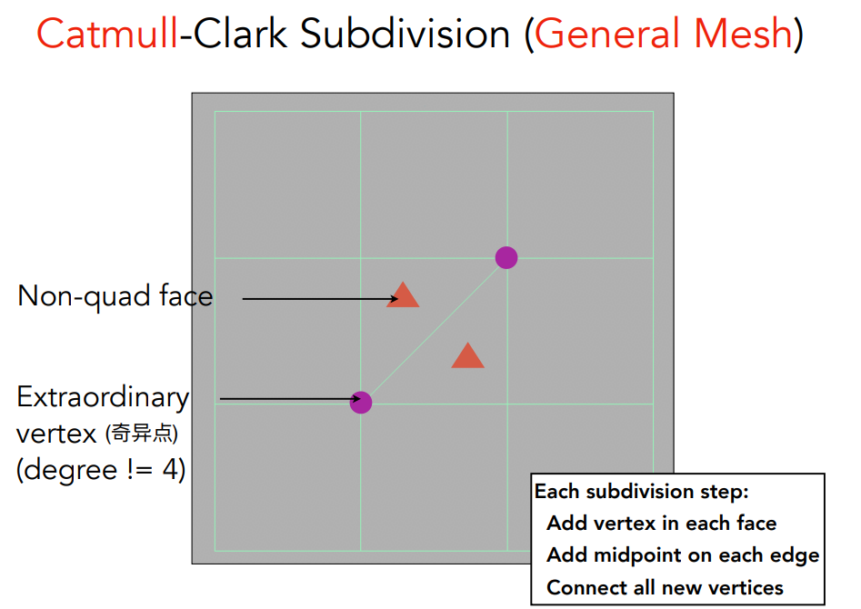

如何细分：每条边取它的中点，每个面取它的中点，把中点都连起来。

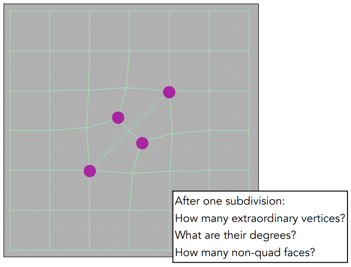

经过一次细分，增加了两个奇异点。（因为划分三角形造成的奇异点）

只要和非四边形面做细分，就要连接这个面的中点和各个边的中点，就会形成一个奇异点。

经过一次catmull-clark细分后所有非四边形面都消失了。代替的是一个奇异点。

catmull-clark第一次会增加非四边形面的奇异点，之后再不会增加。

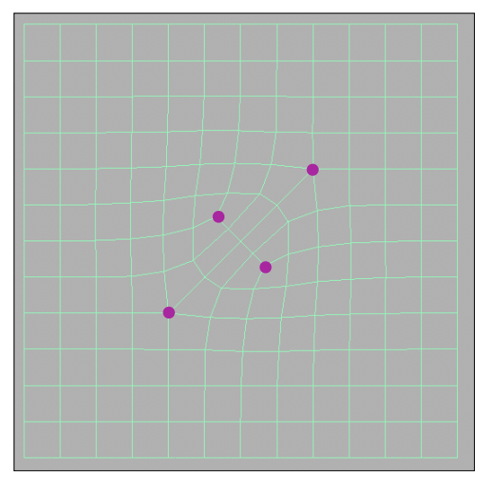

那么细分后的点的更新规则是什么呢？

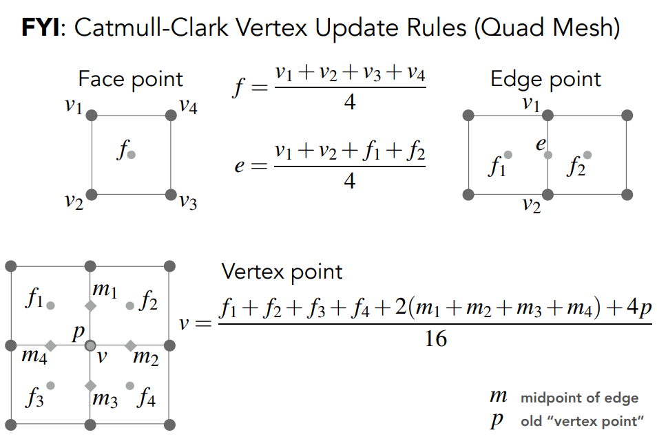

边上的新点

面上的新点

原来的点

都做了某种平均

# 网格简化

保持形状的同时减少网格的面数

在不同的情况下会选用不同的复杂度的面数

有点像Mipmap 但是几何层次上更难做

如果不删除面，只删除点，就会导致出现空洞。所以使用边坍缩。

## 边坍缩

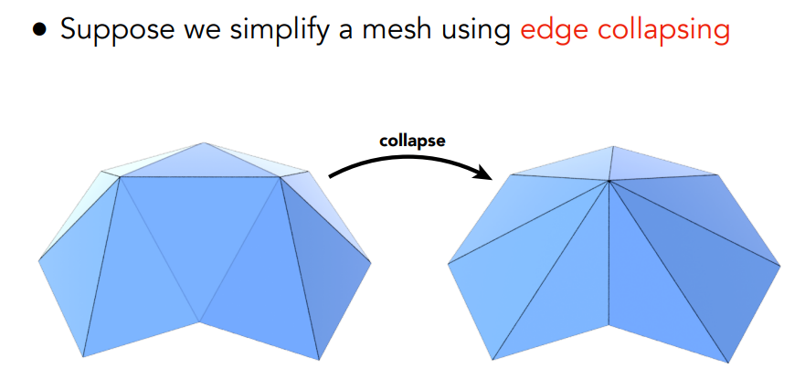

二次误差度量：新点的位置，希望这个位置和它相关几个面的距离的平方和最小。

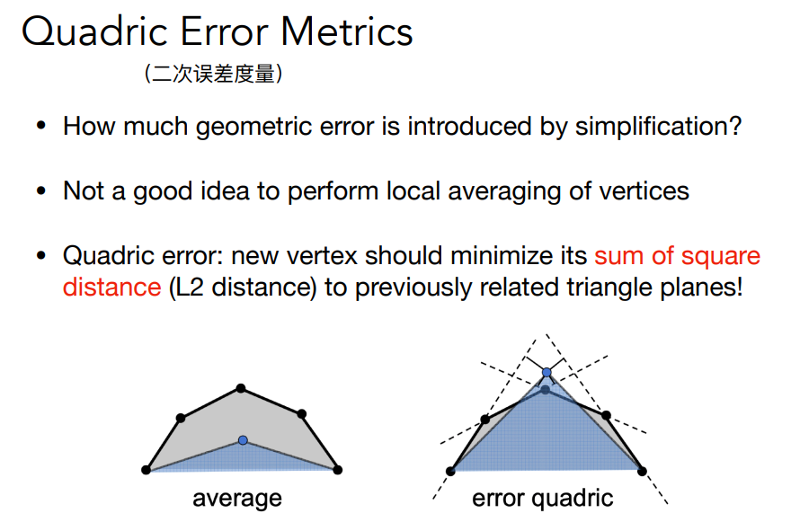

选哪一条边坍缩呢？

坍缩一条边会影响其它边的二次度量误差

取二次度量误差最小的边做坍缩，坍缩后更新其它边的二次度量误差。

此时使用优先队列或堆排序。

不断通过给局部做最优解的过程试图找到全局的最优解，这就是典型的贪心算法。

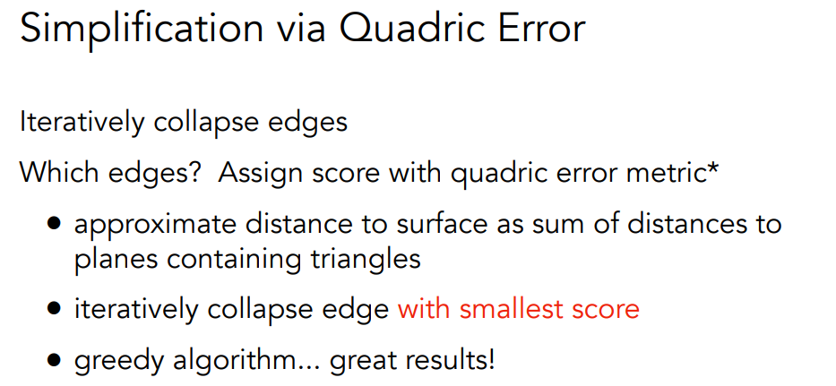

# 光栅化的阴影

着色是一个局部的事情，只考虑着色点自己，光源，摄像机。不考虑其它物体或物体的其它部分对着色点的影响。

之前的着色解决不了物体挡在光源和着色点的问题，也就是解决不了阴影。

## Shadow Mapping

主要思想：如果一个点不在阴影里，那么摄像机可以看到这个点，光源也可以看到这个点。

如果在阴影里，摄像机可以看到这个点，但是光源不会。

经典的Shadow Mapping只能处理点光源。阴影有明显边界，被称为硬阴影。

**第一步：从光源做光栅化，将看到的点深度记下来**

**第二步：从摄像机出发，将看到的点投影到光源的成像平面上，计算深度**

**第三步：如果深度一样那么这个点是可见的，如果不同那么这个点在阴影中**

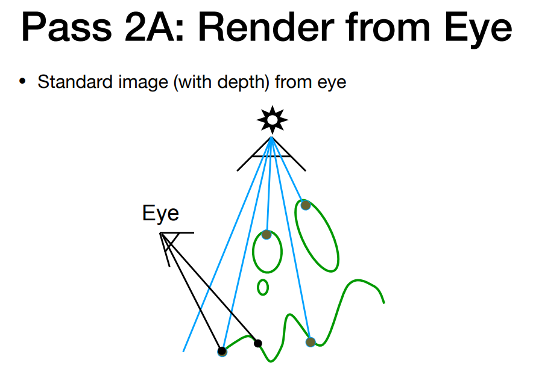

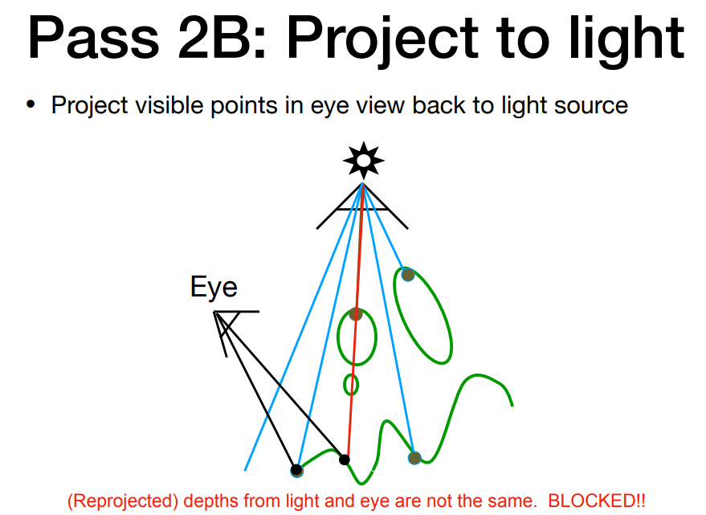

但是深度本身就是浮点数，判等困难。

而且光源的成像平面本身也是有分辨率的。若光源的深度缓存图分辨率小，而摄像机成像分辨率大，那么就会产生类似纹理太小的问题。

如果用更大的阴影图分辨率，效果更好，那么开销也就更大。

Shadow Mapping本身渲染场景两遍，也是更大的分辨率。

使用Shadow Mapping时，点要么可以被光源看到，要么看不到，所以边缘很锐利，叫硬阴影。

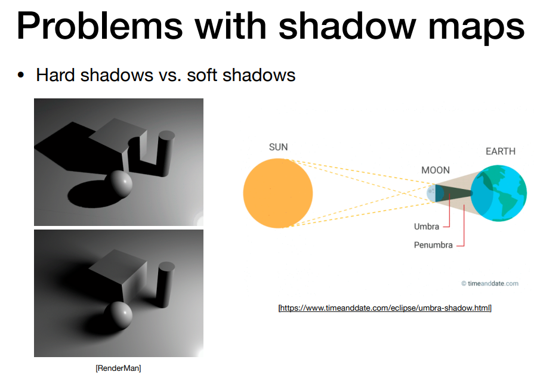

阴影程度取决于看到光源的大小。

软阴影是因为光源有一定大小。所以点光源没有软阴影。