# 光线追踪

光栅化无法解决全局的问题：

1. 软阴影
2. 打磨镜子材质 有高光有粗糙 光线在场景中他弹了两次（多次）
3. 间接光照

光栅化很快但是质量很低

光线追踪很准确，但是很慢

光栅化一般是实时的 而光线追踪是离线的

这也是一种trade-off

定义光线：

1. 光是沿着直线传播的
2. 光线和光线不会发生碰撞
3. 光线是从光源发出，在场景中经过一系列的反射折射最后打到摄像机里。在路径反转时保持不变。
   - 这就是光路的可逆性
   - 这正是追踪一词的含义：眼睛发出感知“光线”

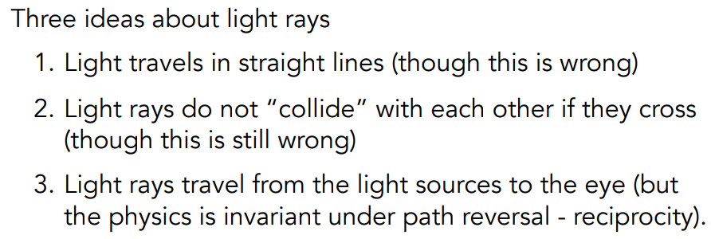

考虑眼睛发出的光线和场景中的物体最近的交点（自然解决了深度测试的问题）

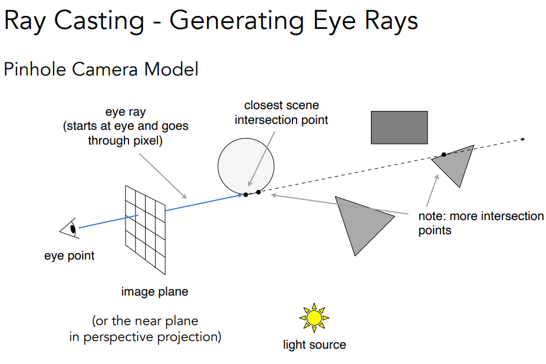

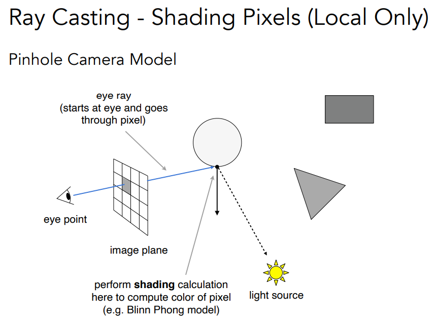

知道这点后可以计算着色（用Phong或其它模型）

但是光线不止反射一次

## Whitted风格光线追踪

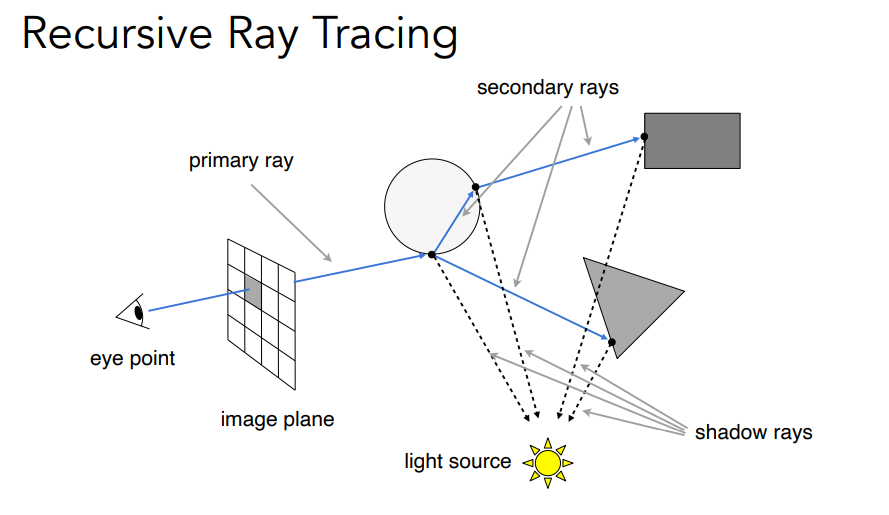

每条反射折射的点都计算一次着色

如果光源可以照射到（眼睛发出的光线折射或反射后的）弹射点，那么就把这点的着色信息计算到这个像素中。

当然有能量损耗

## 如何求交点？

光线再数学上就是射线

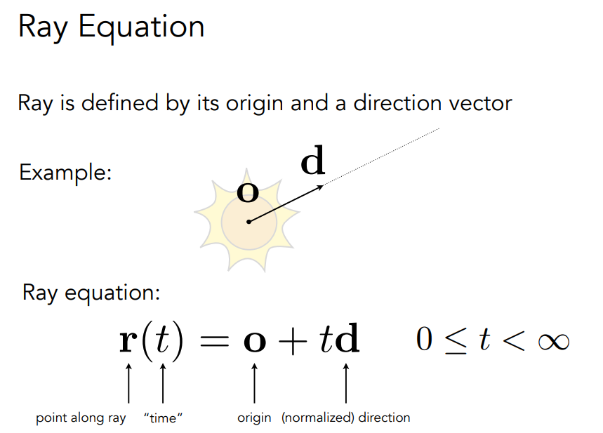

光线上的点都有它的t

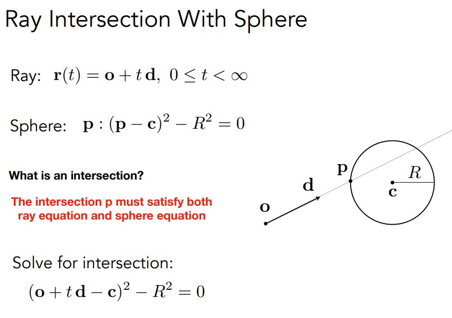

光线与球面求交，交代既满足o+td又满足P

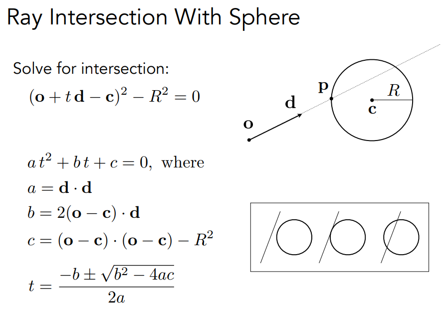

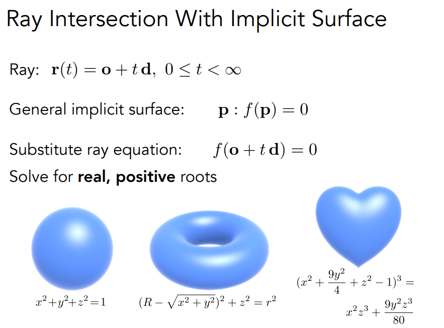

光线和一般隐式曲面求交

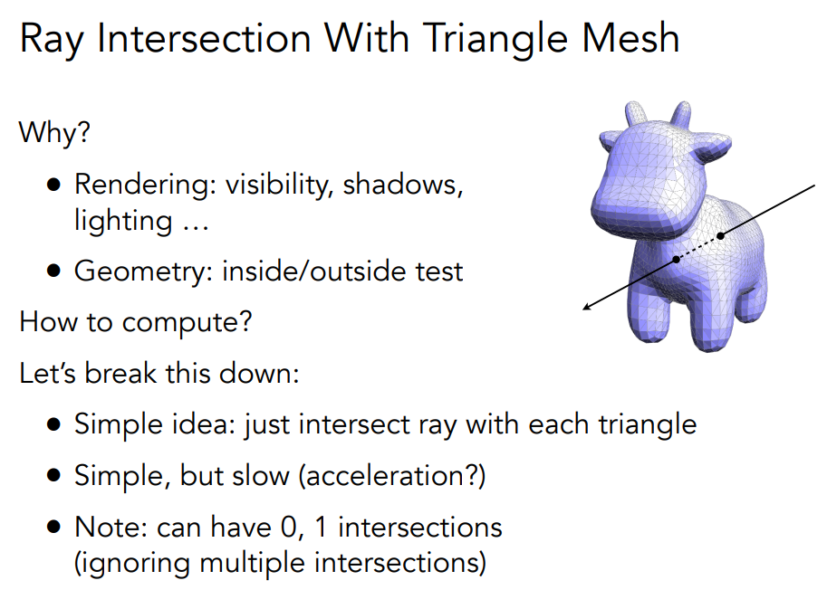

光线和网格求交

将光线与三角形求交分解为两个问题：

1. 光线与平面求交
2. 交点是否在三角形内

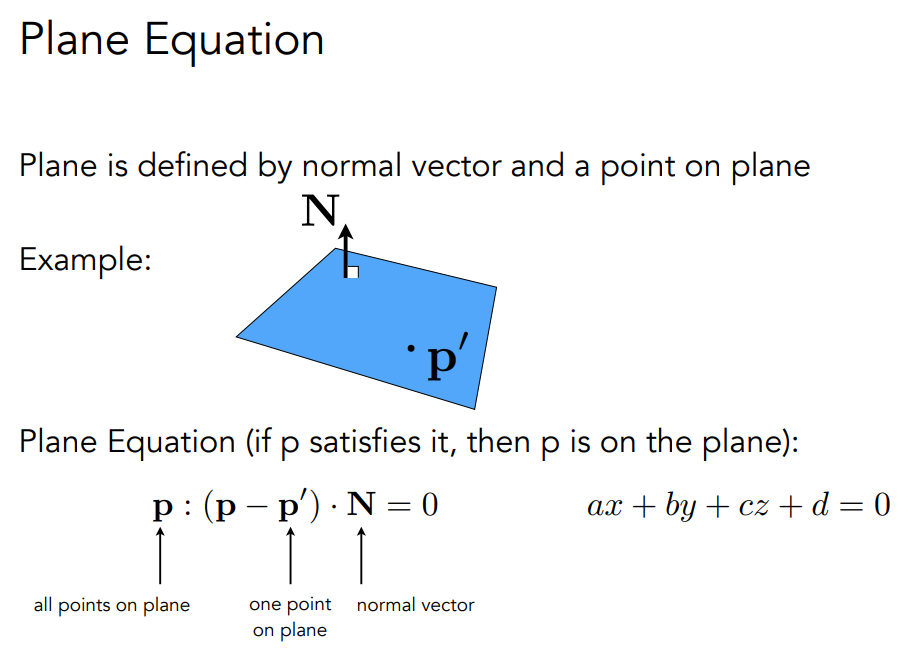

平面上任何一点的与p prime的连线与法线方向垂直

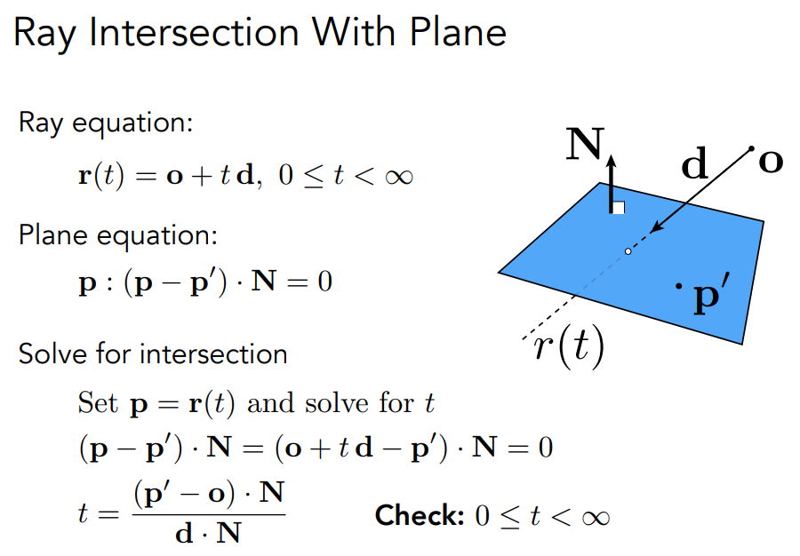

t>=0

接出来后再判断这个点是否在三角形内

能否直接判断光线与平面交点是否在三角形内呢？

使用中心坐标 如果解出重心坐标的三个系数相加等于1 那么在三角形内

使用克拉默法则解线性方程组

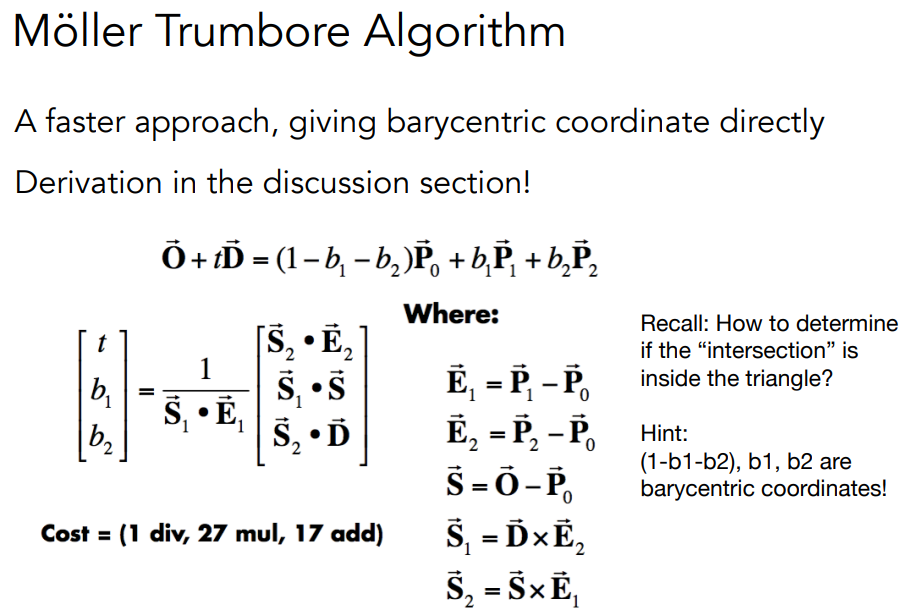

t>=0 b1+b2=1

## 加速光线与三角形求交

把光线和每个三角形做求交，找出最近的交点，非常慢。

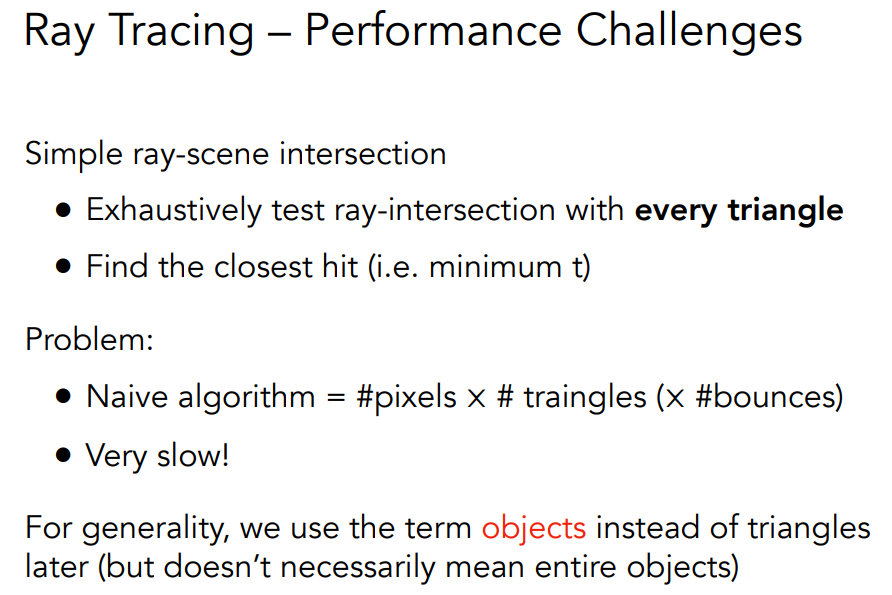

### 包围盒

用简单的形状将物体包起来

如果光线碰不到包围盒，那么肯定碰不到物体。

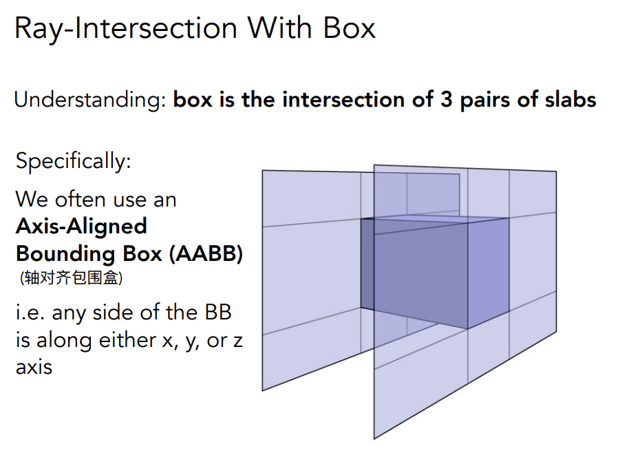

长方体看作三个不同的 对面形成的交集。

长方体的轴一定与xyz轴其一平行。

以二维情况为例，可知光线与两对 板的交点。求交集。

找到>0的最小的t和最大的值t。

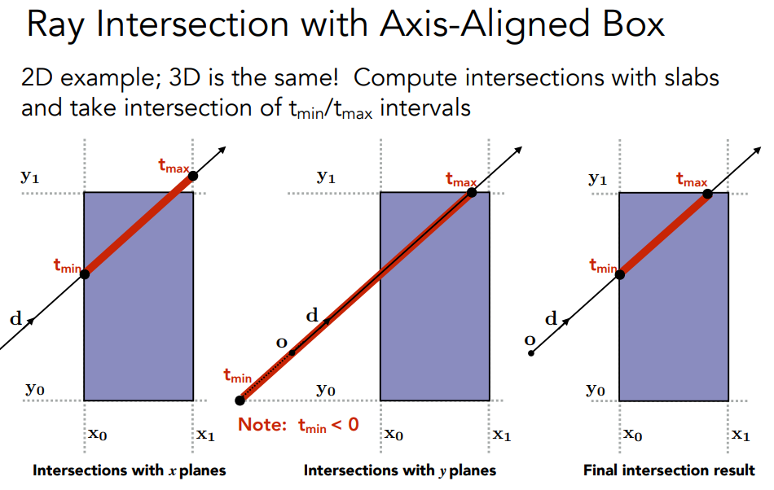

如何知道光线是否进入了包围盒？

光线进入了三个对面，那么认为光线进入了盒子。

只要光线离开任意一对对面，那么认为光线离开了盒子。

进入三个对面的最大时间，离开三个对面的最小时间。

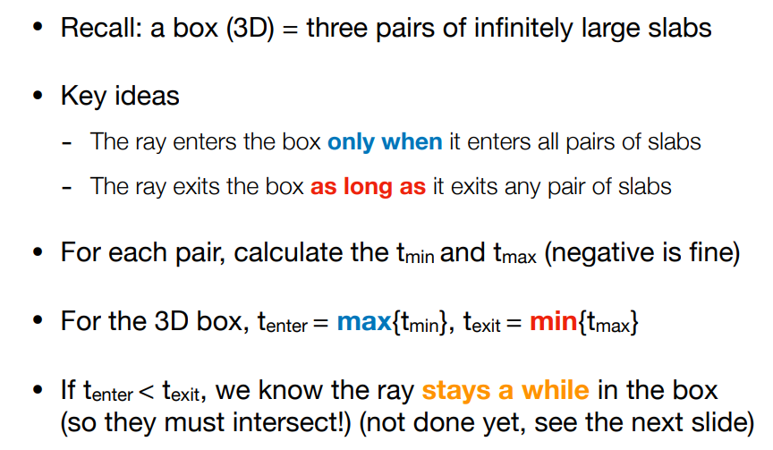

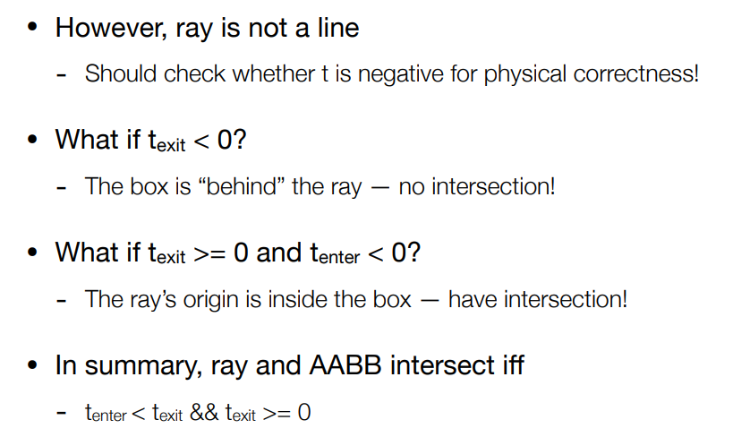

为什么要用轴对齐包围盒呢？

因为光线与轴平行的平面做求交很好求

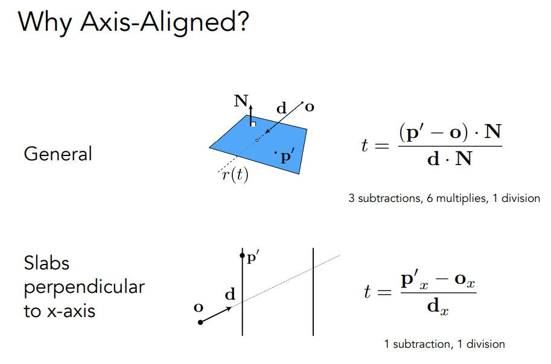