# 加速结构

## Grid

1. 找出场景的包围盒
2. 将盒子分成一堆格子
3. 判定哪些格子里有物品

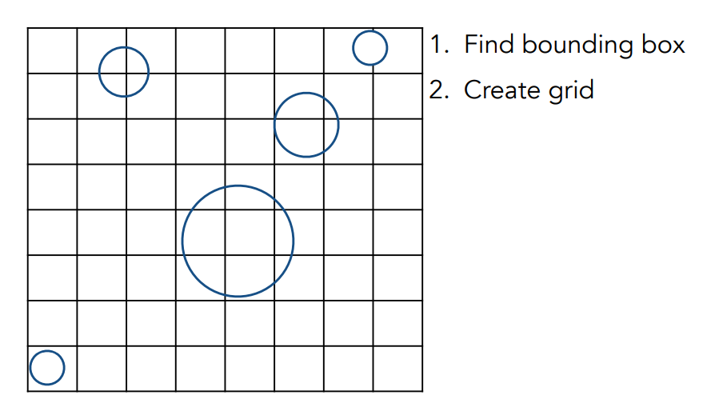

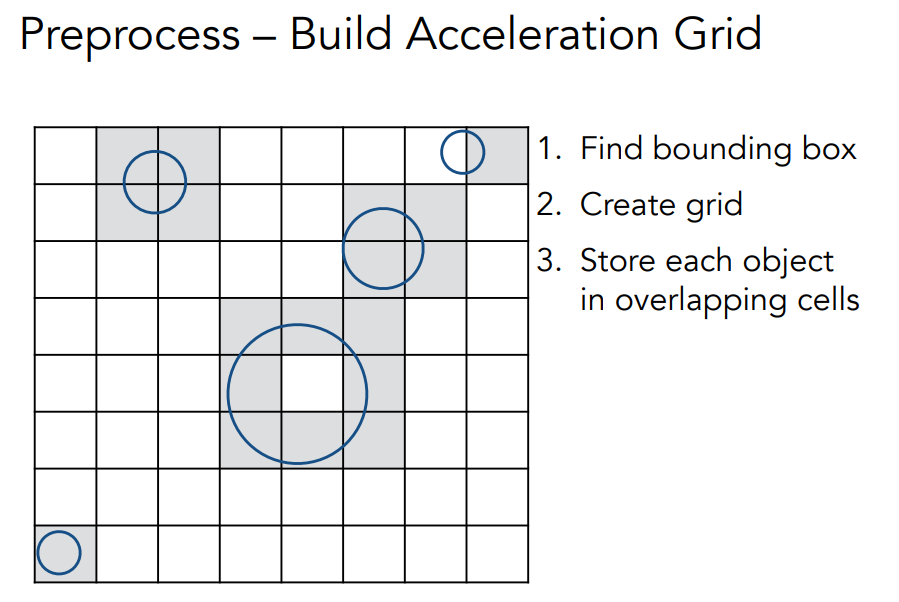

假设光线和格子求交非常快，和实际物体求交非常慢。

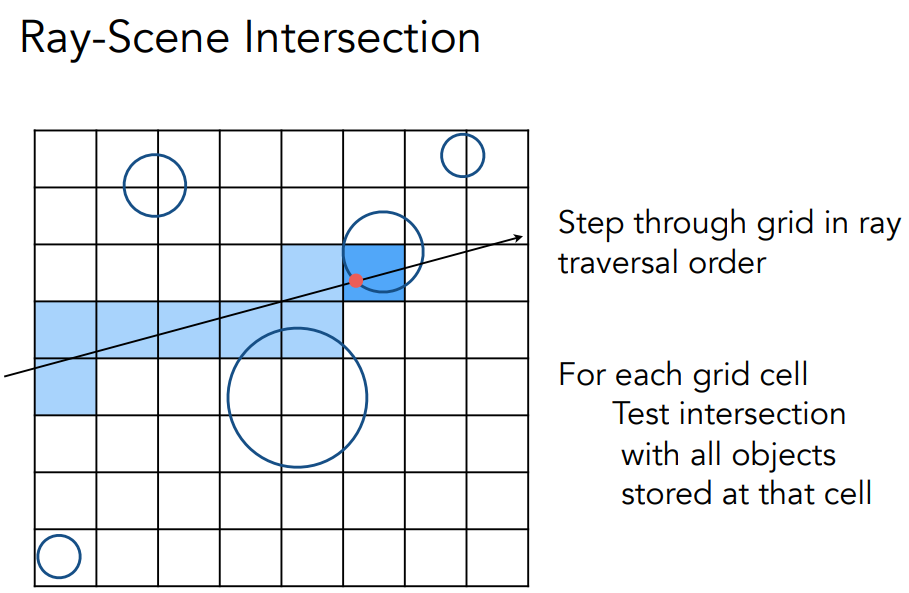

有可能格子内有物体，也与光线有交点，但物体与光线无交点。

不可能将每个格子都与光线做求交判断，实际上若与一个格子有交，那按图中例子来说，下一个有交的格子要么在它的上方，要么在它的右上方，要么在他的右边。

这对应了光栅化中如何显示一条线。

三维空间中有对应的算法找下一个格子。

加速效果怎么样？

格子太稀疏，没加速作用。格子太密计算量反而增加。

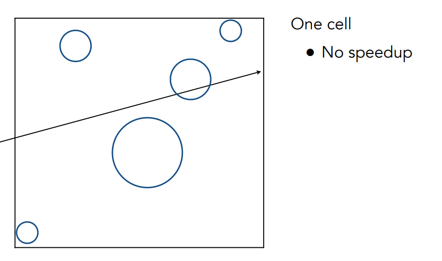

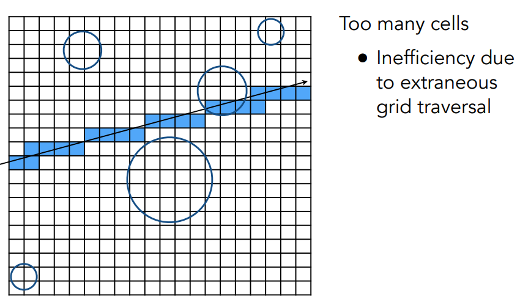

当空间中物体分布均匀时，效果好。

遇到Teapot in stadium效果不好。

## 空间划分Spatial Partitons

空旷的地方不需要太多格子

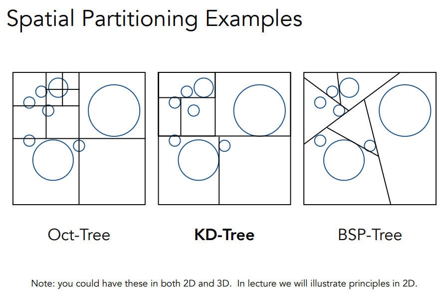

空间中切成八份：八叉树 划分什么时候停下来有不同的标准

KD树：在二维中先水平划分，再竖直划分，再水平划分...再三维中，每次沿着x划分，下一次y，下一次z。每次划分一次，像二叉树一样（保持了二叉树的性质）。

BSP：不是横平竖直的划分。但也是二分的思想。

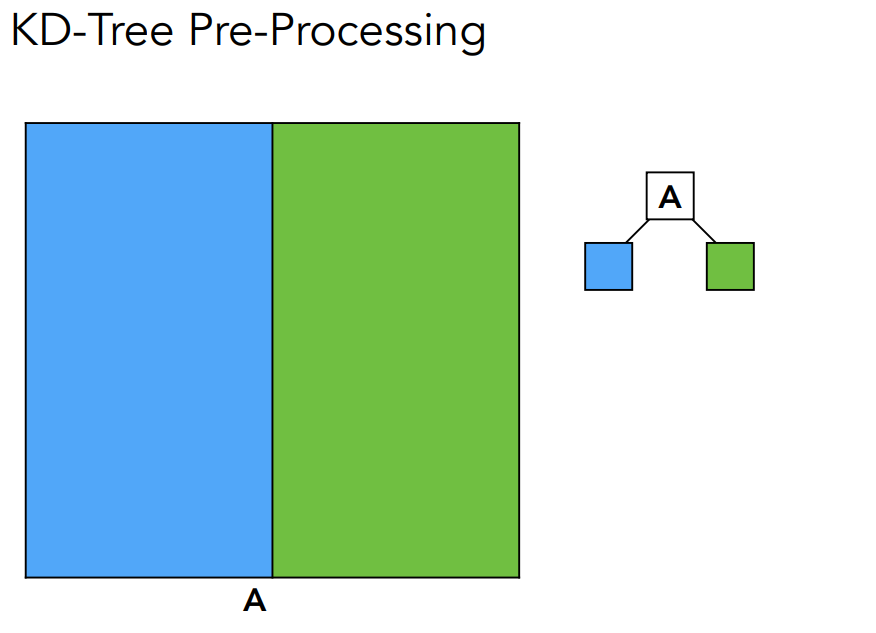

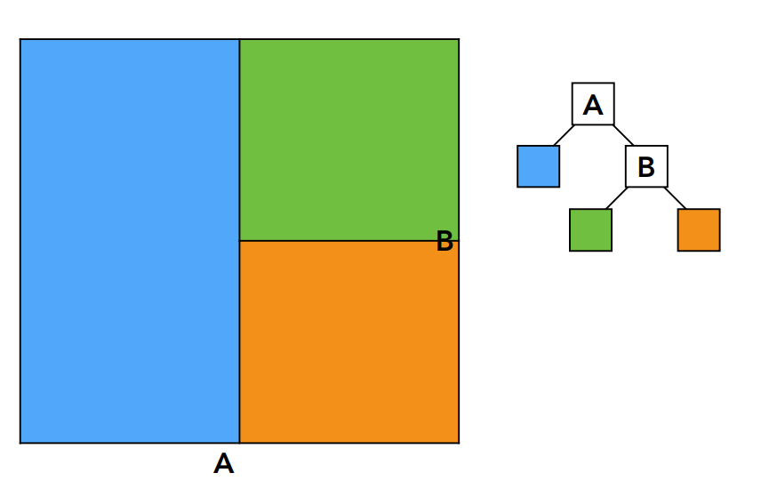

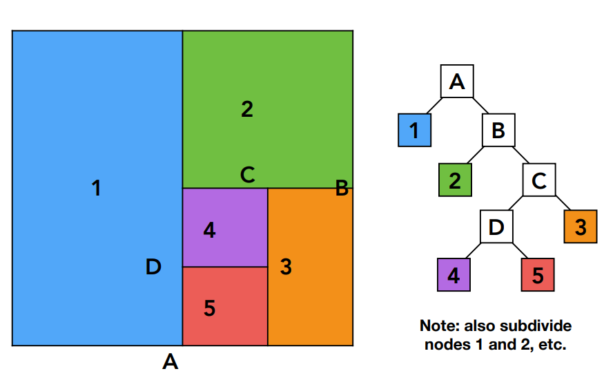

实际上两边都需要划分，只是图中为了说明过程每次只划分一个格子。

KD树：

- 只当当前沿着哪一轴的方向划分
- 划分的位置（不一定在中间）
- 子节点（两个）
- 实际的物体只存在叶子节点上

假设树就长这样

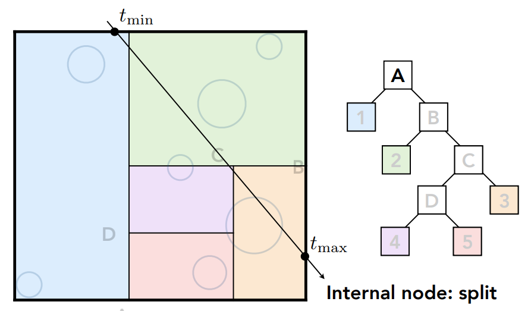

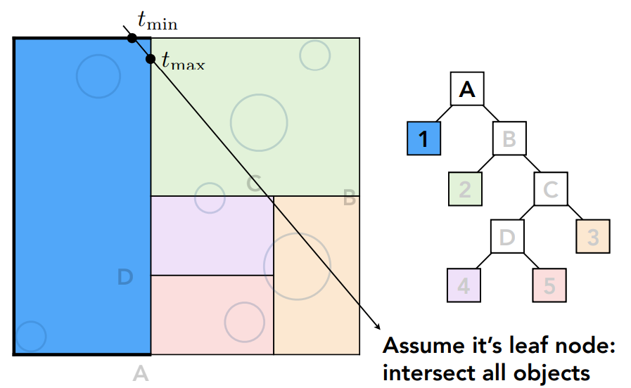

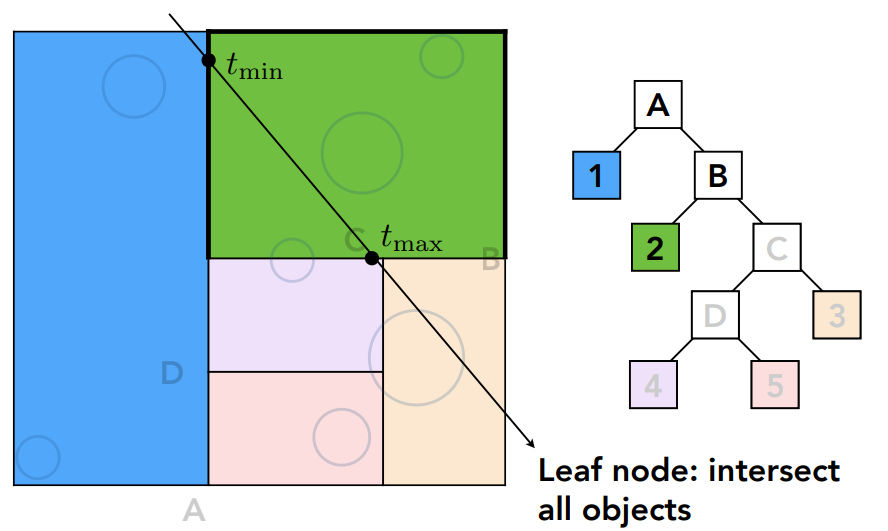

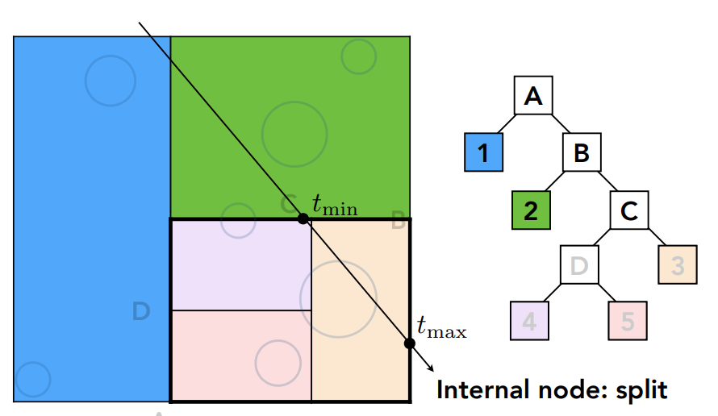

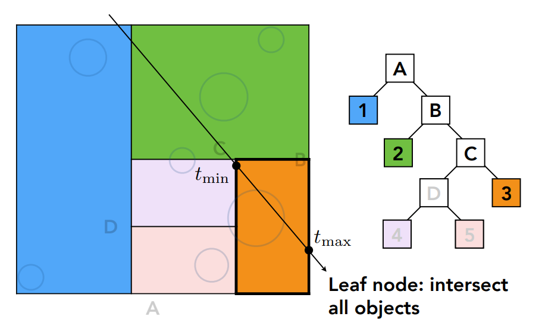

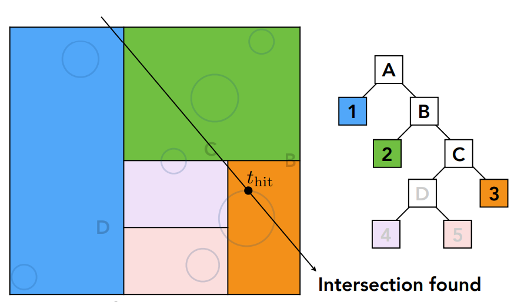

如果光线和某个盒子无交点，什么都不用做。

如果有交点，则继续划分，只到分到无交点，或在叶子节点中有交点。

对于KDTree会有问题：得知道和哪些三角形有交集（三角形和哪些框有交集）

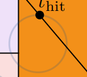

对于KDTree一个物体可能出现在多个叶子节点里 这点大伙都认为不好

## Bounding Volume Hierarchy(BVH)

BVH划分的不是空间而是**物体**

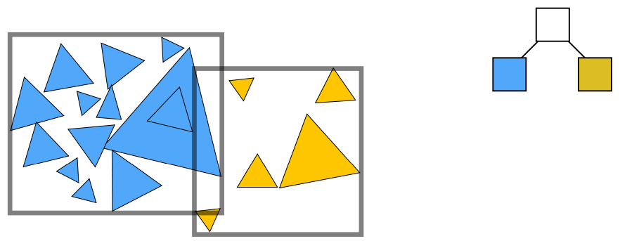

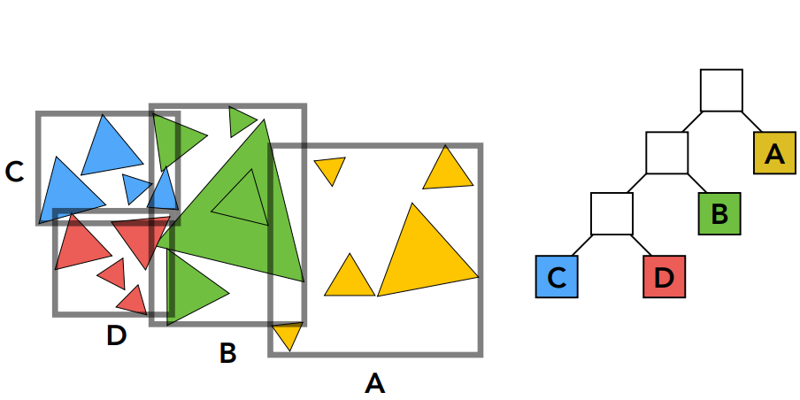

一个物体只可能出现在一个格子里，省去了三角形和包围盒求交问题。

但是BVH的两部分有可能相交（但也没什么问题）

关于怎么分很有说法

同样的把物体放叶子节点里其它做加速结构的判断。

一些划分方式：

- 每次沿着最长的轴去划分
- 取中间那个物体 这样分成两部分后左右两边深度（数量）差不多，树更平衡
- 比如取所有三角形的重心，沿x轴排序，找到中间的那个nlog_2(n)
- 其实只找中位数，不需要排序。一个序列的数找中位数（第i大的数）（第n/2的树）是可以在log_2(n)时间内完成的，算法叫快速选择算法（受快速排序影响）
- 当节点包含了较少物体时不再继续划分

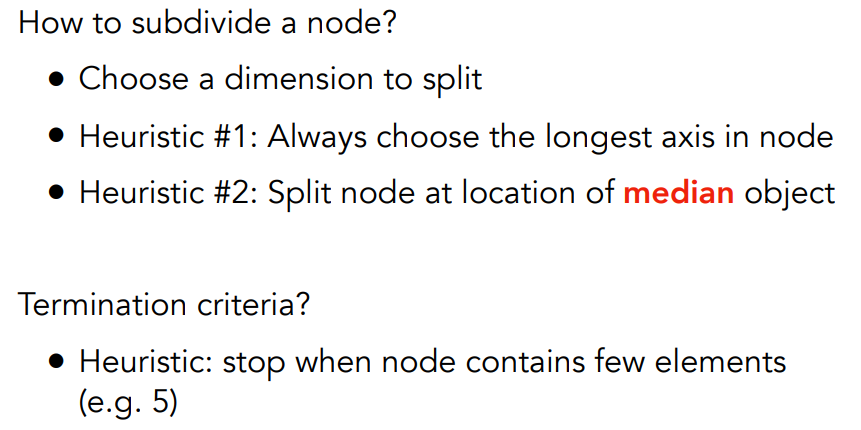

BVH的数据结构

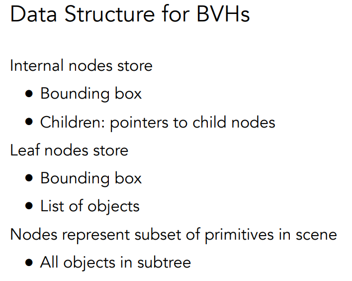

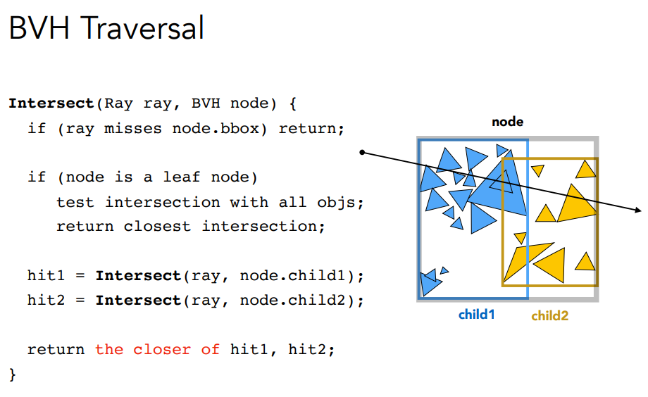

递归算法 像极了二叉树的遍历

KD树vsBVH树

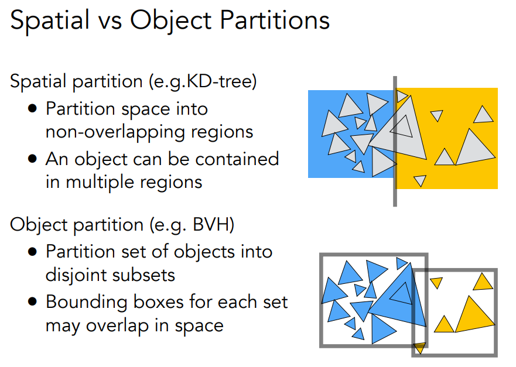

# 辐射度量学

光的强度

精准的描述光的物理，给光各种属性：

- Radiant flux, intensity, irradiance, radiance

## Flux

或者：一个平面单位时间内通过的感光平面光子的数量就叫Flux

- 如何定义光源辐射出的各种能量
- 在任何一个表面接收到多少能量
- 光在传播过程中的能量如何定义

## Radiant Intensity

什么是立体角？

弧度制在空间中的延申

立体角如何计算？

为什么这么定义？

保持 $\phi$ 不变，$\theta$ 变化：

- 球面半径是 r
- 这是在一个**大圆**上走

弧长就是：rdθ

保持 $\theta$ 不变，$\phi$变化：

- 绕的不是大圆
- 而是**纬线圆**

这个圆的半径不是 r，而是：rsinθ

将两条近似垂直的最小边相乘就是的A

当然在球上把立体角积分得到的就是面积4Π

总亮度是Flux，Intensity就是光源在任何一个方向上的亮度。Intensity=FLux/单位立体角 。
$$
I=\frac{d\phi}{d\omega}
$$
