# 辐射度量学

光的强度

精准的描述光的物理，给光各种属性：

- Radiant flux, intensity, irradiance, radiance

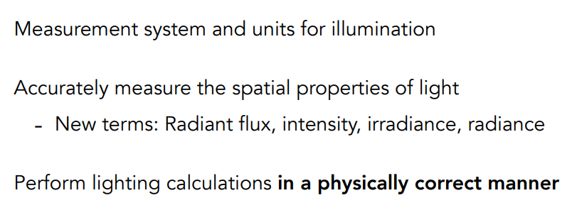

## Flux辐射通量$\Phi$

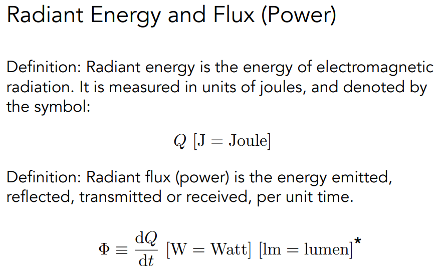

或者：一个平面单位时间内通过的感光平面光子的数量就叫Flux

- 如何定义光源辐射出的各种能量
- 在任何一个表面接收到多少能量
- 光在传播过程中的能量如何定义

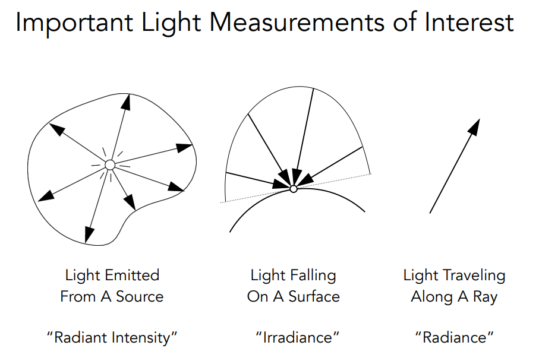

## Radiant Intensity辐射强度$I$

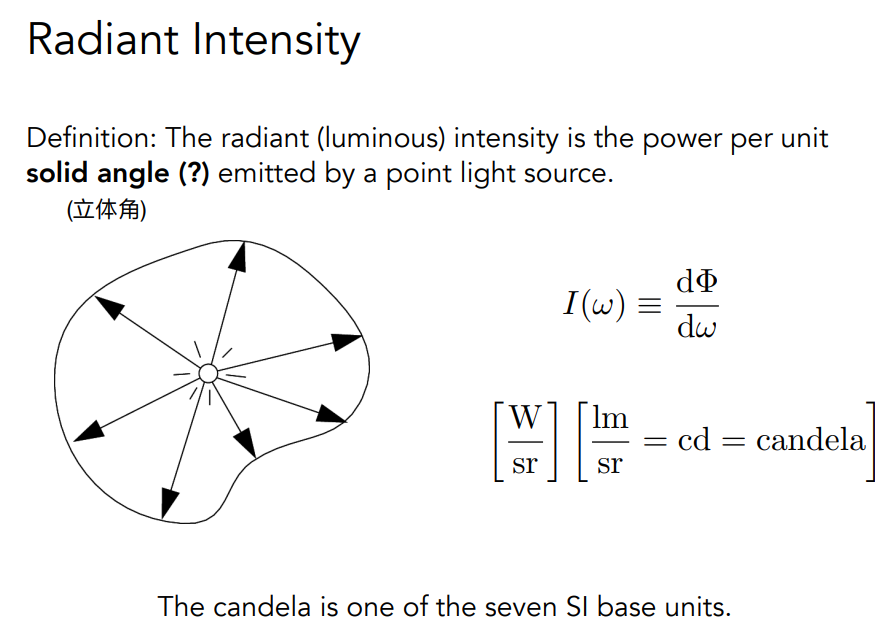

什么是立体角？

弧度制在空间中的延申

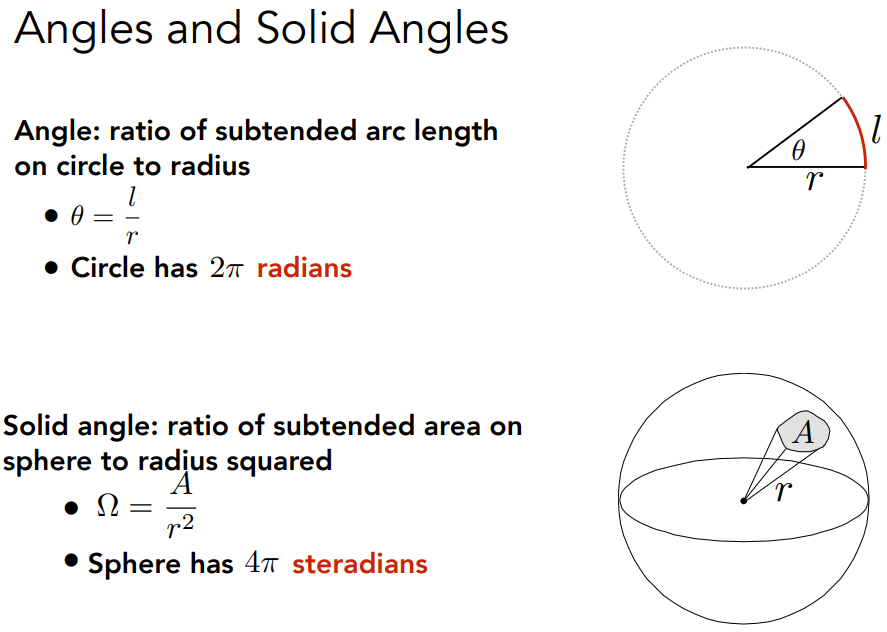

立体角如何计算？

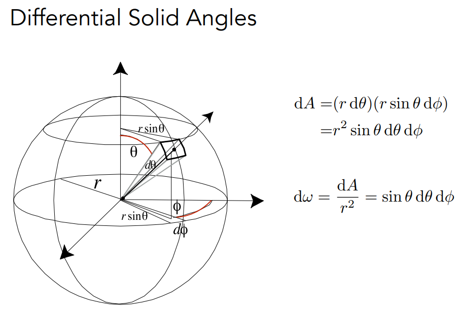

为什么这么定义？

1. 保持 $\phi$ 不变，$\theta$ 变化：弧长就是：rdθ

   - 球面半径是 r

   - 这是在一个**大圆**上走
2. 保持 $\theta$ 不变，$\phi$变化：这个圆的半径不是 r，而是：rsinθ
   - 绕的不是大圆
   - 而是**纬线圆**

将两条近似垂直的最小边相乘就是的A

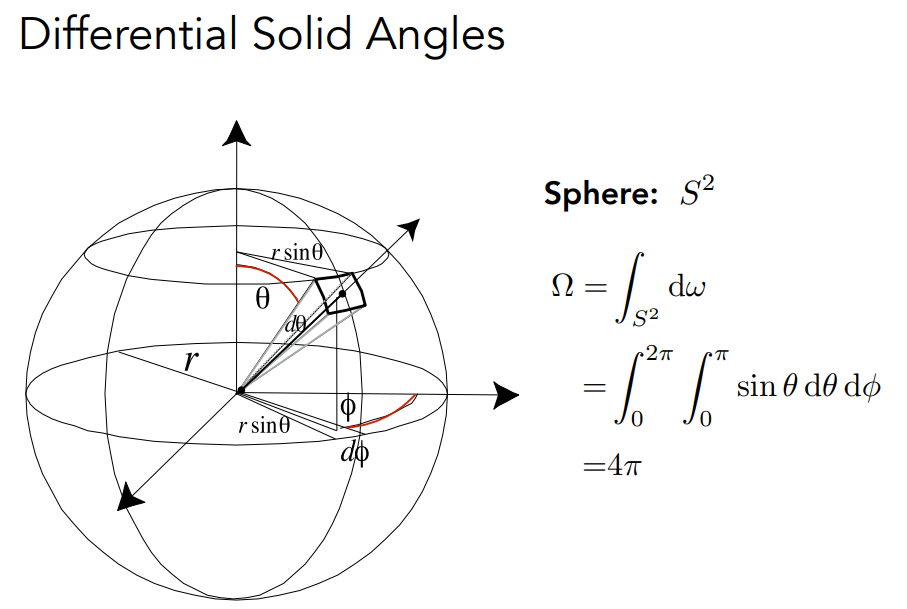

当然在球上把立体角积分得到的就是面积4Π

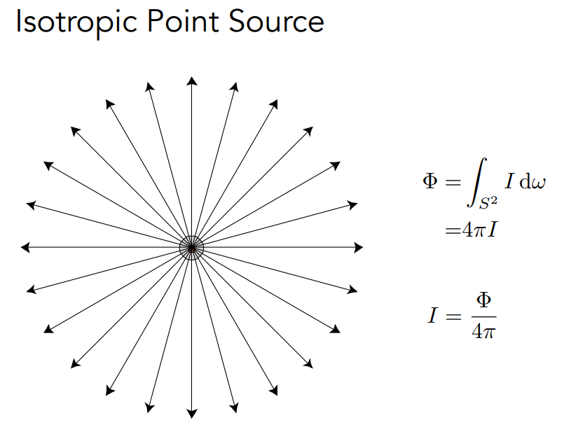

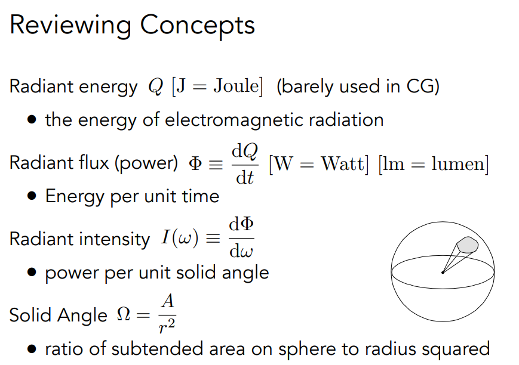

微分立体角实际上与θ有关系 所以并不是对面积的均匀划分

### 直观理解

总亮度是Flux，Intensity就是光源在任何一个方向上的亮度。Intensity=FLux/单位立体角 。
$$
I=\frac{d\phi}{d\omega}
$$
**Flux ($\Phi$)** 是它发出的总能量。

**Intensity ($I$)** 是它向**某一个特定方向**发射的能量有多强。

**Intensity 描述的是“发射源”在某个方向上的强弱（只跟方向有关，跟距离无关）。**

## Irradiance辐射度$E$

与Intensity区分：Power per solid angle

Irradiance：Power per projected unit area

unit are是和入射光线相垂直的方向的面具（或投影到垂直方向的面积）

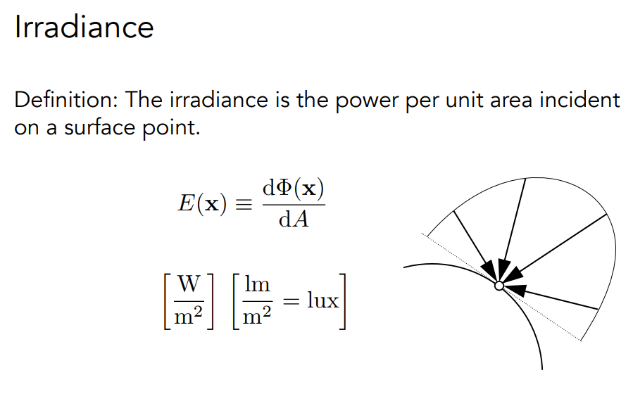

回想之前的夹角

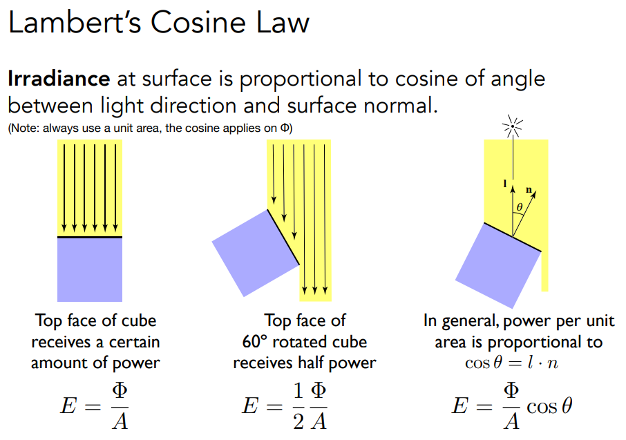

用Irradiance理解Phong模型

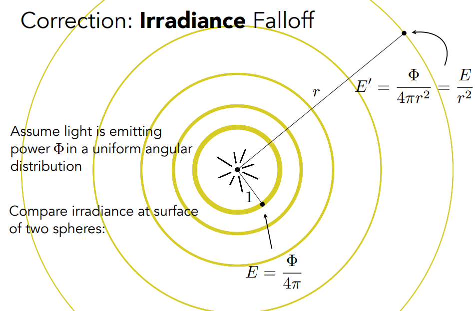

传播过程中其实Intensity没变，而Irradiance不断变小。

### 直观理解

**定义**：单位**面积**上接收到的辐射通量。
$$
E = \frac{d\Phi}{dA}
$$
这次我们不看光源了，我们要看**被照亮的物体表面**。 Irradiance 描述的是**表面被“砸”中了多少光子**。

**Lambert's Cosine Law (余弦定律)**：

如果光线是斜着射过来的，能量会被“摊薄”。
$$
E = \frac{\Phi}{A} \cos\theta
$$
**Irradiance 描述的是“接收面”确实收到了多少能量（跟接收面积和角度和距离有关）。**

推导：

1. Intensity不随距离变化 是单位立体角的能量

$$
I = \frac{d\Phi}{d\omega} \implies d\Phi = I \cdot d\omega
$$

2. Irradiance的定义：

$$
E = \frac{d\Phi}{dA}
$$

3. 把 $d\Phi$ 替换掉：

$$
E = \frac{I \cdot d\omega}{dA}
$$

4. **立体角 $d\omega$ 和面积 $dA$ 的几何关系是什么？** 根据立体角定义：一个面积 $dA$ 在距离 $r$ 处张开的立体角是：假设此时光源没有倾斜

$$
d\omega = \frac{dA}{r^2}
$$

5. 把它代回 $E$ 的公式：

$$
E = \frac{I \cdot (\frac{dA}{r^2})}{dA}
$$

6. 分子分母的$dA$抵消了：

$$
E = \frac{I}{r^2}
$$

7. 考虑到角度之后：

$$
E = I \cdot \underbrace{\frac{1}{r^2}}_{\text{距离因子}} \cdot \underbrace{\cos\theta}_{\text{角度因子}}
$$

Irradiance ($E$) 等于 Intensity ($I$) 除以距离的平方 ($r^2$)。

这就是为什么 $dA$ 里没有距离，但最终结果里却有距离。因为**同样的面积 $dA$，离得越远，它占用的立体角 $d\omega$ 就越小**，所以它截获的能量 $d\Phi$ 就越少。

## Radiance辐射率$L$

描述光在传播过程中的属性

Intensity:power per solid angle

Irradiance:power per projected unit area

Radiance:power per unit solid angle, per projected unit area

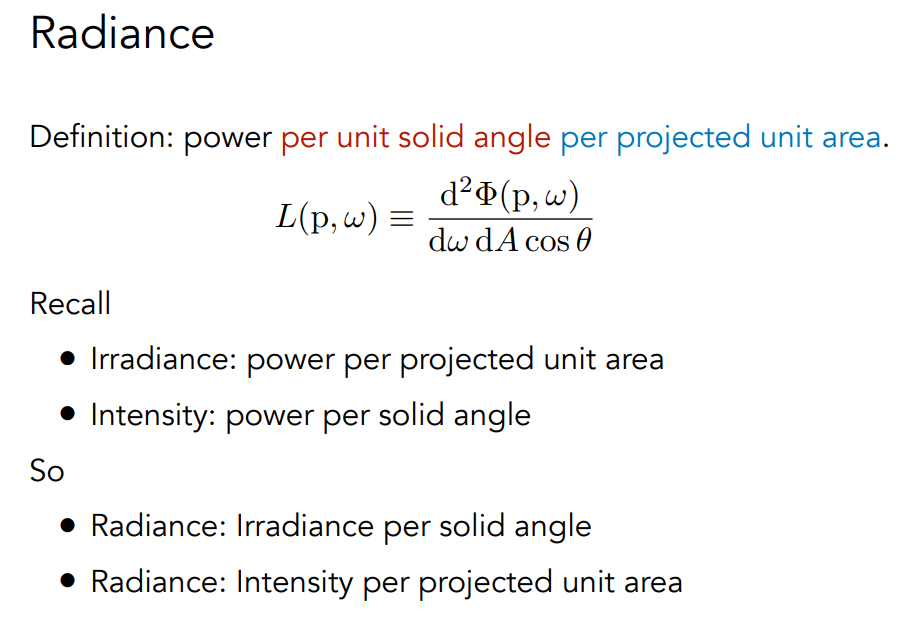

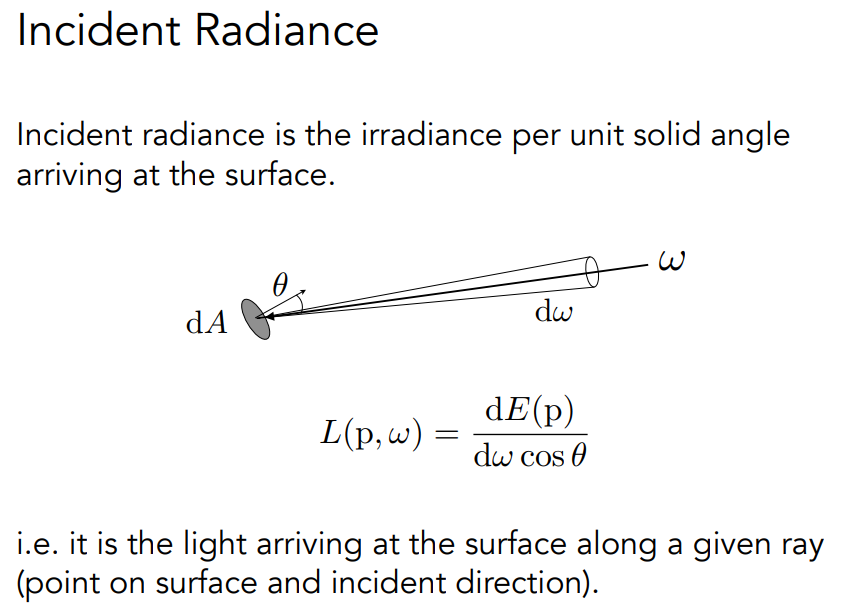

从接受能量的角度用Irradiance和Radiance的关系解释：

**Irradiance：dA收到的能量。Irradiance per solid angle往某个方向去辐射，往ω方向辐射了多大的强度。**

反过来理解也是一样的

**从一个方向打到一个面上去，到达这个面的能量是Irradiance。只考虑某个方向进来的能量被dA收到了多少，这就是Radiance。**

Irradiance与Radiance的区别就是是否有方向性

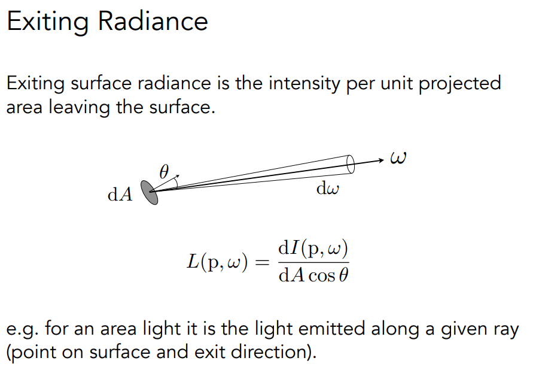

从辐射出去的能量看Intensity与Irradiance的关系解释：

**Intensity是[每一个]立体角上的能量大小，往某一个确定的立体角上去有多少的Intensity**

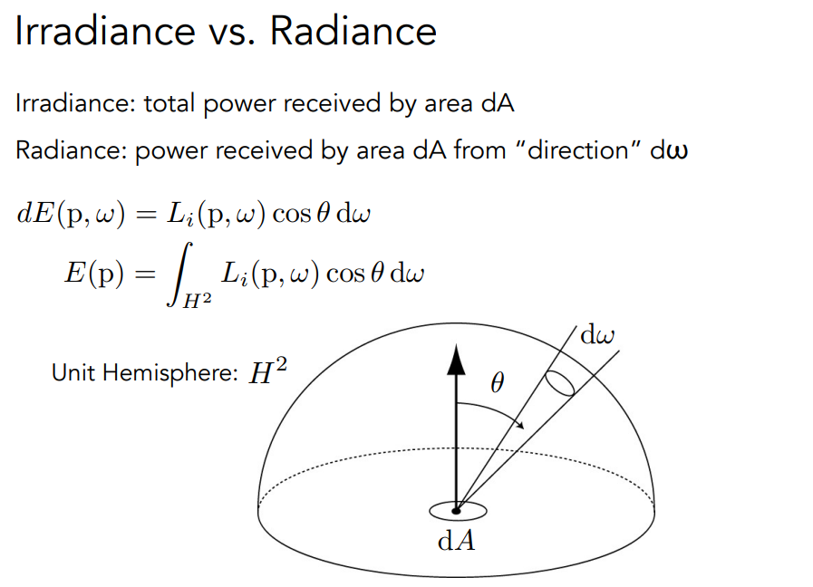

Irradiance在这一点收到的所有能量，就是每个方向能量的积分。

### 直观理解

**Radiance 描述的是“这一束光线”本身携带的能量。它在真空中传播时是不变的。**

#### 联系 A：Irradiance 是 Radiance 的积分

$$
E = \int_{\Omega} L_i \cos\theta \, d\omega
$$

- **左边 ($E$)**：这就好比这个点**一共**收到了多少能量（不管从哪来的）。
- **右边 ($L_i$)**：来自于四面八方（$\Omega$）的每一条光线（Radiance）。
- **物理意义**：一个点接收到的总辐照度 ($E$)，等于来自所有方向的入射光线 ($L$) 的加权总和（权重是 $\cos\theta$）。

#### 联系 B：Intensity 是 Radiance 的积分

$$
I = \int_{A} L \, \cos\theta \, dA
$$

- **物理意义**：如果你把一个有面积的光源（比如手机屏幕）看作一个点光源，它的 Intensity 就是把屏幕上所有像素发出的 Radiance 在面积上积分起来。

## 另一个角度理解

### 第一视角：入射阶段 (Incident) —— 收光

**关键词：Irradiance ($E$)**

在这个阶段，我们将视线固定在物体表面的一个点 $p$ 上，我们关心的是：“**有多少能量砸到了我头上？**”

我们把四面八方射过来的光线，每一束都看作是一个 **Radiance ($L_i$)**。

- $L_i$：Incident Radiance（入射辐射率）。

**数学关系：Irradiance 是入射 Radiance 的“半球积分”**

你需要把半球面上所有方向射来的 $L_i$ 加起来。
$$
E(p) = \int_{\Omega^+} L_i(p, \omega) \cdot \cos\theta \cdot d\omega
$$

- **$L_i$**：这束光本身有多强。
- **$\cos\theta$**：这束光射得有多斜（接收效率）。
- **$\int d\omega$**：把来自四面八方的都加起来。

**总结**：

从入射角度看，**Irradiance ($E$) 就是把所有入射的 Radiance ($L_i$) “捏”在一起形成的一个标量总和。** 它丢失了方向信息，只剩下一个总能量值。

### 第二视角：出射阶段 (Exiting) —— 发光

**关键词：Intensity ($I$) & Radiance ($L_o$)**

现在，能量已经打到表面上了，或者物体本身就是个灯泡。我们关心的是：“**这个物体向外发射了多少能量？**”

这里分为两种情况：

**情况 A：描述“整个面”向某方向的发射能力 $\rightarrow$ Intensity ($I$)**

如果你把发光的表面（比如手机屏幕）看作一个整体，问：“屏幕向正前方射出了多少光？”

这时我们要对**面积 ($dA$)** 进行积分。

$$I(\omega) = \int_{Area} L_o(p, \omega) \cdot \cos\theta \cdot dA$$

- **$L_o$**：屏幕上每一个像素点发出的 Radiance。
- **$\cos\theta$**：投影面积修正（如果是斜着看屏幕）。
- **$\int dA$**：把屏幕上所有像素点的贡献加起来。

**总结**：从出射角度看，**Intensity ($I$) 是把物体表面所有点发出的 Radiance ($L_o$) 在面积上“捏”在一起。** 它保留了方向性，但模糊了具体的发光点位置。

**情况 B：描述“某一条光线”的发射能力 $\rightarrow$ Radiance ($L_o$)**

这是渲染中最常用的。我们不捏合任何东西，就盯着从点 $p$ 射出的**那一束**光。

这就是 **Outgoing Radiance ($L_o$)**。

# BRDF

## 反射方程

Bidirectional Reflectance Distribution Function双向反射分布函数

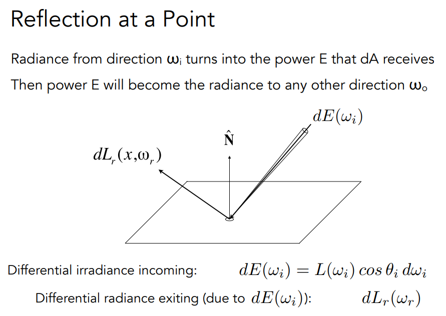

BRDF描绘了光线和物体是如何作用的。

我们知道某一块从某个方向接受到了某些能量，也知道能量会被辐射到四面八方去，但是对于特定方向辐射出去多少能量，BRDF定义了这么个事。

对于任何一个出射方向Radiance，除以这一小块接收到的Irradiance。这就是BRDF的定义。

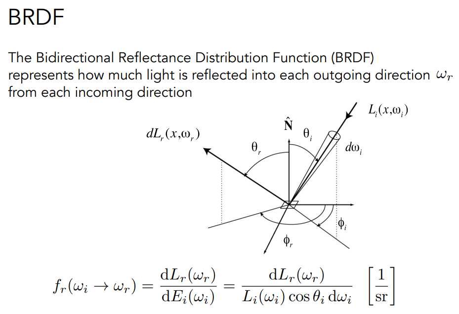

反射分两部分：第一：入射光的Radiance乘以入射方向的立体角，就是入射光在它的立体角上对dA的Irradiance。

BRDF是出射方向上Radiance的微分除以入射方向Irradiance的微分。

BRDF是从一个方向进来打到某个物体之后，往不同方向上反射的能量分布。

如果是镜面的，那么非镜面反射方向没有任何能量。

如果是漫反射，那么进来的能量会被均匀的分到不同的方向。

---

现在盯着某一个反射出去的方向，某个着色点可以接收四面八方的光照。对于每一个入射方向，都会有入射方向着色点和出射方向着色点的BRDF。现在把每一个方向上入射光对出射方向的贡献都加起来（做一个积分）就可以得到这个点在所有可能的入射方向上看上去是什么样的。

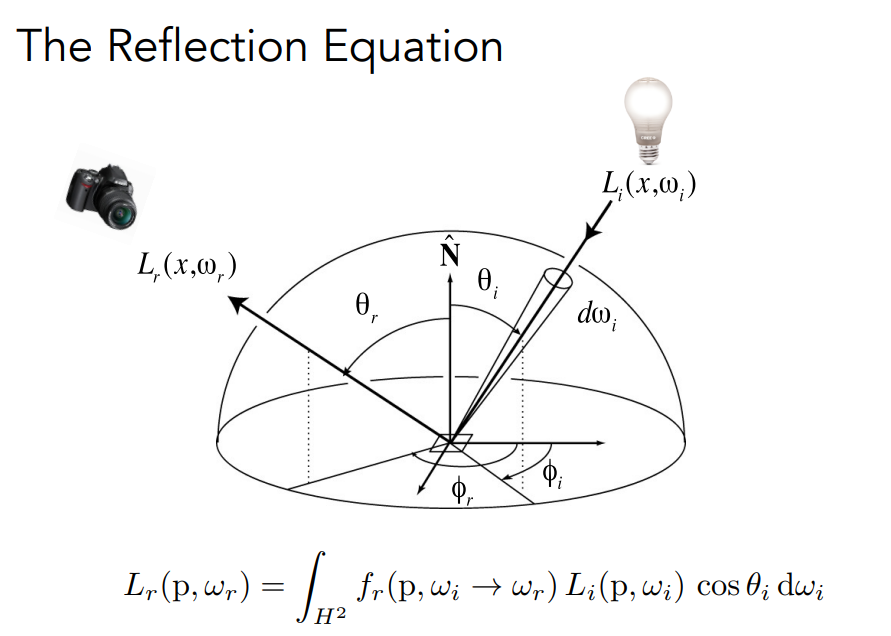

理解1：理解成Irradiance

理解2：理解为各方向Radiance的加权

（待补充笔记）

## 渲染方程

仍和出射的Radiance都可能作为其它点入射的Radiance。本身是一个递归的定义方式。

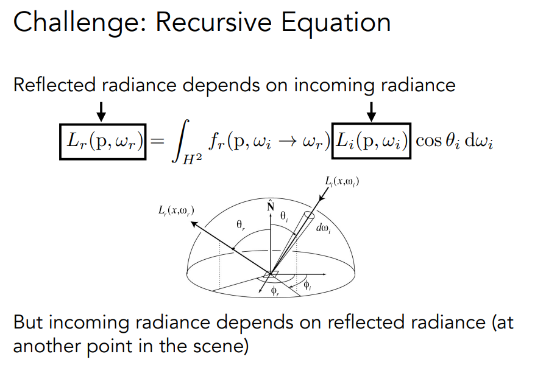

反射方程没有考虑到物体发光的情况，所以如果物体要发光就加上发光项。

这就是渲染方程（假设方向都朝外，用半球模型，光线不可能从背面穿过来）（H^2和Ω+都指半球）

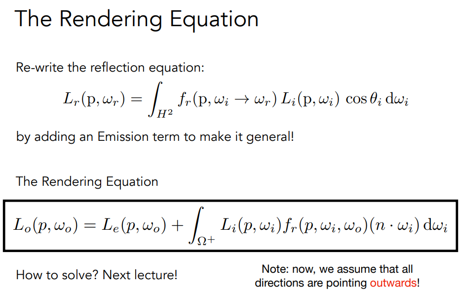

 对于一个点光源

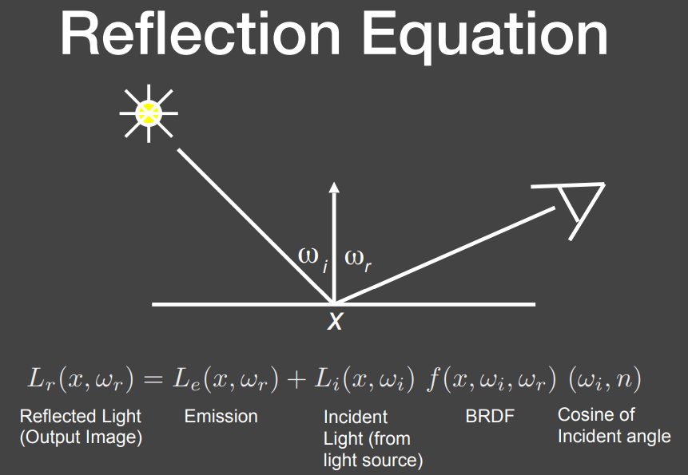

对于多个点光源

按照光线传播的线性性质

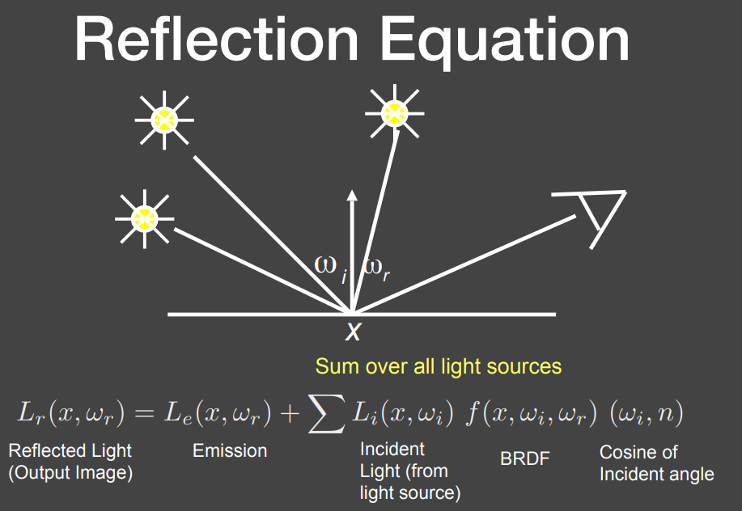

对于面光源

将面光源看为多个点光源，并积分起来。

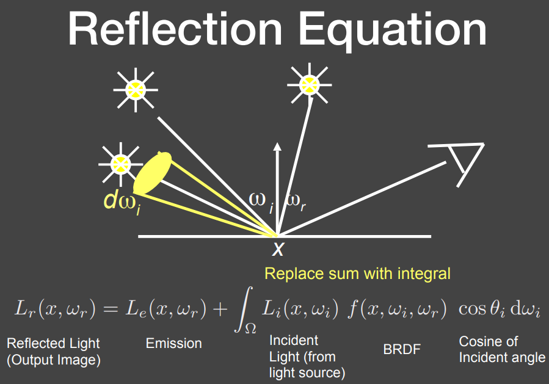

除了光源还有可能是其它物体反射来的Radiance

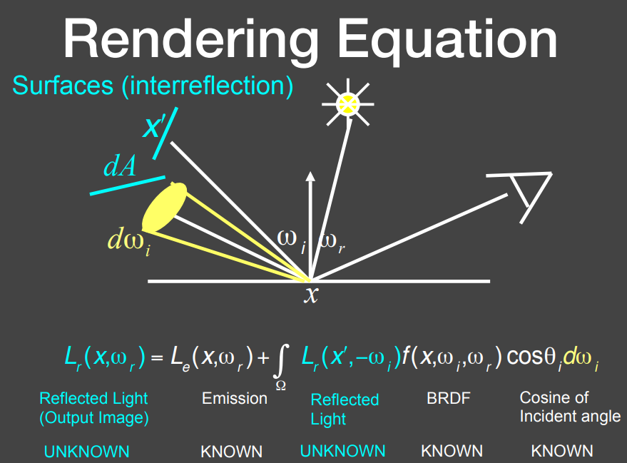

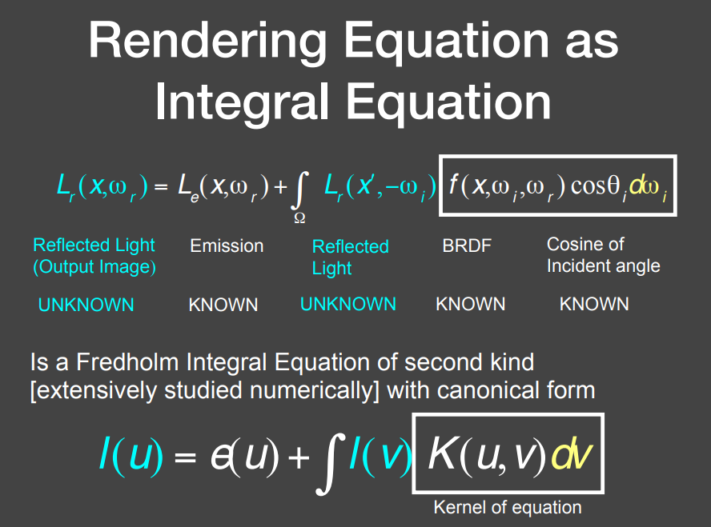

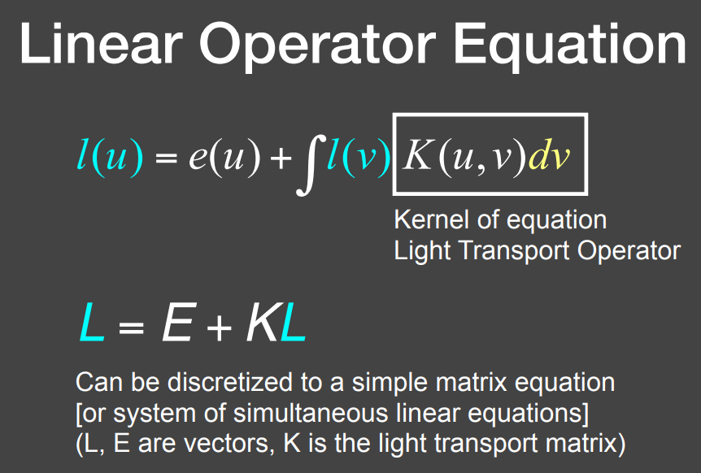

写成算子的形式后泰勒展开

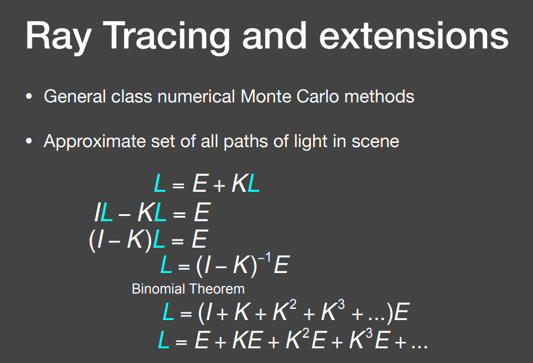

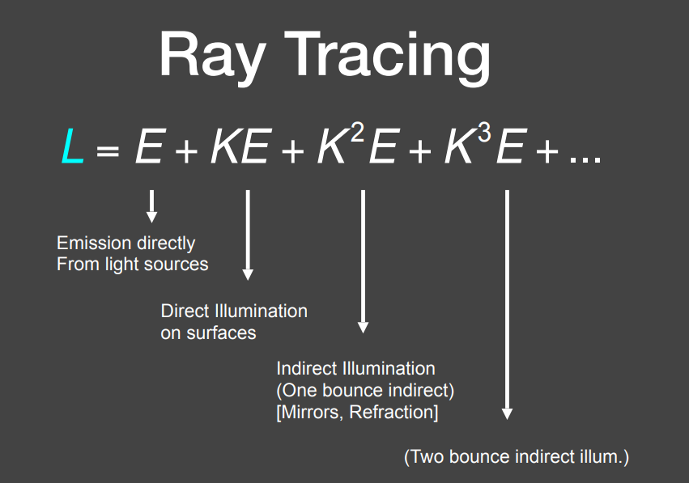

自然变为了对光线弹射次数的分解

## 全局光照

直接和所有间接光照的结果加起来就是全局光照

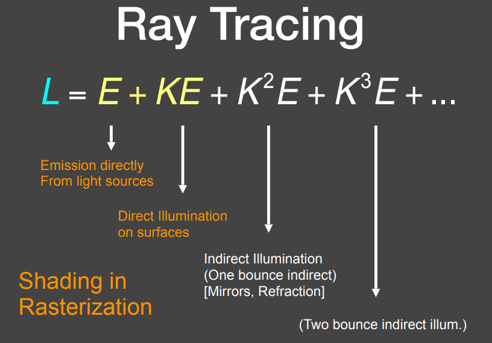

光栅化只能解决0次和1次弹射：光源和直接光照

全局光照展开到无限次，最后亮度会收敛到某一个值。

不过从某种角度来看，却是本身也是泰勒展开。

从能量守恒角度也能理解。

## 概率论回顾

随机变量

概率

期望

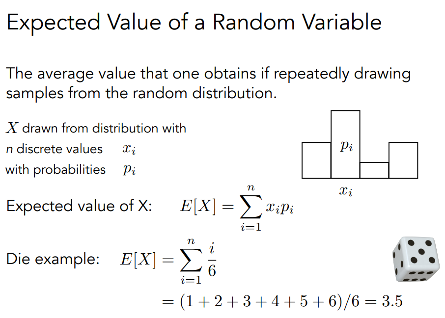

概率密度函数

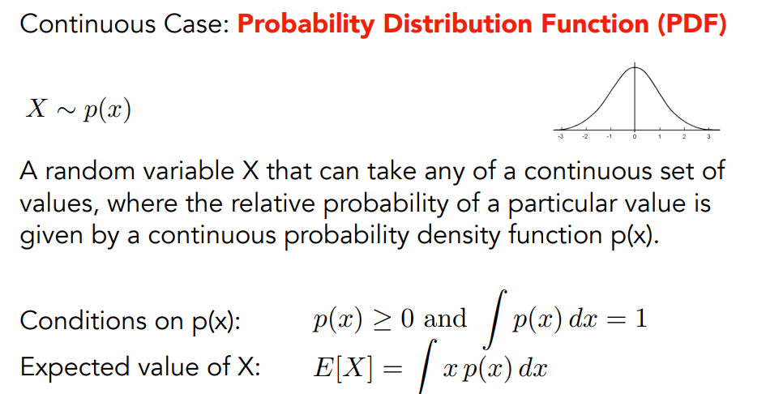

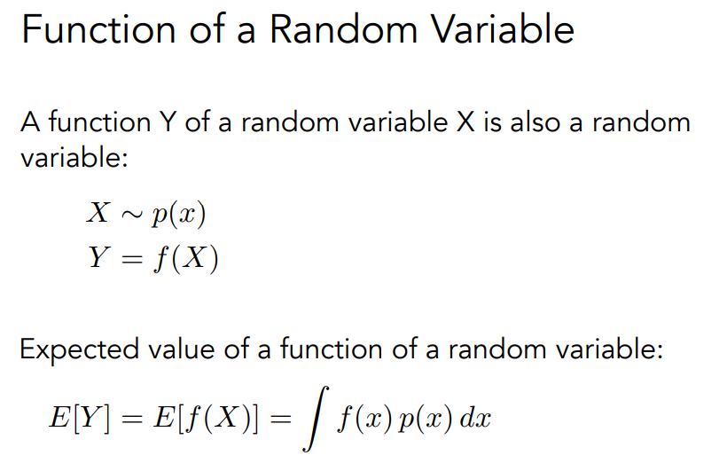

