> [!NOTE]
>
> 材质与外观

# 回顾渲染方程和BRDF

$$
L_o(p, \omega_o) = L_e(p, \omega_o) + \int_{\Omega} f_r(p, \omega_i, \omega_o) L_i(p, \omega_i) (n \cdot \omega_i) \mathrm{d}\omega_i
$$

$L_o(p, \omega_o)$从点 $p$ 沿着方向 $\omega_o$（通常是朝向观察者或摄像机的方向）射出的总辐射亮度。

$L_e(p, \omega_o)$点 $p$ 在 $\omega_o$ 方向上自己发出的光。

$f_r(p, \omega_i, \omega_o)$BRDF双向反射分布函数：从 $\omega_i$ 方向入射的光，有多少比例会被反射到 $\omega_o$ 方向。

$L_i(p, \omega_i)$入射辐射度：从入射方向 $\omega_i$ 到达点 $p$ 的光。

$(n \cdot \omega_i)$ 或 $\cos\theta_i$ —— 朗伯余弦定律：入射光方向 $\omega_i$ 与表面法线 $n$ 的夹角的余弦值。

**你看到的某个点的亮度（$L_o$） = 它自己发的特殊光（$L_e$） + 这一圈环境光反射给你的能量之和（$\int \dots$）**。

# 图形学中的材质

**材质=BRDF**

## 漫反射材质

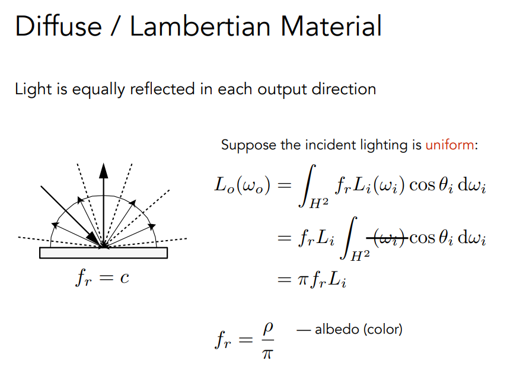

## 反射

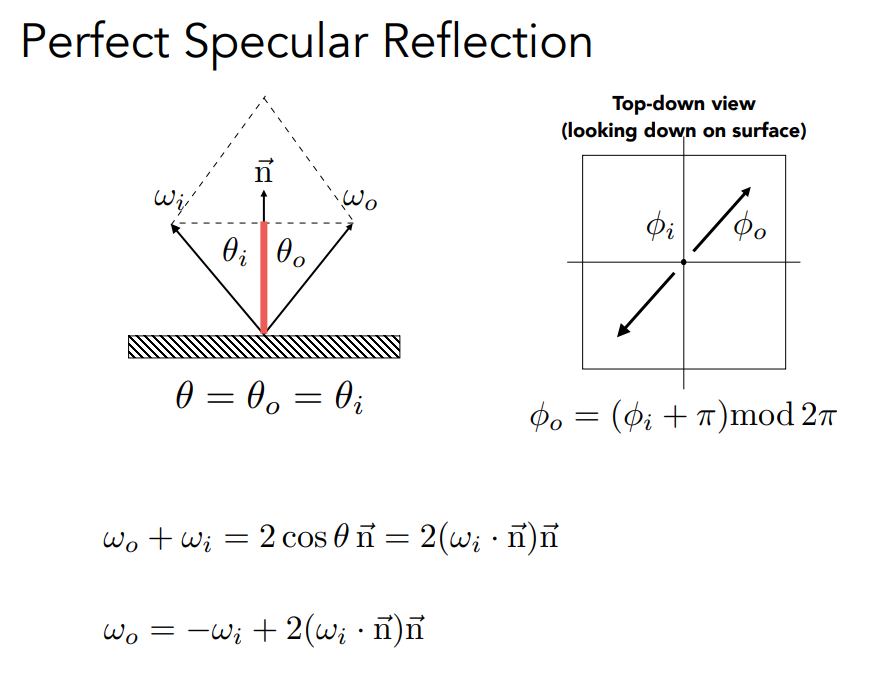

## 折射

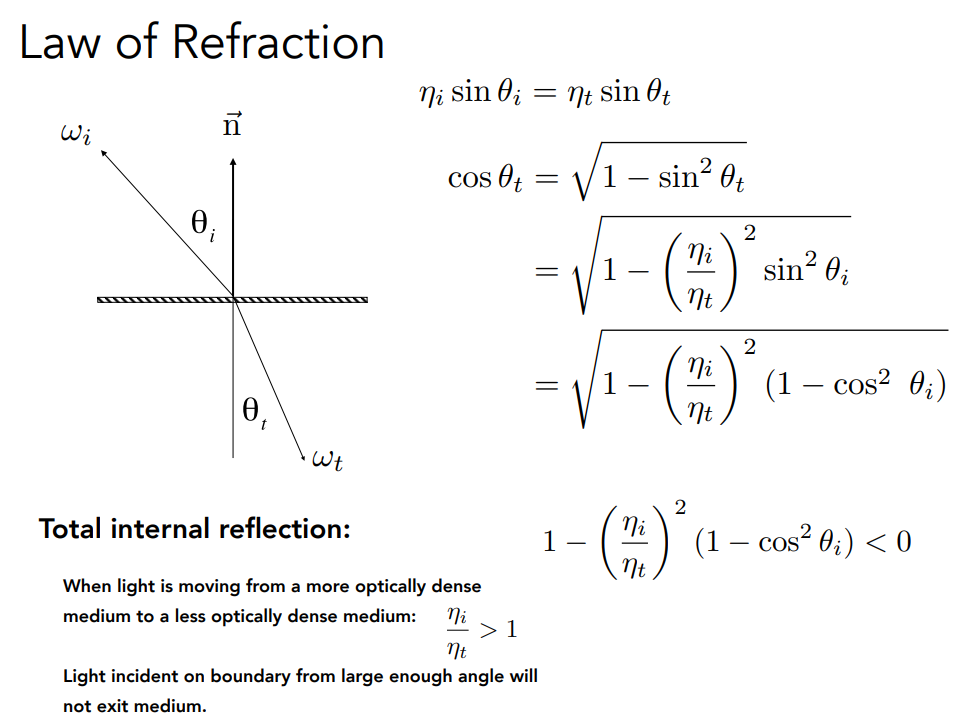

如果入射介质的折射率大于折射介质的折射率，那么很有可能出现没有折射的情况。这就是全反射现象。

## 菲涅尔项

入射光进来后与法线的角度决定了有多少光被反射，有多少光被折射

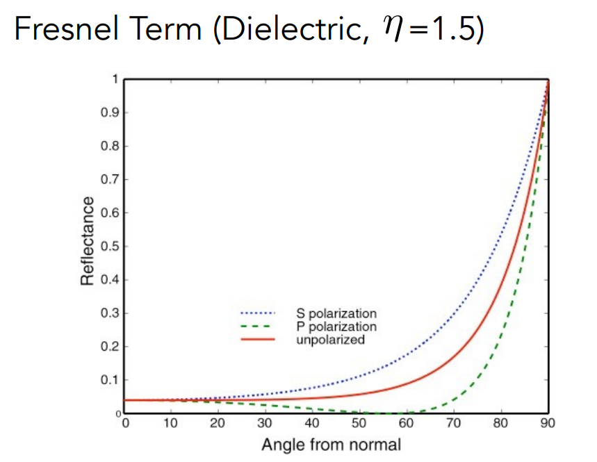

红色的线：光线与法线90°时几乎全被反射

S和P是极化现象，不过一般不考虑。

图里是一个对折射率1.5的某一绝缘体材质的菲涅尔项。

但是金属（导体）的菲涅尔项如下图

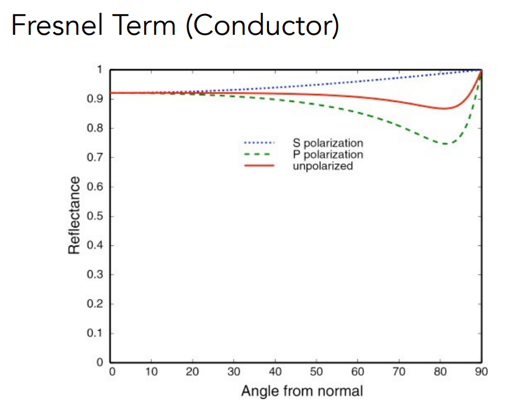

菲涅尔项的公式非常复杂

使用Schlick's approximation

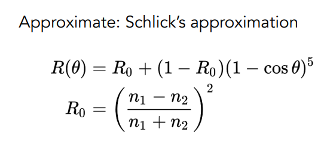

## 微表面模型

只要离得足够远，那么看向物体时，很多微小的东西看不到，看到的是它们最终整体的对表面的作用，对光的整体的效应。

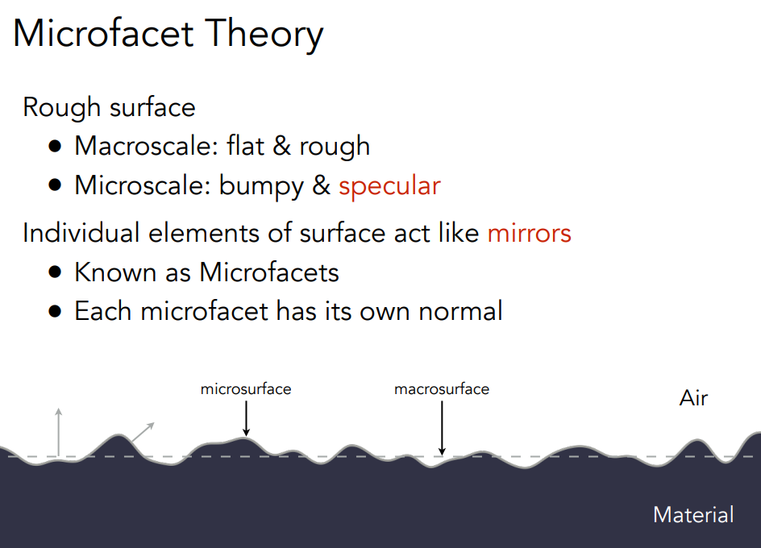

从近处看：很多微小的镜面，每个微表面有自己的法线

从远处看：是一个平的

微表面模型认为从远处看看到的是材质，从近处看看到的是几何。

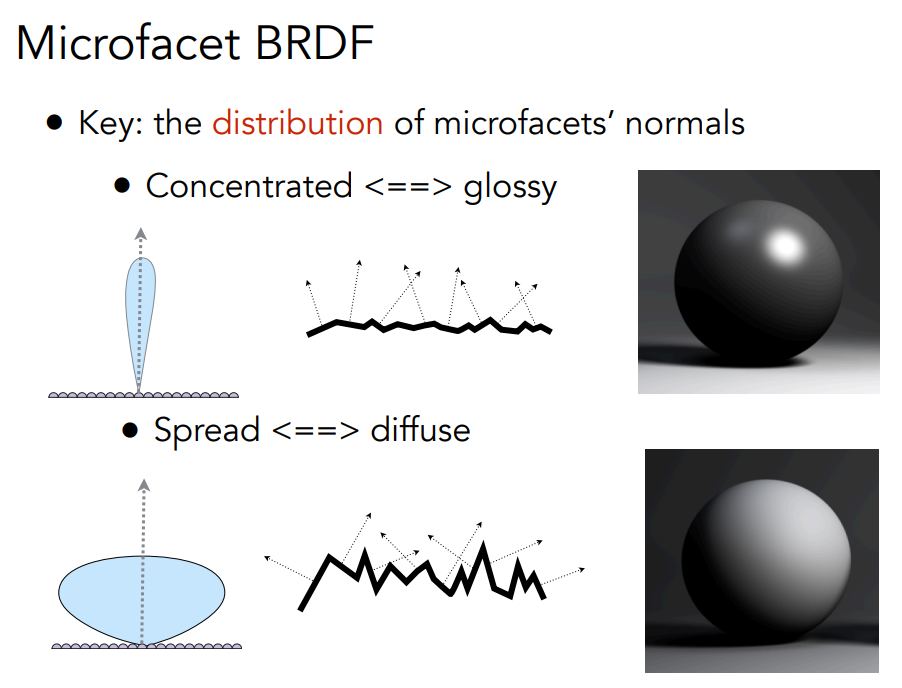

如图所示，如果微表面的法向分布与宏观法线相近，那么看起来材质就是一个glossy

如果微表面的法向分布相对于宏观法线很分散，那么看起来材质就是一个diffuse

通过微表面模型，可以把表面的粗糙层度用微表面的法线分布来表示。

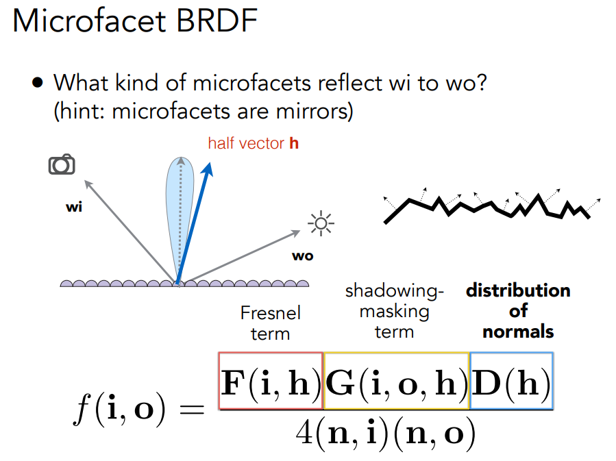

D 项：法线分布函数

G 项：几何遮蔽函数

 F 项：菲涅尔方程

给定入射方向和出射方向，有一个half vector。那么现在就需要：有多少微表面能将光从入射方向反射到出射方向去。只有当微表面的法线方向和half vector一致时才能将入射方向反射到出射方向去。

那在所有的分布中有多少微表面的法线方向朝着half vector呢？这就是$D(h)$

而$F(i,h)$就是菲涅尔项

$G(i,o,h)$又叫几何项，微表面之间很有可能发生互相遮挡。

有一些微表面失去了作用，一些反射的光被挡住了。这就是shadowing-masking。

当光线方向或观察方向非常接近Greeing Angle，那么遮挡情况就会发生。

微表面模型有很多类型

# 材质分类

各项同性材质

各向异性材质

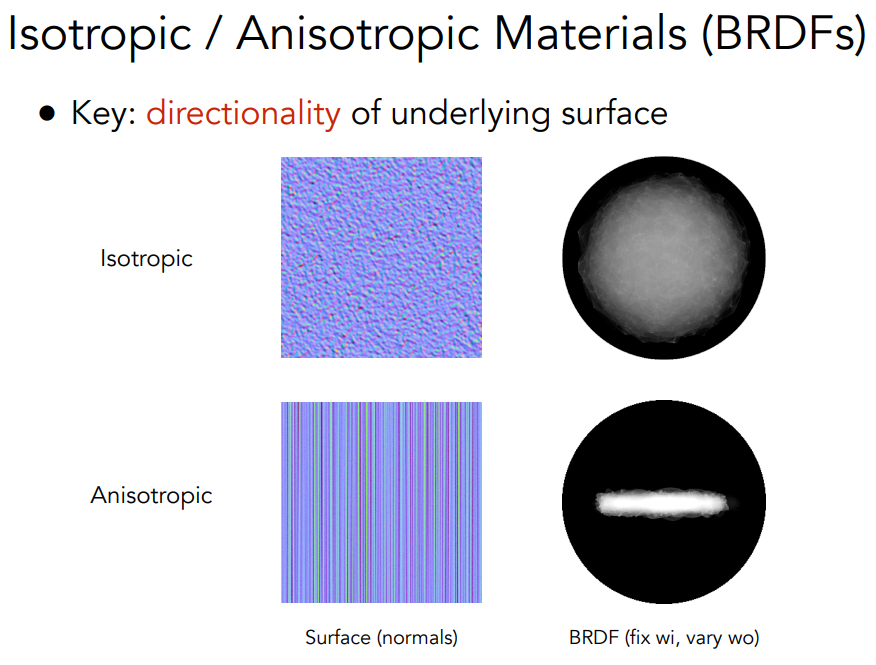

各向异性BRDF不满足在方位角上旋转看到的是相同的BRDF

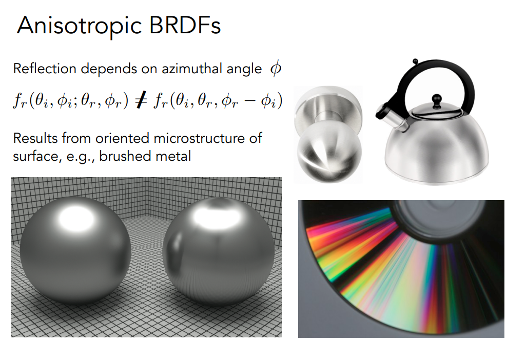

# BRDF的性质

- 非负性
- 线性性质

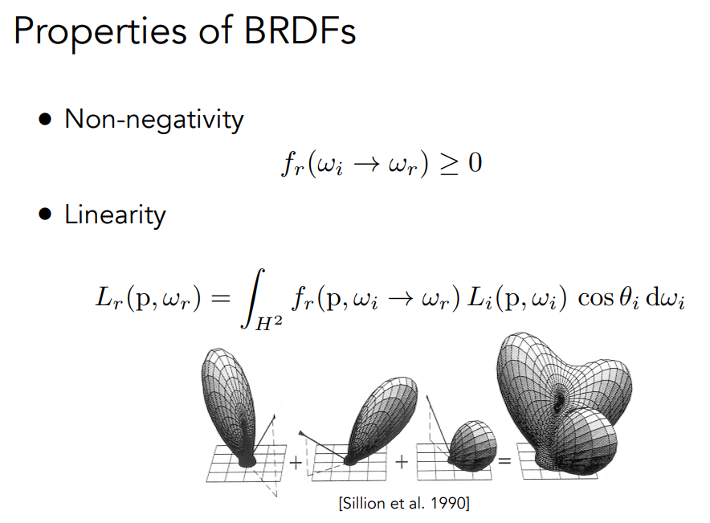

- 可逆性：交换入射方与出射方的角色得到的BRDF一定是一样的。

- 能量守恒

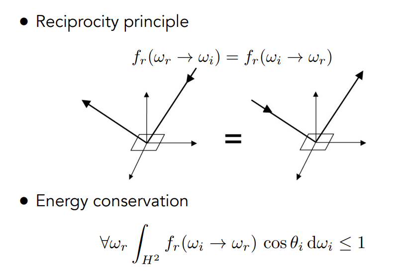

如果不满足这个性质在路径追踪时会能量爆炸而不是收敛

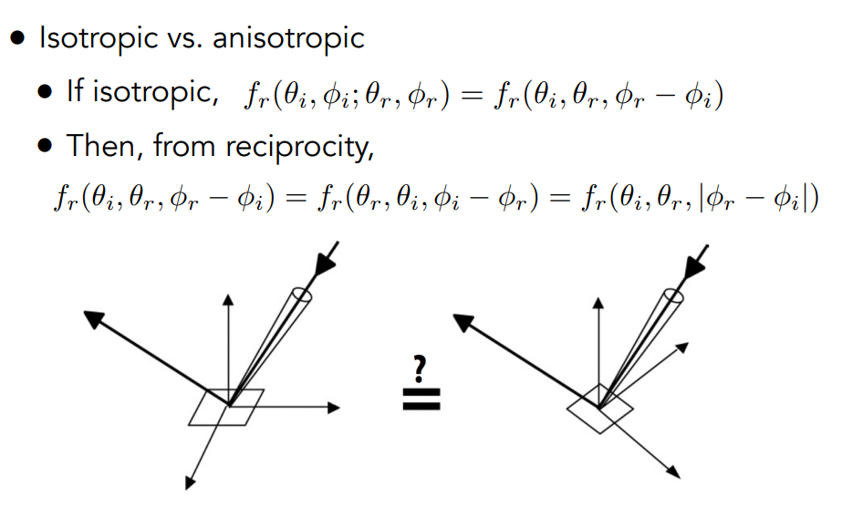

各向同性：BRDF的值只与相对的方位角有关

# 测量BRDF

...

MERL BRDF DataBase

# 在渲染管线中

Phong 模型通常只需要一张 **Diffuse Map（漫反射贴图）** 和一张 **Specular Map（高光贴图）**。而 PBR 为了实现真实的物理效果，通常需要一套 **PBR 贴图序列**（常说的 PBR Workflow）：

核心纹理及其对应关系

在着色器计算时，你会通过 `texture()` 函数查询以下纹理：

- **Albedo / Base Color（基础色贴图）**：对应渲染方程中的 $c$。它不包含任何光照信息（如阴影或高光），只记录材质本来的颜色。
- **Normal Map（法线贴图）**：对应渲染方程中的法线 $n$。用于在微观层面改变表面的朝向，产生凹凸感，这直接影响 **D 项（NDF）** 的计算。
- **Roughness / Glossiness（粗糙度贴图）**：对应 **D 项** 和 **G 项**。决定高光是尖锐的一个点还是模糊的一片。
- **Metallic（金属度贴图）**：对应 **F 项（菲涅尔）**。决定哪些区域像金属（高反射、有色高光），哪些区域像电介质（低反射、白色高光）。
- **AO (Ambient Occlusion，环境光遮蔽)**：虽然不是渲染方程的核心项，但常用于在片元阶段增强褶皱处的阴影细节。