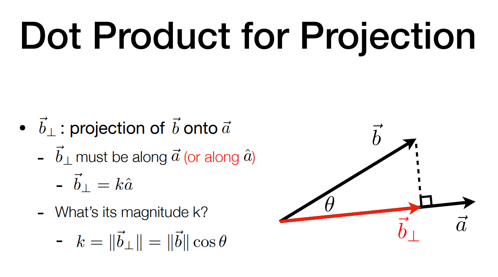
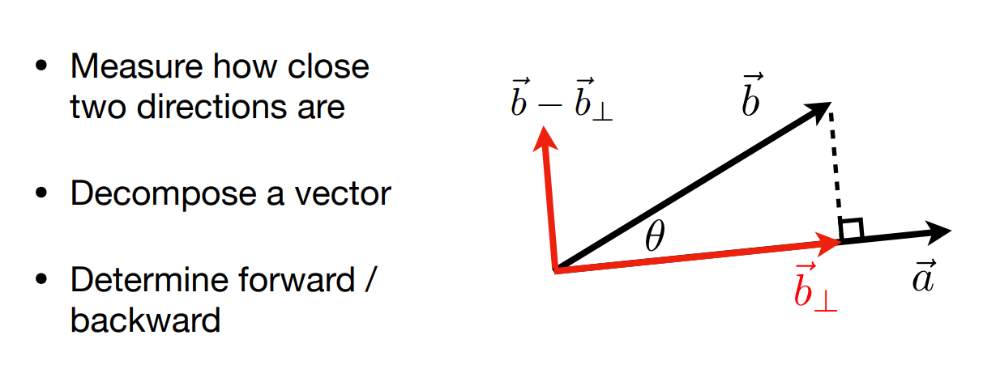
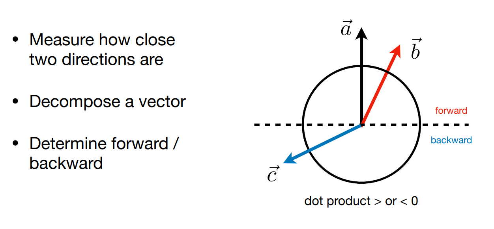
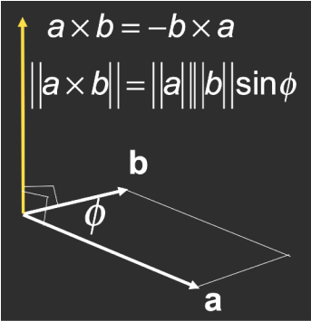
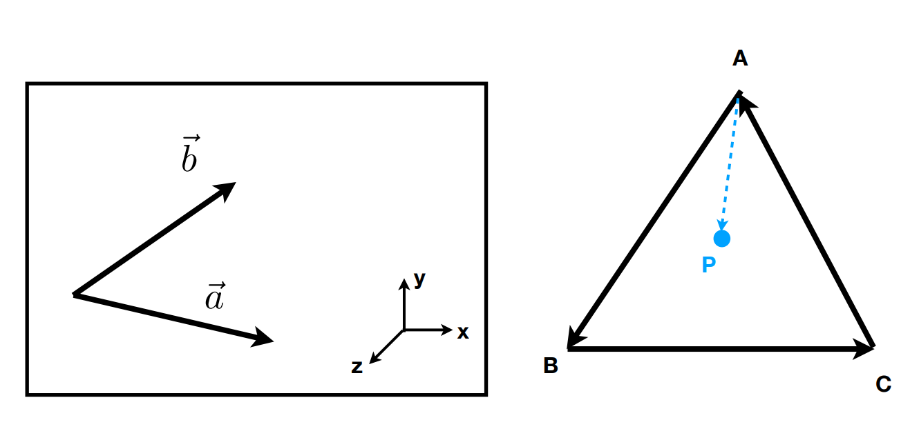

# 图形学中点乘的作用

$$
\begin{aligned}
\vec{a} \cdot \vec{b} &= \|\vec{a}\| \|\vec{b}\| \cos\theta
\\
\cos\theta &= \frac{\vec{a} \cdot \vec{b}}{\|\vec{a}\| \|\vec{b}\|}
\end{aligned}
$$

符合乘法律
$$
\begin{aligned}
\vec{a} \cdot \vec{b} &= \vec{b} \cdot \vec{a} \\
\vec{a} \cdot (\vec{b} + \vec{c}) &= \vec{a} \cdot \vec{b} + \vec{a} \cdot \vec{c} \\
(k\vec{a}) \cdot \vec{b} &= \vec{a} \cdot (k\vec{b}) = k(\vec{a} \cdot \vec{b})
\end{aligned}
$$

## 2D 向量点积
$$
\vec{a} \cdot \vec{b} = \begin{pmatrix} x_a \\ y_a \end{pmatrix} \cdot \begin{pmatrix} x_b \\ y_b \end{pmatrix} = x_a x_b + y_a y_b
$$

## 3D 向量点积
$$
\vec{a} \cdot \vec{b} = \begin{pmatrix} x_a \\ y_a \\ z_a \end{pmatrix} \cdot \begin{pmatrix} x_b \\ y_b \\ z_b \end{pmatrix} = x_a x_b + y_a y_b + z_a z_b
$$

## 快速得到夹角

直接计算得到cosθ

## 找到一个向量在另一个向量上的投影

## 计算两个向量有多么接近

## 前与后的信息

方向基本一致

方向基本相反

方向垂直

# 图形学中叉乘的作用

向量叉乘的结果是向量

- 叉乘得到的向量同时垂直于a向量和b向量
- 叉乘结果根据右手螺旋定则
- 用来构建右手坐标系

$$
\begin{aligned}
&\vec{x} \times \vec{y} = +\vec{z} \\
&\vec{y} \times \vec{x} = -\vec{z} \\
&\vec{y} \times \vec{z} = +\vec{x} \\
&\vec{z} \times \vec{y} = -\vec{x} \\
&\vec{z} \times \vec{x} = +\vec{y} \\
&\vec{x} \times \vec{z} = -\vec{y} \\[6pt]
&\vec{a} \times \vec{b} = -\vec{b} \times \vec{a} \\
&\vec{a} \times \vec{a} = \vec{0} \\
&\vec{a} \times (\vec{b} + \vec{c}) = \vec{a} \times \vec{b} + \vec{a} \times \vec{c} \\
&\vec{a} \times (k\vec{b}) = k(\vec{a} \times \vec{b})
\end{aligned}
$$

在代数上

**向量叉乘的两种表达式：**

分量计算式
$$
\vec{a} \times \vec{b} = \begin{pmatrix}
y_a z_b - y_b z_a \\[6pt]
z_a x_b - x_a z_b \\[6pt]
x_a y_b - y_a x_b
\end{pmatrix}
$$

矩阵表示式
$$
\vec{a} \times \vec{b} = A^* b = 
\begin{pmatrix}
0 & -z_a & y_a \\
z_a & 0 & -x_a \\
-y_a & x_a & 0
\end{pmatrix}
\begin{pmatrix}
x_b \\
y_b \\
z_b
\end{pmatrix}
$$

## 判断左和右

a叉乘b与z轴方向相同 a在b的右侧

b叉乘a与z轴方向相反 b在a的左侧

## 判断内和外

AB叉乘AP P在边AB左边

BC叉乘BP P在边BC左边

CA叉乘CP P在边CA左边

立刻判断P是否在ABC内部

若三角形的三个点按顺时针排列 那就判断是否都在右边

对于任意一个3D点
$$
\|\vec{u}\| = \|\vec{v}\| = \|\vec{w}\| = 1
$$

$$
\vec{u} \cdot \vec{v} = \vec{v} \cdot \vec{w} = \vec{u} \cdot \vec{w} = 0
$$

$$
\vec{w} = \vec{u} \times \vec{v} \quad \text{(right-handed)}
$$

$$
\vec{p} = (\vec{p} \cdot \vec{u})\vec{u} + (\vec{p} \cdot \vec{v})\vec{v} + (\vec{p} \cdot \vec{w})\vec{w} \quad \text{(projection)}
$$

# 矩阵

矩阵表示各种线性变化

（除了考研线代最后一章二次型表示了二次曲面）

具体理解细看3blue1brown《线性代数的本质》

矩阵算法对交换律没用

AB和BA是不同的矩阵
$$
\begin{aligned}
AB &\neq BA \\
(AB)C &= A(BC) \\
A(B+C) &= AB + AC \\
(A+B)C &= AC + BC
\end{aligned}
$$

$$
I_{3\times 3} = \begin{pmatrix}
1 & 0 & 0 \\
0 & 1 & 0 \\
0 & 0 & 1
\end{pmatrix}
$$

$$
(AB)^{T}=B^{T}A^{T}
$$

$$
AA^{-1} = A^{-1}A = I
$$

$$
(AB)^{-1} = B^{-1}A^{-1}
$$

**这些公式将矩阵看为线性变化就很好理解了**

## 矩阵表示点乘

$$
\vec{a} \cdot \vec{b} = \vec{a}^{T} \vec{b}
$$

$$
= \begin{pmatrix} x_a & y_a & z_a \end{pmatrix} \begin{pmatrix} x_b \\ y_b \\ z_b \end{pmatrix} = \begin{pmatrix} x_a x_b + y_a y_b + z_a z_b \end{pmatrix}
$$

## 叉乘表示点乘

$$
\vec{a} \times \vec{b} = A^{*} b = \begin{pmatrix} 0 & -z_a & y_a \\ z_a & 0 & -x_a \\ -y_a & x_a & 0 \end{pmatrix} \begin{pmatrix} x_b \\ y_b \\ z_b \end{pmatrix}
$$