# Scale

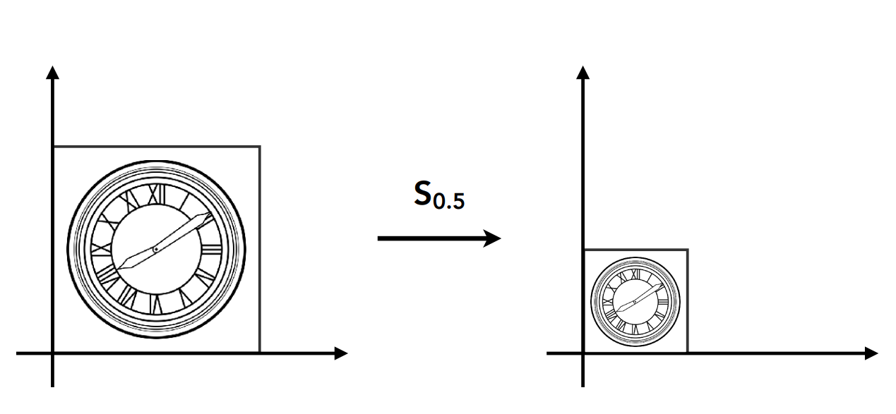

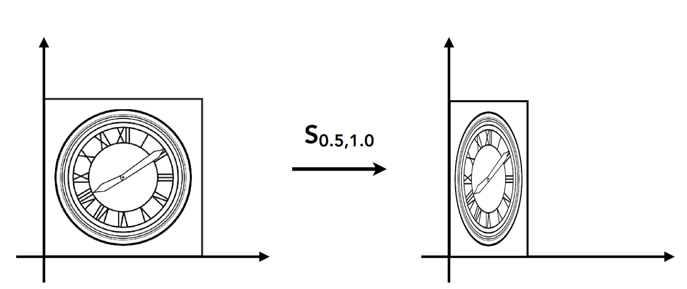

$$
x^{\prime}=s_xx
$$

$$
y^{\prime}=s_yy
$$

$$
\left[\begin{array}{l}
x^{\prime} \\
y^{\prime}
\end{array}\right] = 
\left[\begin{array}{ll}
s_x & 0 \\
0 & s_y
\end{array}\right]
\left[\begin{array}{l}
x \\
y
\end{array}\right]
$$

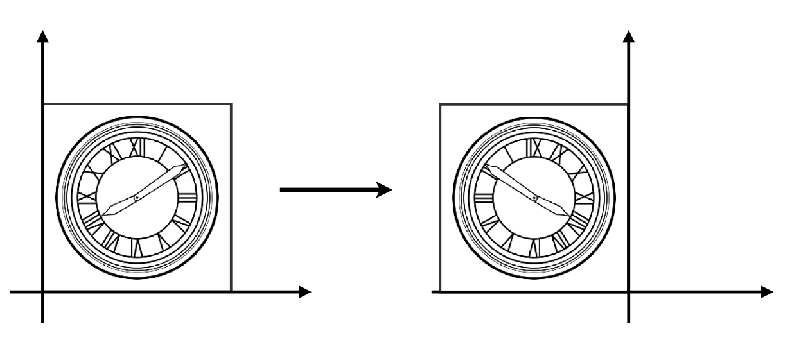
$$
x^{\prime}=-x\\
x^{\prime}=y\\

\left[\begin{array}{l}
x^{\prime} \\
y^{\prime}
\end{array}\right] = 
\left[\begin{array}{ll}
-1 & 0 \\
0 & 1
\end{array}\right]
\left[\begin{array}{l}
x \\
y
\end{array}\right]
$$

# Shear

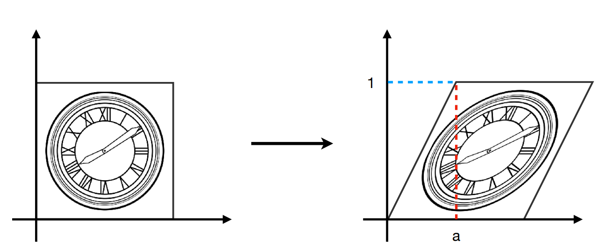

y=0时所有点x的移动方向都是0

y=1时所有点x的移动方向都是a

y=0.5时所有点x的移动方向都是a/2

y方向的移动始终为0
$$
\left[\begin{array}{l}
x^{\prime} \\
y^{\prime}
\end{array}\right] = 
\left[\begin{array}{ll}
1 & a \\
0 & 1
\end{array}\right]
\left[\begin{array}{l}
x \\
y
\end{array}\right]
$$

# Rotate

二维旋转默认以原点为中心逆时针旋转

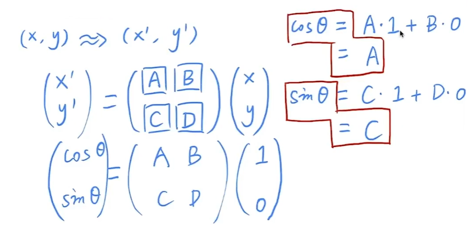

[1,0]旋转后是[conθ, sinθ]算出A和C

[0,1]旋转后是[-sinθ, cosθ]算出B和D

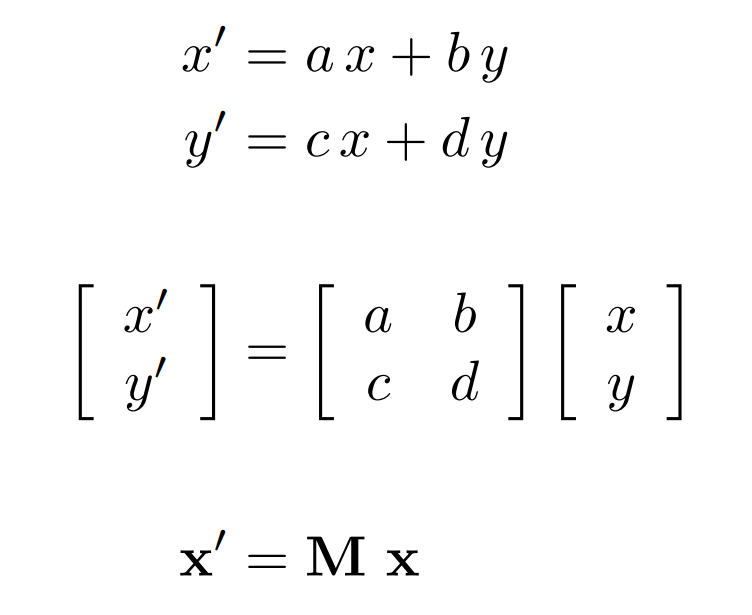

对于一个变化就使用一个矩阵

# 齐次坐标

对于平移变化，平移变化无法使用矩阵乘法表示

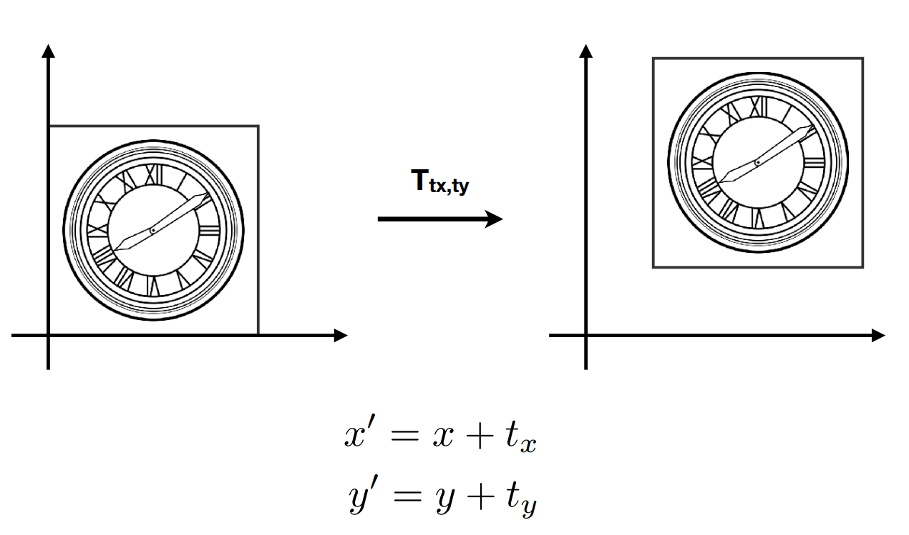

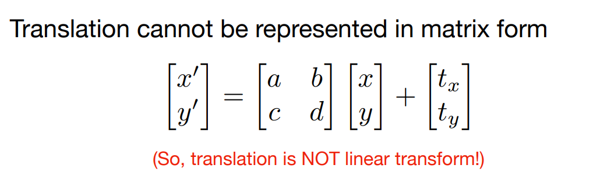

**为了把所有的变化都用矩阵表示**

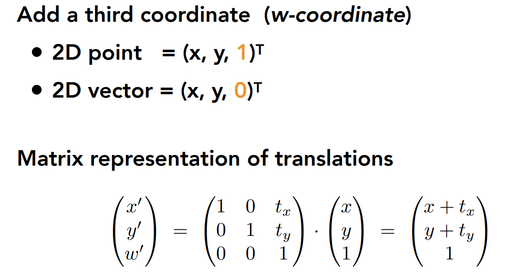

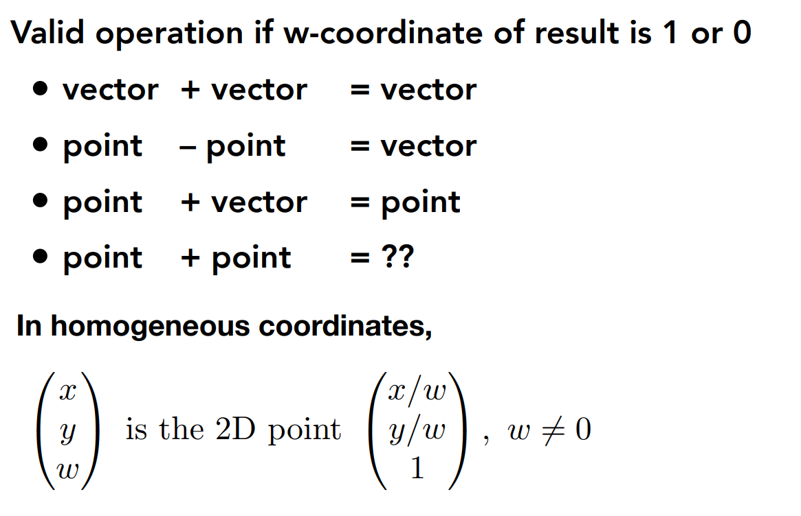

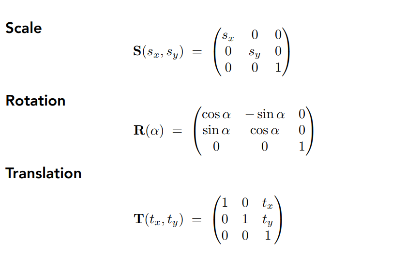

**从矩阵表示线性变化的角度来看，矩阵不符合交换律**

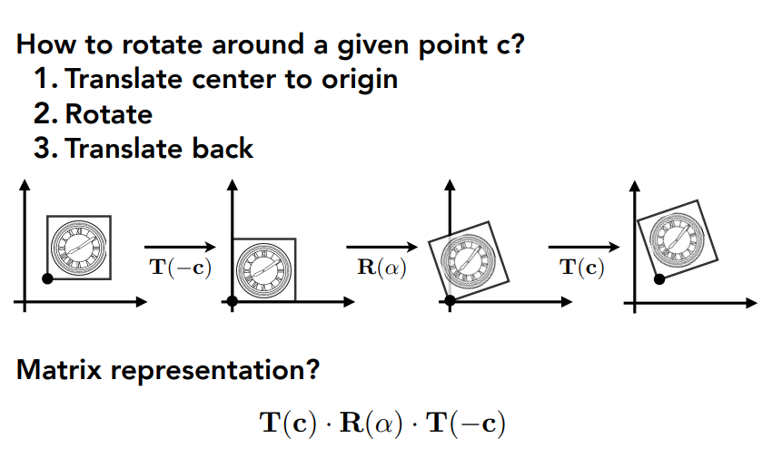

这个知识点直接对应考研中的相似矩阵
$$
P^{-1}AP=B \quad A相似B
$$
相似矩阵是同一线性变化的不同表示

## 三维的齐次坐标是相同的道理

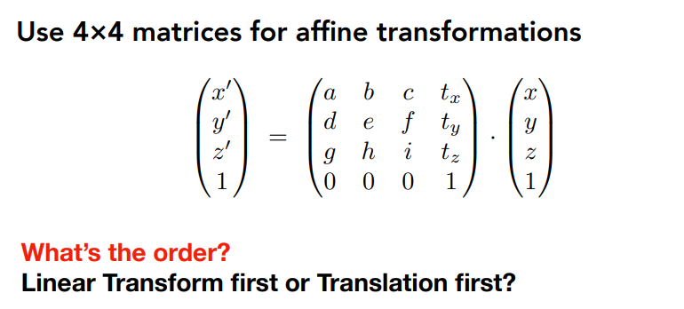

当然是先线性变化再平移
