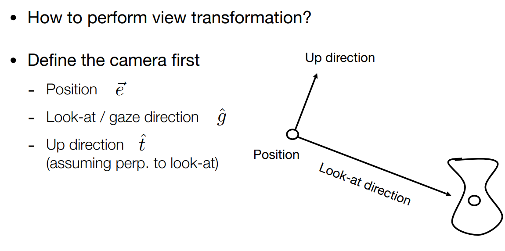
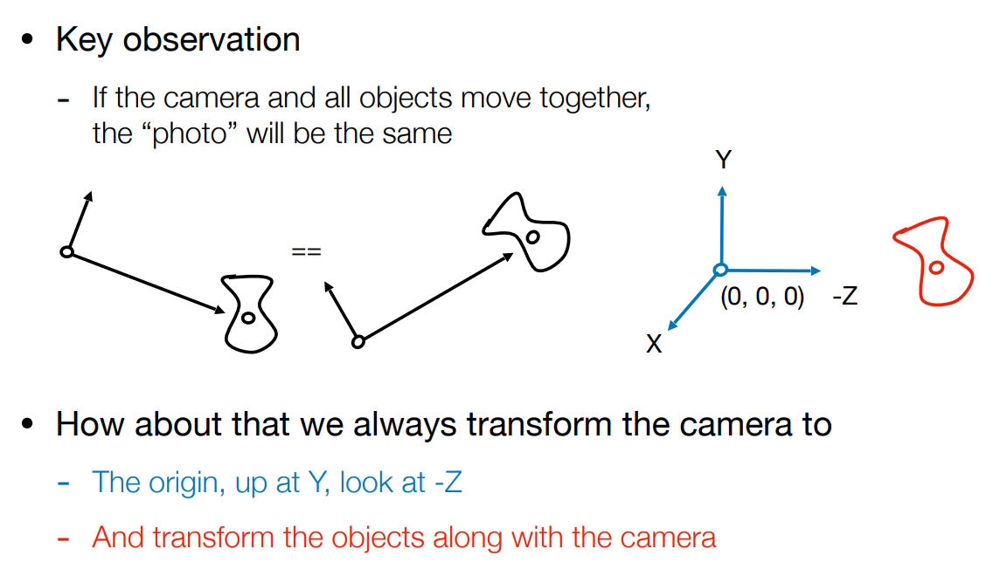
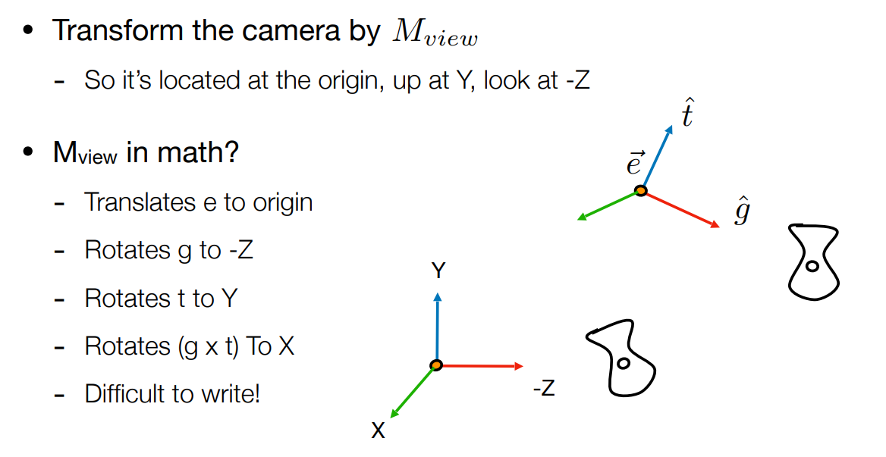
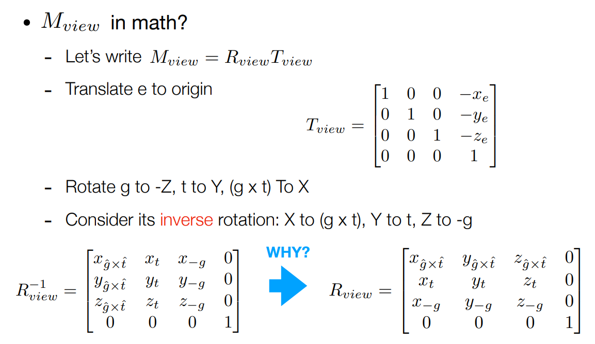
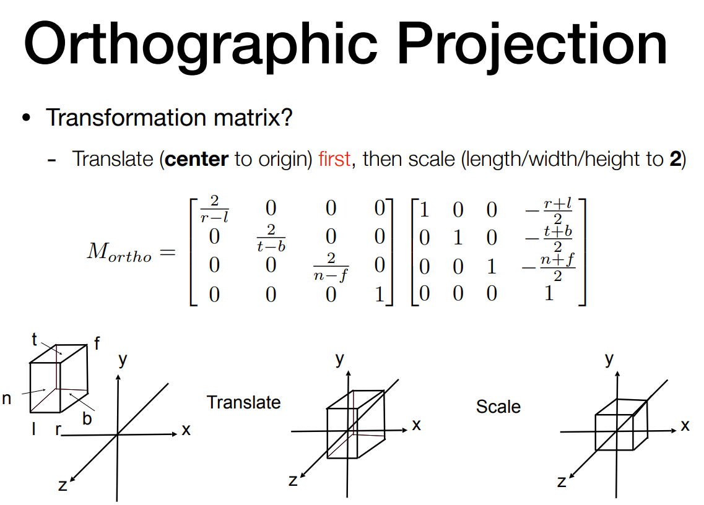
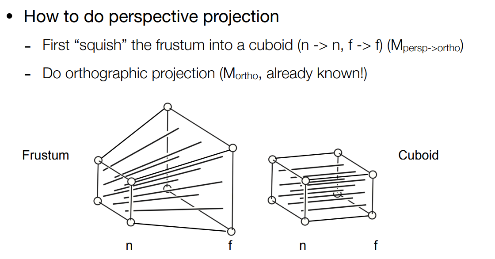

$$
R_{\theta}=\begin{pmatrix}
\cos\theta & -\sin\theta \\
\sin\theta & \cos\theta
\end{pmatrix}
$$

$$
R_{-\theta}=\begin{pmatrix}
\cos\theta & \sin\theta \\
-\sin\theta & \cos\theta
\end{pmatrix}=R_{\theta}^{\top}
$$

$$
R_{-\theta}=R_{\theta}^{-1} \quad \text{(by definition)}
$$

**通过定义来看 旋转矩阵的转置就是旋转矩阵的逆 所以旋转矩阵是一个正交矩阵**

**通过4x4矩阵来表示三维变化**
$$
\left(\begin{array}{c}
x^{\prime} \\
y^{\prime} \\
z^{\prime} \\
1
\end{array}\right)
=
\left(\begin{array}{cccc}
a & b & c & t_{x} \\
d & e & f & t_{y} \\
g & h & i & t_{z} \\
0 & 0 & 0 & 1
\end{array}\right)
\cdot
\left(\begin{array}{c}
x \\
y \\
z \\
1
\end{array}\right)
$$
当然也是先旋转再平移

# 三维空间中的绕轴旋转

$$
\mathbf{R}_{x}(\alpha) = 
\begin{pmatrix}
1 & 0 & 0 & 0 \\
0 & \cos\alpha & -\sin\alpha & 0 \\
0 & \sin\alpha & \cos\alpha & 0 \\
0 & 0 & 0 & 1
\end{pmatrix}
$$

$$
\mathbf{R}_{y}(\alpha) = 
\begin{pmatrix}
\cos\alpha & 0 & \sin\alpha & 0 \\
0 & 1 & 0 & 0 \\
-\sin\alpha & 0 & \cos\alpha & 0 \\
0 & 0 & 0 & 1
\end{pmatrix}
$$

$$
\mathbf{R}_{z}(\alpha) = 
\begin{pmatrix}
\cos\alpha & -\sin\alpha & 0 & 0 \\
\sin\alpha & \cos\alpha & 0 & 0 \\
0 & 0 & 1 & 0 \\
0 & 0 & 0 & 1
\end{pmatrix}
$$

## 为什么关于y轴的不一样？

**因为叉乘：**

- 对于x轴：y叉乘z得到x
- 对于z轴：x叉乘y得到z
- 但对于y轴：z叉乘x得到y

# 罗德里格斯旋转公式

绕任意单位轴 **n** 旋转角度 **α** 的旋转矩阵公式：

$$
\mathbf{R}(\mathbf{n},\alpha) = 
\cos (\alpha) \, \mathbf{I} 
+ (1-\cos (\alpha)) \, \mathbf{n} \mathbf{n}^{T} 
+ \sin (\alpha) \, 
\underbrace{
\begin{bmatrix}
0 & -n_{z} & n_{y} \\
n_{z} & 0 & -n_{x} \\
-n_{y} & n_{x} & 0
\end{bmatrix}
}_{\mathbf{N}}
$$

四元数的乘法法则为什么是这样？
四元数作用于向量旋转时 非常像相似矩阵的形式 假设P-1AP=B 我们会说A和B相似 P可能是基变化 而放在四元素旋转中 旋转后的向量和原来的向量仍然是相似的？只不过变化矩阵不再是基变化 而是到虚数空间 再到实数空间的变化？

# 四元数

# View/Camera Transformation

$$R_{view}^{-1}$$非常好写，而旋转矩阵的逆矩阵等于它的转置，所以将相机旋转回原点也非常好写。

# Projection Transformation

正交投影并不会带来近大远小的情况

## 正交投影

因为坐标系的问题 越远的地方z坐标值越小

## 透视投影

在齐次坐标中(x,y,z,1)和(kx,ky,kz,k*k)表示的是同一个点，所以(zx,zy,zz,z!=0)表示的也是这个点。

在**挤压**的过程中规定：近平面永远不变，远处平面的z值不变。远平面的中心点也不会发生变化。