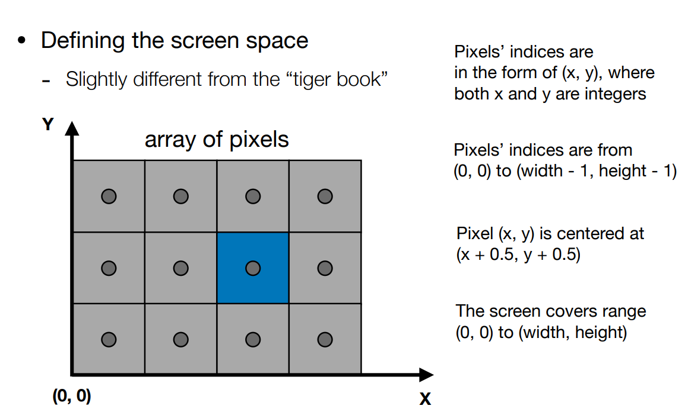
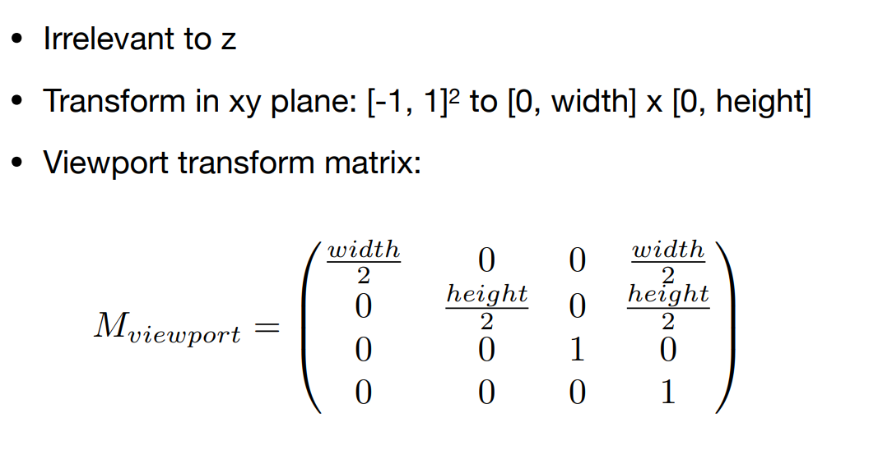
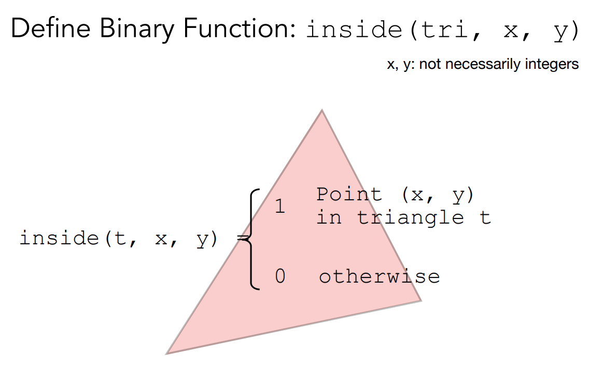
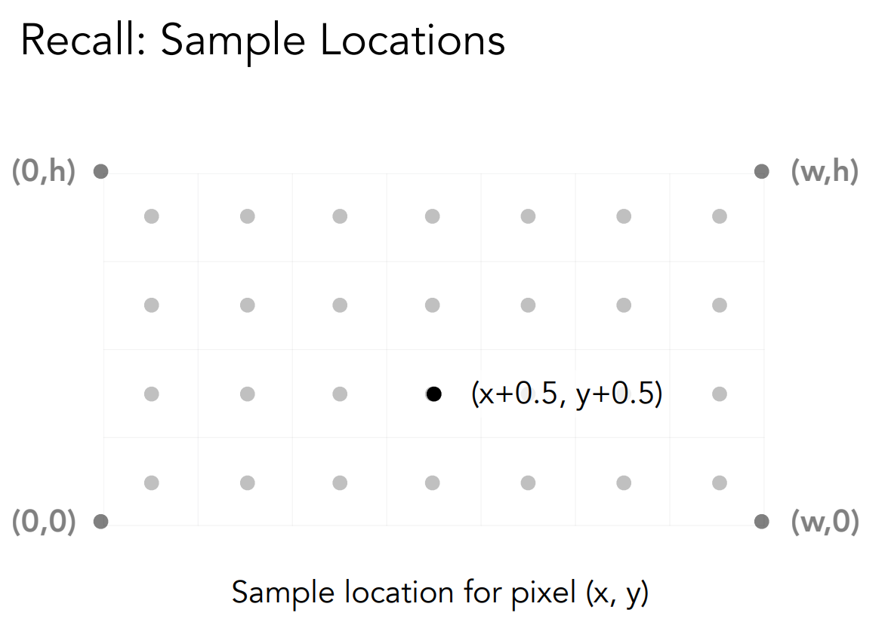
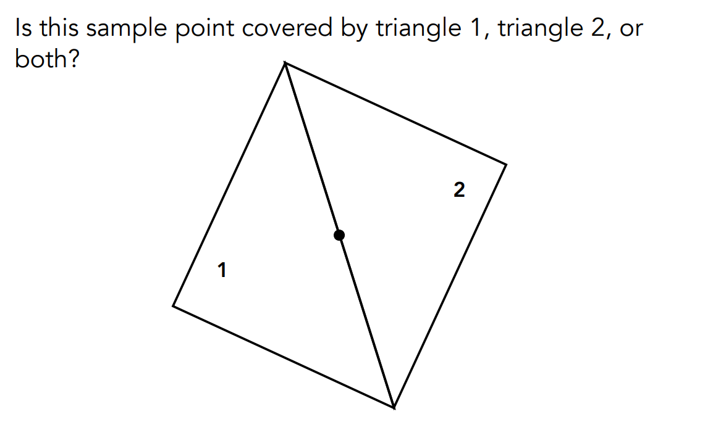
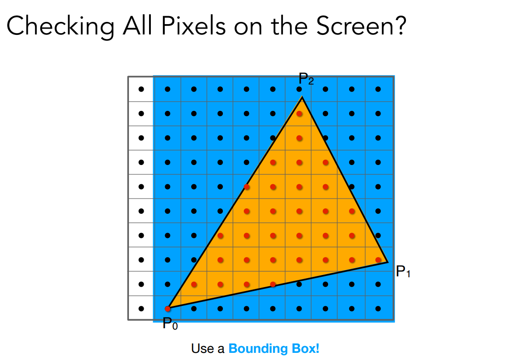
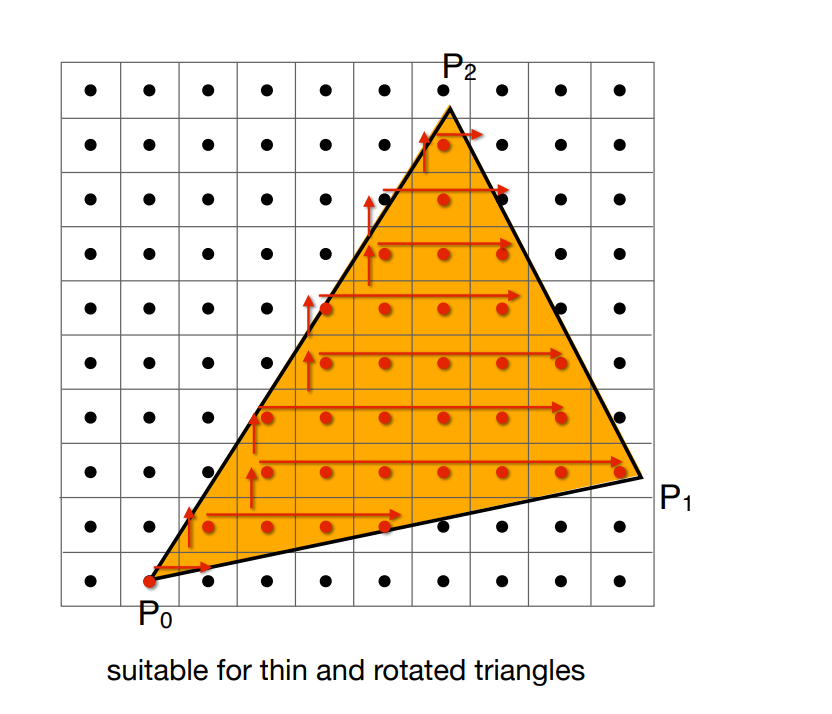
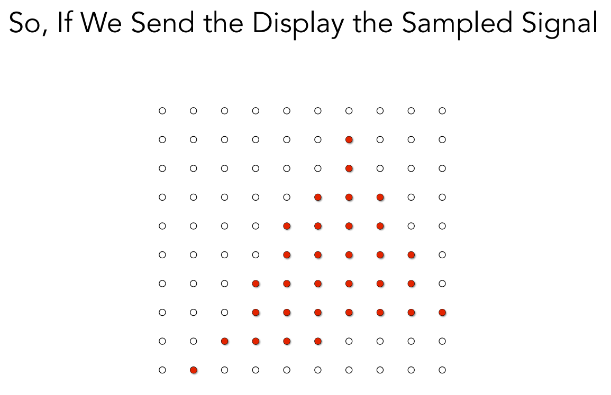
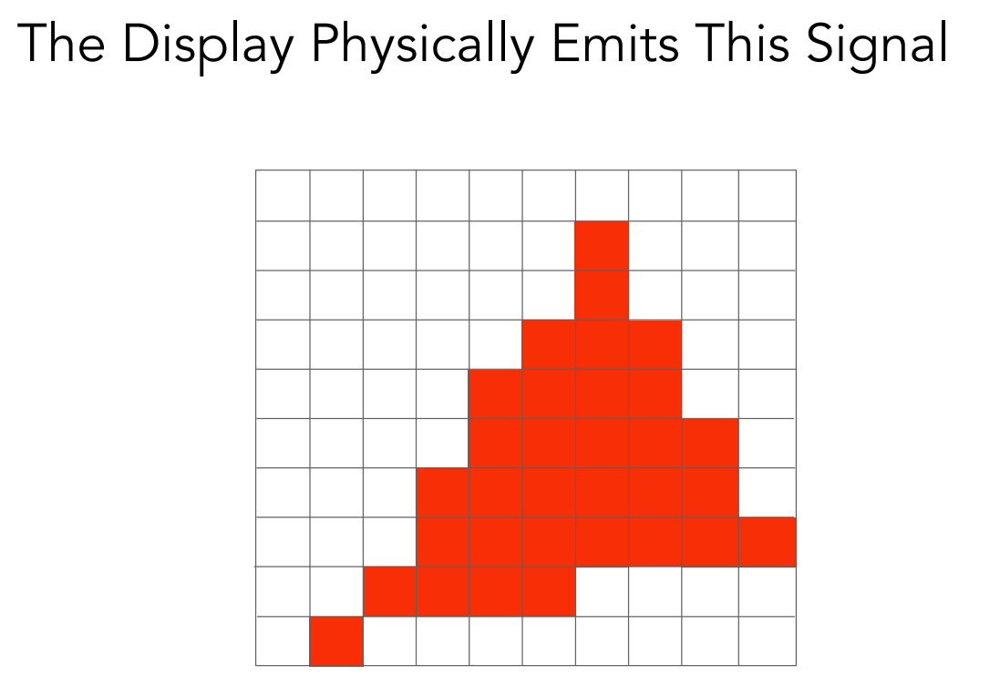
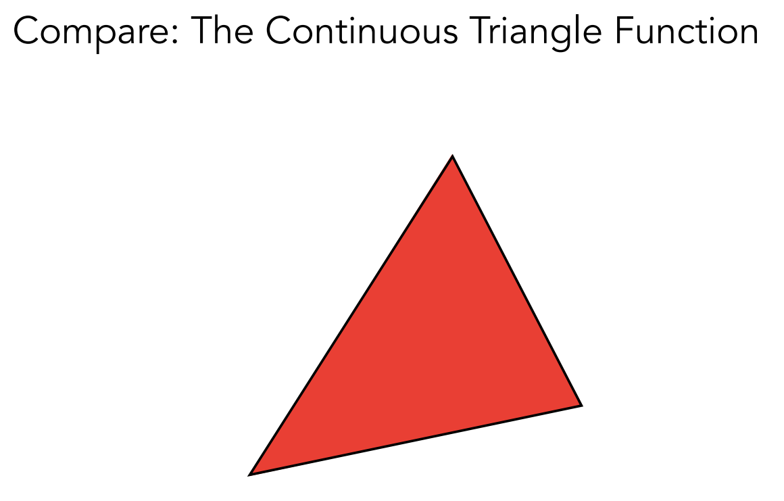

MVP变化之后将物体显示在屏幕上，屏幕：一系列二维数组，元素是像素。

MVP变化之后的视口变化

## 采样

采样就是将函数离散化的过程

~~~c++
for(int x = 0; x < xmax; ++x)
    output[x] = f(x);
~~~

光栅化就是用像素中心对屏幕采样

定义一个函数：是否在三角形内

像素的逻辑序号是整数，但中心要加0.5

~~~c++
for(int x = 0; x < xmax; ++x)
    for(int y = 0;y < ymax; ++y)
        image[x][y] = inside(tri, y+0.5, x+0.5);
~~~

inside的标准按照之前用三角形三条边向量叉乘方向来判断

边界上算不算按自己定义

## 加速判断

### 包围盒

不需要对屏幕的所有像素判断，只需要在该三角形包围盒内判断即可。

### 每一行从最左到最右判断

这种情况适合窄长的三角形

## 采样展示

锯齿的原因：像素本身有大小，采样率对信号本身是不够高的。