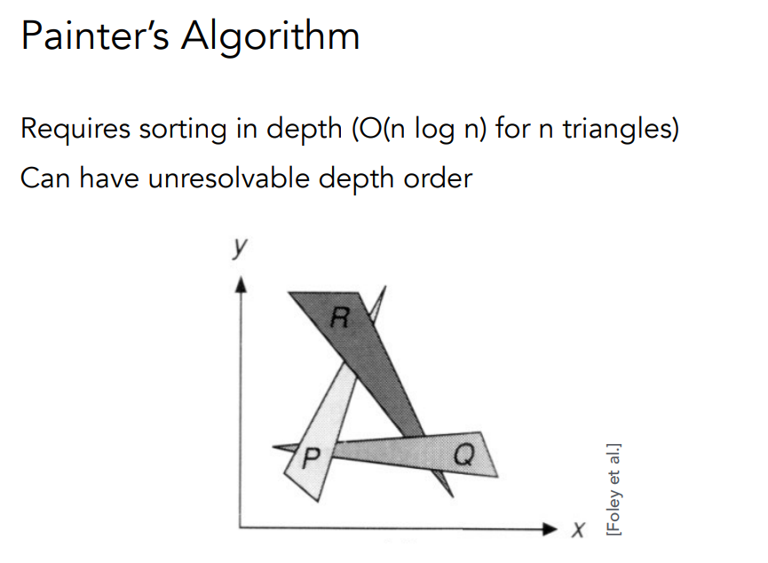
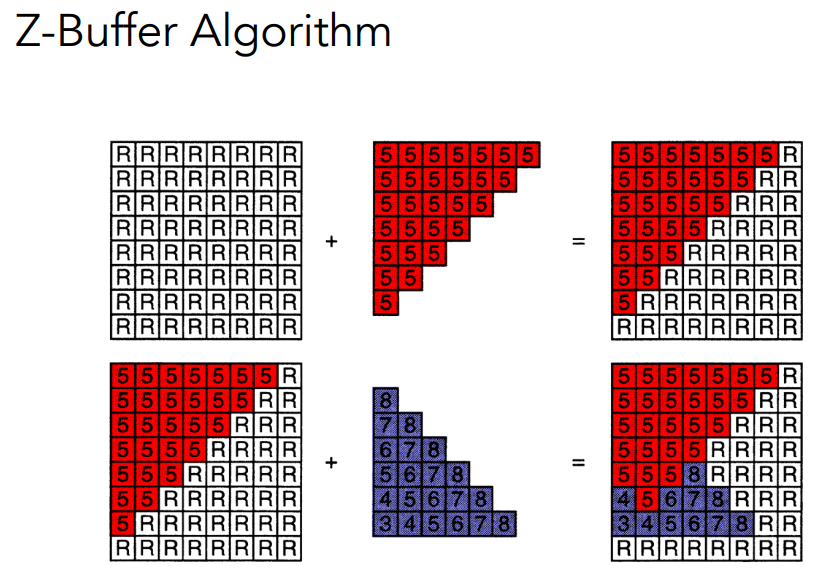
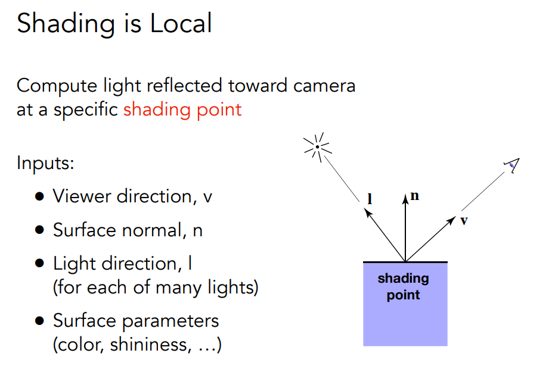
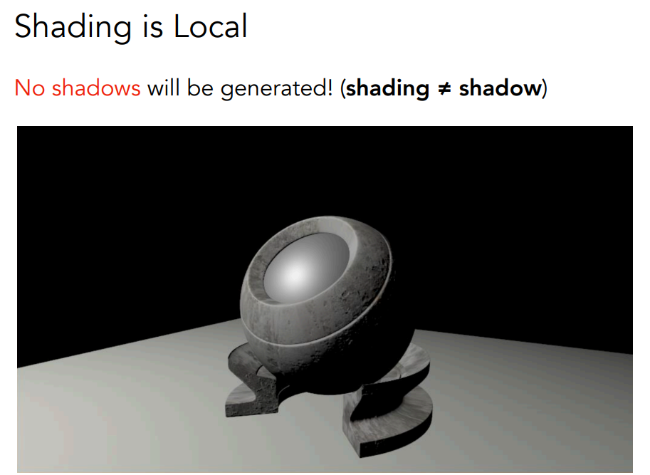
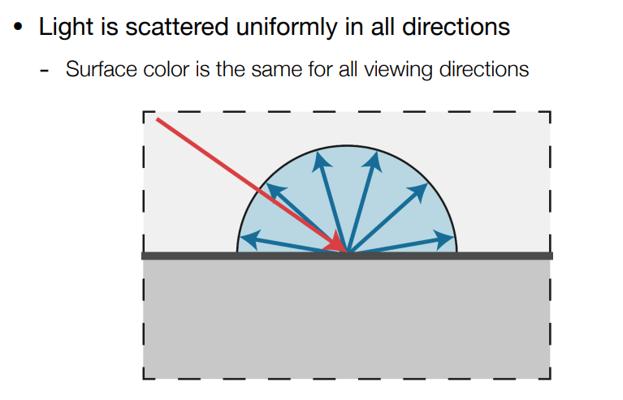
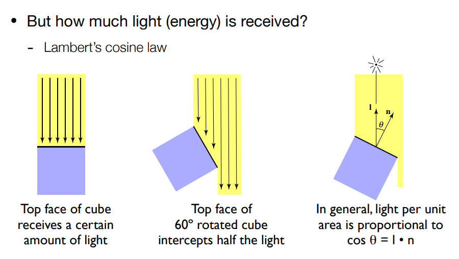
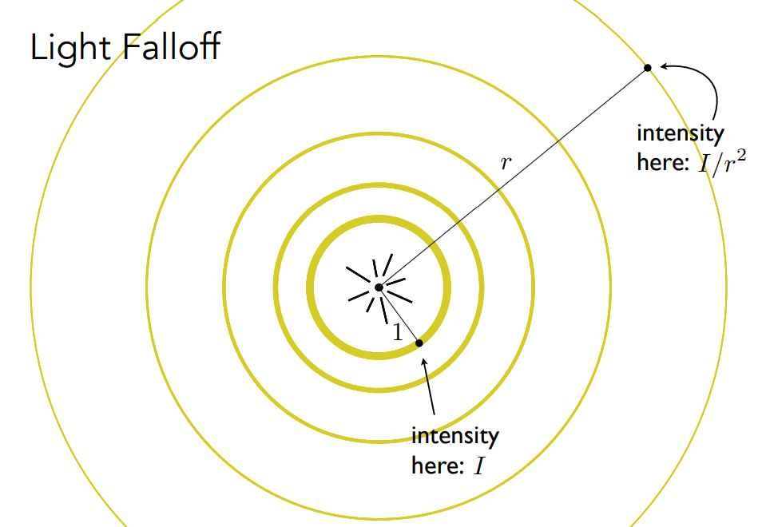
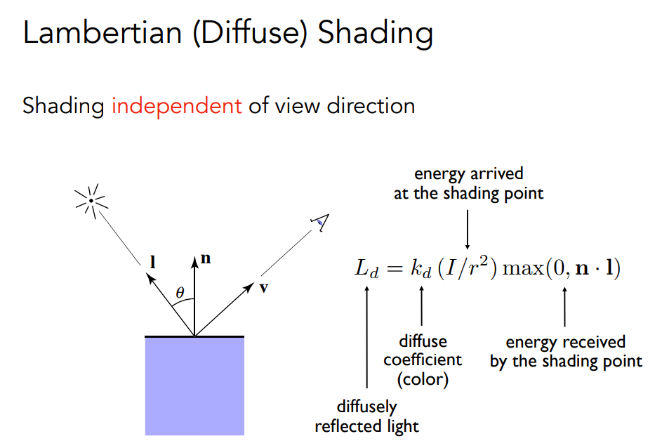

## Z-Buffer

如何确定物体是否被遮挡？

**画家算法：**（油画）先画远处的东西，再画近处的东西。

 

但画家算法无法处理这种情况，于是有了Z-buffer。

**此处暂时规定z越大越远，越小越近**

在光栅化图像时，同时保留一个深度图像。

初始深度为无穷大∞

~~~c++
for(each triangle T)
    for(each sample(x,y,z) in T)
        if(z < zbuffer[x,y])
            framebuffer[x,y]=rgb;	//update color
			zbuffer[x,y]=z;		//update depth
		else
~~~

对于n个三角形来说(三角形覆盖常数个像素)，这个算法的时间复杂度为$O(n)$。

但理论上排序算法的时间复杂度不是$O(nlog_2(n))$吗？

其实该算法没有排序，三角形的顺序不影响结果。

**zbuffer处理不了透明物体**

# Shading(着色)

## Blinn-Phong反射模型

着色具有局部性

着色具有局部性 所以没有阴影

### 漫反射

单位面积接受到的能力与夹角余弦成正比

光源在任何时候发出的能量都是相同的 球壳越大某点能力越小
$$
4\pi I=4\pi I_rr^2\to
I_r=I/r^2
$$
说明能量强度与半径平方成反比
$$
L_d = k_d \frac{I}{r^2} \max(0, \mathbf{n} \cdot \mathbf{l})
$$

**漫反射与观察方向没有关系**，只考虑光线与法线的夹角。

所以这个公式里和v没有任何关系，只和入射光线有关系。
