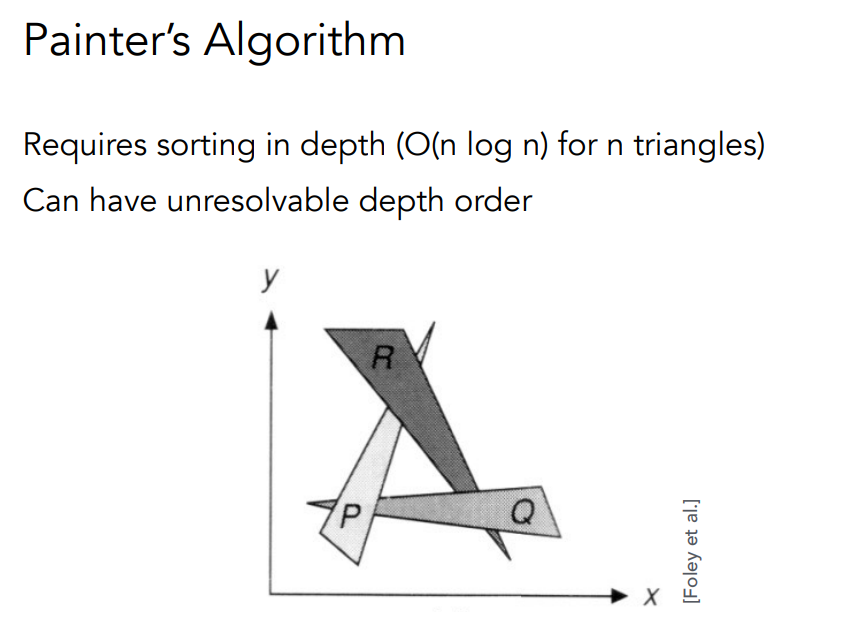
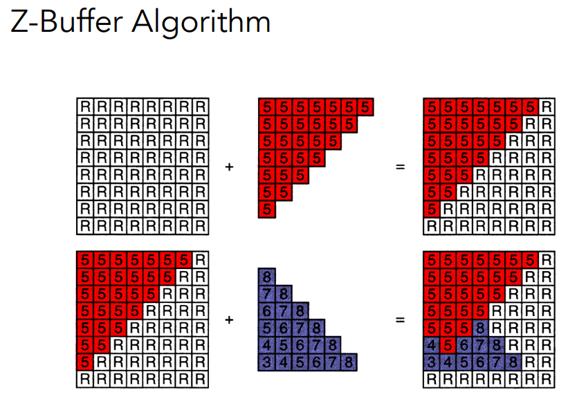
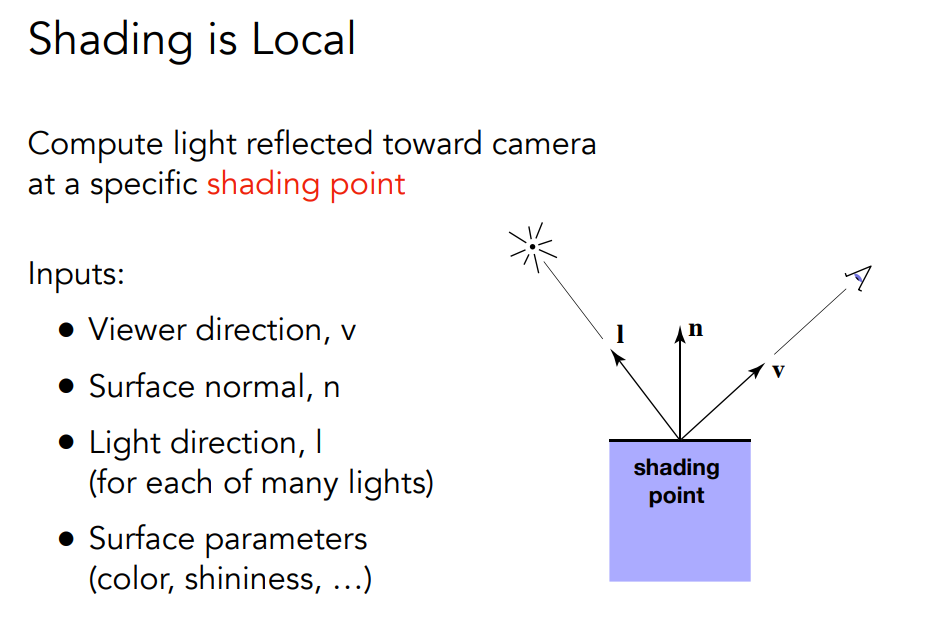
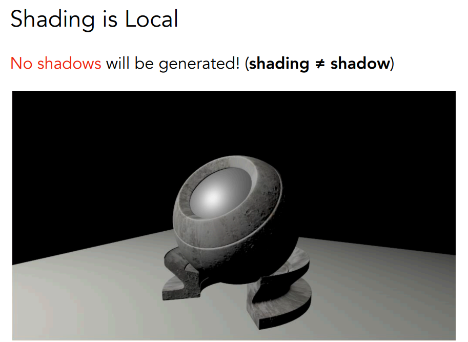
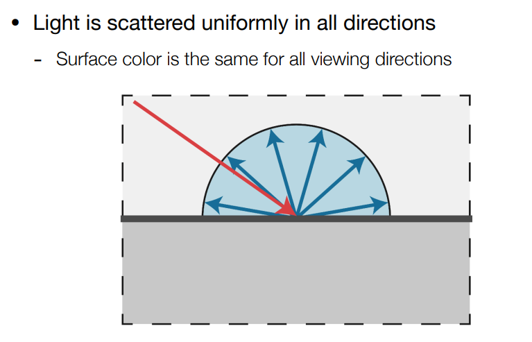
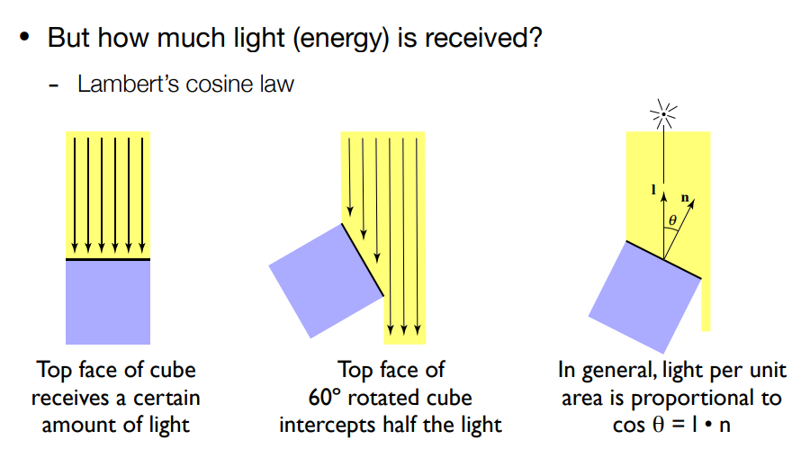
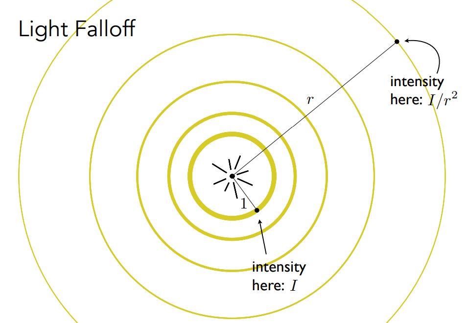
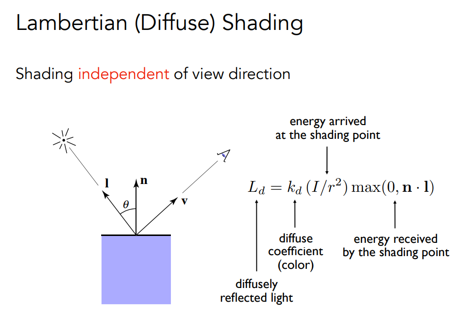

## Z-Buffer

如何确定物体是否被遮挡？

**画家算法：**（油画）先画远处的东西，再画近处的东西。

 

但画家算法无法处理这种情况，于是有了Z-buffer。

**此处暂时规定z越大越远，越小越近**

在光栅化图像时，同时保留一个深度图像。

初始深度为无穷大∞

~~~c++
for(each triangle T)
    for(each sample(x,y,z) in T)
        if(z < zbuffer[x,y])
            framebuffer[x,y]=rgb;	//update color
			zbuffer[x,y]=z;		//update depth
		else
~~~

对于n个三角形来说(三角形覆盖常数个像素)，这个算法的时间复杂度为$O(n)$。

但理论上排序算法的时间复杂度不是$O(nlog_2(n))$吗？

其实该算法没有排序，三角形的顺序不影响结果。

**zbuffer处理不了透明物体**

# Shading(着色)

## Phong模型

Blinn-Phong模型是对经典Phong光照模型的一种改进与优化。它们在计算环境光（Ambient）和漫反射（Diffuse）时的逻辑是完全相同的，核心区别在于**镜面高光的计算方式**。

Phong模型基于**反射向量**与**观察向量**的夹角来计算高光，而Blinn-Phong模型则引入了**半程向量**，基于它与**法线向量**的夹角来计算高光。

#### Phong 模型：基于反射向量 $R$

Phong模型认为，最强的高光应该出现在观察方向刚好等于光线反射方向的时候。因此，它需要先计算光线 $L$ 围绕法线 $N$ 的反射向量 $R$：

$L$：指向光源的向量

$V$：指向观察者（相机）的向量

$N$：表面法线向量

$$R = 2(N \cdot L)N - L$$

然后，计算反射向量 $R$ 与观察向量 $V$ 的点乘（即夹角的余弦值），并对其取指数 $\alpha$（Shininess，高光指数）：

$$I_{phong} = k_s \cdot \max(0, R \cdot V)^\alpha$$

#### Blinn-Phong 模型：基于半程向量 $H$

计算反射向量 $R$ 涉及到较多的乘法和加法运算。Jim Blinn 提出了一种极其巧妙的近似方法：引入光源向量 $L$ 和观察向量 $V$ 之间的**半程向量 $H$**：

$$H = \frac{L + V}{\|L + V\|}$$因为L与V已经被归一化了，根据菱形对角线原则，加一并归一化即可。

如果观察方向正好等于反射方向，那么半程向量 $H$ 就会和法线 $N$ 完全重合。因此，Blinn-Phong 利用法线 $N$ 和半程向量 $H$ 的夹角来近似替代 Phong 模型中的夹角：

$$I_{blinn} = k_s \cdot \max(0, N \cdot H)^\beta$$

**计算性能与效率：** 计算半程向量 $H$ 只需要简单的向量加法和一次归一化操作，这通常比计算反射向量 $R$ 更快。尤其是在早期固定管线时代，如果光源和观察者都在无穷远处（方向光+正交相机），$L$ 和 $V$ 都是常数，那么 $H$ 也是一个可以在顶点着色器甚至CPU中预计算的常数，极大地节省了计算开销。

**高光断层问题：**

在 Phong 模型中，当观察角度非常倾斜（掠射角）时，$V$ 和 $R$ 的夹角可能会超过 90 度，导致 $R \cdot V$ 变为负数。此时 $\max(0, R \cdot V)$ 直接被截断为 0，这会导致物体边缘的高光突然消失，形成极其不自然的生硬边界。

Blinn-Phong 完美解决了这个问题。因为无论 $L$ 和 $V$ 怎么变化，只要它们都在表面上半球内，$H$ 和 $N$ 的夹角绝对不会超过 90 度，从而保证了高光在物体边缘的平滑过渡。

**视觉形态与光晕大小：**

在相同的指数参数下（即 $\alpha = \beta$），半程向量 $H$ 偏离 $N$ 的速度只有反射向量 $R$ 偏离 $V$ 速度的一半左右。因此，Blinn-Phong 渲染出的高光区域会比 Phong **更大、更柔和**。为了让 Blinn-Phong 达到与 Phong 近似锐利的高光效果，通常需要将 Blinn-Phong 的指数设为 Phong 指数的 2 到 4 倍（即 $\beta \approx 4\alpha$）。

## Blinn-Phong反射模型

着色具有局部性

着色具有局部性 所以没有阴影

### 漫反射

单位面积接受到的能力与夹角余弦成正比

光源在任何时候发出的能量都是相同的 球壳越大某点能力越小
$$
4\pi I=4\pi I_rr^2\to
I_r=I/r^2
$$
说明能量强度与半径平方成反比
$$
L_d = k_d \frac{I}{r^2} \max(0, \mathbf{n} \cdot \mathbf{l})
$$

**漫反射与观察方向没有关系**，只考虑光线与法线的夹角。

所以这个公式里和v没有任何关系，只和入射光线有关系。
