## Blinn-Phong模型的高光项

观察的方向和镜面反射的方向足够接近时，会有高光项。

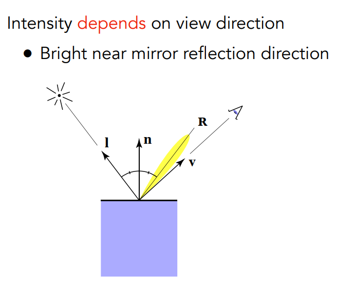

但是phong模型很聪明：高光项和反射方向足够接近时，说明发现方向和半程方向很接近。

为什么不用镜面反射方向判断呢？也有这个模型。算反射方向比算半程向量复杂。

通常将k_s看作白色。

指数p指的是什么？

不加指数的话，普通的夹角余弦容忍度太高了。

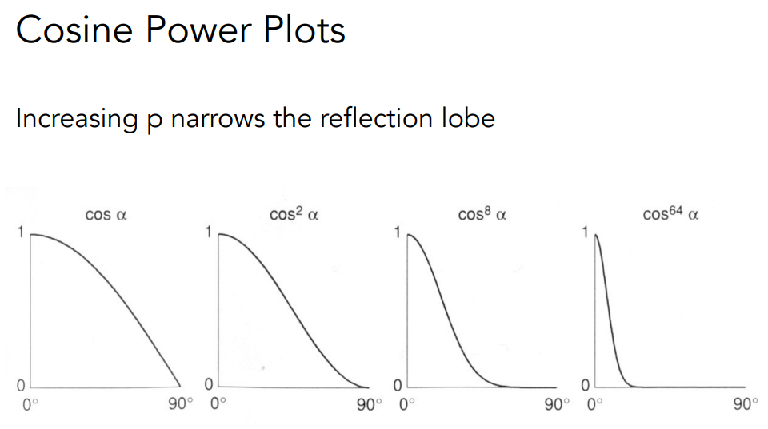

正常情况下的Blinn-Phong模型用个一百到两百。

## 环境光项

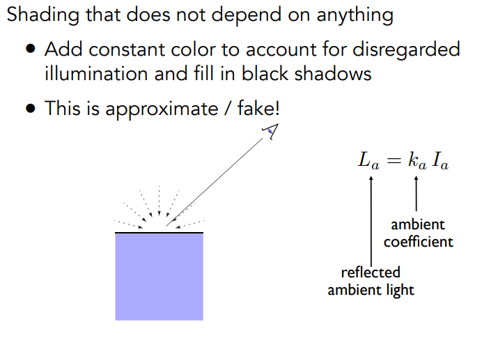

这里认为环境光永远是相同的。环境光是一个**常数**。

## 将所有项加起来

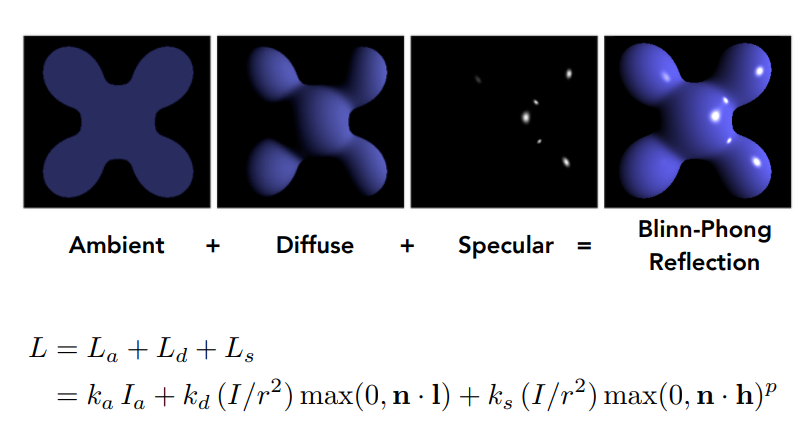

# 着色频率

## 三种着色频率

三个球形状一模一样为什么着色之后各不相同？

因为**着色频率**：着色要用在哪些点上。

图1每一个平面做一次着色

图2每个顶点算一次法线做一次着色 内部这些点三角形插值算出来

图3每一个像素进行着色

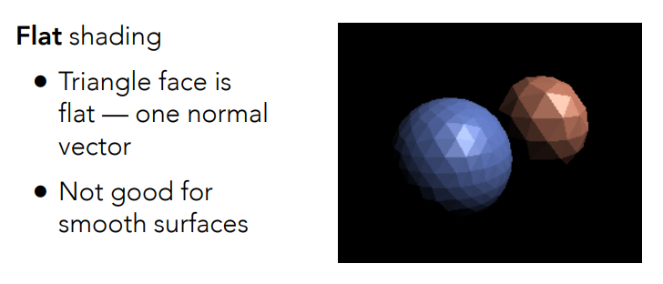

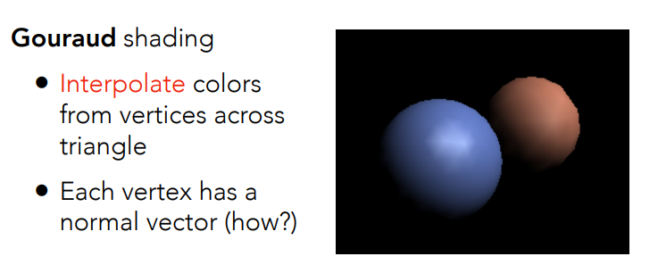

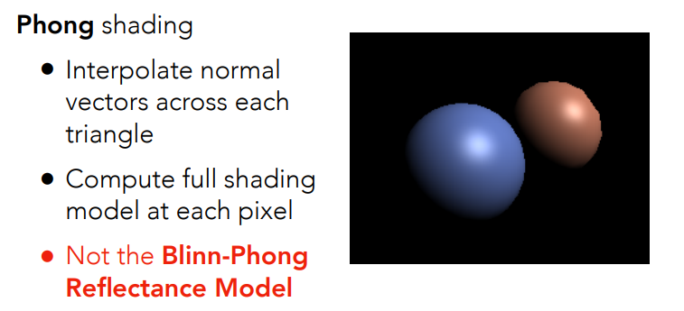

在有些情况下，比如面数很多的时候，flat-shading不一定是差的

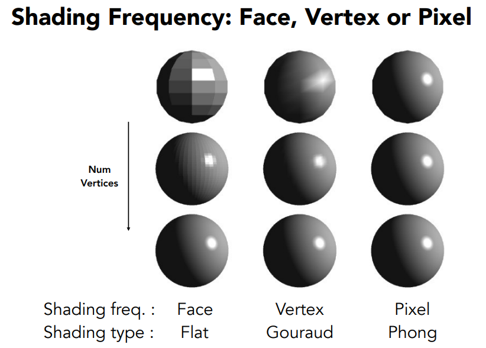

## 逐顶点如何计算法向量

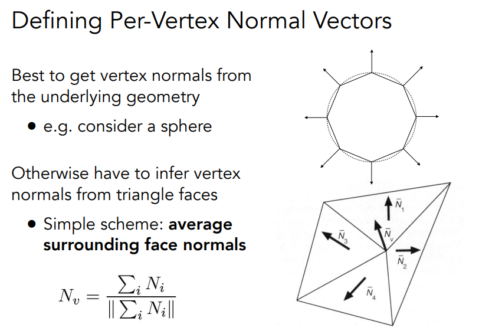

这个点附近三角形的法向量很好求，那么这个点的法向量做个平均。

## 逐像素如何计算法向量？

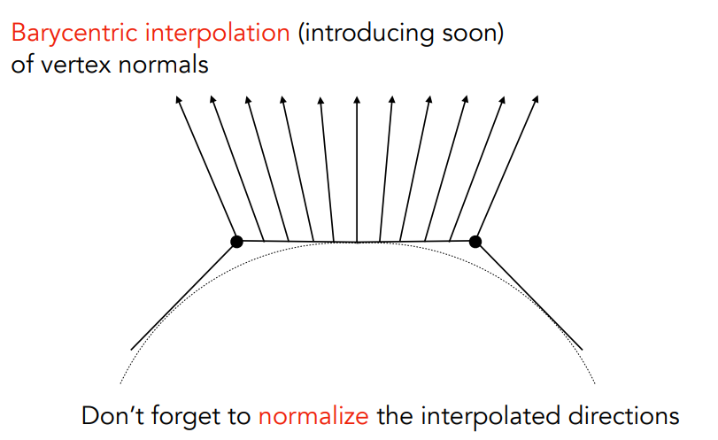
使用重心坐标插值

# 图像管线/实时渲染管线

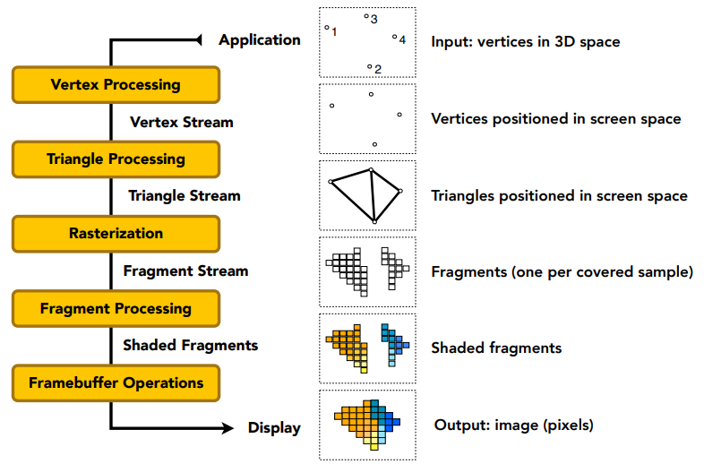

# Shader

管线有的环节允许编程，shader就是写这些可编程的地方。

在Shader里面只需要管 一个顶点或者一个像素怎么运作即可。

写的是顶点就是vertex shader

写的是像素就是pixel/fragment shader

# 纹理映射

希望定义同一个物体不同的点的属性

物体的表面是二维的，和一张图有一一对应关系。

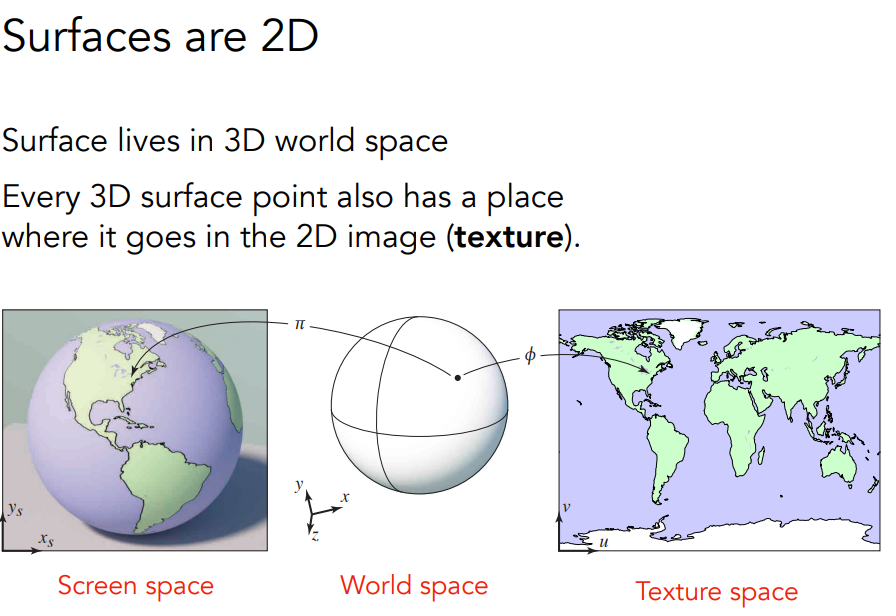

所以纹理定义为：一张图。一一对应就是纹理映射。

如何将空间中的三角形映射到纹理上先不管。

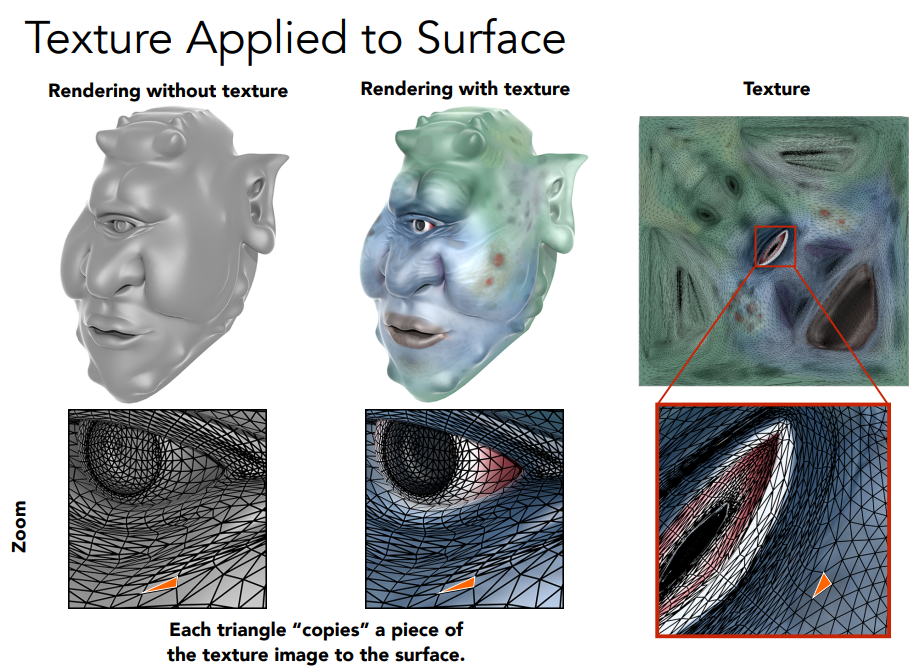

纹理可以不止用一次

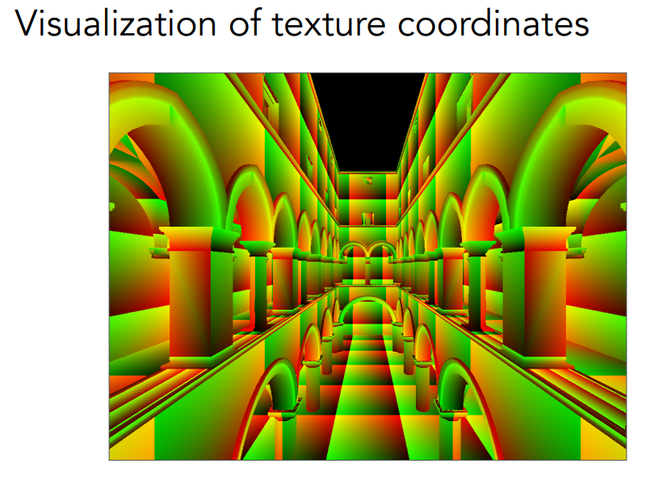

所以好的纹理是无缝衔接的。

知道三角形三个顶点对应的纹理坐标uv 如何得到三角形内部的点的纹理坐标？

**纹理就是定义着色时各个不同点的属性量**