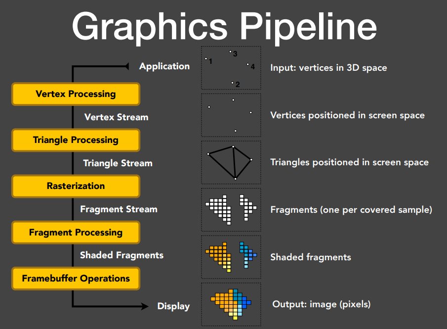
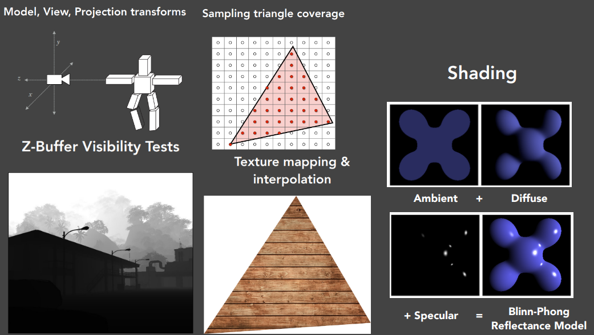
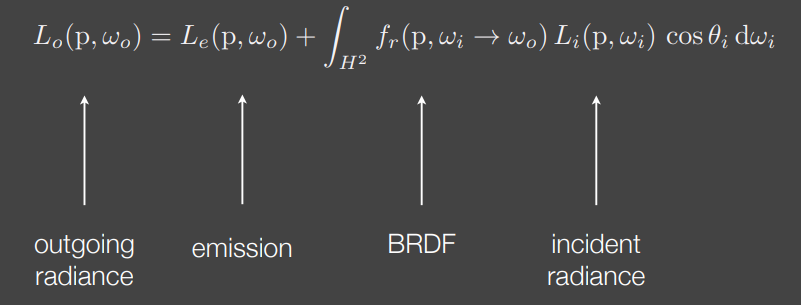
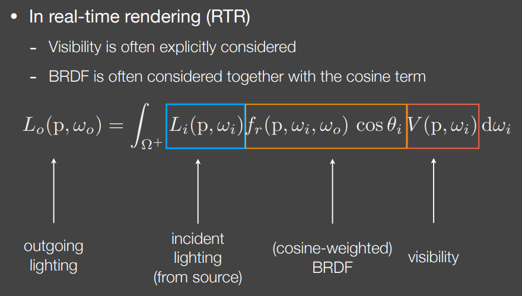

> [!NOTE]
>
> 图形学基础知识回顾

# 渲染管线





1. Model View Projection transforms
2. Sampling triangle coverage
3. Z-Buffer Visibility Tests
4. Shading
5. Texture mapping&interpolation

# 现代渲染管线

## 应用阶段 

这是在 **CPU** 上运行的阶段，主要负责为 GPU 准备数据。

- **视锥裁剪**：剔除不在相机视野范围内的物体。
- **遮挡剔除**：识别被挡住的物体。
- **数据打包**：将顶点数据（位置、法线、UV）、变换矩阵、材质参数发送到显存。
- **Draw Call**：最终通过图形API（Vulkan/D3D12/Metal）提交Draw Call给GPU。

## 几何处理阶段

**顶点着色器 第一个可编程阶段**

每个顶点独立执行，核心任务是空间变换：将顶点从模型局部空间（Model Space）经世界变换到世界空间，再经视图变换到相机空间（View Space），最后经投影变换到齐次裁剪空间（Clip Space）。同时可以计算逐顶点光照、传递UV坐标和法线等数据给后续阶段。

- **空间变换**：将顶点从**模型空间**转换到**裁剪空间**（通过 MVP 矩阵）。

- 其变换公式通常表示为：

  $$V_{clip} = M_{projection} \cdot M_{view} \cdot M_{model} \cdot V_{local}$$

- **逐顶点计算**：如简单的顶点动画或计算切线空间。

**曲面细分阶段（可选）** 这用于地形LOD、位移贴图等场景，能在不增加原始顶点数据的情况下动态提升几何细节。

**几何着色器（Geometry Shader，可选）** 以完整图元（点、线、三角形）为输入单位，可以增删图元。典型用途包括粒子系统的点扩展为四边形、阴影体生成等。但由于其串行特性，在现代管线中往往被Compute Shader或Mesh Shader替代。

**图元组装 (Primitive Assembly) —— 固定功能**

- **连点成面**：根据索引缓冲区，将零散的顶点根据拓扑结构连接成三角形或线段。

## 裁剪与屏幕映射

将连续的几何图元（三角形/线段）转换为离散的像素（片元）的过程。

- **裁剪**：切掉超出屏幕边界的三角形部分。
- **透视除法与视口变换**：将裁剪空间坐标转换为归一化设备坐标 (NDC)。
- **背面剔除**：根据环绕顺序丢弃朝向背后的三角形。

## 光栅化

**三角形设置与遍历**：计算哪些像素中心落在三角形内，并生成**片元 (Fragments)**。

**三角形设置**：计算三角形边的方程，为后续扫描线遍历做准备。

**三角形遍历**：确定哪些像素/采样点被三角形覆盖，生成片段（Fragment）。每个片段包含插值后的属性（位置、UV、法线等），插值使用重心坐标并做透视矫正。

- **采样**：GPU 检查屏幕像素网格，确定哪些像素的中心落在三角形内部。
- **片元生成**：为覆盖到的像素生成**片元**。
- **插值**：利用**重心坐标**，将顶点的属性（如 UV、法线、颜色）平滑地分配到每个片元上。

**Early-Z测试（可选优化）** 在片元着色器之前进行深度测试，提前丢弃被遮挡的片段，避免昂贵的着色计算。但如果片段着色器会修改深度值或使用discard，Early-Z会被禁用，退化为Late-Z。

## 片元着色阶段

这是决定画面最终“长什么样”的关键步骤。

**片元着色器 —— 可编程**

这是现代管线中计算量最大的地方，为每个片段计算最终颜色。

- **纹理采样**：根据 UV 坐标从贴图中读取颜色。
- **光照计算**：结合法线、光源、材质属性（如 PBR 流程中的粗糙度、金属度）计算颜色。
- **阴影计算**：ShadowMap做深度比较。
- **输出颜色**：决定该像素的最终 RGB 值。

在延迟渲染架构下，这个阶段会分两步：

- 几何Pass先将法线、Albedo、粗糙度、金属度、深度等属性写入G-Buffer（多张渲染目标）
- 光照Pass再用全屏四边形/Compute Shader读取G-Buffer，对每个像素进行多光源的光照计算，从而解耦几何复杂度与光源数量。

前向渲染则直接在一个Pass内完成所有光源的着色计算，变体如Forward+使用光源分块（Tiled/Clustered）来降低每个片段需要评估的光源数量。

## 输出合并阶段

处理像素如何写入缓冲区。

- **深度测试**：比较当前片元与 Z-Buffer 中的深度，决定是否被遮挡。
- **模板测试**：根据模板缓冲值决定片段是否保留，常用于描边、镜面反射区域标记、门户渲染等。
- **混合**：将片段颜色与帧缓冲中已有颜色按指定公式混合，这是半透明渲染的核心。半透明物体需要从后往前排序绘制。

## 后处理

渲染完成后通常还有一系列全屏后处理Pass，一般通过Compute Shader或全屏三角形实现：Bloom（提取高亮区域模糊叠加）、色调映射（HDR到LDR的转换，如ACES曲线）、抗锯齿（TAA利用时间上的抖动采样累积，FXAA/SMAA基于边缘检测）、景深、运动模糊、色彩分级等。

## 疑问

### 遮挡剔除和深度测试的区别

遮挡剔除解决了**过度绘制OverDraw的问题**

| **特性**     | **遮挡剔除 (Occlusion Culling)**         | **深度测试 (Depth Test)**           |
| ------------ | ---------------------------------------- | ----------------------------------- |
| **发生阶段** | **应用阶段 (CPU/Compute)**               | **输出合并阶段 (GPU 硬件固定单元)** |
| **处理粒度** | **物体级 / 簇级** (整个模型或一组三角面) | **像素级** (每个像素点)             |
| **性能开销** | 计算逻辑复杂，消耗 CPU/计算性能          | 极低，由专用硬件逻辑完成            |
| **主要目的** | **节省带宽和绘制调用 (Draw Call)**       | **保证遮挡关系正确**                |

### 视锥剔除和裁剪的区别

**视锥剔除—— 粗活**

- **发生地**：应用阶段（CPU）。
- **处理对象**：整个物体（Mesh）或其包围盒（AABB/Sphere）。
- **逻辑**：它只做**“全进、全出、相交”**的判断。
  - **全进**：直接交给 GPU。
  - **全出**：直接丢弃，GPU 根本看不到它。
  - **相交**：只要物体的包围盒有一点点擦到视锥边缘，CPU 就会把**整个物体**（包含数万个三角形）全部发给 GPU。

**裁剪—— 细活**

- **发生地**：几何处理与光栅化之间（GPU 固定硬件）。
- **处理对象**：每一个具体的三角形。
- **逻辑**：它处理那些**横跨视锥边缘**的三角形。
- **关键作用**：
  - **数学安全性（防除零错误）**：这是最核心的原因。如果一个三角形有一个顶点在相机后面（$w \le 0$），在进行**透视除法** ($x/w, y/w$) 时，数学上会崩溃或产生无穷大的坐标。裁剪会在 $w=0$ 的平面之前把三角形“切断”，生成新的顶点，确保传给光栅化器的坐标都是合法的。
  - **性能精度**：如果不裁剪，光栅化器会尝试去遍历一个延伸到屏幕外无穷远处的“巨型三角形”，这会浪费极大的计算资源，甚至导致像素坐标溢出。

### Phong Shading与Gouraud Shading

|                  | Gouraud Shading | Phong Shading          |
| ---------------- | --------------- | ---------------------- |
| **光照计算阶段** | 顶点着色器      | 片段着色器             |
| **计算单位**     | 每个顶点算一次  | 每个片段（像素）算一次 |
| **插值内容**     | 插值**颜色**    | 插值**法线**           |

Gouraud：

```c++
顶点着色器: 每个顶点 → 计算光照 → 得到颜色值
     ↓
光栅化: 对颜色值在三角形内插值
     ↓
片段着色器: 直接使用插值后的颜色（无需再算光照）
```

Phong：

```c++
顶点着色器: 每个顶点 → 只输出法线和位置
     ↓
光栅化: 对法线在三角形内插值
     ↓
片段着色器: 用插值后的法线 → 每像素重新计算光照
```

# 现代光栅化过程

经过顶点着色器、裁剪、透视除法和视口变换之后，三角形的三个顶点已经拥有了屏幕坐标 (x,y)(x, y) (x,y) 和深度值 zz z，以及需要插值的属性（颜色、纹理坐标、法线、切线等）。这些三角形被送入光栅化硬件单元（在 NVIDIA 架构中称为 ROP 前端的 Raster Engine）。

## 三角形设置

光栅化器首先为三角形建立数学描述，以便后续快速判断任意像素是否在三角形内部。

给定三角形三个顶点$v_0, v_1, v_2$对三条边分别构造 **边方程**。以边$v_0 \to v_1$为例，边方程定义为：

$E_{01}(x, y) = (x - x_0)(y_1 - y_0) - (y - y_0)(x_1 - x_0)$

这本质上是一个二维叉积，其符号表示点(x, y)在有向边的哪一侧。三条边方程$E_{01}, E_{12}, E_{20}$ 同号（对于逆时针缠绕均为非负），则该点在三角形内部。

其实就是判断点是否在三角形内

同时设置阶段还会计算三角形面积的倒数$\frac{1}{2A}$ （即三条边方程之和的倒数），用于后续重心坐标归一化，以及计算深度和属性的插值梯度系数。

## 三角形遍历

这一步确定哪些像素（或采样点）被三角形覆盖。

**包围盒裁剪**：先计算三角形在屏幕上的轴对齐包围盒（AABB），只遍历这个矩形区域内的像素，跳过大片空白区域。

**分块遍历**：现代 GPU 不会逐像素遍历包围盒，而是采用层级策略。先以较大的块（如 8×8 或 16×16 像素的 Tile）测试三角形覆盖情况。一个 Tile 如果完全在三角形外部就整体跳过，完全在内部则整体标记为覆盖，部分重叠时才下降到更小粒度逐像素测试。这种分层方法大幅减少了需要执行边方程测试的次数。

**逐像素覆盖测试**：对每个候选像素，将其采样点坐标（通常是像素中心(x + 0.5, y + 0.5) ）代入三条边方程。三个值均满足预设的符号条件（通常是 ≥0），该像素就被三角形覆盖，生成一个 **片元（fragment）**。

**Top-Left 填充规则**：当采样点恰好落在三角形的边上时，需要一个确定性规则来决定归属，避免相邻三角形共享边时某个像素被着色两次或零次。行业标准的 Top-Left Rule 规定：如果采样点落在三角形的"上边"（水平且位于上方的边）或"左边"（非水平且位于左侧的边）上，则算作覆盖；落在其他边上则不算。这保证了任何共享边上的像素有且仅有一个三角形拥有它。

## 多重采样抗锯齿（MSAA）中的光栅化

在开启 MSAA 时，每个像素不是只有一个采样点，而是有多个子采样点（如 4x MSAA 有 4 个子采样点，分布在像素内的不同位置）。光栅化器对每个子采样点分别做边方程测试，生成一个**覆盖掩码**，记录哪些子采样点被三角形覆盖。

关键优化在于：片元着色器仍然只执行一次（使用像素中心的插值属性），着色结果根据覆盖掩码写入对应的子采样点。这样抗锯齿只增加了光栅化和帧缓冲的开销，不会成倍增加着色开销。只有当不同子采样点被不同三角形覆盖时，该像素才会触发多次着色调用。

## 重心坐标插值

对于每个被覆盖的片元，光栅化器利用三条边方程的值计算重心坐标($\lambda_0, \lambda_1, \lambda_2$)：

$\lambda_0 = \frac{E_{12}(x,y)}{2A}, \quad \lambda_1 = \frac{E_{20}(x,y)}{2A}, \quad \lambda_2 = \frac{E_{01}(x,y)}{2A}$

其中2A是三角形面积的两倍。这三个权重满足$\lambda_0 + \lambda_1 + \lambda_2 = 1$，用于插值顶点属性。

**透视校正插值**：在透视投影下，屏幕空间中的线性插值会产生错误结果（典型表现是纹理"游泳"）。正确做法是在1/w空间中线性插值。具体而言，对任意属性a，先插值a/w和1/w，再相除得到正确的透视校正值：

$a_{corrected} = \frac{\lambda_0 \frac{a_0}{w_0} + \lambda_1 \frac{a_1}{w_1} + \lambda_2 \frac{a_2}{w_2}}{\lambda_0 \frac{1}{w_0} + \lambda_1 \frac{1}{w_1} + \lambda_2 \frac{1}{w_2}}$

硬件自动为所有声明了透视插值限定符的属性执行此修正。深度值z在某些 API 的深度缓冲格式下本身就是z/w的线性插值，不需要额外修正。

## Early-Z 与 Hi-Z 深度剔除

严格来说这已经跨出了"光栅化"的狭义范围，但它紧贴在光栅化之后、着色之前执行，对性能影响巨大。

**Hi-Z（Hierarchical Z）**：GPU 维护一个深度缓冲的层级压缩版本，每个 Tile 存储该区域的最近/最远深度值。在三角形遍历阶段就可以用三角形最远深度与 Tile 的最近深度做粗粒度比较，如果三角形在该 Tile 中完全被遮挡就直接跳过，连片元都不生成。

**Early-Z**：对通过 Hi-Z 的片元，在进入片元着色器之前逐片元做精确深度测试。通过的片元才会被调度去着色，不通过的直接丢弃。这避免了对被遮挡片元做无用的昂贵着色。但如果片元着色器中使用了 `discard`（alpha test）或手动写入深度值，硬件就无法保证 Early-Z 的正确性，会退回到 Late-Z（在着色之后做深度测试）。

# 渲染不透明物体

## 为什么必须排序？

在渲染不透明物体时，我们依靠 **Z-Buffer（深度测试）** 丢弃被遮挡的像素。但在半透明渲染中，**深度测试失效了**。

- **原因**：半透明物体不仅自己有颜色，还会透出背后的颜色。
- **数学限制**：混合算法通常是**不可交换的**。也就是说，$A$ 在 $B$ 前面和 $B$ 在 $A$ 前面的计算结果完全不同。

## 第一阶段：CPU 端的场景准备

在数据交给 GPU 之前，CPU 必须先完成“排队”工作。

1. **不透明物体优先**：首先，管线会正常渲染所有不透明物体。此时开启深度写入（Depth Write），确定好场景的基调（如墙壁、地面）。
2. **提取半透明列表**：将所有带有 Alpha 通道（透明度）的物体单独拿出来。
3. **距离计算**：计算每个半透明物体中心点（或包围盒中心）到摄像机的距离。
4. **执行排序**：按照距离从大到小（由远及近）进行排序。

## 第二阶段：渲染状态的调整

当 GPU 开始绘制这组排好序的半透明物体时，必须修改 **输出合并阶段（Output Merger）** 的状态：

- **开启混合**：告诉 GPU 不要直接覆盖像素，而是执行混合公式。
- **关闭深度写入**：这是最关键的一步。如果不关闭，最前面的透明物体会把深度值存入 Z-Buffer，导致它后面的透明物体因为深度测试失败而直接消失。
- **保持深度测试**：虽然不写深度，但要读深度。这样可以确保透明物体不会穿透到不透明的墙壁后面。

## 第三阶段：混合方程

这是像素最终合成的数学过程。对于每一个片元，GPU 会执行以下计算：

**标准混合公式：**

$$C_{out} = C_{src} \cdot \alpha_{src} + C_{dst} \cdot (1 - \alpha_{src})$$

- $C_{src}$（源颜色）：当前正在画的半透明像素颜色。
- $\alpha_{src}$（源透明度）：当前像素的透明度（0 到 1）。
- $C_{dst}$（目标颜色）：**帧缓冲区中已经存在的颜色**（可能是背景，也可能是更远的透明物体）。

**举例说明：**

假设背景是**纯白色** $(1,1,1)$，你要在前面画一块**红色** $(1,0,0)$、透明度为 **0.5** 的玻璃：

1. 红色贡献：$1.0 \times 0.5 = 0.5$
2. 白色贡献：$1.0 \times (1 - 0.5) = 0.5$
3. 最终像素：$(0.5+0.5, 0, 0) + (0, 0.5, 0.5) = (1, 0.5, 0.5)$（呈现粉红色）。

# Draw Call是CPU的瓶颈

- **状态切换：** 这是最耗时的部分。CPU 需要切换材质、纹理、着色器（Shader）、开启或关闭混合模式等。每次状态切换，驱动程序都需要进行大量的校验和计算。
- **指令翻译：** CPU 使用的图形 API（如 OpenGL, DirectX 11）需要将你的代码翻译成显卡驱动能理解的底层指令。
- **数据拷贝：** CPU 需要确保数据（顶点、索引、常量缓冲区）已在显存中就绪，并设置好指针。

**关键点：** GPU 的渲染速度通常极快，快到 CPU 准备一个 Draw Call 的时间，GPU 已经渲染完了好几个。如果 Draw Call 数量过多，CPU 就会一直忙于处理这些管理任务，导致 GPU 处于“饥饿”状态，坐等指令。

## 什么时候会成为GPU的瓶颈

**Fill Rate（填充率）：** 屏幕像素太多，或者 Overdraw（重叠绘制）太严重。

**Shader Complexity：** 你的像素着色器（Fragment Shader）写得太复杂，计算量太大。

**Memory Bandwidth：** 显存带宽不足，纹理采样太频繁。

# 可编程渲染

把管线中原本由固定电路执行的某些阶段替换为通用计算单元，允许开发者编写在 GPU 上运行的小程序（Shader），自定义这些阶段的行为。

顶点着色器

计算着色器

# 处理锯齿

SSAA：在渲染时，将分辨率提高。但是开销大。

MSAA：光栅化阶段对每个像素的子采样点进行覆盖测试。

FXAA：纯后处理。通过像素亮度的差异寻找边缘，然后沿边缘进行模糊平滑。

TAA： 既然在一帧里多采样很贵，那就**分多帧采样**。每一帧都让相机微弱地抖动，然后利用**运动矢量**将前几帧的数据混合到当前帧。

DLSS：利用神经网络对低分辨率画面进行超分辨率重建，在提升帧率的同时顺便解决了锯齿问题。

# 渲染方程



- $Lo(x,ωo)$：出射光
- $Le(x,ωo)$：自发光

- 积分项$\int_{\Omega}$：对所有半球方向的光进行累加
- $Li(x,ωi)$：入射光
- $f_r(x,ωi,ωo)$：BRDF(Bidirectional Reflectance Distribution Function)双向反射分布函数

- $(ωi⋅n)$：余弦项

$Li→Lo→Li→...$Li本身也是其它点的Lo决定的，所以这是一个积分方程+递归的问题。



$V(p,w_i)$是点p往光源$\omega_i$去看，能不能看到光源。

**全局光照=直接光照+间接光照**

**直接光照**：光线只会弹射一次。

**间接光照**：光线会弹射两次。

通常解决全局光照就是解多一次弹射的间接关照。

在实时渲染中搞定多一次的全局光照：光源→物体A→物体B 这样的间接光照即OK
