> [!NOTE]
>
> 实时阴影Ⅰ

# Shadow Mapping

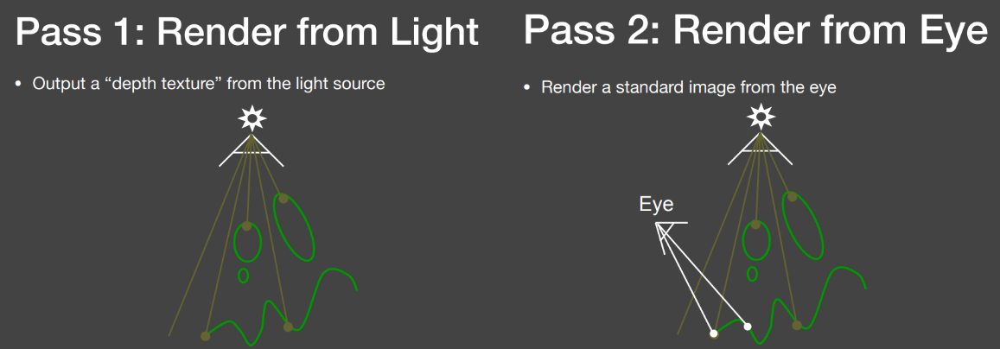

- 在光源处做一次“光栅化”保存深度信息。
- 将摄像机角度的可见点投影到光源处对比深度。

## Shadow Mapping的问题

### 自遮挡

Shadow Map是有分辨率的，每个像素记录一个深度，在一个像素的范围记录的深度是一个常数。在Shadow Map看来，场景因为像素的原因被离散成了一系列“小片”。

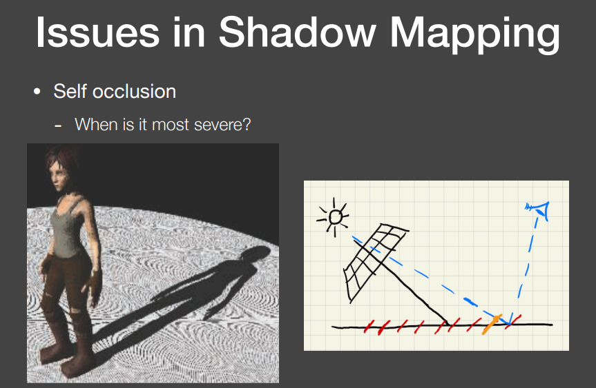

如图所示 交点是实际深度 但是Shadow Map记录的深度值是图中右边黄色的片上的深度。

所以，由于Shadow Map记录的深度是不连续的，所以出现了自遮挡的问题。

当Light从上往下照的时候，此问题最小。

当Light非常偏着射的时候，此问题最大。

如何解决？可以添加一段（根据角度可变的）bias处理这种情况（其实就是加一个动态容差）。如果在bias范围内那不算遮挡。

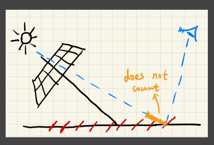

解决了自遮挡问题，但新的问题又来了。如果bias调的大了，那么原本的一些阴影信息可能丢失。

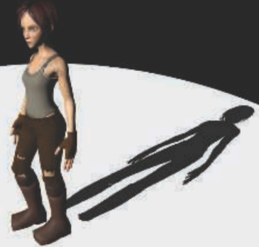

一个解决方法是，找一个很合适的bias值。

学术界的另一个做法是Second-depth shadow mapping

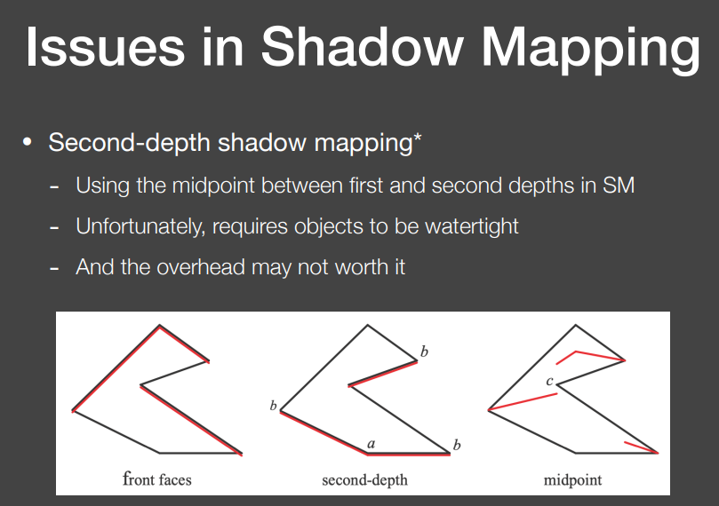

- 这个方法要求物体一定得是watertight的，即使很薄一张纸，其实也得是一个盒子。
- 最小和次小深度如何计算呢？保留次小增加了计算时间。就算都是O(n)，但是常数不一样，性能也拉开很多。

但是**实时渲染不相信复杂度，它只相信绝对的速度**。

### 走样

Shadow Map是有一定分辨率的，那么一定会有（类似光栅化的）锯齿状的阴影。

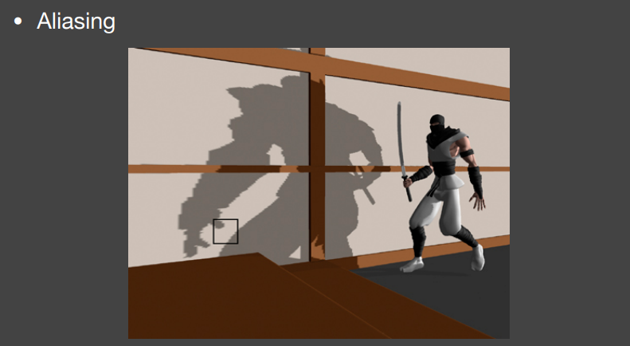

## Shadow Mapping背后数学基础

Schwarz不等式$$ \left[\int_{a}^{b} f(x)g(x)\mathrm{d}x\right]^2 \leqslant \int_{a}^{b} f^2(x)\mathrm{d}x \cdot \int_{a}^{b} g^2(x)\mathrm{d}x $$

Minkowski不等式 $$ \left\{\int_{a}^{b} \left[f(x)+g(x)\right]^2 \mathrm{d}x\right\}^{\frac{1}{2}} \leqslant \left\{\int_{a}^{b} f^2(x)\mathrm{d}x\right\}^{\frac{1}{2}} + \left\{\int_{a}^{b} g^2(x)\mathrm{d}x\right\}^{\frac{1}{2}} $$

但是在实时渲染里，不太关心不等，而是更关心近似相等。

所以要把这些不等式，拿来当约等式使用。

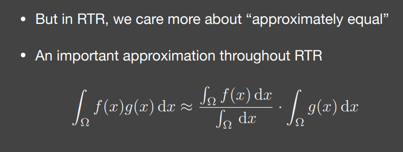

可以把f(x)看为常数，那么分母就类似于一个归一化。如2在[1,3]积分为6，那么提出来就是6/3=2。

这个式子就把乘积的积分化为了积分的乘积。

- 当g的积分限很小的时候，可以看为是准确的。
- 当g在积分域内足够光滑（低频、变换不大）。

以上两条件满足一条，那么就比较准确。

48:00

这里还有笔记待补充。

# PCSS

**Percentage closer soft shadows**

因为绝大多数光源都是面光源，所以软阴影更真实。

光源部分被遮挡，部分没被遮挡。

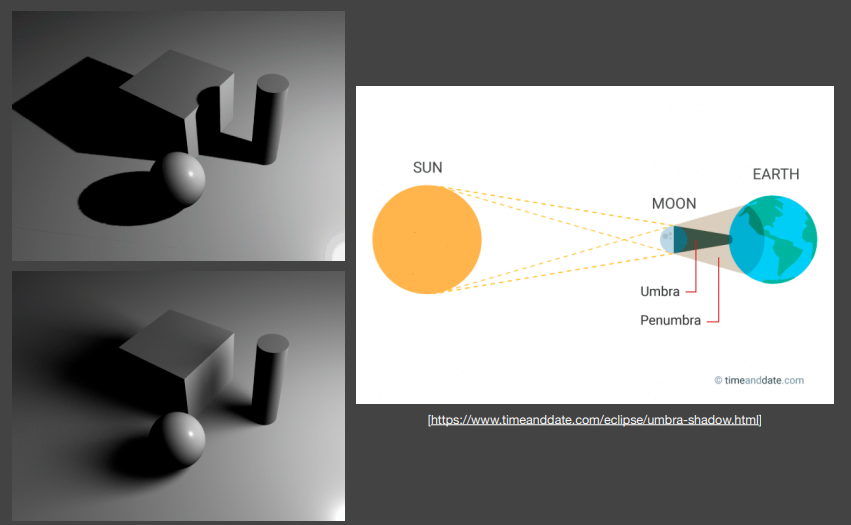

## PCF

**PCF:Percentage Closer Filtering**

PCF最早研发出来是为了反走样/抗锯齿。

PCF在软阴影里是Filtering the results of comparisons，是在阴影判断的时候做。

而不是在有阴影的地方做。

也不是去Filter Shadow Map。实际上Filter Shadow Map毫无意义，结果还是非0即1的。

什么叫在阴影判断的时候FIlter？

原来是像素上的一个点，投影到光源处，做一次判断。

现在是在一个范围内的多个像素，投影到光源处，中心点与附近多个像素点的深度做判断，最后取平均值。

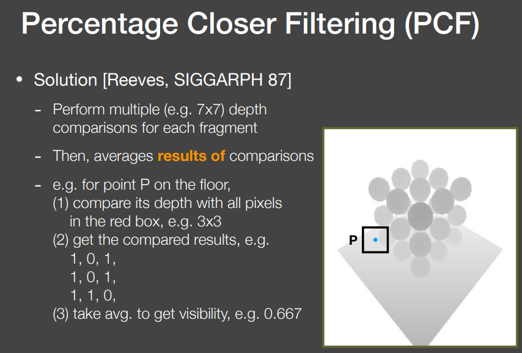

## PCF的尺寸

Filter区域的大小决定了阴影是硬还是软。

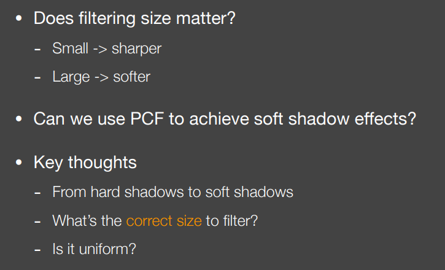

PCF越小阴影约硬。

PCF越大阴影越软。

那么所有地方的PCF都应该一样大吗？

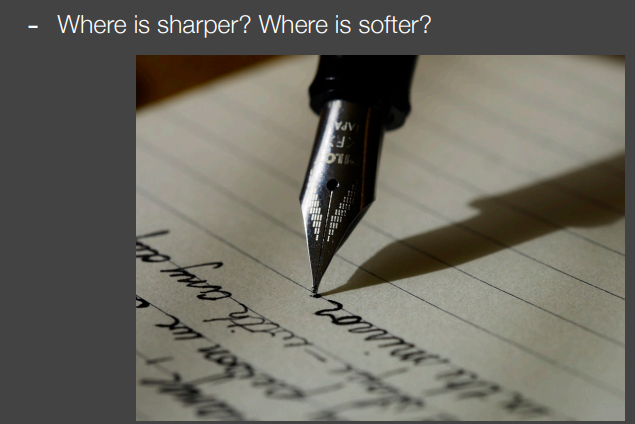

在上述例子中，笔尖处阴影更硬而笔杆处更远。

因为笔尖处阴影离遮挡物近，而笔杆处远。

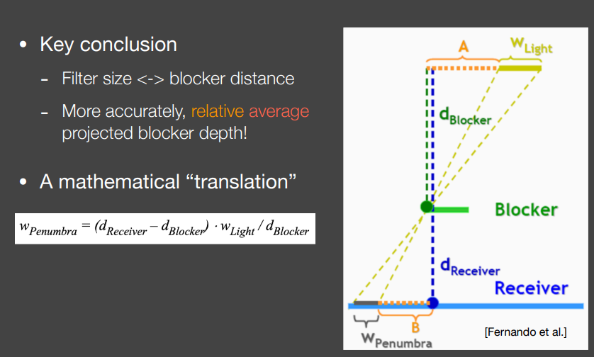

W（图中黑色的W）越大越软

Filter(W)的大小取决于Blocker到Light的距离和这一点到Blocker的距离。（根据相似三角形）

（面光源是不会生成Shadow Map的 但是为了模拟 先假设是点光源 Camera放在Light中间 生成一个Shadow Map）

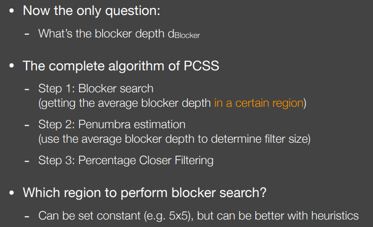

$$
W_p = \frac{d_{receiver} - d_{blocker}}{d_{blocker}} \cdot W_{light}
$$
Blocker可能不是一个简单的点或者直线，是一个复杂的物体。所以要算Blocker的平均深度。

要知道Filter多大，就要计算Blocker到Shading Point的平均距离是多少。

**PCSS过程**：

1. 从Shading Point连向点光源，取周围的某一个区域，判断是否在阴影里。如果在阴影里，说明这个像素是一个Blocker。把所有的Blocker深度记下来取一个平均值。
2. 知道了Blocker的平均深度，就可以根据相似三角形计算Filter有多大。
3. 知道了Filter有多大，那么就可以像PCF那样生成软阴影了。

那么计算Blocker的平均深度也要取一个范围，这与PCF不是鸡生蛋蛋生鸡的问题吗？要计算Filter的大小，就需要通过Blocker的平均深度来得到。要计算Blocker的平均深度，就需要决定，在Blocker多大的范围内计算平均深度。

1. 把Blocker search取一个常数好了。这是一个办法。

2. 另一个方法：Shading point连向Light看Blocker在Shadow map上有多大区域。

如果像素不能遮挡这个点，那不管他。

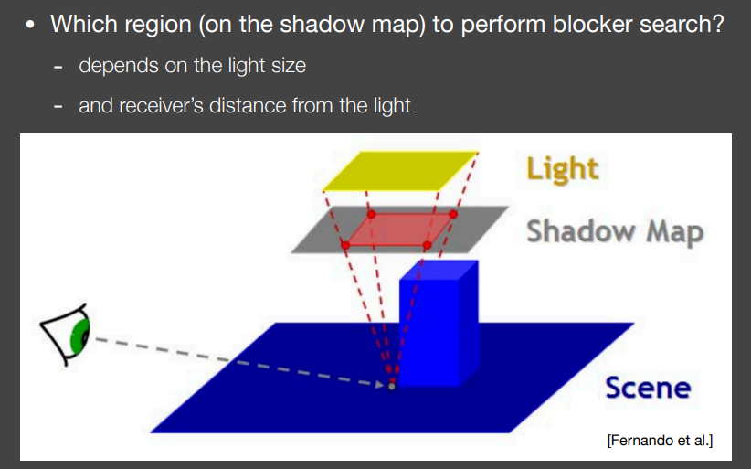

要估计红色的区域里所有能挡住Shading Point的点的区域是多少。

将Shading Point连向Light，看它在Shadow Map上覆盖了多大的区域，这个区域内有多少Blocker。

也就是：

想象一个圆锥体，顶点在接收点 $P$，底面是光源。这个圆锥体在 Shadow Map 平面上截得的区域，就是我们应该搜索的范围。
$$
W_{search} = W_{light} \cdot \frac{d_{receiver} - d_{near}}{d_{near}}
$$
$W_{light}$: 光源的物理大小。

$d_{receiver}$: 当前像素点到光源的距离。

$d_{near}$: 光源相机的近裁剪面距离（Near Plane）。

PCSS和PCF是一个非常慢的过程。

