> [!NOTE]
>
> 实时阴影Ⅱ

# PCF和PCSS

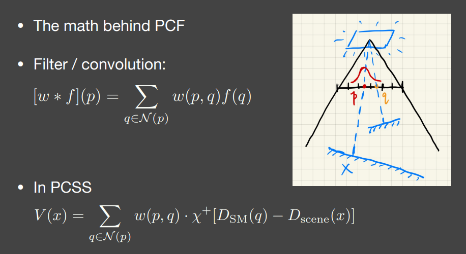

$\chi$是阶梯函数，此处表示非0即1，要么遮挡要么不遮挡。（此处是权重对应的值）

$\omega(p,q)$是权重。

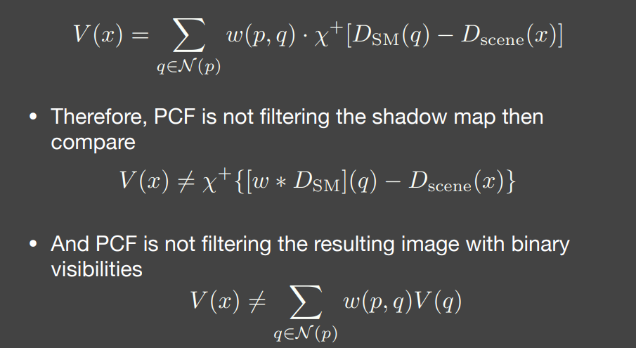

可以看出PCF并**不是对Shadow Map做Filter**（这样干之后，$\chi$还是非0即1的）

也**不是对有锯齿的阴影图片做Filter**

PCSS的步骤：

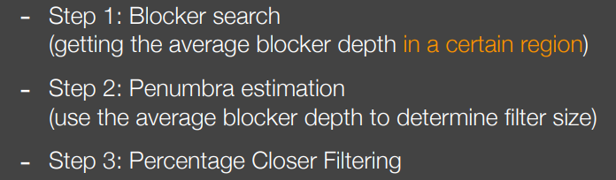

第一步的Blocker search目的是决定shadow map某一大小区域有多少是blocker，并算出遮挡物的平均深度。这是为了第二步用的。

第二步用遮挡物的平均深度估算出第三步应该在Shading Poing周围Filter的大小。

## PCSS很慢

工业界中可以对第一步和第三步稀疏的进行采样。当然这样也会造成noise。

PCSS的Blocker search和Percentage Closer Filtering很慢。所以为了改进有了VSSM。

# VSSM

**Variance Soft Shadow Mapping**

第三步PCF：

- 其实就是看这一个区域中有百分之多少的深度比Shading  Point要浅。
- 有多少texel在范围内深度小于Shading Point。
- 考试中知道自己考了多少分，那我能排百分之多少呢？

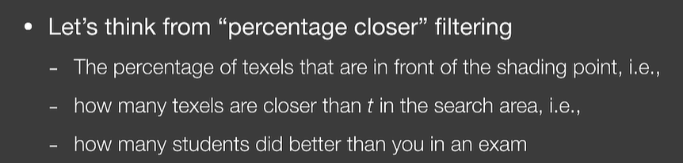

## VSSM解决第三步

VSSM很聪明

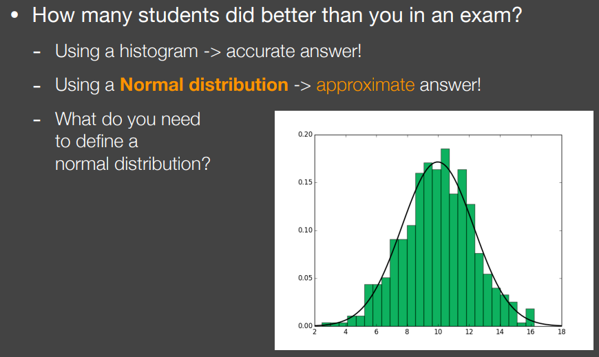

如果我有一个乘积直方图，那么知道排百分之多少就很准了。但如果要不是那么准，直方图都没有，将分布当成一个正太分布，同样可以根据乘积估计出是百分之几。

知道正太分布只需要：**均值、方差**。

VSSM为了做第三步的PCF，就要快速的计算出这个范围内的期望和方差。

范围查询：一种**类似Mipmap的思想**。叫做SAT。

但是求一个区域的期望好求，求方差呢？！！！经典考研概率论公式。

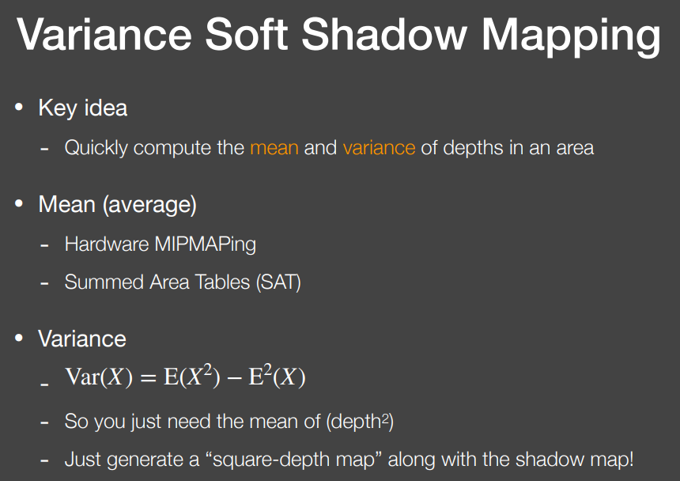

两张Shadow Map一张记深度一张记深度的平方。

所以只需要额外的存一张Shadow Map存平方。

得到均值方差后有了正太分布，那么有多少深度小有多少深度大呢？

算概率密度函数下的面积。

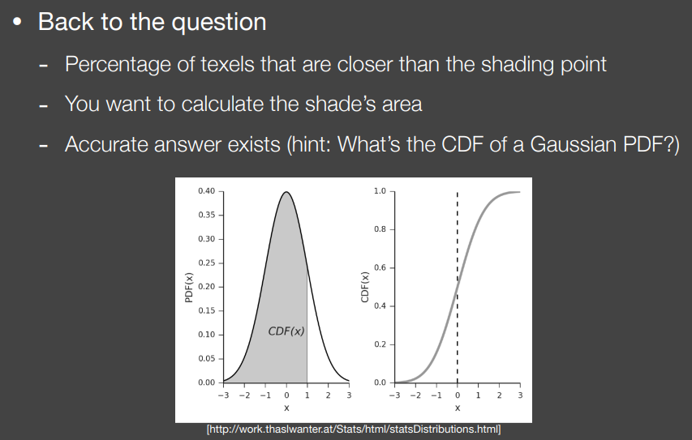

找积分表里的值就好。

C++里有一个数值函数有数值解没有解析解。

但是有更好的方法：

**切比雪夫不等式**

一个正态分布知道期望知道方差，给一个t可以知道大于t的面积。

但如果连分布是什么都不知道，只知道方差和期望，就用切比雪夫不等式。

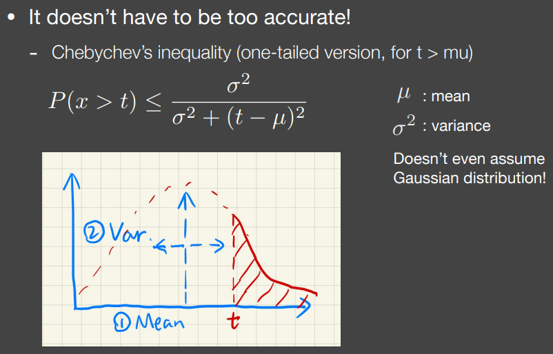

将不等式看为越等式，就相当于知道了CDF。

（但t必须在均值的右边）

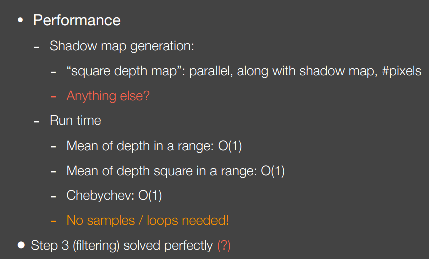

范围内深度均值：O (1) 时间复杂度

范围内深度平方均值：O (1) 时间复杂度

切比雪夫（滤波）：O (1) 时间复杂度

**无需采样 / 循环！**

（VSSM并没有用正态分布，而是直接用了切比雪夫）

VSSM到现在解决了第三步PCF，但是没解决Blocker search

## VSSM解决第一步

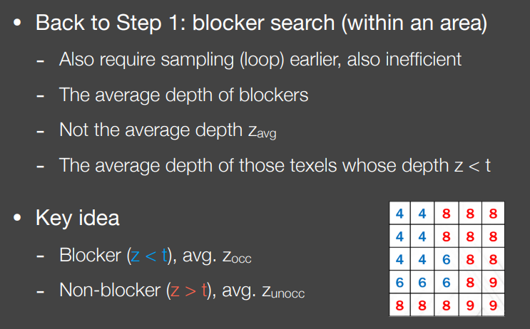

要想的是遮挡物的平均深度（蓝色）

而不是全部的平均深度

遮挡物和非遮挡物都有一个平均深度，那么是多少呢？不知道，不管。

但是总要满足一个关系。

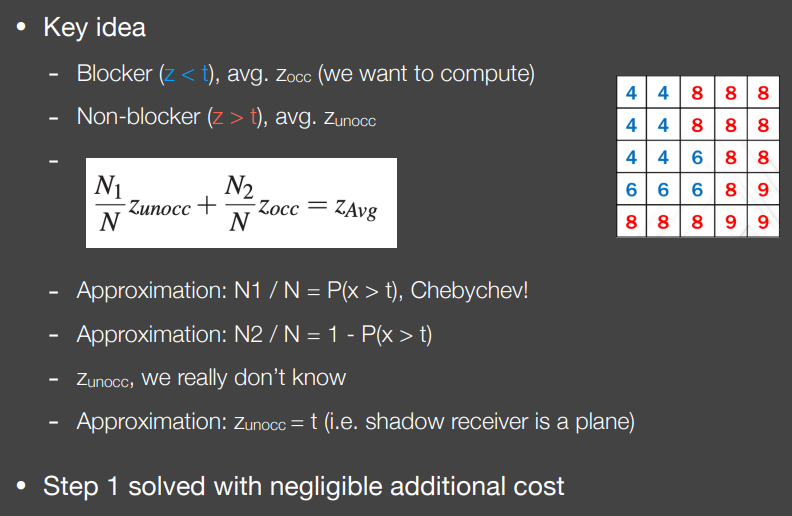

假设非遮挡物的深度和shading point的深度一模一样。（因为觉得大部分阴影的接收者是个平面所以问题不大，曲面或平面与光源不平行，确实会出问题。）

$Z_{unocc}=t$

那么直接算出了$Z_{occ}$

