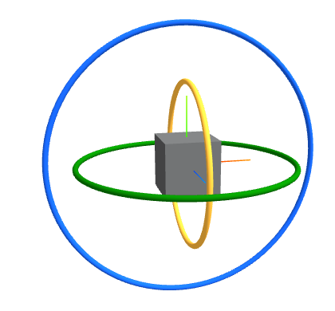
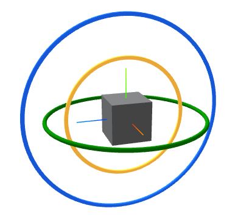

> [!NOTE]
>
> 四元数

# 欧拉角

欧拉角是用三个**连续的旋转序列**来描述物体在三维空间中的朝向。

欧拉角的旋转类似地球仪，要让它旋转到任意角度，你可以规定它必须先绕着特定的轴旋转，然后再绕着另一个轴旋转。通常我们使用三个角的序列来表示：

- $\alpha$ ：绕 $Z$ 轴（垂直轴）旋转。
- $\beta$ ：绕 $Y$ 轴（横向轴）旋转。
- $\gamma$ ：绕 $X$ 轴（纵向轴）旋转。

欧拉角通过旋转顺序发挥作用

欧拉角的核心在于**顺序性**。定义欧拉角时，必须指明旋转顺序，例如 **$Z-Y-X$ 顺序**初始状态：物体与全局坐标系重合。

1. **第一步**：绕当前的 $Z$ 轴旋转 $\alpha$。
2. **第二步**：绕旋转后的 $Y'$ 轴旋转 $\beta$。
3. **第三步**：绕再次旋转后的 $X''$ 轴旋转 $\gamma$。

**注意：** 这里的“$Y'$”和“$X''$”是**局部坐标系**的轴。每一次旋转都会改变物体的局部轴向，这种依赖关系正是欧拉角复杂性的来源。

欧拉角存在下面三个问题：

## 万向节死锁

在 $Z-Y-X$ 顺序中，如果中间的那个轴（$Y$轴）旋转了 90 度，使得原本的 $X$ 轴和 $Z$ 轴重合了，那么系统就丧失了一个自由度。

死锁发生在中间轴旋转90°时。中间轴旋转90°会导致首位两个轴重合从而引发万向节死锁。

演示：图中蓝色为z旋转方向、绿色为y旋转方向、黄色为x旋转方向。



当y轴旋转90°或-90°时，发生了下面的情况：



z轴与x轴的旋转方向重合，此时丢失了一个自由度。

## 旋转顺序的依赖性

由于旋转是非交换的（矩阵乘法 $AB \neq BA$），如果你规定了 $Z-Y-X$ 的顺序，就不能随意更改为 $X-Y-Z$，否则物体最终的姿态将完全不同。

## 插值困难

如果你想让物体从姿态 A 平滑转到姿态 B，简单的线性插值角度会导致物体在旋转过程中产生“非匀速”的跳动或诡异的运动路径。

**平滑插值：物体沿着两个姿态之间最短的路径，以匀速、不发生任何形变的方式旋转过去。**

**为什么欧拉角不能平滑插值？**

对欧拉角进行插值，通常使用的是**线性插值**。假设起始姿态的欧拉角是 $(x_1, y_1, z_1)$，终点姿态是 $(x_2, y_2, z_2)$。插值过程就是简单地按比例 $t$（从 $0$ 到 $1$）计算中间值。

欧拉角的三个分量是**非线性嵌套**的，在数值上让xyz三个数字均匀变换反应到三维空间中就不是匀速的，甚至不是沿着最短路径。这就导致了直接用线性插值欧拉角会发生：路径扭曲、角速度不均匀。

**为什么旋转矩阵不能进行线性插值？**

因为旋转矩阵是正交矩阵，线性插值后的矩阵$$M(t) = (1 - t)M_1 + tM_2$$不再是正交矩阵。

## 存储问题

```c++
struct EulerAngles {
    float yaw;   // 绕 Y 轴
    float pitch; // 绕 X 轴
    float roll;  // 绕 Z 轴
    RotationOrder order; // 必须存储：如 XYZ, ZYX, YZX 等
};
```

因为顺序不同最终姿态不同，所以要存储旋转顺序。

那么欧拉角这么麻烦为什么不直接存矩阵呢？

因为无法通过调整矩阵的9个数值来旋转物体，欧拉角是人类友好的语义层接口。

# 四元数

## 使用复数表示二维旋转

**将2D坐标变为复数**

若x是实数轴，y是虚数轴，那么在二维复平面上：

一个点$(x,y)$表示为复数$$p = x + yi$$

**构建旋转因子**

想把这个点p绕原点旋转θ角度，需要构建一个单位复数作为旋转因子。

根据极坐标，一个角度为 $\theta$、长度为 $1$ 的单位复数 $q$ 可以写成：

$$q = \cos\theta + i\sin\theta$$

**复数乘法表示旋转**

$$p \cdot q = (x + yi)(\cos\theta + i\sin\theta)$$

$$p \cdot q = x\cos\theta + ix\sin\theta + yi\cos\theta + yi^2\sin\theta$$

$$p \cdot q = (x\cos\theta - y\sin\theta) + i(x\sin\theta + y\cos\theta)$$

计算结果的实部和虚部完美的对应了二维线性代数中，正交矩阵表旋转的结果。

$$\begin{bmatrix}
\cos\theta & -\sin\theta \\
\sin\theta & \cos\theta
\end{bmatrix}
\begin{bmatrix}
x \\
y
\end{bmatrix}
=
\begin{bmatrix}
x\cos\theta - y\sin\theta \\
x\sin\theta + y\cos\theta
\end{bmatrix}$$

所以得出结论：**在二维复平面中，乘以一个单位复数，在几何上等价的物理意义就是旋转**。

复数的乘法天然包含了二维空间的旋转逻辑，过程也比矩阵更紧凑。

那么

**既然二维旋转可以用 $(x + yi)$ 解决，那三维旋转能不能通过增加一个虚数轴来解决？**

## 四元数相乘

如果有两个四元数：

$$q_1 = w_1 + x_1i + y_1j + z_1k$$

$$q_2 = w_2 + x_2i + y_2j + z_2k$$

计算它们的乘积

$$q_1 q_2 = (w_1 + x_1i + y_1j + z_1k)(w_2 + x_2i + y_2j + z_2k)$$

**平方变负**：$i^2 = j^2 = k^2 = -1$

**顺时针乘（正）**：$ij = k, \quad jk = i, \quad ki = j$

**逆时针乘（负）**：$ji = -k, \quad kj = -i, \quad ik = -j$

合并同类项

**实部：**

所有互相相乘产生 $i^2, j^2, k^2$ 的项，以及 $w_1w_2$，构成了新的实部：

$$w_{new} = w_1w_2 - x_1x_2 - y_1y_2 - z_1z_2$$也就是$$w_{new} = w_1w_2 - \mathbf{v}_1 \cdot \mathbf{v}_2$$

**虚部 $i$（$X$ 轴分量）：**

$$x_{new} = w_1x_2 + x_1w_2 + y_1z_2 - z_1y_2$$

**虚部 $j$（$Y$ 轴分量）：**

$$y_{new} = w_1y_2 - x_1z_2 + y_1w_2 + z_1x_2$$

**虚部 $k$（$Z$ 轴分量）：**

$$z_{new} = w_1z_2 + x_1y_2 - y_1x_2 + z_1w_2$$

其中三个虚部的后半部分正是$\mathbf{v}_1$ 和 $\mathbf{v}_2$ 的叉乘 $\mathbf{v}_1 \times \mathbf{v}_2$的定义公式

最终的公式如下：
$$
q_1 q_2 = (w_1w_2 - \mathbf{v}_1 \cdot \mathbf{v}_2) + (w_1\mathbf{v}_2 + w_2\mathbf{v}_1 + \mathbf{v}_1 \times \mathbf{v}_2)
$$

## 三维旋转是否可以增加一个虚数轴表示

一个三维复数$$p = x + yi + zj$$

能否让i和j来负责三维空间中的旋转呢？

无论$i \cdot j$如何定义都无法满足旋转后向量长度不变。

想要在三维空间中进行完美的、无死角的旋转计算，三维数字系统是不够的，必须升维到四维。

所以就有了四元数
$$
q = w + xi + yj + zk
$$
并且规定
$$
i^2 = j^2 = k^2 = ijk = -1
$$

## 四元数性质

在工程上经常将四元数写为一个标量和一个三维向量

$$q = w + xi + yj + zk$$

$$q = (w, \mathbf{v})$$其中 $w$ 是实数部分，$\mathbf{v} = (x, y, z)$ 是虚数向量部分。

ijk不满足交换律

$$ij = k, \quad ji = -k$$

$$jk = i, \quad kj = -i$$

$$ki = j, \quad ik = -j$$

在欧拉角和旋转矩阵中，先绕X转再绕Y转和先Y转再X转最终效果是不同的。

四元数的非交换性也完美契合了三维空间中的旋转的特性

## 四元数应用于旋转

### 使用右乘抵消实部

假设要将一个三维空间点$\mathbf{v} = (x, y, z)$进行旋转，首先要将它写成纯四元数形式

$$p = 0 + xi + yj + zk$$

$$p = 0 + \mathbf{v}$$。

假设旋转算子 $q$ 是由旋转角度 $\alpha$ 和单位旋转轴 $\mathbf{u}$ 构成的：

$$q = \cos\alpha + \mathbf{u}\sin\alpha$$

如果像二维复数那样单次左乘，四元素的乘法会展开成：

$$q \cdot p = (-\mathbf{u} \cdot \mathbf{v}\sin\alpha) + (\mathbf{v}\cos\alpha + (\mathbf{u} \times \mathbf{v})\sin\alpha)$$

此时多了一个实部：$-\mathbf{u} \cdot \mathbf{v}\sin\alpha$

这就说明了经过一次左乘三维空间中的点泄漏到了**四维标量空间**

**为了消除这个实部，将泄漏到四维标量空间的部分拽回三维空间，必须右乘q的逆。**

对于单位四元数，逆等于共轭$q^{-1} = \cos\alpha - \mathbf{u}\sin\alpha$

于是就有了著名三明治公式$p' = q \cdot p \cdot q^{-1}$

最终实部为$(-\mathbf{u} \cdot \mathbf{v}\sin\alpha)\cos\alpha + (\mathbf{v}\cos\alpha + (\mathbf{u} \times \mathbf{v})\sin\alpha) \cdot \mathbf{u}\sin\alpha$

由于$(\mathbf{u} \times \mathbf{v}) \cdot \mathbf{u} = 0$所以最终实部$= -\mathbf{u}\cdot\mathbf{v}\sin\alpha\cos\alpha + \mathbf{v}\cdot\mathbf{u}\cos\alpha\sin\alpha = 0$

右乘 $q^{-1}$ 的根本物理意义，是产生一个符号相反的标量投影，完美抵消掉单次乘法产生的“维度泄漏”，确保最终结果的实部永远为 $0$，使点乖乖留在三维空间。

### 使用半角叠加

我们将要旋转的向量 $\mathbf{v}$，沿着旋转轴 $\mathbf{u}$ 拆分成两个分量：

- **平行分量**：$\mathbf{v}_{\parallel}$
- **垂直分量**：$\mathbf{v}_{\perp}$

所以 $p = p_{\parallel} + p_{\perp}$。根据代数分配律，$q \cdot p \cdot q^{-1} = (q \cdot p_{\parallel} \cdot q^{-1}) + (q \cdot p_{\perp} \cdot q^{-1})$。

分别来看：

**情况 A：对平行分量的作用**

四元数有一个重要性质：互相平行的纯四元数**满足交换律**。

因为 $p_{\parallel}$ 平行于旋转轴 $\mathbf{u}$，所以 $p_{\parallel} \cdot q^{-1} = q^{-1} \cdot p_{\parallel}$。

因此：

$$q \cdot p_{\parallel} \cdot q^{-1} = q \cdot q^{-1} \cdot p_{\parallel} = 1 \cdot p_{\parallel} = p_{\parallel}$$

**物理意义：** 沿着旋转轴的分量在旋转前后保持不变。这完全符合常理！

**情况 B：对垂直分量的作用**

互相垂直的纯四元数**反交换**。

更神奇的是，对于垂直于旋转轴的向量 $p_{\perp}$，它右乘 $q^{-1}$ 的代数结果，**竟然完全等价于它左乘 $q$！**

即数学定理证明了：$p_{\perp} \cdot q^{-1} = q \cdot p_{\perp}$。

把这个等式代入三明治公式，奇迹发生了：

$$q \cdot p_{\perp} \cdot q^{-1} = q \cdot (q \cdot p_{\perp}) = q^2 \cdot p_{\perp}$$

**三明治”公式中的右乘 $q^{-1}$，不仅没有抵消掉左乘 $q$ 的旋转，反而在垂直平面上，相当于对向量又施加了一次同方向的左乘 $q$！**

因为公式实际上对空间进行了 $q^2$ 的操作。我们需要算出 $q^2$ 是多少。

根据四元数的棣莫弗定理（类似于复数）：

如果 $q = \cos\alpha + \mathbf{u}\sin\alpha$

那么 $q^2 = \cos(2\alpha) + \mathbf{u}\sin(2\alpha)$

我们希望最终的物理旋转角度是 $\theta$，那么：

$$2\alpha = \theta \implies \alpha = \frac{\theta}{2}$$

## 四元数总结

想让一个物体绕着单位向量轴 $\mathbf{u} = (u_x, u_y, u_z)$ 旋转 $\theta$ 角度。构建这个旋转四元数 $q$ 的公式是：
$$
q = \cos\left(\frac{\theta}{2}\right) + (u_x i + u_y j + u_z k)\sin\left(\frac{\theta}{2}\right)
$$
注意：

别忘了空间中的点化为纯四元数$p = 0 + xi + yj + zk$

并使用三明治乘法$p' = q \cdot p \cdot q^{-1}$

## 四元数的优点

解决万向节死锁问题：四元数本质上是“绕空间中任意一条轴旋转一个角度”（轴角表示法）。它不依赖全局的 $X, Y, Z$ 轴顺序，因此**没有任何奇异点**，可以在三维空间中进行全方位、无死角的自由旋转。

**完美球面插值：**由于单位四元数本身就分布在一个四维空间的超球面上，使用 Slerp算法，可以让物体沿着两个姿态之间的**最短大圆弧**，以绝对**匀速**进行旋转过渡。这正是现代3D动画（如骨骼动画的关键帧过渡）能够平滑无比的核心秘密。

存储优化：一个旋转矩阵存储9个浮点数，一个四元数存储4个浮点数。

性能问题：

- 两个 3x3 矩阵相乘需要 **27 次乘法**和 18 次加法。

- 两个四元数相乘只需要 **16 次乘法**和 12 次加法。在大量进行旋转叠加（状态合成）时，四元数的计算开销显著更低。

数值漂移：

- 由于浮点数精度误差，经过几千次旋转叠加后，旋转数据会发生“漂移”。

- 如果矩阵不再正交（即三条轴不再互相垂直且长度为1），物体就会发生拉伸变形。而将一个矩阵重新正交化要用施密特正交化，计算量很大。
- 四元数发生精度漂移时，只需要除以自身模长归一化即可。

## 四元数的缺点

虽然四元数在存储、组合和插值上全面胜出，但在**旋转一个具体的三维向量（如空间中的数百万个顶点）**时，四元数的三明治乘法 $q \cdot p \cdot q^{-1}$ 大约需要消耗 15-21 次乘法，而矩阵乘以向量 $M \cdot \mathbf{v}$ 只需要 9 次乘法。

## 四元数的应用

**存储与动画**：在内存中存储物体的姿态、处理骨骼动画关键帧、计算旋转插值时，**全部使用四元数**。

**摄像机控制**：用欧拉角旋转相机会发生万向节死锁。

**组合叠加**：在 CPU 端计算父子节点的旋转级联时，使用**四元数乘法**。

**最终渲染**：在计算完最终姿态，准备把数据送入图形 API（如顶点着色器）去变换海量几何顶点前，将四元数**转换为 4x4 的变换矩阵**，利用 GPU 对矩阵乘法的硬件级加速来完成最后的渲染。

**注意**：在渲染管线的MVP变换中，核心任务是齐次坐标变换，
