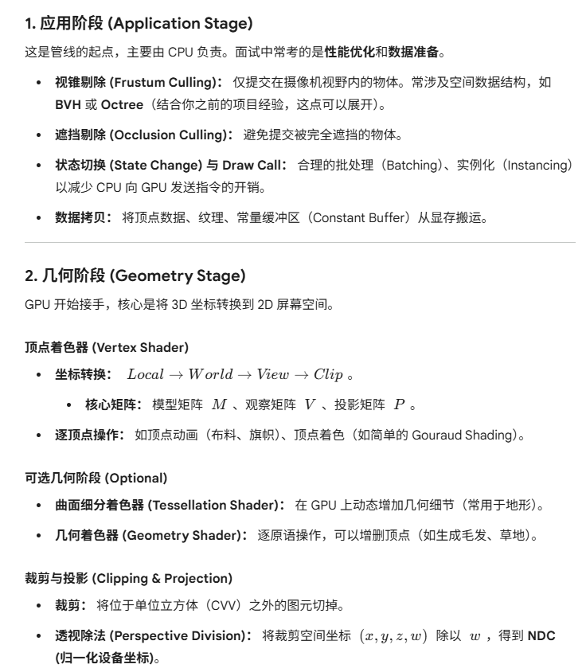
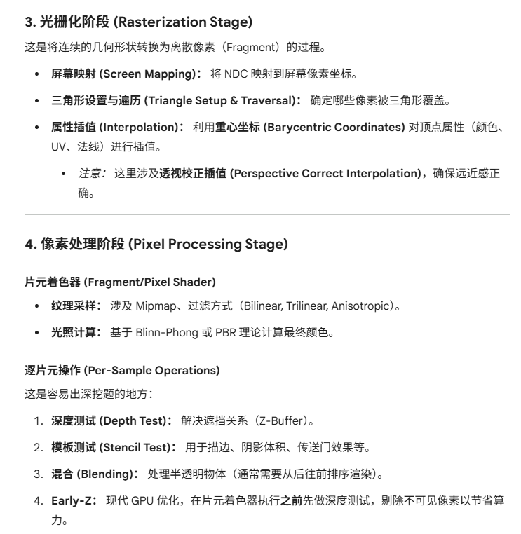
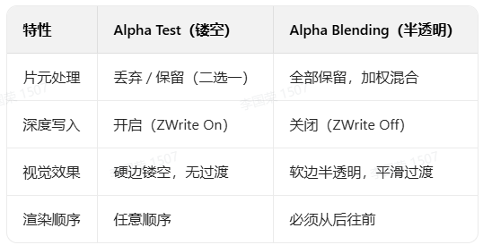

# 应用阶段

## 视锥剔除

摄像机在 3D 空间中定义了一个截头平头体（Frustum），它由 6 个平面组成：左、右、上、下、近、远。视锥剔除就是判断物体的**包围盒** 是否与这 6 个平面有交集。

**空间中平面的定义**：$$n \cdot P + d = 0$$

n是法向量

P是空间中任意点

d是常数项

其实就是$n\cdot(P-P_0)=0$将括号展开。

对于空间中任意一点 $P$：

- $n \cdot P + d > 0$：点在平面**内侧**（可见）。
- $n \cdot P + d < 0$：点在平面**外侧**（不可见）。

**判断一个点在视锥之内**：视锥的 6 个平面每一个都可以用平面方程表示：

其中 $n$ 是平面的法向量（指向视锥内部），$d$ 是平面到原点的距离。

只有当这个点在6 个平面的“内侧”或与其相交时，该物体才会被提交给 GPU。

**球包围盒剔除步骤**：

1. **构建包围盒：** 为每个物体计算一个简单的几何体，通常是 **AABB**（轴对齐包围盒）或 **BSphere**（包围球）。包围球计算最快，只需判断中心点到平面的距离是否大于半径。

2. **相交测试：** 只有当包围盒在所有 6 个平面的“内侧”或与其相交时，该物体才会被提交给 GPU。

**AABB剔除步骤**：

1. **寻找最优点**：判断一个 AABB 与平面的关系，不需要测试包围盒所有的 8 个顶点。为了追求极致性能，我们只需针对每个平面找到 AABB 上最特殊的两个点。
   - **P-vertex (Positive Vertex)**：在平面法线方向上**最远**的点（最容易在平面内侧的点）。
   - **N-vertex (Negative Vertex)**：在平面法线方向上**最近**的点（最容易在平面外侧的点）。

2. **快速的找到这两个点**：假设 AABB 的最小点为 $min$，最大点为 $max$，平面的法向量为 $n = (n_x, n_y, n_z)$：

   - 如果 $n_x \ge 0$，则 P 点的 $x$ 分量取 $max_x$，N 点取 $min_x$。

   - 如果 $n_x < 0$，则 P 点的 $x$ 分量取 $min_x$，N 点取 $max_x$。

     （$y$ 和 $z$ 分量以此类推）

3. 对于视锥的**每一个**平面，进行以下测试：

   1. **完全在外侧：** 如果 **P-vertex** 都在平面的外侧（$n \cdot P + d < 0$），说明整个 AABB 都在该平面外侧，直接剔除。
   2. **部分相交：** 如果 **N-vertex** 在平面外侧，但 **P-vertex** 在平面内侧，说明 AABB 与该平面相交。
   3. **完全在内侧：** 如果 **N-vertex** 都在平面内侧（$n \cdot N + d > 0$），说明 AABB 相对该平面完全在内侧。

   - 如果 AABB 在 **所有 6 个平面** 的测试中都没有被判定为“完全在外侧”，那么它就是可见的。
   - 如果在任意一个平面测试中被判定为“完全在外侧”，则立即停止后续平面测试，直接剔除。

### 假阳性

当 AABB 非常大且跨越了视锥的某个角（比如左上角外侧），虽然它在 6 个平面的正半空间内，但它实际上并不与视锥体相交。

- **解决方案：** 在引擎开发中，这种极少数的“假阳性”通常是可以接受的，因为剔除算法的目的是**快速减少渲染压力**，偶尔多画一个物体比用更复杂的算法（如分离轴定律 SAT）去精确计算要划算得多。

### 加速结构

如果有成千上万个物体，逐一开销计算很大，此时需要使用空间划分

- 八叉树
- BVH

## 遮挡剔除

遮挡剔除解决的是：**“这个东西虽然在镜头里，但它是不是被别的东西挡住了？”**

由于 GPU 的 Z-Buffer 只能在像素级别处理遮挡，如果我们把被挡住的数百万个顶点发给 GPU，依然会造成严重的 **Overdraw**（过度绘制）。

遮挡剔除的实现方式：

### 软件遮挡剔除

在 CPU 上维护一个低分辨率的“深度图”（Z-Mask）。

**步骤**：

1. 选出场景中一些大的、闭合的遮挡物（如墙壁、大山）。 

2. 在 CPU 上利用光栅化将其渲染到低分辨率的深度图中。

3. 对于其他物体，判断其包围盒在深度图上的投影是否被遮挡。

### 硬件遮挡查询

利用 GPU 的反馈机制。

**步骤** ：

1. 渲染所有遮挡物。
2. 发送一个查询请求，渲染目标物体的包围盒（不写颜色，只测深度）。 
3. GPU 返回“有多少像素通过了深度测试”。如果为 0，下一帧就不用渲染该物体。

**缺点：** CPU 等待 GPU 返回结果会有**延迟**，通常会导致管线气泡（Stall）。

### HIZ (Hierarchical Z-Buffer) 剔除

这是目前现代引擎（如 UE、Unity）主流的做法。

- **原理：** 生成上一帧的深度图 Mipmaps。在这一帧渲染前，将物体包围盒的深度与 Mipmap 对应层级的最深值进行比较。
- **优点：** 可以在 Compute Shader 中实现大规模剔除（GPU-Driven Rendering Pipeline）。

## 排序与渲染队列

**不透明物体从前向后**排序。利用 Early-Z 剔除掉被遮挡的像素，减少像素着色器的压力。

**半透明物体从后向前**排序。必须这样才能保证 Alpha 混合结果正确。

**相同材质物体：** 即使空间位置不连续，也会尽量让使用相同 Shader 和纹理的物体排在一起，减少状态切换。

为什么排序决定了状态切换？

**减少 Overdraw：** 先按距离排（由近及远），配合 GPU 的 **Early-Z** 技术，可以跳过被遮挡像素的片元计算，这对性能提升巨大。

**减少状态切换：** 在距离相近的区间内，如果两个物体材质相同，我们就不需要切换 Shader 或纹理，直接改一下坐标就画。

## 状态切换

状态切换就是**设置参数**，设置渲染状态

把 GPU 想象成一个巨大的、并行的加工工厂流水线，而 Draw Call 是按下“启动键”。

在按下启动键之前，需要调整流水线的各种旋钮和开关，这些就是“状态设置”：

**Shader：** 相当于更换加工图纸。

**Texture绑定纹理：** 相当于挂载原材料仓库。

**Blend Mode设置混合模式：** 相当于设置涂料是覆盖还是半透明叠加。

**Depth Test：** 相当于开启或关闭“高度检测仪”。

## DrawCall

Draw Call就是提交绘制命令

**Draw Call** 是 CPU 调用图形 API（如 `glDrawElements` 或 `vkCmdDrawIndexed`）指令，命令 GPU 进行一次渲染

**背后的过程：** 当 CPU 发起 Draw Call 时，驱动程序需要将高层的 API 调用转化为 GPU 能理解的底层指令，并准备好所有的状态数据，如：切换纹理、Shader、深度测试规则，这些状态切换的开销很高。

**瓶颈所在：** 真正的瓶颈通常不在于 GPU 的渲染能力，而在于 **CPU 在准备指令时的开销**。

**减少DrawCall有下面几种方法：**

### 静态合批

**原理：** 在导出场景或构建阶段，将共                                                                                                                                                                                                                                                                                                                                                                                                                                                                                                                                                                                                                                                                                                                                                                                                                                                                                                                                                                                                                                                                                                                                                                                                                                                                   享**相同材质**的**静态不移动的物体**合并成一个巨大的顶点缓冲区。

**优点：** 运行效率极高，一个 Draw Call 画完。

**缺点：** 显存占用翻倍。例如，场景里有 100 颗一模一样的树，静态合批会把 100 份模型数据存进显存，而不是 1 份数据+100 个位置。

### 动态合批

**原理：** 每一帧由 CPU 搜集**相同材质的小模型**，**动态拼凑**成一个大的缓冲区发给 GPU。

**缺点：** CPU 开销大。如果模型顶点数太多，拼凑过程可能比直接 Draw Call 还慢。

### 实例化渲染

**原理：** 只发送一个模型的原始数据到 GPU。同时发送一个包含 100 个实例数据的数组（如每个实例的世界矩阵、颜色偏移）。

**实现：** 在 Shader 中通过 `instanceID` 来索引对应的矩阵。

**优点：** 极大节省显存和 CPU 开销，最适合渲染森林、草地、子弹。

## 按时间顺序

视锥剔除/遮挡剔除→渲染队列与排序→设置渲染状态/状态切换→DrawCall

# 几何阶段

## 顶点着色器

核心任务是坐标变换

### MVP变换

**模型变换Model**

- $Local \to World$
- **目的：** 将模型从自己的局部坐标系放置到游戏世界的统一坐标系中。处理旋转、平移、缩放。

**观察变换/视图变换View**

- $World \to View$
- **目的：** 以摄像机为原点，重新定义空间。让摄像机看向 $-Z$ 方向（通常约定），所有物体相对摄像机移动。

**投影变换Projection**

- $View \to Clip$

- **目的：** 将 3D 的观察空间压缩到一个单位立方体（CVV）中。

- **关键点：** 这是顶点着色器最后一步输出。此时坐标是四维的 $(x, y, z, w)$。

### 其它功能

顶点动画

- **原理：** 在 Shader 中利用 `Time` 变量，结合正弦波等函数修改顶点的 $x, y, z$ 坐标。
- **例子：** 随风摇摆的草地、波浪起伏的水面、飘动的旗帜。
- **优势：** 比 CPU 计算每一帧的顶点位置快得多，且不需要频繁更新 Buffer。

骨骼动画

- **原理：** 根据权重（Weight）将顶点绑定到不同的骨骼上，每个顶点的位置由其关联的几根骨骼矩阵加权计算得出。
- **面试点：** 现在的引擎通常在 GPU 顶点着色器中完成骨骼蒙皮（GPU Skinning），以解放 CPU。

逐顶点着色：如Gouraud Shading

- **原理：** 在顶点着色器里就算好光照颜色。

- **缺点：** 效果生硬，现代 PBR 渲染通常在片元着色器做逐像素计算。

### 输入输出

**输入**：顶点位置、法线、切线、UV 坐标、顶点色、骨骼索引和权重。

**输出**：裁剪空间坐标 (`gl_Position`)，以及需要传给后方的自定义数据（如世界空间位置、UV、法线等）。

### 关于w分量

在顶点着色器输出后，硬件会自动进行**透视除法**（归一化），但在顶点着色器内部，我们只负责乘上投影矩阵。

- **透视投影：** 投影矩阵会将 $z$ 值（距离摄像机的深度）存入 $w$ 分量中。
- **作用：** 用于判断物体是否在视锥体外（裁剪）。
  - 后续用于计算**透视校正插值**，确保纹理在斜着看时不会扭曲。

### 潜在问题

**为什么变换顶点法线时，不能直接使用 Model 矩阵？**

- **原因：** 如果模型进行了**非统一缩放**（比如 $x$ 轴拉长 2 倍，$y$ 轴不变），直接用 Model 矩阵会导致变换后的法线不再垂直于表面。
- **解决方案：** 使用 Model 矩阵的**逆转置矩阵**。
  - 公式：$N_{world} = (M^{-1})^T \cdot N_{local}$
  - *注：* 如果只有旋转和统一缩放，直接用 Model 矩阵的前 $3 \times 3$ 部分即可。

**为什么可以这样？**

法线 $n$ 的定义是：它必须垂直于表面的切线 $t$。

在数学上，这意味着它们的点积为 0：

$$n \cdot t = n^T t = 0$$

对模型进行变换（矩阵 $M$）时，表面上的顶点位置发生了变化，切线 $t$ 也会随之变换为 $t'$。

由于切线是由两个顶点的差值定义的（$t = P_2 - P_1$），所以切线的变换遵循模型矩阵 $M$：

$$t' = M t$$

**核心矛盾：** 我们需要找到一个新的法线变换矩阵 $G$，使得变换后的法线 $n' = G n$ 依然与变换后的切线 $t'$ 保持垂直。即：

$$(n')^T t' = 0$$

将已知的变换代入这个垂直公式：

$$(G n)^T (M t) = 0$$

利用矩阵转置的性质 $(AB)^T = B^T A^T$：

$$n^T G^T M t = 0$$

现在观察这个式子。我们已知原始状态下 $n^T t = 0$。为了让上面的等式在任何情况下都成立，中间的项必须等于单位矩阵 $I$：

$$G^T M = I$$

接着解出 $G$：

1. $G^T = M^{-1}$ （两边乘以 $M$ 的逆）
2. $G = (M^{-1})^T$ （两边取转置）

**结论：** 法线的变换矩阵应该是模型矩阵的**逆转置矩阵**。

**为什么非统一缩放会弄坏法线？**

**统一缩放：** 如果模型整体放大 2 倍，法线虽然也长了，但方向没变。此时 $M$ 是正交矩阵（带有缩放），$(M^{-1})^T$ 的方向效果和 $M$ 是一致的。

**非统一缩放：** 假设你把一个球体在 $x$ 轴方向拉长 2 倍。

- 表面会变得更加“平缓”。
- 如果你直接用 $M$ 变换法线，法线在 $x$ 方向也会被拉长 2 倍。
- **结果：** 拉长后的法线会“偏向”拉伸的方向，而不再垂直于拉伸后的平缓表面。
- **逆转置的作用：** 逆矩阵 $M^{-1}$ 会在 $x$ 方向**缩小** 2 倍，转置矩阵确保了坐标空间的正确映射。这种“反向操作”恰好抵消了拉伸带来的倾斜，使法线重新指向垂直于表面的方向。

## 可选几何阶段

### 曲面细分着色器

**以控制点集为单位输入输出**

在传统管线中，模型细度在进入 GPU 前就固定了。而曲面细分允许我们在 GPU 上动态生成几何体。

**应用场景**：

**动态 LOD (Level of Detail)：** 靠近相机的地面模型变得极其精细，远处的保持粗糙，节省显存带宽。

**位移贴图：** 结合高度图。顶点着色器只能移动已有顶点，而曲面细分能生成新顶点，让地面砖块真的“凸”出来，而不仅仅是法线贴图的视觉欺骗。

### 几何着色器

几何着色器的特点是：**它以“图元”为单位输入，并且可以改变图元的数量。**

- **输入：** 整个图元（如一个三角形的 3 个顶点）。
- **能力：** 它可以“销毁”这个三角形，也可以将其“分裂”成多个三角形，甚至变成点或线段。

经典应用场景：

- **草地渲染**：只需要给 GPU 传一个代表草根的点，GS 可以在这个点上原位生成两个三角形组成的一棵草。
- **公告板**：将点扩充为始终面向相机的矩形（如粒子系统中的烟雾、火花）。
- **生成法线可视化线段**：实时生成表示法线方向的短线。

可选几何阶段一般PC端可选、移动端不选。

## 裁剪

为什么要在这一步裁剪？因为在后续的透视除法中，我们需要除以 $w$。如果一个顶点在相机后面（$w \le 0$），直接计算会导致数学错误或图像倒置。

在裁剪空间中，硬件会根据 $w$ 分量定义一个**标准视锥体 (CVV)**。对于 OpenGL 风格，合法的点必须满足：

$$-w \le x \le w, \quad -w \le y \le w, \quad -w \le z \le w$$

实现方式：Sutherland-Hodgman 算法

- **不只是剔除：** 如果一个三角形完全在 CVV 外，直接丢弃；如果完全在内，保留。
- **重构图元：** 如果一个三角形跨越了边界，裁剪器会计算边与平面的交点，生成新的顶点，从而将原三角形切割成一个或多个新的图元（通常是多边形重新三角化）。
- **属性插值：** 新生成的顶点需要根据交点位置，对颜色、UV 等属性进行线性插值。

裁剪需要w分量，所以必须在透视除法之前。

## 透视除法

透视除法实现近大远小效果

离相机近的物体z轴绝对值小，远的物体z轴绝对值大。

投影后的坐标与z成反比，z越大，x'和y‘就会越小。

GPU 硬件会自动将裁剪空间的四维向量 $(x, y, z, w)$ 的前三个分量除以第四个分量 $w$：

$$\begin{bmatrix} x/w \\ y/w \\ z/w \end{bmatrix}$$

经过透视除法后，坐标进入了**归一化设备坐标 (NDC)** 空间。

- 无论原始视锥体长什么样，在 NDC 空间中，所有的可见点都被压缩进了一个中心在原点、边长为 2 的单位立方体中（坐标范围 $[-1, 1]$）。
- **$z$ 值的意义：** 此时的 $z$ 值代表了深度信息，通常映射到 $[0, 1]$（对于 DX）或 $[-1, 1]$（对于 OpenGL），用于后续的深度测试。

### 透视矫正

想象在一条笔直的铁轨上，铁轨上有两根枕木，分别在距离你 **10米** 和 **50米** 的地方。

- 在**物理世界**中，这两根枕木的中点应该在 **30米** 处。
- 但在你的**眼睛（屏幕）**里，由于近大远小，10米到30米这段距离占了屏幕的一大半，而30米到50米只占了很小的一点点。

**结论：** 3D 空间的几何中心，映射到 2D 屏幕上后，**不再是** 2D 形状的几何中心。

如果你在屏幕上按 $0.5$ 的权重去插值 UV 坐标，你其实取到的是物理空间中更远处的点，这就会导致纹理看起来像被“压扁”或“折断”了。

虽然在投影过程中，$x$ 和 $y$ 与 $z$ 的关系变成了非线性的，但是 **距离的倒数 ($1/z$) 在屏幕空间（NDC）中与屏幕坐标依然保持着线性关系。**

在渲染管线中，我们通常用 $w$ 来代替观察空间的 $z$（或其线性组合），所以下文用 $1/w$ 来表述。

这意味着：

1. 可以在屏幕上线性插值 $1/w$。
2. 可以在屏幕上线性插值 $Attributes/w$（比如 $UV/w$，$Color/w$）。

### 透视矫正步骤

**第一步：准备数据（在顶点着色器/图元装配阶段）**

对于三角形的三个顶点 $A, B, C$，我们不直接传 $UV$，而是传：

- $\frac{1}{w_A}, \frac{1}{w_B}, \frac{1}{w_C}$
- $\frac{UV_A}{w_A}, \frac{UV_B}{w_B}, \frac{UV_C}{w_C}$

**第二步：屏幕空间插值（在光栅化阶段）**

对于像素中心点，根据 2D 重心坐标 $(\alpha, \beta, \gamma)$ 进行线性插值，得到该像素对应的：

- $(1/w)_{interp} = \alpha \frac{1}{w_A} + \beta \frac{1}{w_B} + \gamma \frac{1}{w_C}$
- $(UV/w)_{interp} = \alpha \frac{UV_A}{w_A} + \beta \frac{UV_B}{w_B} + \gamma \frac{UV_C}{w_C}$

**第三步：还原真实属性（在传给片元着色器前）**

现在我们手里有 $\frac{1}{w}$ 和 $\frac{UV}{w}$，想要得到真实的 $UV$，只需要做个简单的除法：

$$UV_{correct} = \frac{(UV/w)_{interp}}{(1/w)_{interp}}$$

**数学上的抵消：** $\frac{UV}{w} \div \frac{1}{w} = UV$。

通过这种“先除以深度再插值，最后再除回来”的骚操作，我们就完美补偿了透视投影带来的非线性形变。

### Z-Buffer里存的是非线性的深度值

**面试官：** “既然你提到了 $1/w$，那 Z-Buffer 里的深度值存的是真实的 $z$，还是 $1/z$（或经过投影变换后的 $z/w$）？”

**你的回答：**

存的是**非线性**的深度值（通常是投影变换后的 $z/w$）。

- **原因一：** 方便光栅化。正如前面所说，$1/w$ 相关的量在屏幕空间是线性的，可以直接通过重心坐标插值得到每个像素的深度。
- **原因二：** 精度分配。$1/z$ 在近处变化极快，远处变化极慢。这使得 Z-Buffer 在**近处精度极高**，远处精度较低，这恰好符合人类视觉对近处遮挡关系更敏感的特性。

### 问题

**既然最后都要除以 $z$，为什么投影矩阵不直接算出除完后的结果，而是要把 $z$ 存进 $w$，等后面再除？**

这涉及到两个极其重要的原因：

1. **保持线性插值**

   在 3D 空间中，三角形的边是线性的（直线）。如果我们提前除了 $z$，坐标变换就变成了非线性，这会导致物体在移动时发生畸变，且无法在后续光栅化时正确插值属性。

2. **保留深度信息用于Z-Buffer**

   如果直接除掉 $z$，我们就失去了原始的深度信息。将 $z$ 存入 $w$（以及映射到 NDC 的 $z$ 分量中），可以让我们在后面进行**深度测试**，决定谁在谁前面。

### 问题

在裁剪阶段，如果一个三角形的一个顶点在近平面之前，另一个在后面，我们会得到什么？

**准备思路：**

- 这涉及到了**图元装配**的细节。
- 我们不能直接删除这个三角形，否则会出现空洞。
- 裁剪器会在近平面上计算交点，生成两个新顶点，通常会将原来的一个三角形切割成两个三角形（或者一个四边形）。

## 图元装配

将顶点连成三角形

## 背面剔除

虽然我们在应用阶段（CPU）做了视锥剔除，但有些物体虽然在视野内，它的“背面”是不需要渲染的（比如一个不透明球体的后半部分）。在 GPU 硬件中，这通常发生在图元组装之后、光栅化之前。

在定义三角形图元时，顶点的排列顺序决定了该三角形的“正反面”。

- **逆时针**：默认通常定义为**正面**。
- **顺时针**：默认通常定义为**背面**。

那么如何判断一个三角形是顺时针还是逆时针呢？

在屏幕空间或NDC空间，此时三角形的三个顶点 $P_0, P_1, P_2$ 已经经过了透视除法，映射到了屏幕坐标系（2D）。

**向量计算：** 取两条边向量，例如 $\vec{a} = P_1 - P_0$，$\vec{b} = P_2 - P_0$。

**二维叉乘：** 计算这两个向量在 2D 平面上的叉乘结果，$$Result = a_x \cdot b_y - a_y \cdot b_x$$。

如果 $Result > 0$，则顶点顺序为逆时针（正面）。

如果 $Result < 0$，则顶点顺序为顺时针（背面）。

如果 $Result = 0$，说明三角形退化成了一条线或一个点，直接剔除。

### 为什么不在世界空间用‘法线点乘视线方向’来剔除背面？

**原因 A（性能）：** 3D 空间的向量运算开销高于 2D 平面的简单行列式计算。

**原因 B（准确性）：** 经过透视投影后，物体的正反面可能会发生翻转（虽然罕见），在屏幕空间判定能保证与最终看到的像素完全一致。

**原因 C（一致性）：** 这种方法不需要预先存储每个面片的法线信息，仅依靠顶点坐标即可判定，极大地节省了带宽。

# 光栅化

光栅化是将几何图元（三角形）转换为片元（Fragments）的过程

## 三角形设置

**数据准备：** 计算三角形三条边的斜率、常数项，以及三角形的面积。

**目的：** 这些数据将用于后续判断像素是否在三角形内，以及计算重心坐标。

## 三角形遍历

**核心算法：边函数**

对于三角形的三条边 $E_0, E_1, E_2$，每条边都可以看作一个线性函数。

假设边由顶点 $V_0(x_0, y_0)$ 和 $V_1(x_1, y_1)$ 定义，对于像素中心点 $P(x, y)$，其边函数定义为：

$$E(P) = (x - x_0)(y_1 - y_0) - (y - y_0)(x_1 - x_0)$$

- **符号判定：** 
  - 如果 $E(P) > 0$，说明 $P$ 在边的右侧。
  - 如果 $E(P) < 0$，说明 $P$ 在边的左侧。
- **包含判定：** 如果 $P$ 对于三条边计算的结果**符号完全一致**（取决于绕序，全为正或全为负），则说明该像素中心在三角形内部，需要生成一个片元。

### 分块光栅化

GPU 不会逐个像素扫描全屏。它会将屏幕划分为小的 **Tile（如 8x8 或 16x16 像素块）**。

1. 首先测试三角形包围盒覆盖了哪些 Tile。
2. 仅对这些 Tile 内的像素进行细粒度遍历。 这种方法极大地利用了 L1/L2 缓存，减少了内存带宽消耗。

## 重心坐标插值

当确定了一个像素在三角形内，我们需要知道这个像素点的 **深度(Z)、UV、颜色** 等属性。这些属性是通过三角形的三个顶点插值得到的。

**重心坐标定义**

三角形内任意一点 $P$ 都可以用三个顶点的线性组合表示：

$$P = \alpha A + \beta B + \gamma C$$

其中 $\alpha + \beta + \gamma = 1$。

这些系数 $\alpha, \beta, \gamma$ 就是**重心坐标**。它们的值等于子三角形面积与总面积的比值。

### 透视矫正插值

重心坐标是在**屏幕空间（2D）计算的。然而，由于透视投影是非线性**的，屏幕空间的中点并不对应世界空间的中点。

如果你直接在屏幕空间用线性插值计算 UV 坐标，会出现纹理扭曲（比如地板砖在远处看起来像被折断了）。

必须利用投影后保留在 $w$ 分量中的深度信息进行校正。硬件实际插值的是：

1. **$1/w$ 的倒数：** $I_{1/w} = \alpha(1/w_A) + \beta(1/w_B) + \gamma(1/w_C)$
2. **属性与 $1/w$ 的乘积：** $I_{uv/w} = \alpha(uv_A/w_A) + \beta(uv_B/w_B) + \gamma(uv_C/w_C)$

最后，像素真实的 $UV$ 值通过两者相除得到：
$$
UV_{real} = \frac{I_{uv/w}}{I_{1/w}}
$$

## 抗锯齿

光栅化阶段也是**MSAA**发生的地点。

- **原理：** 在每个像素内部设置多个**采样点**。
- **覆盖率计算：** 边函数不再只针对像素中心，而是对每个采样点都跑一遍。
- **性能平衡：** MSAA 的聪明之处在于，它只对**深度和模板测试**进行多倍采样，而**片元着色器**依然只在像素中心运行一次（如果该像素被覆盖），最后根据采样点的覆盖比例混合颜色。

# 片元处理

此时，光栅化已经生成了一系列片元，但它们还没通过深度测试等，所以还不是真正的像素。

片元处理主要分两个部分，**片元着色器**和**逐片元操作**。

## Early-Z

深度测试发生在片元着色器之后，但现代 GPU 为了性能，会执行 **Early-Z**（提前深度测试）。

**Early-Z和传统的深度测试，它们执行的逻辑都是一样的。**

**都是比较此片元深度与深度缓冲区中对应位置的现有深度值。**

**原理：** 在片元着色器运行**之前**，先对比该片元的深度值。如果它已经被挡住了，就直接丢弃，不再运行昂贵的着色计算。

**面试陷阱：** 什么时候 Early-Z 会失效？

- **Discard/clip 操作：** 如果你在 Shader 里根据计算结果丢弃像素。
- **手动修改深度：** 如果你在 Shader 里修改了 `gl_FragDepth`。
- **Alpha Test：** **开启透明度测试时。**
- **原因：** 硬件无法预知着色器运行后该像素是否还存在或深度是否变化，只能关闭 Early-Z 以保证结果正确。

### Z-Prepass

**第一遍（仅写深度）：** 关闭颜色写入，只渲染场景中不透明物体的深度。这一步 Shader 极简，运行极快。

**第二遍（正式渲染）：** 开启颜色写入，使用 `Equal` 或 `LessEqual` 的深度比较函数。

**效果：** 在正式渲染昂贵的 Shader 时，由于 Z-Buffer 已经填满了最前面的深度信息，所有的 Overdraw 都会被 Early-Z 完美剔除。

## 片元着色器

这是最耗时的可编程阶段

片元着色器并不是孤立存在的，它的输入数据来源于光栅化阶段对顶点属性的**透视校正插值**。

**插值后的坐标：** 通常是世界空间或观察空间的位置。

**插值后的法线：** 用于计算光照方向。

**插值后的 UV 坐标：** 用于纹理采样。

### 纹理采样

**过程：** 使用插值后的 UV 坐标去纹理内存采样。

**Mipmap：** 为了解决远处纹理闪烁（走样）和节省带宽。

**过滤方式：**

- **Bilinear (双线性)：** 像素内 4 个点加权。

- **Trilinear (三线性)：** 在两个 Mipmap 层级间再做一次插值。
- **Anisotropic (各向异性)：** 解决侧看地面纹理模糊的问题，因为Mipmap知识方形范围近似。

### 光照计算

经验模型：Blinn-Phong

- **组成：** 环境光 (Ambient) + 漫反射 (Diffuse) + 高光 (Specular)。
- **特点：** 计算简单，但不符合能量守恒。

物理模型：PBR

- **核心理论：** 基于 **BRDF (双向反射分布函数)**。
- **微表面理论：** 认为物体表面由无数肉眼看不见的微小平面组成，粗糙度决定了这些微平面的分散程度。
- **能量守恒：** 出射光线的能量永远不会超过入射光线的能量。
- **核心分量**
  - **D (Distribution)：** 法线分布函数（如 GGX），决定高光形状。
  - **G (Geometry)：** 几何遮蔽函数，计算微表面间的互相遮挡。
  - **F (Fresnel)：** 菲涅尔方程，解释为什么侧看物体反射更强。

## 逐片元操作

### alpha测试

Alpha 测试通常被称为 **"Discard"** 或 **"Cutout"**。

**过程：** 在片元着色器中采样纹理，获得 Alpha 值。如果 `Alpha < 0.5`，直接调用 `discard` 命令，这个像素就像没存在过一样，不参与后续任何计算。

**优点：** 

1. **不需要排序：** 它可以像普通不透明物体一样从前往后画，因为它会写深度。
2. **简单高效：** 适合处理具有复杂轮廓但“非透明即不透明”的物体。

**缺点：** 

1. 边缘会有严重的**锯齿**，因为一个像素要么全显，要么全没。
2. 强制关闭Early-Z导致大量OverDraw

### 模板测试

模板测试依赖于**模板缓冲区**。

- **数据格式：** 它通常与深度缓冲区（Z-Buffer）存储在一起（例如常见的 D24S8 格式，24位给深度，8位给模板）。
- **存储值：** 模板缓冲区的每个像素通常是一个 8 位的整数（范围 0-255）。
- **逻辑过程：** 
  1. GPU 将当前片元的**参考值**与缓冲区中的已有值进行比较。
  2. 如果比较通过（由比较函数决定，如 `Always`, `Greater`, `Equal` 等），片元进入下一关（深度测试）。
  3. 如果失败，片元被丢弃。
  4. **无论通过还是失败**，都可以根据配置来**更新**缓冲区里的值（如：保持、置零、加一、替换等）。

**使用场景**:

A. 传送门

- **实现步骤：**
  1. 渲染传送门的门框，设置模板测试为“总是通过”，并将对应区域的模板值写为 1。
  2. 渲染传送门后的异世界时，设置模板测试为“仅在模板值为 1 的地方绘制”。
- **效果：** 异世界的内容就像被“剪裁”在了门框范围内。

B. 物体描边

- **实现步骤：**
  1. 正常渲染模型，并让它在模板缓冲区标记为 1。
  2. 将模型稍微放大一点（或沿法线挤出），渲染这个扩大的模型，但设置模板测试为“不等于 1 时才绘制”。
- **效果：** 只有模型边缘露出来的部分被画了出来，形成完美的描边。

C. 镜像渲染

- **实现步骤：**
  1. 先渲染镜子面，将该区域模板值设为 1。
  2. 渲染反射物体时，只允许画在模板值为 1 的区域，防止反射倒影“溢出”到镜子外面。

#### 与深度测试区别

可以把**深度测试**看作是**“物理空间的遮挡判定”**（由几何位置决定），而把**模板测试**看作是**“逻辑空间的掩码判定”**（由开发者定义的逻辑决定）。

**深度测试（量化比较）：** 它的标准是**连续的浮点数**（深度值）。比较的是“谁大谁小”，反映的是物体在 3D 空间中的真实物理位置。

**模板测试（逻辑运算）：** 它的标准是**离散的整数**。它不仅能比大小，更常用的是**位运算和等值判定**。它不代表任何物理距离，只代表一个“标记”。

### 深度测试

Z-Buffer存的是非线性的深度值

### alpha混合

如果一个片元通过了模板测试和深度测试，它并不一定会直接替换掉颜色缓冲区（Color Buffer）里的旧颜色。如果这个物体是半透明的（比如玻璃、烟雾、水），我们就需要将**当前片元的颜色**与**缓冲区已有的颜色**进行数学组合。
$$
C_{final} = (C_{src} \times F_{src}) \quad op \quad (C_{dst} \times F_{dst})
$$
**$C_{src}$ (Source Color):** 当前片元着色器输出的颜色（即将要画上去的颜色）。

**$C_{dst}$ (Destination Color):** 颜色缓冲区中当前位置已有的颜色（已经画好的背景）。

**$F_{src}$ / $F_{dst}$ (Blend Factors):** 混合因子，决定了源颜色和目标颜色的贡献比例。

**$op$ (Blend Operation):** 运算符，通常是加法（Add），也可以是减法或取最大/最小值。

#### 为什么透明物体必须排列?

- **现象：** 如果你不排序直接画两个半透明物体（A 在 B 后面），先画 A 再画 B，与先画 B 再画 A 的结果是不一样的。

- **数学原因：** 标准 Alpha 混合公式 $C_{src} \cdot A + C_{dst} \cdot (1-A)$ 是**不满足结合律**的。

- **深度测试的冲突：** 

  - 如果先画近处的透明物体，它会写入深度值。
  - 随后画远处的物体时，深度测试会发现它被“遮挡”而直接丢弃。
  - **结果：** 远处的物体完全消失了，这显然是错误的。

- **正确做法：** 

  1. 首先绘制所有**不透明**物体（开启深度写入）。

  2. 将所有**半透明**物体按距离从远到近排序。
  3. **关闭深度写入**，但保持深度测试，逐个进行混合。

#### 预乘Alpha

**普通 Alpha：** 颜色和透明度分开存储 $(R, G, B, A)$。

**预乘 Alpha：** 存储的是 $(R \cdot A, G \cdot A, B \cdot A, A)$。

**优点：**

1. **性能：** 混合方程简化为 $C_{src} + C_{dst} \cdot (1-A)$，少了一次乘法。

2. **插值正确性：** 在进行纹理过滤（如 Mipmap）或线性插值时，预乘 Alpha 能避免非预乘 Alpha 常见的“黑边”问题。

### 双缓冲

当所有的测试和混合都完成后，结果被写入 **后备缓冲区**

- 为了防止用户看到正在“绘制中”的扫描过程，我们使用**双缓冲机制**。
- 当一帧画完，进行 **Swap Buffer**（交换前后台缓冲区），将画好的内容呈现在屏幕上。
- **垂直同步：** 确保交换操作发生在显示器两次扫描之间，防止“画面撕裂”。

# 其它疑问

## 为什么要避免小三角形?

如果一个三角形非常小，甚至小于一个像素，光栅化阶段会发生什么？会有什么性能问题？”

**准备思路：**

- **现象：** 如果三角形中心没对准像素采样点，这个三角形就会直接“消失”（闪烁/失真）。
- **性能开销：** 即使三角形很小，GPU 依然会以 **2x2 Quad（像素方块）** 为单位运行片元着色器（为了计算导数 `ddx/ddy` 辅助 Mipmap 采样）。大量微小三角形会导致极低的着色效率（Quad Overdraw）。
- **优化建议：** 使用 **LOD** 或现代的 **Nanite (UE5)** 技术。

当一个三角形在屏幕上的尺寸小于一个像素（或者接近一个像素）时，Nanite 会跳过显卡的固定光栅化单元，转而使用**软件光栅化**。

Nanite 的软件光栅化直接在 **Compute Shader** 里运行：

- 它直接计算三角形覆盖了哪个像素。
- 使用 **64 位**原子操作直接写入一个包含“深度”和“可见性 ID”的缓冲区。
-  只针对最终留在屏幕上的像素，去回溯它的材质、纹理和光照。

# 延迟渲染

延迟渲染的核心理念是：**先确定哪些像素可见，再进行光照计算。**

在前向渲染中，如果一个像素被覆盖了 5 次（Overdraw），即使只有最上面的一层可见，GPU 依然可能对这 5 个片元都运行了一遍复杂的片元着色器（PBR 计算、多重采样）。

**延迟渲染的解决思路：** 将复杂的计算从**几何阶段**剥离，推迟到**像素处理阶段**。通过空间换时间，确保每一帧中的每个像素**只执行一次**完整的光照计算。

## 第一步：几何通路

在这个阶段，我们**不进行任何光照计算**。

- **操作：** 像往常一样渲染所有不透明几何体。
- **输出：** 并不直接输出颜色，而是将物体的所有属性（位置、法线、反照率、粗糙度、金属度等）存储在一组被称为 **G-Buffer (Geometry Buffer)** 的多重渲染目标（MRT）中。
- **结果：** 这一步执行完后，我们得到了几张像贴图一样的缓冲区，记录了屏幕空间内每个像素的物理信息。

这个阶段的核心是 **“存数据”**，只关心 “这个像素属于哪个物体，它的材质属性是什么”，和光源**完全无关**

## 第二步：光照通路

这一步是延迟渲染的精华。

- **操作：** 渲染一个全屏矩形（Quad）或一个能够覆盖光源范围的几何体。
- **计算：** 对于屏幕上的每个像素，从 G-Buffer 中取出对应的法线、深度、颜色等信息，带入光照公式（如 PBR）计算最终颜色。
- **特点：** 计算量不再取决于场景的几何复杂度（三角形数量），而仅仅取决于**屏幕分辨率**和**光源数量**。

## 每一趟相当于一次管线

### Pass 1：几何通路

- **流程：** 顶点着色器 $\to$ 光栅化 $\to$ **片元着色器** $\to$ 逐片元操作（写 G-Buffer）。
- **关键点：** 这个阶段的片元着色器**“罢工”了**。它不再计算复杂的颜色，而是把材质属性直接写进 G-Buffer。此时，硬件管线走完了。

### Pass 2：光照通路

- **流程：** 渲染一个全屏矩形 $\to$ 光栅化 $\to$ **片元着色器** $\to$ 输出颜色。
- **关键点：** **真正的光照计算发生在这里的片元着色器中。** 
- **结论：** 你所说的“光照仍然在片元阶段”是对的，但延迟渲染把这个阶段**“挪”**到了第二个 Pass。它的输入不再是顶点插值属性，而是上一遍 Pass 存下来的 G-Buffer 贴图。

## 优点：

1. **光源数量爆炸：** 即使有成百上千个光源，性能依然稳定。因为每个像素只算一次光照，且可以通过限制光源影响范围来进一步优化。
2. **解耦几何与光照：** 极其复杂的模型不会拖慢光照阶段。
3. **渲染管线整洁：** 处理后期处理（如 AO、SSR、运动模糊）更自然，因为数据都在 G-Buffer 里。

这个阶段的核心是 **“算光照”**，只关心 “这个像素的属性是什么，光源对它的影响有多大”，根本不需要知道这个像素属于哪个物体

## 缺点与瓶颈：

1. **内存带宽压力：** G-Buffer 通常很大（多张高精度 RT），频繁读写对显存带宽要求极高（尤其是移动端）。
2. **半透明处理困难：** 由于 G-Buffer 每个像素只能存一个深度的信息，延迟渲染**无法直接处理半透明物体**。
   - 解决：通常在延迟渲染结束后，再用前向渲染的方式画一遍透明物体。
3. **抗锯齿问题：** 无法原生支持 **MSAA**。
   - 解决： 只能使用后处理抗锯齿（FXAA, SMAA）或临时抗锯齿（TAA）。

## 对渲染管线影响

### 几何阶段的产出变化

在传统管线中，几何阶段结束后直接进入光照计算。而在延迟渲染中，几何阶段的**终点**变了：

- **不再计算最终颜色：** 片元着色器不再执行复杂的 PBR 或 Phong 光照方程。
- **写入 G-Buffer：** 它的唯一任务是将几何信息（法线、深度、反照率、粗糙度等）写入一组多重渲染目标（MRT），即 **G-Buffer**。
- **影响：** 这一步的片元着色器变得非常“轻量”，但也极其消耗**显存带宽**，因为需要同时写入多张高分辨率贴图。

### 光照计算的位置“后移”

这是最核心的变化。光照计算从“随几何体一起处理”变成了“对屏幕像素进行处理”：

- **延迟执行：** 光照计算被推迟到了几何阶段完全结束之后。
- **计算对象变化：** 现在的输入不是顶点插值出的属性，而是从 G-Buffer 纹理中采样出的像素值。
- **复杂度脱钩：** 光照计算的复杂度由 $O(物体数量 \times 光源数量)$ 变成了 $O(屏幕分辨率 \times 光源数量)$。这使得场景中支撑成百上千个光源成为可能。

### 逐片元操作的限制

延迟渲染对管线后端的固定功能阶段产生了负面影响：

- **MSAA（多重采样抗锯齿）失效：** 因为光照是在 G-Buffer 之后计算的，此时已经丢失了原始的子像素几何信息，传统的硬件 MSAA 无法工作。
- **影响：** 这迫使管线必须在后处理阶段引入 **FXAA、SMAA** 或 **TAA（时域抗锯齿）** 来弥补。

### 混合阶段的缺失

这是延迟渲染最大的痛点：

- **无法处理半透明：** G-Buffer 每个像素只能存储一个深度的信息。如果有两个透明物体重叠，延迟管线无法在 G-Buffer 里同时记录它们。
- **管线补充：** 为了解决这个问题，现代渲染管线实际上是“混合体”。在延迟渲染结束后，会强行插入一个**前向渲染阶段**，专门用来按顺序渲染半透明物体。

### 深度测试的逻辑前置

为了优化 G-Buffer 的写入，延迟渲染更加依赖 **Early-Z** 或 **Z-Prepass**：

- **避免无效写入：** 由于 G-Buffer 写入非常昂贵（带宽大），在填充 G-Buffer 之前，通常会先跑一遍只写深度的 Pass。
- **影响：** 这使得管线在开头变得更重，但换取了后续处理复杂材质时的极高效率。

# 光照烘培

将延迟渲染的GBuffer思想运用到其它地方

对于场景中静止不动的物体和静止的光源：

- **离线计算：** 在引擎编辑器里，利用服务器或开发机强大的算力，使用**光线追踪**模拟极其真实的光影效果（包括多次弹射的全局光照）。
- **存储信息：** 将计算出的光照结果（颜色、阴影、间接光）直接“烧录”在一张特殊的贴图上，这就是 **光照贴图 (Lightmap)**。
- **实时渲染：** 运行时，管线确实如你所说，变得极其简单。物体不再需要计算复杂的 PBR 方程，只需要采样这张 Lightmap 并与自身纹理相乘即可。

## 为什么不能完全取代实时渲染？

**动态物体干扰：** 静态光照贴图无法反映动态物体（如主角）走过时产生的阴影。

**交互性差：** 如果玩家打碎了一盏灯，光照贴图是无法实时更新的，场景依然会亮着。

**内存开销：** 巨大的场景需要海量的高分辨率 Lightmaps，显存压力极大。

# 渲染透明/半透明物体

## 混合方程由来

混合方程式哪里来的呢？

Alpha最初被发明出来，并不是为了模拟透明度，而是为了模拟覆盖率。

把屏幕上的像素（Pixel）想象成一个没有大小的点，而是把它想象成一个**有面积的正方形小窗口**（假设面积为 1）。

假设我们有一个背景颜色 $C_{dst}$ 已经填满了这个像素窗口。现在，我们要在这个像素上画一个不透明的物体，颜色为 $C_{src}$。

但是，这个物体的边缘正好穿过这个像素，它**并没有完全盖住整个像素，而是只盖住了一部分**。

- 我们定义物体盖住像素的**面积比例**为 $\alpha$（取值范围 0 到 1）。
- 那么，背景没有被盖住、依然露出来的面积比例自然就是 $(1 - \alpha)$。

现在，我们站在远处看这个像素。因为显示器的物理像素太小了，我们的眼睛无法分辨出一个像素里面哪部分是 $C_{src}$ 哪部分是 $C_{dst}$，我们看到的只能是这个像素发出的**平均混合光**。

这个平均颜色（最终输出颜色 $C_{out}$）怎么算？很简单，就是按照面积求加权平均值：

$$C_{out} = (\text{前景覆盖面积} \times \text{前景颜色}) + (\text{背景剩余面积} \times \text{背景颜色})$$

将面积替换为 $\alpha$，就得到了我们无比熟悉的方程：

$$C_{out} = \alpha \cdot C_{src} + (1 - \alpha) \cdot C_{dst}$$

所以混合方程最初被发明出来是一个不透明物体的覆盖问题。

图形学开发者们发现了一个极其巧妙的巧合：如果你把一块玻璃放在背景上，玻璃透光率是 50%，和你把一个不透明的物体做成极其细密的网格、只遮挡 50% 的面积（类似纱窗），**在宏观视觉上产生的混合颜色结果是非常接近的**。

所以直接借用了插值公式，把α解释为不透明度用来模拟半透明材质。

## alpha混合

半透明物体渲染的本质是将当前片元的颜色与颜色缓冲区已存在的颜色按照一定的比例进行混合，这个比例通常由alpha通道决定。

常见的混合方程：
$$
C_{out} = \alpha_{src} \cdot C_{src} + (1 - \alpha_{src}) \cdot C_{dst}
$$
$C_{out}$：最终写入颜色缓冲区的颜色。

$C_{src}$：源颜色（当前正在渲染的半透明物体的片元颜色）。

$\alpha_{src}$：源颜色的不透明度（0 为完全透明，1 为完全不透明）。

$C_{dst}$：目标颜色（颜色缓冲区中原有的颜色，即背景颜色）。

这个方程是**不可交换的，不满足交换率**。这意味着 $A$ 叠加在 $B$ 上，和 $B$ 叠加在 $A$ 上，计算出的最终颜色是不同的。这就引出了实时渲染中最大的痛点：**深度排序**。

为什么是不可交换的？可以这么理解。

后面的物体先提供底色，前面的物体在底色上做叠加。

最终的颜色=最前面的物体+它后面的所有贡献颜色之和

$C=C_1α_1+C_2α_2(1−α_1)+C_3α_3(1−α_1)(1−α_2)+⋯$

因为Z-buffer只留最近片元，而透明物体需要叠加所有层，防止后面透明物体被直接挡掉丢失信息，所以不能用Z-buffer剔除。

## 不可交换推导

**A在后B在前的混合**

1. 先把 A 混合到背景上：$C_{temp} = \alpha_a C_a + (1 - \alpha_a) C_{bg}$

2. 再把 B 混合到刚才的结果上：

$$C_{final1} = \alpha_b C_b + (1 - \alpha_b) \cdot C_{temp}$$

3. 代入展开后得到：

$$C_{final1} = \alpha_b C_b + (1 - \alpha_b) \alpha_a C_a + (1 - \alpha_b)(1 - \alpha_a) C_{bg}$$

$$C_{final1} = \alpha_b C_b + \alpha_a C_a - \alpha_a \alpha_b C_a + (1 - \alpha_a - \alpha_b + \alpha_a \alpha_b) C_{bg}$$

**B在后A在前混合**

$$C_{final1} = \alpha_a C_a + (1 - \alpha_a) \alpha_b C_b + (1 - \alpha_b)(1 - \alpha_a) C_{bg}$$

$$C_{final2} = \alpha_a C_a + \alpha_b C_b - \alpha_a \alpha_b C_b + (1 - \alpha_a - \alpha_b + \alpha_a \alpha_b) C_{bg}$$

**对比**

对比 $C_{final1}$ 和 $C_{final2}$，你会发现它们对背景 $C_{bg}$ 的衰减系数是一样的。但是，它们对物体颜色本身的权重不同：

- 前者包含 $-\alpha_a \alpha_b C_a$
- 后者包含 $-\alpha_a \alpha_b C_b$

这在数学上显然是不相等的（除非 $C_a = C_b$）。

这个混合了两个物体的公式如何理解呢？

以前B后A理解：

光线从背景射出，穿过 A，再穿过 B 到达眼睛。

B 作为最前面的物体，它的颜色 $C_b$ 只需要乘以它自己的不透明度 $\alpha_b$ 就可以进入眼睛。

- 这就是$\alpha_b C_b$项

但是，A 作为后面的物体，它发出的光想要进入眼睛，**必须再穿过一次 B**，因此 A 的颜色不仅受限于自己的不透明度，还要被 B 的透明度 $(1 - \alpha_b)$ 衰减一次。

- 这就是$(1-\alpha_b)\alpha_a C_a$项

背景颜色想要进入眼睛，要被A和B都衰减

- 这就是$$C_{final2} = \alpha_a C_a + \alpha_b C_b - \alpha_a \alpha_b C_b + (1 - \alpha_a - \alpha_b + \alpha_a \alpha_b) C_{bg}$$项

## 渲染透明物体过程

**一、渲染所有不透明物体**

开启深度测试（Z-Test ON）。

开启深度写入（Z-Write ON）。

关闭 Alpha 混合。

优化思路：为了最大化 Early-Z 剔除的效率，不透明物体通常从前向后（Front-to-Back）渲染。

**二、对半透明物体进行排序**

在 CPU 端，计算所有半透明物体相对于相机的距离。

按照**从后向前**的顺序（画家算法）对它们进行排序。

**三、渲染半透明物体**

开启深度测试（Z-Test ON）：确保半透明物体依然会被它前面的不透明物体遮挡。

**关闭深度写入（Z-Write OFF）：** 这是极其关键的一步。如果半透明物体写入了深度，它后面的其他半透明物体就会被剔除（因为未通过深度测试），导致背后的物体直接消失，而不是透过前景物体显示出来。

开启 Alpha 混合（Blending ON）。

不过注意：在光线追踪架构下，透明度的处理变得很自然。光线击中透明介质，会根据折射率和菲涅尔方程计算出投射光线和反射光线，继续在场景中追踪，从而获得物理上的焦散和折射效果。

## 对渲染管线的影响

延迟渲染无法处理透明物体

为什么呢？

在前向渲染中得出结论：半透明渲染强依赖于**混合**，即当前片元需要和颜色缓冲区中已经存在的背景颜色进行数学运算。

延迟渲染的核心思想是把“几何可见性测试”和“光照计算”解耦。它的第一个 Pass 会把场景中所有物体的几何与材质信息（反照率 Albedo、法线 Normal、粗糙度 Roughness、金属度 Metallic、深度 Depth 等）写入一组巨大的纹理中，这组纹理被称为 **G-Buffer（几何缓冲区）**。

问题就出在 G-Buffer 的数据结构上：**G-Buffer 的每一个像素位置，只能存储“一个”表面的信息。**

假设 视线穿过了一块红色的半透明玻璃（A），看到了后面的一堵灰色的水泥墙（B）。

- 如果 G-Buffer 记录了玻璃（A）的信息，那么墙（B）的法线、材质信息就被覆盖丢失了。在随后的光照 Pass 中，引擎只能照亮玻璃，墙完全是黑的，或者说根本不存在。
- 如果 G-Buffer 记录了墙（B）的信息（通常开启深度测试会保留后面的实体），那么玻璃（A）的信息就丢失了，光照 Pass 算完之后，屏幕上只有墙，玻璃消失了。

延迟渲染的 G-Buffer 就像是把 3D 空间“拍扁”成了一组 2D 数据字典。在这个拍扁的过程中，**深度方向上重叠的多个表面信息发生了数据丢失**，导致后续的光照 Pass 根本没有足够的数据来执行 Alpha 混合。

## 实际使用混合管线

既然纯延迟管线走不通，现代商业引擎和定制化架构通常采用最务实的做法：**把前向渲染和延迟渲染缝合在一起。**

这是目前最标准的工业范式，渲染一帧的流程如下：

1. **延迟渲染不透明物体：**
   - 渲染所有不透明物体，将信息写入 G-Buffer。
2. **延迟光照计算：**
   - 利用 G-Buffer 里的数据，进行极高效率的多光源光照计算，得到一张不透明物体的最终光照结果图（HDR 颜色缓冲）。
   - 此时，Z-Buffer里保留着所有不透明物体的深度。
3. **前向渲染半透明物体：**
   - **管线切换！** 引擎退回到我们之前讨论的传统前向渲染模式。
   - 将半透明物体按照**从后向前**排序。
   - 读取步骤 2 生成的颜色缓冲作为背景（$C_{dst}$），开启 Z-Test（利用步骤 1 留下的 Z-Buffer 进行遮挡剔除），关闭 Z-Write，开启 Alpha Blending。
   - 逐个绘制半透明物体，实时计算它们受到的光照，并直接混合到屏幕上。

## 混合方程的问题

标准的 Alpha 混合方程**确实是一个极其粗糙的表面插值**，它完全忽略了物体的“厚度”和“体积”。

片元着色器只知道当前这一个像素点的法线、UV、颜色和 Alpha，它**完全不知道**光线在这个像素后面还要穿透多厚的实体介质才能从物体的另一端出来。

因此，当给一个玻璃球设置 $\alpha = 0.5$ 时，渲染器只是简单地把这个球的“正面那层皮”当成一张半透明的贴纸贴在屏幕上，得到的结果自然是均匀且缺乏立体感的。

而真实的物理投射是比尔-朗伯定律。$$T = e^{-\sigma_t \cdot d}$$

真实的Alpha是一个非线性变量。

其中一个解决方法是：

**基于深度的厚度估算**

- **Pass 1：** 只渲染物体的背面（Cull Front），将深度值（Back Depth）写入一张纹理。
- **Pass 2：** 只渲染物体的正面（Cull Back），读取当前像素的正面深度（Front Depth）。
- **计算：** 像素处的近似厚度 $d = \text{Back Depth} - \text{Front Depth}$。
- 然后将这个 $d$ 代入比尔-朗伯定律计算出当前像素动态的 Alpha 值，再进行混合。这样物体的中心（厚）和边缘（薄）就会呈现出自然的透视变化。

# 颜色缓冲与帧缓冲

在图形 API（如 OpenGL, Vulkan, DirectX）的逻辑层面，多次 Draw Call 产生的颜色值是被累加存放在一个叫 **颜色缓冲区 (Color Buffer)** 的地方。

颜色缓冲区是 **帧缓冲区对象 (Framebuffer Object, FBO)** 的一部分。可以把 FBO 想象成画家的“画布”。

- 渲染一帧的开始：使用 Clear 命令清空画布（比如全部涂成黑色，深度值设为无限远）。
- **Draw Call 1 (画远处的山)：** GPU 计算出山的颜色，写进颜色缓冲区。
- **Draw Call 2 (画近处的不透明房子)：** GPU 计算出房子的颜色，由于房子离相机更近（通过了 Z-Buffer 深度测试），它直接**覆盖**掉颜色缓冲区里房子所在位置的山的颜色。
- **Draw Call n (画半透明的玻璃)：** GPU 读取颜色缓冲区里现有的颜色（房子或山），与玻璃的颜色进行 Alpha 混合计算，然后**把混合后的新颜色写回**颜色缓冲区。

在逻辑上，它是一个**半持久性的存在**——它的生命周期就是“一帧”。只要这一帧没画完，数据就一直存在那里供后续的 Draw Call 读写；一帧画完并送去显示后，它就会被清空，迎接下一帧。

# Z冲突

## 现象

当相机移动或旋转时，两个表面在屏幕上疯狂地交替闪烁，互相争夺显示权。

常见触发场景：

1. 两个面片完全重合（地面贴花、重复的模型面）

2. 远平面设置过大，深度值精度被大量分配到远处，近处精度不足/

3. 深度缓冲位数过低（16 位 ZBuffer 极易出现）

- 两个或多个物体 / 面片**距离相机的深度值极其接近**
- 深度缓冲是**有限精度**，无法区分微小的深度差异
- 渲染时两个片元交替通过深度测试，画面表现为**闪烁、条纹、抖动的噪点**，这就是 Z 冲突

导致 Z-fighting 的核心原因可以归结为两点：

1. **浮点数精度的先天限制**
2. **透视投影带来的非线性深度映射**

第二点尤其关键。

## 原因

**缓冲区精度有限**

深度缓冲区（Z-Buffer）采用 **24 位定点数**或**32 位浮点数**来存储深度值。

这意味着，无论你的场景有多大（比如从相机前 0.1 米一直到 10000 米外的大山），这漫长的物理空间都必须被挤压映射到 `[0.0, 1.0]` 这个有限的数值范围内。

当两个极其靠近的三角形被渲染时，它们在物理世界中的 $Z$ 坐标可能相差 $0.0001$ 米。但是，经过投影和离散化后，它们算出来的深度值在 24 位的 Z-Buffer 中**可能变成了同一个二进制数**。

由于 GPU 在执行深度测试时发现两者的深度值一模一样，或者由于浮点运算的微小舍入误差导致这一帧 A 比 B 大，下一帧 B 比 A 大，屏幕上就会出现疯狂的闪烁。

**元凶：非线性的透视投影**

在透视投影矩阵中，为了实现“近大远小”的视觉效果，需要**透视除法**。

透视除法导致了距离与深度缓冲中的值是一个反比例函数

这导致实际物理距离（View Space $Z$）到深度缓冲区的值（NDC $Z$，范围取 `[0.0, 1.0]`）的映射方程是一个**反比例函数**。它的标准形式如下：
$$
Z_{buffer} = \frac{f}{f - n} - \frac{n \cdot f}{Z_{view} \cdot (f - n)}
$$
 假设Near=0.1，Far=1000。

- 物理空间中从 `0.1米 到 1米` 这仅仅 **0.9米** 的距离，就消耗掉了深度缓冲区 **近 90% 的精度！**
- 剩下从 `1米 到 1000米` 这 **999米** 的浩瀚空间，只能可怜巴巴地去瓜分剩下 **10% 的精度范围**。

所以在远处，两面相隔 1 米的墙，在 Z-Buffer 看来，它们的深度值可能完全没有区别，瞬间引发严重的 Z-fighting。

## 解决方法

**把近裁剪面（视锥中的近平面）推得越远越好：** 这是**最有效**的手段。根据上面的公式，把 Near 从 0.01 改为 0.1，就能拯救巨大的远处精度。永远不要把 Near 设置为不合理的小值。

**多边形偏移 (Polygon Offset / Depth Bias)：** 专门针对海报贴墙等共面问题。在光栅化之后、深度测试之前，强行给计算出的深度值加上一个极小的偏移量（Bias），人为制造出深度差。

**提高深度缓冲精度**

**Reverse-Z (反向深度)：** 这是现代 3D 引擎（UE5, 现代 CAD 渲染器）的**行业标准做法**。

- 结合 32位浮点型深度缓冲（Float32）。
- 把 Near 映射到 `1.0`，Far 映射到 `0.0`。
- 利用 IEEE 754 浮点数在靠近 `0.0` 时精度极高的物理特性，完美对冲掉了透视投影在远处的精度衰减，让整个场景的深度精度变得几乎均匀！

## 透出除法导致远处精度变小

$$
Z_{ndc} = \frac{f}{f - n} - \frac{f \cdot n}{Z_{view} \cdot (f - n)}
$$

需要通过**除以 Z 来实现屏幕 $X$ 和 $Y$ 的透视缩放**（近大远小）。为了在管线中用同一种硬件指令处理所有维度，$Z$ 坐标自己也不得不“陪绑”，跟着被除了一次 $Z$。这就导致了深度的映射从线性变成了非线性（包含 $1/Z$ 项），最终引发了远处精度极速衰减的 Z-fighting 噩梦。

# alpha测试

目的：实现镂空效果

方法：存在一个alpha通道，片元对应的alpha通道和阈值比较，小于就丢弃整个片元，不进行后面的着色。

# 计算反射光线

**入射光线方向向量为 $\mathbf{I}$**，**表面法向量为 $\mathbf{n}$**（通常需归一化），我们要计算**反射光线方向向量 $\mathbf{R}$**
$$
R = 2(N \cdot L)N - L
$$
怎么推导呢？

向量 $L$ 在法线 $N$ 上的**投影长度**，在数学上就是它们的点乘：$(N \cdot L)$。

因为法线 $N$ 是单位向量，所以代表这段投影的**向量**就是：$(N \cdot L)N$。

从几何上看，这段投影刚好是对角线 $(L + R)$ 长度的**一半**。

所以，完整的对角线向量就是两倍的投影向量：

$$L + R = 2(N \cdot L)N$$
