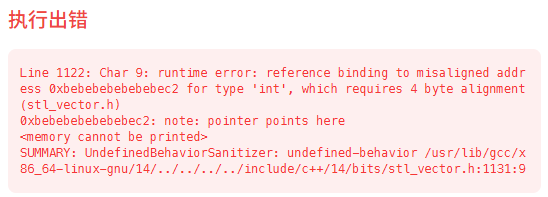
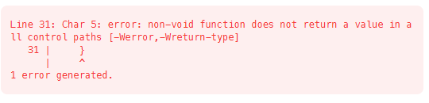

# leecode提交常见问题



这种一般是数组越界导致的空指针异常



这种是只在条件中return了 而在函数末尾没有return


# 每天都要看的

链表：

翻转链表 很多题都要用 一定不能错了

合并链表

排序链表

快慢指针

二叉树：递归/迭代

层次遍历

先序遍历

中序遍历

后序遍历


```c++
ListNode* reverse(ListNode* head)
{
    ListNode* prev = nullptr;
    ListNode* curr = head;

    while (curr)
    {
        ListNode* next = curr->next; // ① 保存

        curr->next = prev;           // ② 修改

        prev = curr;                 // ③ 推进prev
        curr = next;                 // ④ 推进curr
    }

    return prev;
}
```

