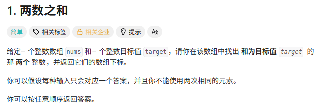
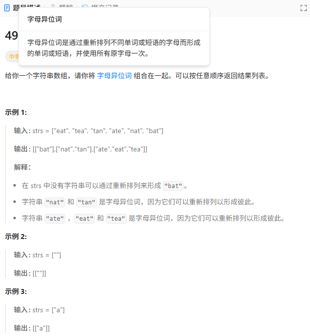
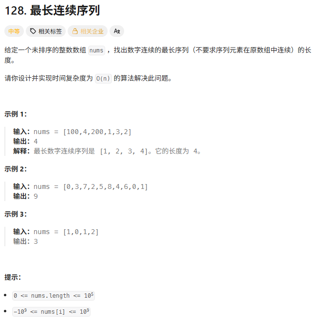

> [!NOTE]
>
> 哈希

# 两数之和



```c++
vector<int> twoSum(vector<int>& nums, int target) {
    unordered_map<int, int> map;

    for (int i = 0; i < nums.size(); i++) {
        int complement = target - nums[i]; // 我们要找的“另一半”

        // 1. 先回头看，map里有没有这个另一半？
        auto it = map.find(complement);
        if (it != map.end()) {
            // 找到了！直接返回 {另一半的下标, 当前下标}
            return {it->second, i};
        }

        // 2. 没找到，就把自己登记进 map，方便后面的数字来找我
        map[nums[i]] = i;
    }
    return {};
}
```

# 字母异位词分组



```c++
vector<vector<string>> groupAnagrams(vector<string>& strs) {
    // 这里的 Key 是排序后的字符串，Value 是原字符串列表
    unordered_map<string, vector<string>> map;

    for (string& str : strs) {
        string key = str;
        // 1. 获取身份证：排序
        // 例如 "tea" -> "aet"
        sort(key.begin(), key.end()); 

        // 2. 归类
        map[key].push_back(str);
    }

    // 3. 转换输出格式
    vector<vector<string>> ans;
    for (auto& pair : map) {
        ans.push_back(pair.second);
    }
    return ans;
}
```

# 最长连续序列

华为二面、字节二面



时间复杂度O(n)不能排序

```c++
int longestConsecutive(vector<int>& nums) {
    // 1. 放入 Set 去重且支持快速查找
    unordered_set<int> num_set;
    for (int num : nums) {
        num_set.insert(num);
    }

    int longestStreak = 0;

    for (int num : num_set) {
        // 2. 只有当 num 是序列起点时，才开始向后数
        // 如果 num-1 存在，说明 num 只是序列的一部分，不是起点，直接跳过
        if (!num_set.count(num - 1)) {
            int currentNum = num;
            int currentStreak = 1;

            // 3. 只要 currentNum + 1 存在，就继续数
            while (num_set.count(currentNum + 1)) {
                currentNum += 1;
                currentStreak += 1;
            }

            longestStreak = max(longestStreak, currentStreak);
        }
    }

    return longestStreak;
}
```

