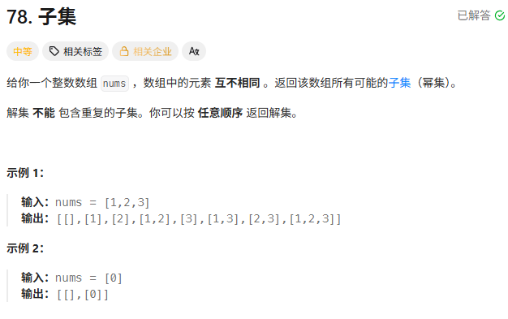
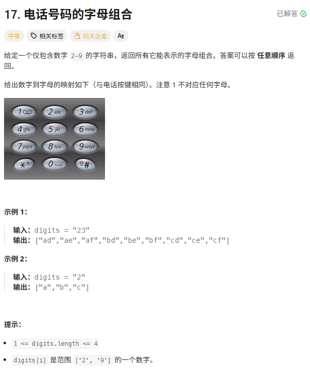
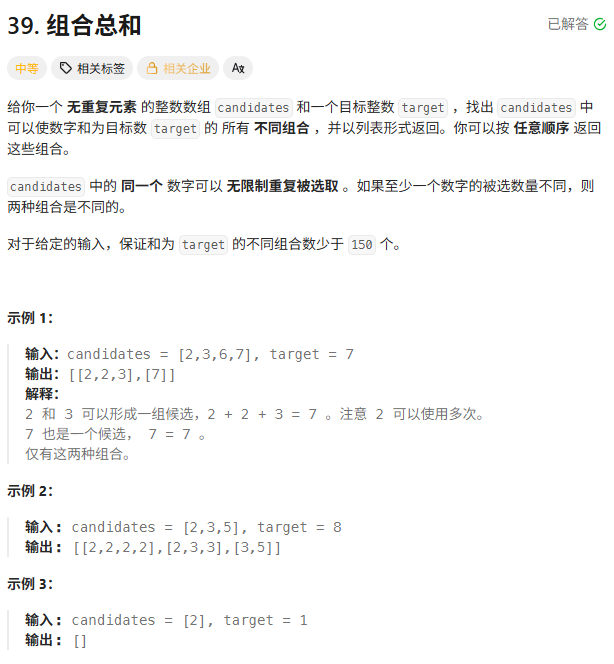
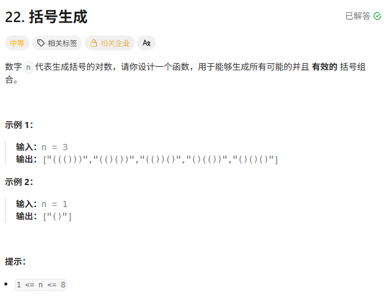
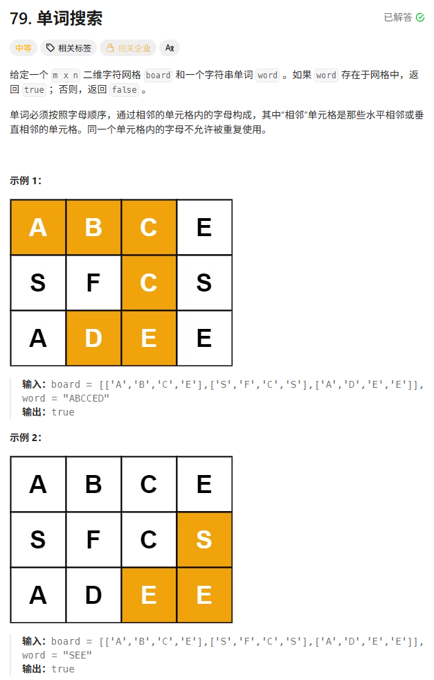
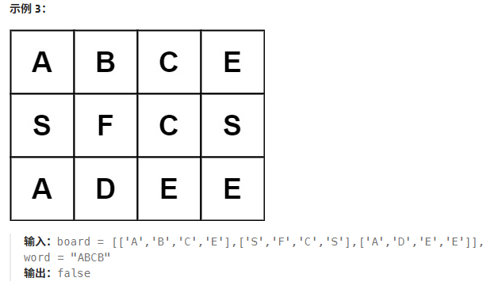
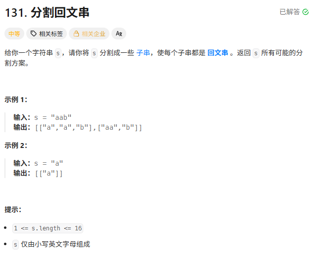
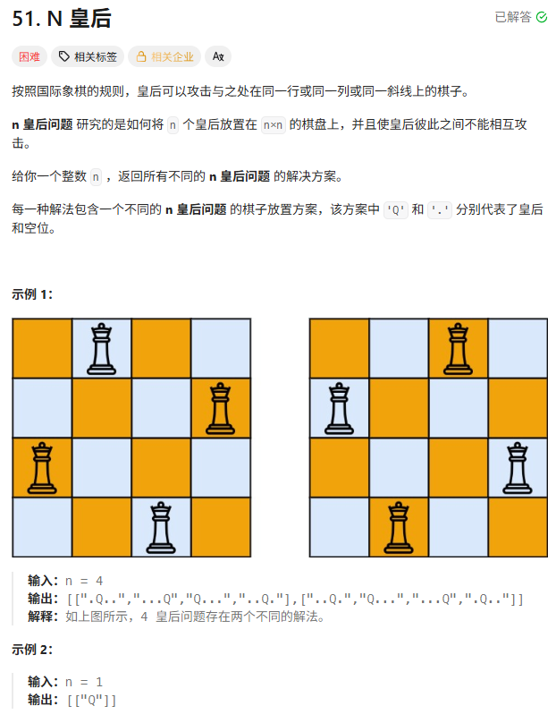

> [!NOTE]
>
> 回溯

# 常见回溯模板

**回溯的本质，是在“解空间树”上做带约束的深度优先搜索（DFS）。**

在解空间树上做深度优先搜索，并通过剪枝减少搜索规模。

```c++
for (每一种可能的选择) {
    做选择
    递归进入下一层
    撤销选择
}
```

## 回溯通用模板

```c++
void backtrack(参数...) {
    if (终止条件) {
        收集答案;
        return;
    }

    for (选择 in 当前可选列表) {
        做选择;
        backtrack(下一层参数);
        撤销选择;  // 回溯
    }
}
```

## 子集问题

- 每个元素只有 选/不选 两种状态
- 不需要used数组
- 从start位置往后选

```c++
vector<vector<int>> result;
vector<int> path;

void backtrack(vector<int>& nums, int start) {
    result.push_back(path);   // 每个节点都是答案

    for (int i = start; i < nums.size(); i++) {
        path.push_back(nums[i]);
        backtrack(nums, i + 1);
        path.pop_back();
    }
}
```

## 组合类问题

- 只关心选k个
- 用start控制顺序
- 可以剪枝

```c++
void backtrack(int n, int k, int start) {
    if (path.size() == k) {
        result.push_back(path);
        return;
    }

    for (int i = start; i <= n; i++) {
        path.push_back(i);
        backtrack(n, k, i + 1);
        path.pop_back();
    }
}
```

## 排列类问题

- 顺序不同算不同答案
- 需要 used 数组

```c++
vector<bool> used;

void backtrack(vector<int>& nums) {
    if (path.size() == nums.size()) {
        result.push_back(path);
        return;
    }

    for (int i = 0; i < nums.size(); i++) {
        if (used[i]) continue;

        used[i] = true;
        path.push_back(nums[i]);

        backtrack(nums);

        path.pop_back();
        used[i] = false;
    }
}
```

## 有重复元素的排列

```c++
sort(nums.begin(), nums.end());

for (int i = 0; i < nums.size(); i++) {
    if (used[i]) continue;

    if (i > 0 && nums[i] == nums[i - 1] && !used[i - 1])
        continue;

    used[i] = true;
    path.push_back(nums[i]);

    backtrack(nums);

    path.pop_back();
    used[i] = false;
}
```

## 字符串切割类

- 每层选择一个“区间”
- 需要判断合法性

```c++
void backtrack(string& s, int start) {
    if (start == s.size()) {
        result.push_back(path);
        return;
    }

    for (int i = start; i < s.size(); i++) {
        if (!合法判断(start, i)) continue;

        path.push_back(s.substr(start, i - start + 1));
        backtrack(s, i + 1);
        path.pop_back();
    }
}
```

## N皇后类

- 每一层代表一行
- 用数组记录列、对角线是否冲突

对角线数学表达式：

主对角线：

$row−colrow$

副对角线：

$row+colrow$

```c++
void backtrack(int row) {
    if (row == n) {
        result.push_back(board);
        return;
    }

    for (int col = 0; col < n; col++) {
        if (列冲突 || 对角线冲突) continue;

        放皇后;
        backtrack(row + 1);
        撤销皇后;
    }
}
```

# 全排列

```c++
vector<vector<int>> permute(vector<int>& nums) {
    result.clear();
    path.clear();

    // used数组：记录哪些元素已经被选进 path 了
    // 初始化全为 false
    vector<bool> used(nums.size(), false);

    backtracking(nums, used);
    return result;
}

void backtracking(vector<int>& nums, vector<bool>& used) {
    // 1. 结束条件：路径长度等于数组长度，说明找齐了一组
    if (path.size() == nums.size()) {
        result.push_back(path);
        return;
    }

    // 2. 遍历选择列表
    for (int i = 0; i < nums.size(); i++) {
        // 如果这个数字已经被用过了，跳过 (剪枝)
        if (used[i] == true) {
            continue;
        }

        // --- 做选择 ---
        used[i] = true;      // 标记为已用
        path.push_back(nums[i]); // 加入路径

        // --- 递归 (进入下一层) ---
        backtracking(nums, used);

        // --- 撤销选择 (回溯) ---
        // 为什么要撤销？因为要回到上一步，去尝试选别的数字
        path.pop_back();     // 移出路径
        used[i] = false;     // 标记为未用
    }
}
```

# 子集

| **特性**     | **全排列 (Permutations)** | **子集/组合 (Subsets/Combinations)** |
| ------------ | ------------------------- | ------------------------------------ |
| **关注点**   | 顺序 (Order)              | 元素内容 (Content)                   |
| **例子**     | `[1,2]` $\neq$ `[2,1]`    | `{1,2}` == `{2,1}`                   |
| **控制方式** | `used` 数组               | `startIndex` 指针                    |
| **循环起点** | `i = 0`                   | `i = startIndex`                     |
| **收集时机** | 叶子节点 (Len == N)       | 所有节点 (Every Node)                |



```c++
                   []
            /        |        \
          [1]       [2]      [3]
         /   \        \
     [1,2]  [1,3]    [2,3]
        |
     [1,2,3]
```

```c++
vector<vector<int>> subsets(vector<int>& nums) {
    result.clear();
    path.clear();

    // start_index 初始化为 0，从第一个数开始选
    backtracking(nums, 0);
    return result;
}

void backtracking(vector<int>& nums, int startIndex) {
    // 1. 收集结果
    // 注意：这里没有 if (结束条件) return; 
    // 因为我们要收集树上的所有节点，而不仅仅是叶子节点
    // 每次进来都存一份当前的 path
    result.push_back(path);

    // 2. 遍历选择列表
    // 关键：i 从 startIndex 开始，而不是从 0 开始
    for (int i = startIndex; i < nums.size(); i++) {

        // --- 做选择 ---
        path.push_back(nums[i]);

        // --- 递归 ---
        // 关键：下一层只能从 i + 1 开始选 (不走回头路，也不重复选自己)
        backtracking(nums, i + 1);

        // --- 撤销选择 ---
        path.pop_back();
    }
}
```

# 电话号码的字母组合



多个不同集合里做选择

```c++
// 0. 建立映射表 (0和1不对应任何字母，留空)
const string letterMap[10] = {
    "", "", "abc", "def", "ghi", "jkl", "mno", "pqrs", "tuv", "wxyz"
};

vector<string> result;
string path; // 用 string 来做路径，比 vector<char> 方便

vector<string> letterCombinations(string digits) {
    result.clear();
    path.clear();

    // 特殊情况：如果输入为空，直接返回空列表
    if (digits.empty()) {
        return result;
    }

    backtracking(digits, 0);
    return result;
}

// index: 当前我们要处理 digits 里的第几个数字
void backtracking(const string& digits, int index) {
    // 1. 结束条件：index 指向了字符串的末尾，说明所有数字都处理完了
    if (index == digits.size()) {
        result.push_back(path);
        return;
    }

    // 2. 找到当前数字对应的字母集合
    int digit = digits[index] - '0'; // 将 char '2' 转为 int 2
    string letters = letterMap[digit]; // 取出 "abc"

    // 3. 遍历这个集合 (每次都是从头开始遍历，因为是不同的集合)
    for (int i = 0; i < letters.size(); i++) {

        // --- 做选择 ---
        path.push_back(letters[i]); 

        // --- 递归 ---
        // 处理下一个数字 (index + 1)
        backtracking(digits, index + 1);

        // --- 撤销选择 ---
        path.pop_back();
    }
}
```

# 组合总和



```c++
class Solution {
    public:
    vector<vector<int>> result;
    vector<int> path;

    void backtrack(vector<int>& candidates, int target, int sum, int start) {

        if (sum == target) {
            result.push_back(path);
            return;
        }

        if (sum > target)
            return;

        for (int i = start; i < candidates.size(); i++) {

            path.push_back(candidates[i]);

            backtrack(candidates, target, sum + candidates[i], i);  
            // 注意这里是 i 不是 i+1，因为可以重复使用

            path.pop_back();
        }
    }

    vector<vector<int>> combinationSum(vector<int>& candidates, int target) {
        backtrack(candidates, target, 0, 0);
        return result;
    }
};
```

**允许重复选 ≠ 允许乱序选**

`start` 的作用不是控制“重复”，而是控制“顺序”。

它保证：$i_1 \le i_2 \le i_3 \le \dotsi$ 这样就不会出现：

```markdown
[2,3] 和 [3,2]
```

这种重复答案。

- 用 `i`（不是 i+1） → 允许重复选当前元素

- 用 `start` 控制起点 → 防止回头选前面的元素

优化版

```c++
vector<vector<int>> combinationSum(vector<int>& candidates, int target) {
    result.clear();
    path.clear();

    // 关键步骤：排序！为了后续的剪枝优化
    sort(candidates.begin(), candidates.end());

    backtracking(candidates, target, 0, 0);
    return result;
}

// sum: 当前路径的和
// startIndex: 当前从哪个下标开始选
void backtracking(vector<int>& candidates, int target, int sum, int startIndex) {
    // 1. 成功结束条件
    if (sum == target) {
        result.push_back(path);
        return;
    }
    // (注意：sum > target 的情况被下面的剪枝处理了，这里不需要写)

    // 2. 遍历选择列表
    for (int i = startIndex; i < candidates.size(); i++) {

        // --- 剪枝 (Pruning) ---
        // 如果当前选的这个数加起来已经超标了，那后面的数更大，肯定也超标
        // 直接 break，不要继续循环了
        if (sum + candidates[i] > target) {
            break;
        }

        // --- 做选择 ---
        path.push_back(candidates[i]);
        sum += candidates[i];

        // --- 递归 ---
        // 关键点：传入 i，而不是 i + 1
        // 表示下一层递归仍然可以从当前数字 candidates[i] 开始选
        backtracking(candidates, target, sum, i);

        // --- 撤销选择 ---
        sum -= candidates[i];
        path.pop_back();
    }
}
```

# 括号生成



注意这里是`left<n`和`right<left`不是`<=`因为要在`size==2*n`时判断

```c++
vector<string> generateParenthesis(int n) {
    result.clear();
    current.clear();

    // 初始状态：左括号用了0个，右括号用了0个
    backtracking(n, 0, 0);
    return result;
}

// left: 已经使用的左括号数量
// right: 已经使用的右括号数量
void backtracking(int n, int left, int right) {
    // 1. 结束条件：左右括号都用完了 (长度达到了 2*n)
    if (current.size() == 2 * n) {
        result.push_back(current);
        return;
    }

    // 2. 尝试放左括号
    // 规则：只要左括号没超标，就可以放
    if (left < n) {
        current.push_back('(');      // 做选择
        backtracking(n, left + 1, right); // 递归
        current.pop_back();          // 撤销选择
    }

    // 3. 尝试放右括号
    // 规则：只有右括号数量 小于 左括号数量时，才能放
    // (这样能保证任何时候都不会出现 "())" 这种非法前缀)
    if (right < left) {
        current.push_back(')');      // 做选择
        backtracking(n, left, right + 1); // 递归
        current.pop_back();          // 撤销选择
    }
}
```

# 单词搜索





```c++
bool exist(vector<vector<char>>& board, string word) {
    int rows = board.size();
    int cols = board[0].size();

    // 1. 遍历每一个格子作为起点
    for (int i = 0; i < rows; i++) {
        for (int j = 0; j < cols; j++) {
            // 如果找到了，直接返回 true (剪枝：只要找到一条就行)
            if (backtrack(board, word, i, j, 0)) {
                return true;
            }
        }
    }
    return false;
}

// i, j: 当前坐标
// k: 当前我们要匹配 word 里的第 k 个字符
bool backtrack(vector<vector<char>>& board, string& word, int i, int j, int k) {
    // 1. 结束条件：k 越界，说明 word 所有字符都匹配完了 -> 成功！
    if (k == word.size()) {
        return true;
    }

    // 2. 边界检查 & 字符匹配检查
    // 如果越界，或者当前格子字符不对，或者当前格子被占用了('#') -> 失败
    if (i < 0 || i >= board.size() || j < 0 || j >= board[0].size() || board[i][j] != word[k]) {
        return false;
    }

    // 3. --- 做选择 ---
    char temp = board[i][j]; // 暂存当前字符
    board[i][j] = '#';       // 标记为已占用 (防止走回头路)

    // 4. --- 递归 (向四个方向尝试) ---
    // 只要有一个方向能通，就返回 true
    bool found = backtrack(board, word, i + 1, j, k + 1) || // 下
        backtrack(board, word, i - 1, j, k + 1) || // 上
        backtrack(board, word, i, j + 1, k + 1) || // 右
        backtrack(board, word, i, j - 1, k + 1);   // 左

    // 5. --- 撤销选择 (回溯) ---
    board[i][j] = temp;      // 还原字符 (释放格子)

    return found;
}
```

# 分割回文子串



把字符串切割成若干段，使得每一段都是回文串，返回所有可能的分割方案。

$start=n$表示已经成功切到字符串末尾。

```c++
vector<vector<string>> result;
vector<string> path;

vector<vector<string>> partition(string s) {
    result.clear();
    path.clear();
    backtracking(s, 0);
    return result;
}

// startIndex: 切割线的位置
void backtracking(const string& s, int startIndex) {
    // 1. 结束条件：切割线切到了字符串末尾
    // 说明这一路切下来，每一段都是合法的回文串
    if (startIndex >= s.size()) {
        result.push_back(path);
        return;
    }

    // 2. 遍历切割点
    // i 代表当前这一刀切在哪个字符的后面
    // 子串范围: [startIndex, i]
    for (int i = startIndex; i < s.size(); i++) {

        // --- 判断是否回文 (剪枝) ---
        // 如果截取的这一段不是回文，就没必要往下走了
        if (isPalindrome(s, startIndex, i)) {

            // --- 做选择 ---
            // substr(起始位置, 长度)
            string sub = s.substr(startIndex, i - startIndex + 1);
            path.push_back(sub);

            // --- 递归 ---
            // 这一刀切到了 i，下一刀从 i + 1 开始切
            backtracking(s, i + 1);

            // --- 撤销选择 ---
            path.pop_back();
        }
    }
}

// 辅助函数：判断 s[start...end] 是否回文 (双指针)
bool isPalindrome(const string& s, int start, int end) {
    for (int i = start, j = end; i < j; i++, j--) {
        if (s[i] != s[j]) {
            return false;
        }
    }
    return true;
}
```

# N皇后



```c++
vector<vector<string>> result;
// chessboard: 用 string 数组来表示棋盘，'.' 表示空，'Q' 表示皇后
// 比如 n=4:
// [".Q..",
//  "...Q",
//  "Q...",
//  "..Q."]

vector<vector<string>> solveNQueens(int n) {
    result.clear();
    // 初始化棋盘，全部填 '.'
    vector<string> chessboard(n, string(n, '.'));

    backtracking(n, 0, chessboard);
    return result;
}

// n: 棋盘大小
// row: 当前正在处理第几行
void backtracking(int n, int row, vector<string>& chessboard) {
    // 1. 结束条件：row 等于 n，说明 0 到 n-1 行都已经放好了皇后
    if (row == n) {
        result.push_back(chessboard);
        return;
    }

    // 2. 遍历列：在当前行 (row)，尝试每一列 (col)
    for (int col = 0; col < n; col++) {

        // --- 剪枝 (检查位置是否合法) ---
        if (isValid(row, col, chessboard, n)) {

            // --- 做选择 ---
            chessboard[row][col] = 'Q';

            // --- 递归 (去下一行) ---
            backtracking(n, row + 1, chessboard);

            // --- 撤销选择 (回溯) ---
            chessboard[row][col] = '.';
        }
    }
}

// 辅助函数：检查在 (row, col) 放皇后是否合法
// 只需要检查：列、左上角、右上角 (因为是自顶向下放的，不需要检查下面)
bool isValid(int row, int col, vector<string>& chessboard, int n) {
    // 1. 检查列 (正上方)
    for (int i = 0; i < row; i++) {
        if (chessboard[i][col] == 'Q') {
            return false;
        }
    }

    // 2. 检查 45度角 (左上角)
    // i 往上走，j 往左走
    for (int i = row - 1, j = col - 1; i >= 0 && j >= 0; i--, j--) {
        if (chessboard[i][j] == 'Q') {
            return false;
        }
    }

    // 3. 检查 135度角 (右上角)
    // i 往上走，j 往右走
    for (int i = row - 1, j = col + 1; i >= 0 && j < n; i--, j++) {
        if (chessboard[i][j] == 'Q') {
            return false;
        }
    }

    return true;
}
```

