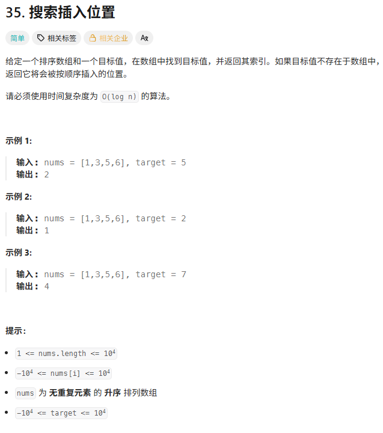
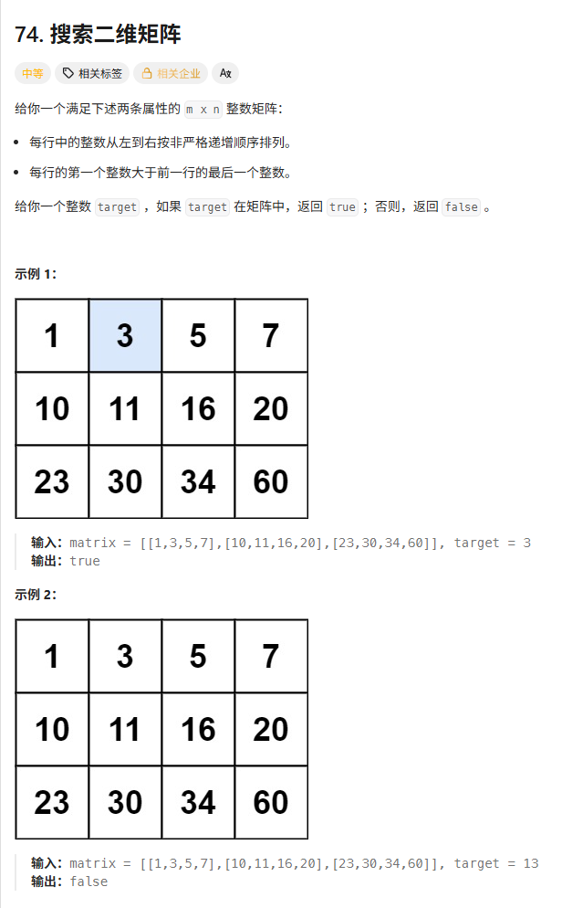
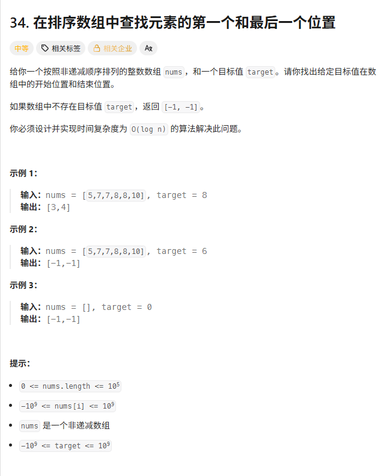
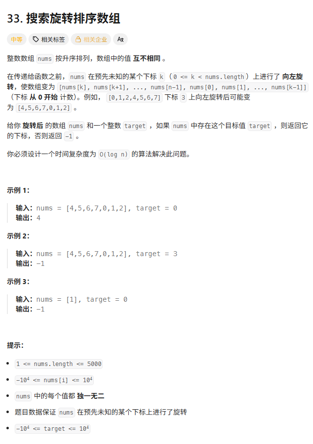
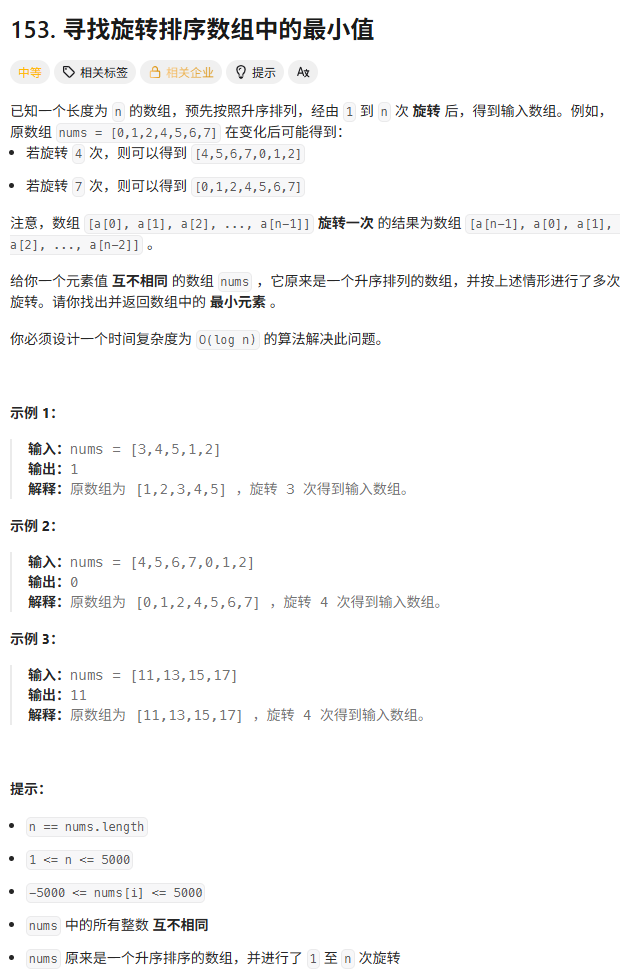
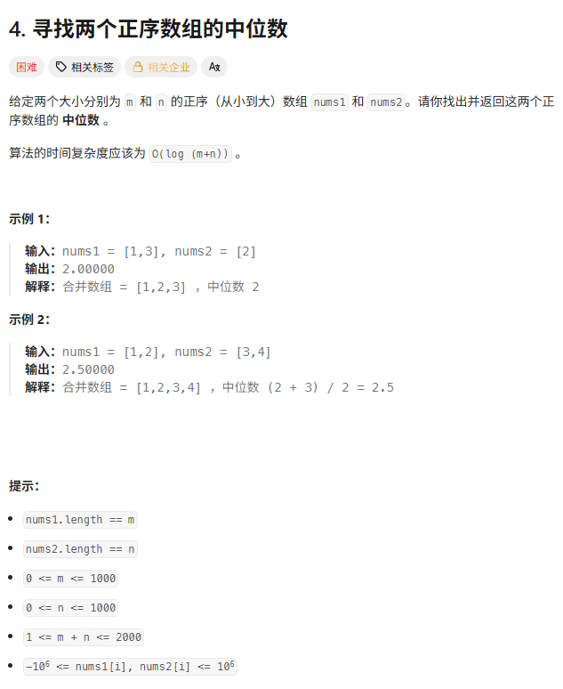

> [!NOTE]
>
> 二分

# 搜索插入位置



```c++
class Solution {
    public:
    int searchInsert(vector<int>& nums, int target) {
        int left = 0;
        int right = nums.size() - 1; // 1. 定义闭区间 [0, n-1]

        // 2. 允许 left == right，防止漏掉最后一个元素
        while (left <= right) { 
            // 防止溢出的写法 (虽然这题数据规模不大，但这是好习惯)
            int mid = left + (right - left) / 2;

            if (nums[mid] > target) {
                right = mid - 1; // target 在左区间 [left, mid-1]
            } else if (nums[mid] < target) {
                left = mid + 1;  // target 在右区间 [mid+1, right]
            } else {
                return mid;      // 找到了
            }
        }

        // 3. 核心难点：为什么返回 left？
        // 当循环结束时，left 一定是 right + 1。
        // 此时 left 指向的位置，就是“第一个大于 target 的元素的位置”，
        // 也就是 target 应该插入的位置。
        return left; 
    }
};
```

使用左闭右闭区间 `[left, right]`流派

使用条件`while(left<=right)`保证当right==left时，数组剩最后一个元素时，也要检查这个元素。

# 搜索二维矩阵



```c++
class Solution {
public:
	bool searchMatrix(vector<vector<int>>matrix, int target) {
		int m = matrix.size(), n = matrix[0].size();
		int left = 0, right = m * n - 1;
		while (left <= right) {
			int mid = (left + right) / 2;
			int row = mid / n;
			int col = mid % n;
			int val = matrix[row][col];
			if (val > target) {
				right = mid - 1;
			}
			else if (val < target) {
				left = mid + 1;
			}
			else {
				return true;
			}
		}
		return false;
	}
};
```

# 在排序数组中查找第一个和最后一个位置



**寻找边界**

```c++
class Solution {
    public:
        vector<int> searchRange(vector<int>& nums, int target) {
            int leftBorder = findLeft(nums, target);
            int rightBorder = findRight(nums, target);
            
            // 如果左边界没找到，那右边界肯定也找不到
            if (leftBorder == -1) {
                return {-1, -1};
            }
            return {leftBorder, rightBorder};
        }

    private:
        // 寻找左边界 (First Position)
        int findLeft(vector<int>& nums, int target) {
            int left = 0, right = nums.size() - 1;
            int result = -1; // 用一个变量记录最近一次遇到的 target

            while (left <= right) {
                int mid = left + (right - left) / 2;
                
                if (nums[mid] == target) {
                    result = mid;     // 1. 先记下来：我这就有一个 target
                    right = mid - 1;  // 2. 关键：别停，继续向左压缩！看看左边还有没有
                } 
                else if (nums[mid] > target) {
                    right = mid - 1;
                } 
                else {
                    left = mid + 1;
                }
            }
            return result;
        }

        // 寻找右边界 (Last Position)
        int findRight(vector<int>& nums, int target) {
            int left = 0, right = nums.size() - 1;
            int result = -1;

            while (left <= right) {
                int mid = left + (right - left) / 2;
                
                if (nums[mid] == target) {
                    result = mid;     // 1. 先记下来
                    left = mid + 1;   // 2. 关键：别停，继续向右压缩！看看右边还有没有
                } 
                else if (nums[mid] > target) {
                    right = mid - 1;
                } 
                else {
                    left = mid + 1;
                }
            }
            return result;
        }
};
```

# 寻找旋转排序数组



```c++
class Solution {
    public:
    int search(vector<int>& nums, int target) {
        int left = 0;
        int right = nums.size() - 1;

        while (left <= right) {
            int mid = left + (right - left) / 2;

            if (nums[mid] == target) {
                return mid;
            }

            // --- 核心判断：哪一半是有序的？---

            // 1. 左半边 [left, mid] 是有序的
            if (nums[left] <= nums[mid]) {
                // target 就在这个有序区间里吗？
                if (nums[left] <= target && target < nums[mid]) {
                    right = mid - 1; // 在，那就砍掉右边
                } else {
                    left = mid + 1;  // 不在，那就去右边找
                }
            }
            // 2. 右半边 [mid, right] 是有序的
            else {
                // target 就在这个有序区间里吗？
                if (nums[mid] < target && target <= nums[right]) {
                    left = mid + 1;  // 在，那就砍掉左边
                } else {
                    right = mid - 1; // 不在，那就去左边找
                }
            }
        }
        return -1;
    }
};
```

**无论怎么切，数组被 `mid` 一分为二后，其中一半一定是“有序”的。**

每次算出 `mid` 后，我们将 `nums[mid]` 与 `nums[left]`（最左边）进行比较：

1. **情况 A：`nums[left] <= nums[mid]`**
   - **含义**：`left` 到 `mid` 是一路爬升的。说明 **[left, mid] 是有序的**（位于高坡）。
   - **决策**：
     - 如果 `target` 刚好落在这个有序区间里（`nums[left] <= target < nums[mid]`），那我们就去左边找（`right = mid - 1`）。
     - 否则：`target` 肯定在右边那个乱七八糟的区间里，去右边找（`left = mid + 1`）。
2. **情况 B：`nums[left] > nums[mid]`**
   - **含义**：`left` 比 `mid` 还大，说明中间经历了断崖。那么 **[mid, right] 必然是有序的**（位于矮坡）。
   - **决策**：
     - 如果 `target` 刚好落在这个有序区间里（`nums[mid] < target <= nums[right]`），那我们就去右边找（`left = mid + 1`）。
     - 否则：`target` 肯定在左边那个乱七八糟的区间里，去左边找（`right = mid - 1`）。

> 为什么是 `nums[left]<=nums[mid]`?

主要是为了处理 `left == mid` 的情况（比如只有两个元素 `[3, 1]`）。

当 `left == mid` 时，我们可以认为左边（只有一个元素）是有序的，逻辑依然成立。

> 为什么是`nums[left] <= target`和`target <= nums[right]`

如果不是`<=`那么nums[left] == target时永远不会进入判断，导致漏解。

> 与下一道题最小值这道题比较

**找最小值**：我们只关心“断崖”在哪，所以和 `nums[right]` 比。

**搜索 Target**：我们需要判断区间范围，所以和 `nums[left]` 比（确定左区间是否有序）或者和 `nums[right]` 比（确定右区间是否有序）都可以。通常习惯和 `left` 比，方便写 `nums[left] <= target < nums[mid]` 这种范围判断。

### 我的另一种思路

```c++
int search(vector<int>& nums, int target) {
	int left = 0;
	int right = nums.size() - 1;
	int n = nums.size() - 1;
	while (left <= right) {
		int mid = (left + right) / 2;
		if (nums[mid] == target) {
			return mid;
		}
		if (target > nums[n]) {
			if (nums[mid] > nums[n] && nums[mid] > target) {
				right = mid - 1;
			}
			else if (nums[mid] > nums[n] && nums[mid] < target)
			{
				left = mid + 1;
			}
			else {
				right = mid - 1;
			}
		}
		else {
			if (nums[mid] < nums[n] && nums[mid] < target) {
				left = mid + 1;
			}
			else if (nums[mid] < nums[n] && nums[mid] > target)
			{
				right = mid - 1;
			}
			else {
				left = mid + 1;
			}
		}

	}
	return -1;
}
```

啰嗦了一点 但是也还行吧

优化之后

```c++
int search(vector<int>& nums, int target) {
    int left = 0;
    int right = nums.size() - 1;
    int n = nums.size() - 1;

    while (left <= right) {
        int mid = (left + right) / 2;

        if (nums[mid] == target) {
            return mid;
        }

        bool targetLeft = target > nums[n];
        bool midLeft = nums[mid] > nums[n];

        // ✅ 在同一段：正常二分
        if (targetLeft == midLeft) {
            if (nums[mid] > target) {
                right = mid - 1;
            } else {
                left = mid + 1;
            }
        }
        // ❗ 不在同一段：直接跳
        else {
            if (targetLeft) {
                // target 在左段，mid 在右段
                right = mid - 1;
            } else {
                // target 在右段，mid 在左段
                left = mid + 1;
            }
        }
    }

    return -1;
}
```

# 寻找旋转排序数组中的最小值



```c++
class Solution {
    public:
    int findMin(vector<int>& nums) {
        int left = 0;
        int right = nums.size() - 1;

        // 循环条件 left < right
        // 当 left == right 时，说明区间只剩一个元素，那就是最小值
        while (left < right) {
            int mid = left + (right - left) / 2;

            // 情况 1: mid 在左半段 (高坡)
            // 说明最小值肯定在右边，且 mid 不可能是最小值
            if (nums[mid] > nums[right]) {
                left = mid + 1;
            }
            // 情况 2: mid 在右半段 (矮坡)
            // 说明最小值在左边，或者就是 mid 自己
            else {
                right = mid; // ⚠️ 注意这里不减 1
            }
        }
        // 循环结束时 left == right，指向的就是最小值
        return nums[left];
    }
};
```

**情况 A：`nums[mid] > nums[right]`**

- **含义**：`mid` 的值比最右边还大。说明 `mid` 还在 **左半段（高坡）** 上。
- **推论**：最小值（断崖）肯定在 `mid` 的 **右边**。
- **行动**：`left = mid + 1`。

**情况 B：`nums[mid] < nums[right]`**

- **含义**：`mid` 的值比最右边小。说明 `mid` 已经在 **右半段（矮坡）** 上了。
- **推论**：最小值可能是 `mid` 自己，也可能在 `mid` 的 **左边**（如果 `mid` 后面还有更小的）。
- **行动**：`right = mid`。
  - **注意**：这里不是 `mid - 1`，因为 `mid` 自己可能就是那个最小值，不能排除掉。

**为什么是 `while (left < right)` 而不是 `<=`？**

- 之前的题目（找 target），我们有可能在 `mid` 就找到了并返回，所以要一直缩到空为止。
- 这道题我们是要**逼近**到一个点。当 `left == right` 时，我们就锁定了唯一的嫌疑人，此时不需要再进循环判断了，直接输出它即可。

### 如果用left<=right的话

```c++
int findMin(vector<int> nums) {
    int left = 0;
    int right = nums.size() - 1;
    int rightval = nums[right];
    while (left <= right) {
        int mid = (left + right) / 2;			
        if (nums[mid] > rightval) {
            left = mid + 1;
        }
        else {
            right = mid - 1;
        }
    }
    return nums[left];
}
```

这样也可以

# 寻找两个正序数组中的中位数[Hard]



```c++
double findMedianSortedArrays(vector<int>& A, vector<int>& B) {
    if (A.size() > B.size())
        return findMedianSortedArrays(B, A);

    int m = A.size(), n = B.size();
    int left = 0, right = m;

    while (left <= right) {
        int i = (left + right) / 2;
        int j = (m + n + 1) / 2 - i;
		
        //i和j最大不是m-1和n-1 因为i和j不是数组下标而是指划分位置
        int L1 = (i == 0) ? INT_MIN : A[i - 1];
        int R1 = (i == m) ? INT_MAX : A[i];
        int L2 = (j == 0) ? INT_MIN : B[j - 1];
        int R2 = (j == n) ? INT_MAX : B[j];
		
        //注意这里是<=而不是<
        if (L1 <= R2 && L2 <= R1) {
            if ((m + n) % 2 == 1)
                return max(L1, L2);
            else
                return (max(L1, L2) + min(R1, R2)) / 2.0;
        }
        else if (L1 > R2) {
            right = i - 1;
        }
        else {
            left = i + 1;
        }
    }
    return 0.0;
}
```

```c++
double findMedianSortedArrays(vector<int>& nums1, vector<int>& nums2) {
    // 1. 始终保证 nums1 是较短的那个数组
    // 这样我们二分 nums1 时，算出来的 j 肯定不会越界
    if (nums1.size() > nums2.size()) {
        return findMedianSortedArrays(nums2, nums1);
    }

    int m = nums1.size();
    int n = nums2.size();

    // 左半边需要的元素总个数 (m + n + 1) / 2
    // 这种写法既能处理奇数总长，也能处理偶数总长
    int totalLeft = (m + n + 1) / 2;

    // 2. 在 nums1 上进行二分查找
    // 我们要找的是分割线 i 的位置，i 的取值范围是 [0, m]
    int left = 0;
    int right = m;

    while (left <= right) {
        // i: nums1 分割线右边的第一个元素下标 (即 nums1 左边分得 i 个)
        int i = left + (right - left) / 2;
        // j: nums2 分割线右边的第一个元素下标 (即 nums2 左边分得 j 个)
        int j = totalLeft - i;

        // 处理边界值：如果分割线在最左/最右，用无穷值代替
        int nums1LeftMax = (i == 0) ? INT_MIN : nums1[i - 1];
        int nums1RightMin = (i == m) ? INT_MAX : nums1[i];
        int nums2LeftMax = (j == 0) ? INT_MIN : nums2[j - 1];
        int nums2RightMin = (j == n) ? INT_MAX : nums2[j];

        // 3. 交叉判断
        if (nums1LeftMax > nums2RightMin) {
            // A左边太大 -> i 往左移
            right = i - 1;
        } else if (nums2LeftMax > nums1RightMin) {
            // B左边太大 (A拿少了) -> i 往右移
            left = i + 1;
        } else {
            // 4. 完美分割！计算中位数

            // 如果总长度是奇数，中位数就是左半边的最大值
            if ((m + n) % 2 == 1) {
                return max(nums1LeftMax, nums2LeftMax);
            }
            // 如果总长度是偶数，中位数是 (左大 + 右小) / 2
            else {
                return (max(nums1LeftMax, nums2LeftMax) + min(nums1RightMin, nums2RightMin)) / 2.0;
            }
        }
    }
    return 0.0;
}
```

在 `nums1` 和 `nums2` 中，各切一刀
 左边一共放 **一半元素**，右边放另一半

```latex
nums1:  [   |   ]
nums2:  [     |   ]

左半部分元素总数 = 右半部分元素总数（或多 1）
```

## 这道题为什么能二分？

**答案所在的位置，关于一个变量，具有单调性**

> 1.二分的对象到底是谁？

被二分的是：**切分位置 `i`**

我们固定在 `nums1` 上：

```latex
nums1: [ 0 ... i-1 | i ... ]
```

 `i` 表示：

 **nums1 左边取多少个数**

>  2.单调性在哪里

判断 A：`L1 > R2` 是否成立

当你 **增大 `i`** 时：

- `L1 = nums1[i-1]` **不减**
- `R2 = nums2[j]`，而 `j = const - i`  **不增**

L1−R2是一个单调递增的量

一旦 `L1 > R2` 成立

再继续增大 `i`，**只会更严重**

这就是 **二分的根基**

> 3.二分如何排除

```c++
nums1: [ |   ]
nums2: [      | ]
```

i太小时

nums1左边太少、nums2左边太多

i应该左边的区间都被排除，所以left=i+1

```c++
nums1: [     | ]
nums2: [ |   ]
```

i太大时

nums1左边太多、nums2左边太少

i右边的区间都被排除，所以right=i-1

## 其它疑问

> 为什么`L1 = nums1[i-1]`，`R1 = nums1[i]`？

i表示nums1左边选了多少元素

左边最后一个元素下标i-1

右边第一个元素下标i

> 为什么m+n+1可以处理奇数和偶数

情况 1：`m+n` 是奇数

设 `m+n = 2k+1`
$$
\frac{2k+2}{2}=k+1
$$


```
左边 k+1 个
右边 k 个
```

中位数 = 左边最后一个`max(L1,L2)`

情况 2：`m+n` 是偶数

设 `m+n = 2k`
$$
\frac{2k+1}{2}=k
$$


```
左边 k 个
右边 k 个
```

中位数 = 左右边界平均

> 为什么奇数时返回 `max(L1, L2)`？

奇数时，中位数为整体左边最大值 整体左边最大值就是nums1左边最大值和nums2左边做大值的最大值。

# 双指针做法

