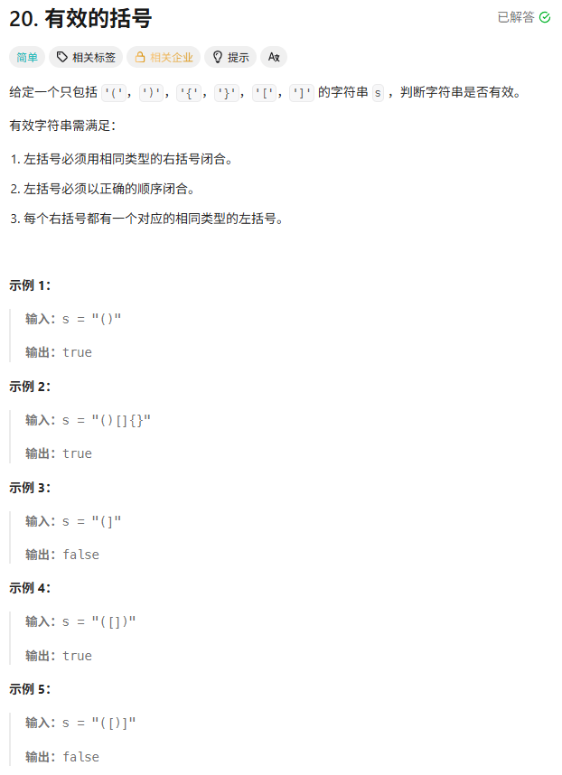
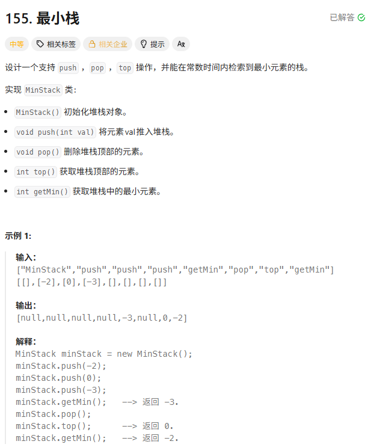
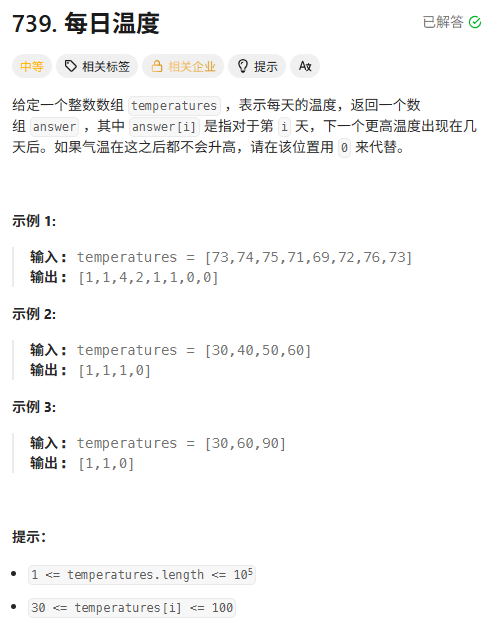
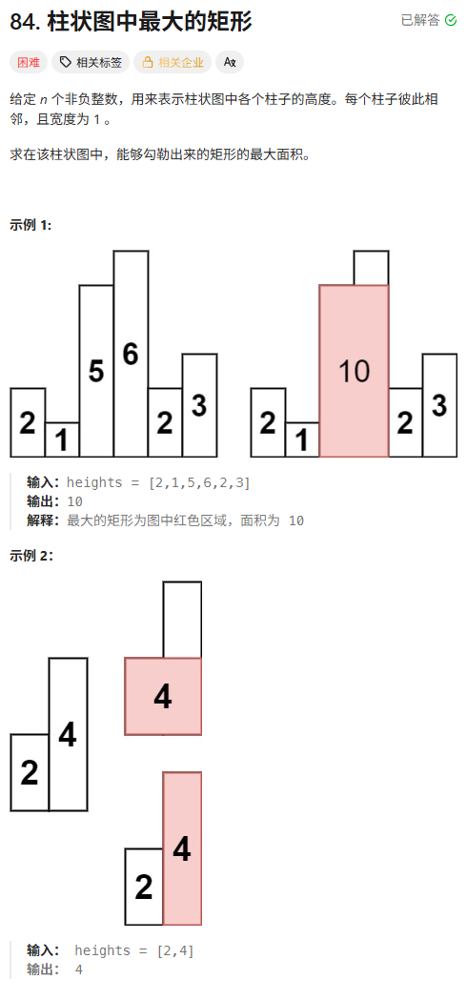

> [!NOTE]
>
> 栈

# 单调栈

用于解决**找某一个元素左边/右边第一个比它大/小的元素**

```c++
for (int i = 0; i < n; i++) {
    while (!st.empty() && 不满足单调性) {
        // 处理栈顶
        st.pop();
    }
    st.push(i);
}
```

在这里**while 本身就隐含了 if 判断**，因为while条件不成立根本不会进入循环。

而单调栈有一个非常重要的性质：

$\text{每个元素都必须入栈一次}$

入栈是无条件的，只是入栈前可能要清算。

# 有效的括号



```c++
bool isValid(string s) {
    // 如果长度是奇数，绝对不可能成对
    if (s.size() % 2 != 0) return false;

    stack<char> st;

    for (char c : s) {
        if (c == '(') {
            st.push(')'); // 存入期望遇到的另一半
        } else if (c == '[') {
            st.push(']');
        } else if (c == '{') {
            st.push('}');
        } else {
            // 此时 c 是右括号
            // 情况1: 栈空了 (右括号多了，例如 "])")
            // 情况2: 栈顶不是 c (类型不匹配，例如 "(]")
            if (st.empty() || st.top() != c) {
                return false;
            }
            // 匹配成功，弹出栈顶
            st.pop();
        }
    }

    // 循环结束，栈必须为空才算完全匹配
    // (防止左括号多了，例如 "(()")
    return st.empty();
}
```

# 最小栈



```c++
class MinStack {
    private:
    // 普通栈，存所有数据
    stack<int> s;
    // 辅助栈，只存递减的最小值
    stack<int> min_stack;

    public:
    MinStack() {
        // 构造函数，不需要做特殊初始化
    }

    void push(int val) {
        // 1. 主栈必进
        s.push(val);

        // 2. 辅助栈进不进？
        // 如果辅助栈为空，或者 val 比当前最小值还小（或相等），就进
        // 注意：这里必须是 <=，不能是 <。因为如果来了两个 2，都要存，
        // 否则弹出一个 2 之后，最小值就丢了。
        if (min_stack.empty() || val <= min_stack.top()) {
            min_stack.push(val);
        }
    }

    void pop() {
        // 1. 获取主栈要弹出的值
        int topVal = s.top();
        s.pop();

        // 2. 如果弹出的值等于当前的最小值，辅助栈也要弹
        if (topVal == min_stack.top()) {
            min_stack.pop();
        }
    }

    int top() {
        return s.top();
    }

    int getMin() {
        return min_stack.top();
    }
};
```

# 字符串解码

双栈法：

`nums` 栈：存倍数。

`strs` 栈：存之前拼好的前缀。

```c++
string decodeString(string s) {
    stack<int> nums;
    stack<string> strs;

    int currNum = 0;
    string currStr = "";

    for (char c : s) {
        if (isdigit(c)) {
            // 1. 处理数字 (可能是多位数，比如 100[a])
            currNum = currNum * 10 + (c - '0');
        } 
        else if (c == '[') {
            // 2. 遇到 [ : 存档，进栈
            nums.push(currNum);
            strs.push(currStr);

            // 清空状态，准备处理括号里面的
            currNum = 0;
            currStr = "";
        } 
        else if (c == ']') {
            // 3. 遇到 ] : 读档，出栈，组装
            int k = nums.top(); nums.pop();      // 之前的倍数
            string prevStr = strs.top(); strs.pop(); // 之前的前缀

            // 组装：prevStr + (currStr * k)
            for (int i = 0; i < k; i++) {
                prevStr += currStr;
            }
            // 更新当前字符串为组装后的结果
            currStr = prevStr;
        } 
        else {
            // 4. 普通字符 : 直接追加
            currStr += c;
        }
    }
    return currStr;
}
```

## 递归做法

这道题也可以用递归做

递归做法使用天然的“函数调用栈”代替手动维护的stack

```c++
string decodeString(string s) {
    int i = 0;
    return dfs(s, i);
}

// 注意：这里的 i 必须是引用传递 (int&)，
// 这样递归里走过的路，回到上一层时才不会重复走。
string dfs(string& s, int& i) {
    string res = "";
    int k = 0;

    while (i < s.size()) {
        if (isdigit(s[i])) {
            // 1. 计算倍数 k
            k = k * 10 + (s[i] - '0');
            i++;
        } 
        else if (s[i] == '[') {
            // 2. 遇到 [，交给下一层递归去解析括号里的内容
            i++; // 跳过 '['
            string temp = dfs(s, i);
            i++; // 跳过 ']' (递归回来后，i 指向的一定是 ']')

            // 3. 将递归返回的结果重复 k 次
            while (k > 0) {
                res += temp;
                k--;
            }
        } 
        else if (s[i] == ']') {
            // 4. 遇到 ]，说明当前这一层的任务结束了，返回结果
            // 注意：这里不需要 i++，留给上一层去跳过
            return res;
        } 
        else {
            // 5. 普通字符
            res += s[i];
            i++;
        }
    }
    return res;
}
```

# 每日温度



把**索引**压入栈里。

**栈里的规则**：只能存 **“还没找到更高温度的日子”**，而且这些日子对应的温度必须是 **单调递减** 的。

遍历每一天 `i`，温度为 `T[i]`。

**检查栈顶**：看看栈顶的那一天（`prev_index`）的温度 `T[prev_index]` 是不是比 `T[i]` 小？

- **如果是**：说明栈顶那天终于等到了比它暖和的日子（就是当前 `i`）！
  - **结算**：`answer[prev_index] = i - prev_index`（距离）。
  - **出栈**：`pop` 掉栈顶。
  - **继续检查**：新的栈顶可能也比 `T[i]` 小，继续结算，直到栈空或栈顶比当前大。

**入栈**：当前这天 `i` 还没找到比它暖和的（因为它刚来），所以把 `i` 压入栈中，等待未来的人来解救它。

```c++
vector<int> dailyTemperatures(vector<int>& temperatures) {
    int n = temperatures.size();
    vector<int> ans(n, 0); // 初始化全为 0
    stack<int> st; // 单调栈，存的是下标 (Index)

    for (int i = 0; i < n; i++) {
        // 当栈不为空，且当前温度大于栈顶那天的温度时
        // 说明栈顶那天等到了升温
        while (!st.empty() && temperatures[i] > temperatures[st.top()]) {
            int prevIndex = st.top();
            st.pop();

            // 计算等待天数
            ans[prevIndex] = i - prevIndex;
        }

        // 当前天入栈等待
        st.push(i);
    }

    return ans;
}
```

# 柱状图中的最大矩形



对于任意一个柱子 i：

如果我们 **强行规定它是矩形的最矮柱子**

左边第一个比它小的位置为 L

右边第一个比它小的位置为 R

宽度：$width=R−L−1$

面积：$area_i = heights[i] \times (R - L - 1)$

从左往右遍历。

当遇到当前柱子比栈顶小：

说明：

栈顶这个柱子的“右边界”找到了！

它的右边第一个更小元素就是 i。

那左边第一个更小元素呢？在单调栈里。

```c++
int largestRectangleArea(vector<int>& heights) {
    int n = heights.size();
    // 1. 加上哨兵: 首尾各加一个 0
    // 这样可以省去判断栈空，并且保证最后所有元素都能出栈计算
    vector<int> newHeights(n + 2);
    newHeights[0] = 0;
    newHeights[n + 1] = 0;
    for (int i = 0; i < n; i++) {
        newHeights[i + 1] = heights[i];
    }

    stack<int> st; // 单调递增栈 (存下标)
    st.push(0);    // 先把左边的哨兵压入
    int maxArea = 0;

    // 2. 遍历新的数组
    for (int i = 1; i < newHeights.size(); i++) {
        // 当当前高度 < 栈顶高度时，说明栈顶元素遇到"右边界"了，可以结算了
        while (newHeights[i] < newHeights[st.top()]) {
            int curIndex = st.top(); 
            st.pop();

            int curHeight = newHeights[curIndex];
            // 弹出后，新的栈顶就是"左边界"
            int leftIndex = st.top();
            int rightIndex = i;

            // 3. 计算面积
            // 宽度 = 右边界 - 左边界 - 1
            int width = rightIndex - leftIndex - 1;
            maxArea = max(maxArea, curHeight * width);
        }
        // 当前元素入栈
        st.push(i);
    }

    return maxArea;
}
```

