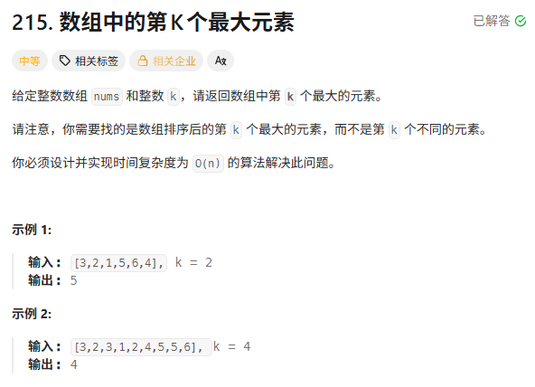
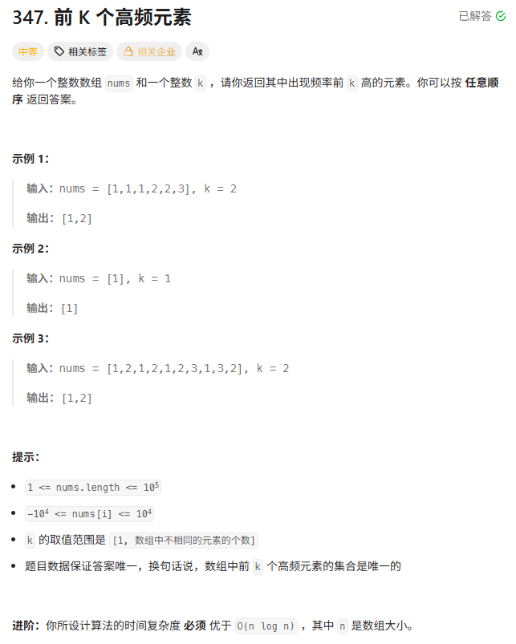
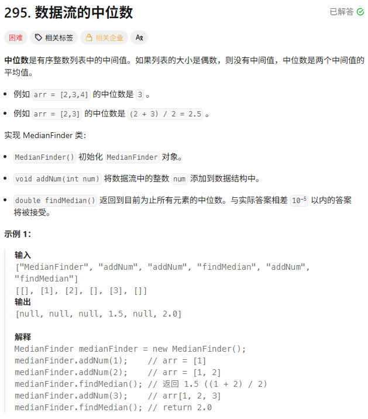

> [!NOTE]
>
> 堆

# 数组中第K个最大元素



基于大根堆的做法

```c++
int findKthLargest(vector<int>& nums, int k) {
    priority_queue<int> pq;
    for (auto num : nums) {
        pq.push(num);
    }
    int cnt = k - 1;
    while (cnt--) {
        pq.pop();

    }
    return pq.top();
}
```

基于小根堆的做法

```c++
int findKthLargest(vector<int>& nums, int k) {
    auto lmd = [](int a, int b) {return a > b; };
    priority_queue<int, vector<int>, decltype(lmd)> pq;
    for (auto num : nums) {
        pq.push(num);
        if (pq.size() > k) {
            pq.pop();
        }
    }
    return pq.top();
}
```

# 前K个高频元素

字节一二面



使用小根堆来解

```c++
vector<int> topKFrequent(vector<int>& nums, int k) {
    // 1. 统计频率 map: <数字, 频率>
    unordered_map<int, int> countMap;
    for (int num : nums) {
        countMap[num]++;
    }

    // 2. 定义小顶堆: 存 pair<频率, 数字>
    // greater<pair<int, int>> 会按照 pair.first (频率) 从小到大排
    priority_queue<pair<int, int>, vector<pair<int, int>>, greater<pair<int, int>>> pq;

    // 3. 遍历 map，维护大小为 k 的堆
    for (auto& it : countMap) {
        int num = it.first;
        int freq = it.second;

        pq.push({freq, num});

        if (pq.size() > k) {
            pq.pop(); // 踢出频率最低的
        }
    }

    // 4. 收集结果 (堆里剩下的就是前 K 高频)
    vector<int> result;
    while (!pq.empty()) {
        result.push_back(pq.top().second); // 取出数字
        pq.pop();
    }

    return result;
}
```

使用大根堆来解

```c++
vector<int> topKFrequent(vector<int>& nums, int k) {
    vector<int> ans;
    unordered_map<int, int> hash_map;

    for (auto num : nums) {
        hash_map[num]++;
    }

    auto cmp = [](const pair<int,int>& a, const pair<int,int>& b) {
        return a.second < b.second;
    };

    priority_queue<
        pair<int,int>,
        vector<pair<int,int>>,
        decltype(cmp)
    > pq(hash_map.begin(), hash_map.end(), cmp);

    while (k-- && !pq.empty()) {
        ans.push_back(pq.top().first);
        pq.pop();
    }

    return ans;
}                   
```

# 数据流的中位数



#### 核心思路：双堆对顶

中位数的本质是什么？是把一堆数**一分为二**的那个分界线。

如果我们可以维护两个“容器”：

- **左边容器**：存比较小的那一半数。
- **右边容器**：存比较大的那一半数。

为了能快速算出中位数（也就是分界线处的数），我们需要：

1. 从左边容器里，能轻易拿到**最大值** $\rightarrow$ **大顶堆 (Max Heap)**。
2. 从右边容器里，能轻易拿到**最小值** $\rightarrow$ **小顶堆 (Min Heap)**。

这就形成了一个**“沙漏”**形状的结构：上面宽下面尖（小顶堆），下面宽上面尖（大顶堆），两堆尖对尖的地方，就是**中位数**。

**平衡规则**：

为了保证“中位数”就在中间，我们必须保证两个堆的**元素数量平衡**。

约定：**大顶堆（左边）的元素个数 $\ge$ 小顶堆（右边）的元素个数**。

具体来说：

- 如果总数是偶数，两个堆一样多。
- 如果总数是奇数，大顶堆比小顶堆多一个。

**`addNum(num)` 进阶操作：** 我们不能简单地“小的扔左边，大的扔右边”，因为我们不知道新来的数相对于现在的中位数是大是小。 最无脑且正确的策略是 **“过一遍水”**：

1. **先扔进大顶堆**：不管三七二十一，先让大顶堆收留它。
2. **大顶堆吐出最大值**：大顶堆重新排好序后，把最大的那个（有可能就是刚才新来的）扔给小顶堆。
   - 为什么要这一步？为了保证大顶堆里的所有数都比小顶堆里的数小。
3. **平衡数量**：此时小顶堆可能拿多了。如果小顶堆的数量 > 大顶堆的数量，把小顶堆的最小值（堆顶）拿回来还给大顶堆。

**`findMedian()` 操作：**

- 如果大顶堆元素多：直接返回大顶堆堆顶。
- 如果一样多：返回 (大顶堆堆顶 + 小顶堆堆顶) / 2.0。

```c++
class MedianFinder {
    // 大顶堆 (Left Part): 存较小的一半，堆顶是这一半里最大的
    priority_queue<int> maxHeap;
    // 小顶堆 (Right Part): 存较大的一半，堆顶是这一半里最小的
    priority_queue<int, vector<int>, greater<int>> minHeap;

    MedianFinder() {

    }

    void addNum(int num) {
        // 1. 先放入 maxHeap
        maxHeap.push(num);

        // 2. 将 maxHeap 中最大的移到 minHeap，保证 minHeap 里的数都比 maxHeap 大
        minHeap.push(maxHeap.top());
        maxHeap.pop();

        // 3. 维护平衡：我们约定 maxHeap 的 size 必须 >= minHeap 的 size
        // 如果 minHeap 反而多了，就还给 maxHeap 一个
        if (minHeap.size() > maxHeap.size()) {
            maxHeap.push(minHeap.top());
            minHeap.pop();
        }
    }

    double findMedian() {
        // 如果 maxHeap 元素多一个，中位数就是 maxHeap 的堆顶
        if (maxHeap.size() > minHeap.size()) {
            return maxHeap.top();
        }
        // 否则一样多，取两个堆顶的平均值
        return (maxHeap.top() + minHeap.top()) * 0.5;
    }
```

