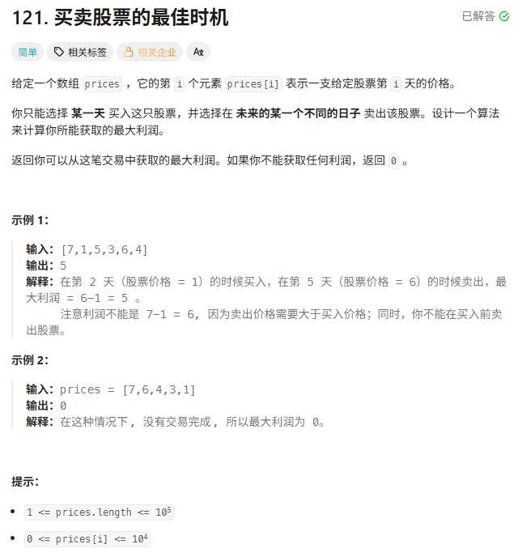
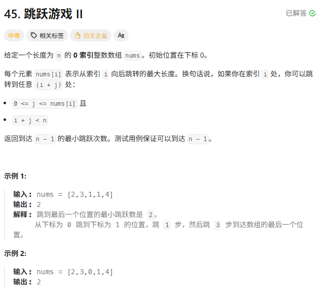
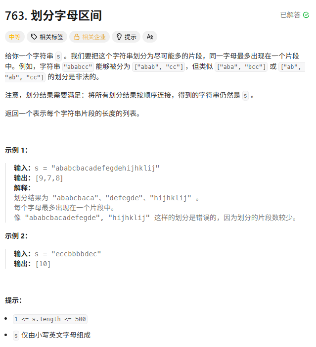

> [!NOTE]
>
> 贪心算法

**常见的贪心策略：**

- **排序法**：先把数据排序，然后从头拿/从尾拿。
- **极值法**：维护一个当前最小值/最大值，每次都和它比。

**暴力搜索 $\supset$ 动态规划 $\supset$ 贪心算法**

# 买卖股票的最佳时机



用贪心做：

**卖出价尽可能高**。

**买入价尽可能低**。

**贪婪地记录历史最低价**：不管现在价格多少，我只要看到比历史最低还低的，我就记下来（假设我就在那天买了）。

**贪婪地计算当前最大利润**：假设我今天卖，利润是多少？如果比我之前记录的最大利润还高，我就更新最大利润。

```c++
int maxProfit(vector<int>& prices) {
    int minPrice = INT_MAX; // 历史最低价，初始化为无穷大
    int maxPro = 0;         // 历史最大利润，初始化为 0

    for (int price : prices) {
        // 1. 贪心选择：如果当前价格比历史最低还低，那就在这天买（更新最低价）
        if (price < minPrice) {
            minPrice = price;
        }
        // 2. 贪心计算：如果今天卖能赚更多，那就更新最大利润
        else if (price - minPrice > maxPro) {
            maxPro = price - minPrice;
        }
    }

    return maxPro;
}
```

用动态规划做：(状态机DP)

我们要记录每天结束时的**状态**。对于第 `i` 天，我们只有两种状态：

1. **持有股票**：要么是昨天就持有的，要么是今天刚买的。
2. **不持有股票**：要么是昨天就没持有，要么是今天刚卖的。

**定义 `dp` 数组：**

- `dp[i][0]`: 第 `i` 天结束时，**持有**股票，手里的最大现金（通常是负数，因为花了钱）。
- `dp[i][1]`: 第 `i` 天结束时，**不持有**股票，手里的最大现金（利润）。

**状态转移方程：**

1. **今天持有 (`dp[i][0]`)**：
   - 要么昨天就持有 (`dp[i-1][0]`)。
   - 要么今天刚买（注意：因为只能买一次，所以买之前的现金是 0）。所以是 `0 - prices[i]`，而不是`dp[i-1][0]+prices[i]`。
   - 选现金多的：`max(dp[i-1][0], -prices[i])`。
2. **今天不持有 (`dp[i][1]`)**：
   - 要么昨天就不持有 (`dp[i-1][1]`)。
   - 要么今天卖了（昨天持有 + 今天股价）。所以是 `dp[i-1][0] + prices[i]`。
   - 选现金多的：`max(dp[i-1][1], dp[i-1][0] + prices[i])`。

```c++
int maxProfit(vector<int>& prices) {
    int n = prices.size();
    // 定义 dp 数组，初始化第一天
    // dp[0][0] 第一天持有，也就是买了，现金为 -prices[0]
    // dp[0][1] 第一天不持有，没买没卖，现金为 0
    vector<vector<int>> dp(n, vector<int>(2));
    dp[0][0] = -prices[0]; 
    dp[0][1] = 0;

    for (int i = 1; i < n; i++) {
        // 状态转移
        dp[i][0] = max(dp[i-1][0], -prices[i]);
        dp[i][1] = max(dp[i-1][1], dp[i-1][0] + prices[i]);
    }

    // 最后一天如果不持有股票，利润肯定最大
    return dp[n-1][1];
}
```

# 跳跃游戏


贪心做法：

```c++
bool canJump(vector<int>& nums) {
    int cover = 0; // 目前最远能到达的下标
    int n = nums.size();

    // 注意：这里我们只遍历到 cover 范围内
    // 因为 cover 之外的格子我们根本到不了，看都没必要看
    for (int i = 0; i <= cover; i++) {
        // 更新最远覆盖范围
        cover = max(cover, i + nums[i]);

        // 如果覆盖范围已经超过或等于终点下标，直接成功
        if (cover >= n - 1) {
            return true;
        }
    }

    // 循环结束还没返回 true，说明到不了
    return false;
}
```

DP做法：

- `dp[i]`：**以目前的能力，截止到遍历完第 i 个格子，最远能跳到哪里？**

不利用 `i` 的跳跃能力，保持之前的最远距离 `dp[i-1]`。

我在 `i` 处起跳，距离变为 `i + nums[i]`。

`dp[i] = max(dp[i-1], i + nums[i])`

```c++
bool canJumpDP(vector<int>& nums) {
    int n = nums.size();
    vector<int> dp(n, 0); // dp[i] 表示在 i 处能到达的最远下标

    dp[0] = nums[0]; // 初始化：在起点能跳多远

    for (int i = 1; i < n; i++) {
        // 如果前一个格子的最远距离连 i 都到不了，那后面全废了
        if (dp[i-1] < i) {
            return false;
        }

        // 状态转移
        dp[i] = max(dp[i-1], i + nums[i]);

        if (dp[i] >= n - 1) return true;
    }

    return dp[n-1] >= n - 1;
}
```

DP 里的 `dp[i]` 只依赖于 `dp[i-1]`。

我们根本不需要一个数组来存“历史每一步的最远距离”，我们只需要一个变量 `cover` 来存 **“上一步算出来的最远距离”** 就够了。

# 跳跃游戏Ⅱ



```c++
int jump(vector<int>& nums) {
    if (nums.size() <= 1) return 0; // 起点就是终点

    int curEnd = 0;  // 当前这一步的边界
    int maxPos = 0;  // 下一步能到的最远位置
    int steps = 0;   // 跳跃次数

    // 注意：不需要遍历最后一个元素
    // 因为进入最后一个元素前，步数肯定已经更新过了
    for (int i = 0; i < nums.size() - 1; i++) {
        // 1. 贪心记录：在这个范围内，最远能跳到哪？
        maxPos = max(maxPos, i + nums[i]);

        // 2. 边界检查：如果走到当前步的边界了
        if (i == curEnd) {
            curEnd = maxPos; // 更新边界为刚才找到的最远位置
            steps++;         // 必须跳一步

            // (可选优化) 如果已经覆盖终点，提前结束
            // if (curEnd >= nums.size() - 1) break;
        }
    }

    return steps;
}
```

循环条件是 `i < n - 1`。 为什么不是 `i < n`？

当你已经能到达最后一个位置时，不需要再产生一次跳跃。

`steps++` 表示 **真的进行了一次新的跳跃**

最后一个位置不能触发新的 jump，最后一个位置是目标点不是中转点，所以不用在最后的位置跳。

统计的是“起跳次数”，而不是“落点次数”。

# 划分字母区间

跳跃游戏的变种



```c++
vector<int> partitionLabels(string s) {
    // 1. 第一次遍历：记录每个字符最后出现的位置
    int last[26] = {0};
    for (int i = 0; i < s.size(); i++) {
        last[s[i] - 'a'] = i;
    }

    vector<int> result;
    int start = 0; // 当前片段的起始下标
    int end = 0;   // 当前片段的最远结束下标

    // 2. 第二次遍历：根据最远位置进行切割
    for (int i = 0; i < s.size(); i++) {
        // 贪心：不断更新当前片段需要到达的最远位置
        end = max(end, last[s[i] - 'a']);

        // 如果当前遍历到了这个最远位置，说明可以切了
        if (i == end) {
            result.push_back(end - start + 1);
            start = i + 1; // 下一个片段的起点
        }
    }

    return result;
}
```

