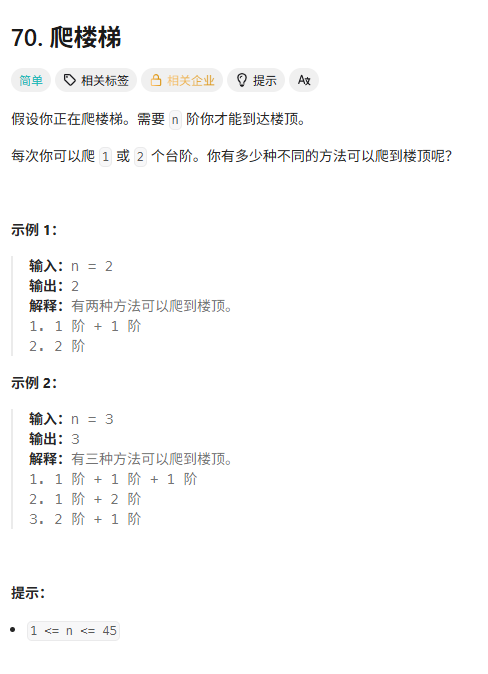
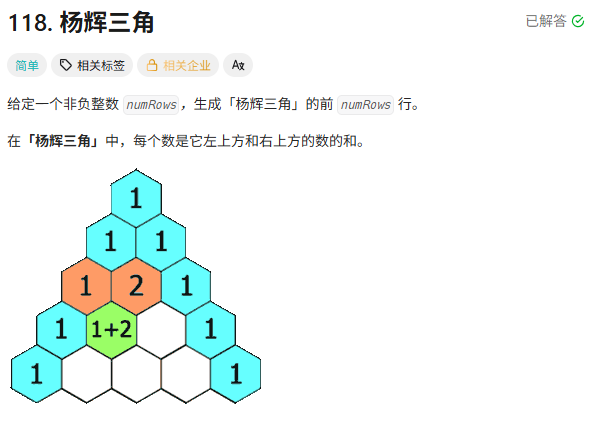
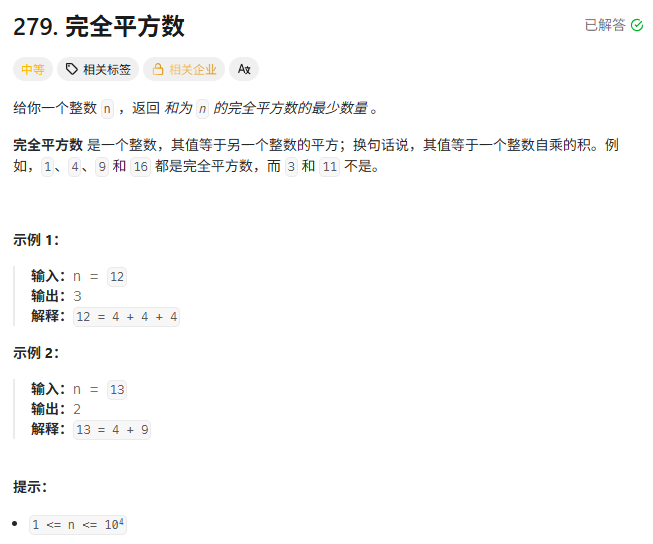
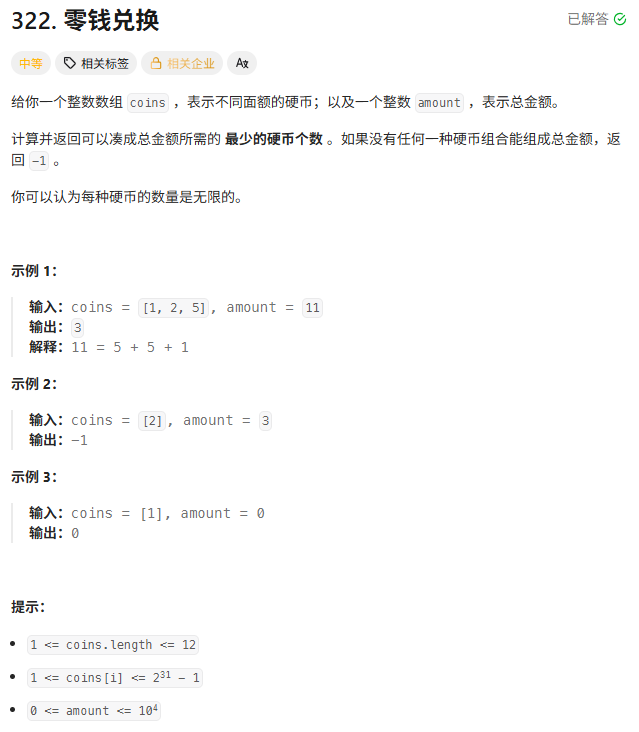
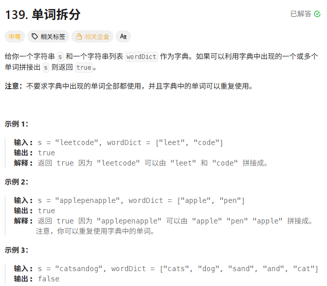
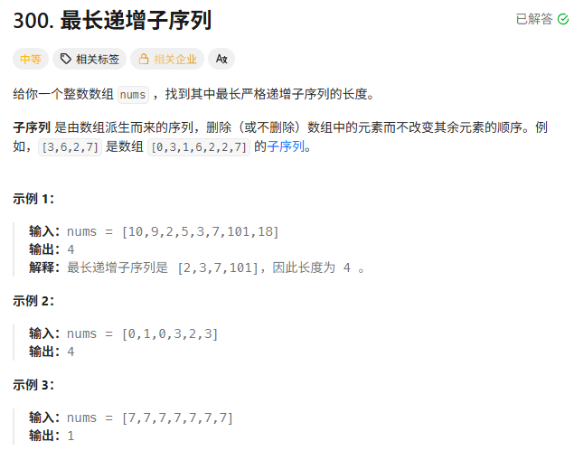
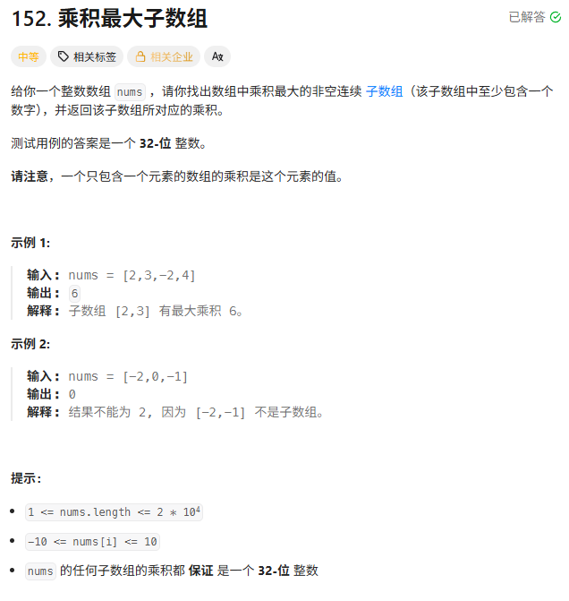
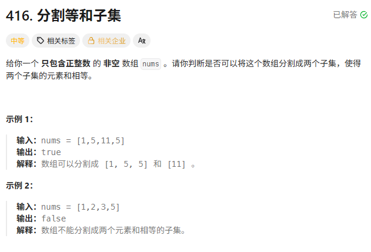
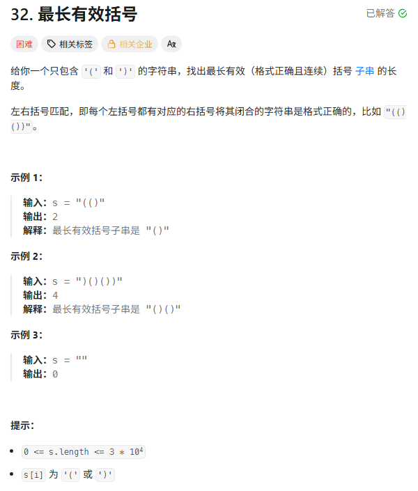

> [!NOTE] 
>
> 动态规划

# n+1与n

**dp[i] 表示“前 i 个元素” → 用 n+1**
**dp[i] 表示“第 i 个位置结尾” → 用 n**

前缀型DP用n+1：$dp[i]=前i个元素([0,i−1])的状态$

比如：单词拆分 背包问题

为什么必须有n+1？因为必须表示**什么都没有**的状态

位置型DP用n：$dp[i]=以i结尾的状态$

此时i是真实下标

如：最长递增子序列、最大子数组和

| 类型   | dp含义      | 是否需要 dp[0] 表示空 | 数组大小 |
| ------ | ----------- | --------------------- | -------- |
| 前缀型 | 前 i 个元素 | ✅ 需要                | n+1      |
| 位置型 | 以 i 结尾   | ❌ 不需要              | n        |

# 背包问题思路

## 0/1背包

**每个物体最多用一次**

$dp[i][j]=前i个物品，在容量j下的最大价值$

对于第i个物体：

- 不选：$dp[i][j]=dp[i−1][j]$
- 选：$dp[i][j]=dp[i−1][j−w[i−1]]+v[i−1]$
- 合计：$dp[i][j]=max(dp[i−1][j], dp[i−1][j−w[i−1]]+v[i−1])$

```c++
vector<vector<int>> dp(n + 1, vector<int>(W + 1, 0));

for (int i = 1; i <= n; i++) {
    for (int j = 0; j <= W; j++) {
        if (j < w[i - 1]) {
            dp[i][j] = dp[i - 1][j];
        } else {
            dp[i][j] = max(dp[i - 1][j],dp[i - 1][j - w[i - 1]] + v[i - 1]);
        }
    }
}
```

$dp[i][j]只依赖dp[i−1][...]$

所以可以**只保留一行**

```c++
for (int i = 0; i < n; i++) {          // 物品
    for (int j = 0; j <= W; j++) {     // 全部容量
        if (j >= w[i]) {               // 判断能不能放
            dp[j] = max(dp[j], dp[j - w[i]] + v[i]);
        }
    }
}
```

但是这个写法是错的，因为在二维中用的是`dp[i-1]`但是在一维优化中此时前面的已经被更新了，不再是`dp[i-1]`这一层了，所以要倒着来。

```c++
for (int i = 0; i < n; i++) {          
    for (int j = W; j >= 0; j--) {     // 倒序！！
        if (j >= w[i]) {
            dp[j] = max(dp[j], dp[j - w[i]] + v[i]);
        }
    }
}
```

倒序遍历是防止一个物体被用多次

如果连if都不想写 那也可以直接写为

```c++
for (int i = 0; i < n; i++) {
    for (int j = W; j >= w[i]; j--) {
        dp[j] = max(dp[j], dp[j - w[i]] + v[i]);
    }
}
```

## 完全背包

**每个物体可以无限用**

$dp[i][j]=前i个物品，在容量j下的最大价值$

对于第i个物品：

- 不选：$dp[i][j]=dp[i−1][j]$
- 选：$dp[i][j]=dp[i][j−w[i−1]]+v[i−1]$
- 合计：$dp[i][j]=max(dp[i−1][j], dp[i][j−w[i−1]]+v[i−1])$
- 为什么选的话和01背包不一样了？
  - 因为每个物品可以无限选，选了第i个物品之后，减去它的重量，剩余重量为`j-w[i-1]`。剩下的重量还可能由这个物品组成。

```c++
vector<vector<int>> dp(n + 1, vector<int>(W + 1, 0));

for (int i = 1; i <= n; i++) {
    for (int j = 0; j <= W; j++) {
        if (j < w[i - 1]) {
            dp[i][j] = dp[i - 1][j];
        } else {
            dp[i][j] = max(dp[i - 1][j],dp[i][j - w[i - 1]] + v[i - 1]);
        }
    }
}
```

```c++
for (int i = 0; i < n; i++) {
    for (int j = 0; j <= W; j++) {   // 正序
        if (j >= w[i]) {
            dp[j] = max(dp[j], dp[j - w[i]] + v[i]);
        }
    }
}
```

## 多重背包

**每个物体有固定的次数 介于01和完全之间**

有 n 种物品

每种物品：

- 重量 `w[i]`
- 价值 `v[i]`
- **数量限制 `k[i]`**

$dp[i][j]=前i种物品，在容量j下的最大价值$

对于第i种物品：

- 不选：$dp[i][j]=dp[i−1][j]、$
- 选k次：$dp[i][j]=dp[i−1][j−k⋅w[i]]+k⋅v[i]$
- 合计：$ dp[i][j] = \max_{0 \le k \le k[i]} \left( dp[i-1][j - k w[i]] + k v[i] \right) $

```c++
for (i)
    for (j)
        for (k = 0 → k[i])
```

这样时间复杂度直接$O(n⋅W⋅k)$

使用二进制拆分优化

```c++
vector<int> weights, values;

for (int i = 0; i < n; i++) {
    int w = weight[i], v = value[i], k = count[i];

    for (int c = 1; c <= k; c <<= 1) {
        weights.push_back(c * w);
        values.push_back(c * v);
        k -= c;
    }

    if (k > 0) {
        weights.push_back(k * w);
        values.push_back(k * v);
    }
}
```

然后直接使用01背包

```c++
for (int i = 0; i < weights.size(); i++) {
    for (int j = W; j >= weights[i]; j--) {
        dp[j] = max(dp[j], dp[j - weights[i]] + values[i]);
    }
}
```

## 分组背包

有若干组物品

每一组里有多个物品

**每组最多选一个**

$dp[i][j]=前i组，在容量j下的最大价值$

对于第i组：

- 不选这一组的任何物品：$dp[i][j]=dp[i−1][j]$。
- 选这一组的某个物品k：$dp[i][j]=dp[i−1][j−wi,k]+vi,k$
- 合并：$dp[i][j]=max(dp[i−1][j], kmax(dp[i−1][j−wi,k]+vi,k))$

```c++
for (int i = 1; i <= group_num; i++) {
    for (int j = 0; j <= W; j++) {
        dp[i][j] = dp[i-1][j];  // 不选

        for (auto& item : group[i]) {
            int w = item.weight;
            int v = item.value;

            if (j >= w) {
                dp[i][j] = max(dp[i][j],dp[i-1][j - w] + v);
            }
        }
    }
}
```

状态压缩后：

```c++
for (int i = 0; i < group_num; i++) {
    for (int j = W; j >= 0; j--) {   // 倒序！！
        for (auto& item : group[i]) {
            int w = item.weight;
            int v = item.value;

            if (j >= w) {
                dp[j] = max(dp[j], dp[j - w] + v);
            }
        }
    }
}
```

# 动态规划

**把复杂问题拆成子问题，通过保存子问题结果来避免重复计算**

## 一、从“暴力递归”到“动态规划”

想象你要计算 **$f(5)$**，根据某种规则它等于 $f(4) + f(3)$。

- **普通递归（傻瓜式计算）**：

  为了算 $f(5)$，它去算 $f(4)$ 和 $f(3)$。

  为了算 $f(4)$，它又去算 $f(3)$ 和 $f(2)$。

  **$f(3)$ 被重复计算了多次。** 随着 $n$ 变大，这种重复会爆炸式增长（指数级复杂度）。

- **动态规划（聪明式计算）**：

  我开辟一个记录本（数组或哈希表）。

  算出了 $f(3)$，我把它写在第 3 格。

  下次需要 $f(3)$ 时，我不计算，我直接翻本子查答案。

  **每个子问题只算一次。**（线性复杂度）。

动态规划其实就是：

> 带记忆的递归（记忆化搜索）

## 二、DP 的“三要素”

要写出一个 DP 算法，你的大脑必须完成这三层逻辑构建：

1. **最优子结构**

**大问题的最优解，包含了小问题的最优解。**

f(n)=由若干 f(更小规模) 组合得到

- **例子**：你想从 A 走到 C 路径最短。如果你发现 A -> B -> C 是最短的，那么 B -> C 也一定是 B 到 C 之间的最短路径。

2. **重叠子问题**

这就是我们刚才说的：大问题拆成小问题时，小问题会**反复出现**。如果没有重叠，直接用递归就行了（比如归并排序），没必要用 DP。

3. **状态转移方程——这是核心**

它是描述“小问题”如何推导出“大问题”的**数学公式**。

- **爬楼梯**：$dp[i] = dp[i-1] + dp[i-2]$
- **打家劫舍**：$dp[i] = \max(dp[i-1], dp[i-2] + \text{money}[i])$

## 三、攻克 DP 的“五部曲”

这是我们后续做所有 DP 题目都要遵循的固定模板。每次写代码前，先问自己这五个问题：

1. **确定 dp 数组（dp table）以及下标的含义**：`dp[i]` 到底代表什么？（是钱？是方法数？还是最大长度？）
2. **确定递推公式**：`dp[i]` 是由哪些前面的状态推出来的？
3. **dp 数组如何初始化**：起点在哪里？（`dp[0]` 应该是 0 还是 1？）
4. **确定遍历顺序**：是从前往后填表，还是从后往前？是先遍历物品还是先遍历背包？
5. **举例推导 dp 数组**：手动模拟填几个格子，看看结果和预期对不对。

###  DP 的分类（学习路径）

DP 不是一团乱麻，它是有固定套路的：

- **基础线性DP**：爬楼梯、斐波那契（理解递推）。
- **路径问题**：不同路径、最小路径和（二维数组填表）。
- **背包问题**：01背包、完全背包（最经典，也最难）。
- **状态机DP**：打家劫舍/买卖股票：带状态机（选还是不选？）。
- **序列型DP**：最长递增子序列、最长公共子序列。
- **区间DP**：`dp[l][r]`表示最优解

# 爬楼梯

****

```c++
dp[i]=dp[i-1]+dp[i-2]
dp[1]=1
dp[2]=2
```

# 杨辉三角



```c++
vector<vector<int>> generate(int n) {
    vector<vector<int>> ans;

    for (int i = 0; i < n; i++) {
        vector<int> curr(i + 1, 1);  // 默认全是1

        for (int j = 1; j < i; j++) {
            curr[j] = ans[i - 1][j - 1] + ans[i - 1][j];
        }

        ans.push_back(curr);
    }

    return ans;
}
```

# 打家劫舍

# 完全平方数

完全背包问题



`dp[i]`组成整数`i`所需的最少完全平方数个数

```c++
int numSquares(int n) {
    vector<int> dp(n + 1);
    
    for (int i = 0; i <= n; i++) {
        dp[i] = i;  // 最坏情况 i = 1+1+1+...+1
    }

    for (int i = 1; i <= n; i++) {
        for (int j = 1; j * j <= i; j++) {
            dp[i] = min(dp[i], dp[i - j*j] + 1);
        }
    }

    return dp[n];
}
```

$dp[12]=min(dp[12],dp[8]+1)$

$dp[4]=dp[0]+1=1$

$dp[12]=4+4+4$

看起来是`j=1`到`j*j<=i`只遍历了一次，但是每个dp元素都经过这样的遍历，所以完全背包的无限次使用隐含在了之前的遍历中。

# 零钱兑换



这道题也是完全背包问题

dp[i]=组成金额i所需的最少硬币数量

```c++
int coinChange(vector<int>& coins, int amount) {
    // 1. dp[i] 表示凑齐金额 i 所需的最少硬币数
    // 初始化为 amount + 1，表示一个无法达到的最大值
    vector<int> dp(amount + 1, amount + 1);

    // 3. 初始化基石
    dp[0] = 0;

    // 4. 遍历
    for (int i = 1; i <= amount; i++) {       // 遍历背包（金额）
        for (int coin : coins) {              // 遍历物品（面额）
            // 只有当当前金额大于硬币面额时，才考虑这个硬币
            if (i - coin >= 0) {
                // 2. 递推：取当前值和（去掉这个硬币后的最优解+1）的最小值
                dp[i] = min(dp[i], dp[i - coin] + 1);
            }
        }
    }

    // 5. 结果检查
    // 如果 dp[amount] 还是初始值，说明凑不齐
    return dp[amount] > amount ? -1 : dp[amount];
}
```

# 单词拆分

字节一面



$dp[i]$的含义：前i个字符是否可以被拆分，也就是$s[0:i−1]$是否可以被字典拆分。

```c++
bool wordBreak(string s, vector<string>& wordDict) {
    // 将词典放入哈希表，提升查询速度
    unordered_set<string> wordSet(wordDict.begin(), wordDict.end());

    // 1. dp[i] 表示 s 的前 i 个字符是否可以拆分
    vector<bool> dp(s.size() + 1, false);

    // 3. 初始化：空字符串合法
    dp[0] = true;

    // 4. 遍历
    for (int i = 1; i <= s.size(); i++) { // 遍历背包（字符串长度）
        for (int j = 0; j < i; j++) {    // 遍历物品（拆分点）

            // 2. 递推逻辑：
            // 如果前 j 个字符合法，且剩余子串 [j, i) 在词典中
            string sub = s.substr(j, i - j);
            if (dp[j] && wordSet.count(sub)) {
                dp[i] = true;
                break; // 只要找到一种拆分方式，dp[i] 就是 true，直接跳出内层循环
            }
        }
    }

    return dp[s.size()];
}
```

关于`substr`：

如果想要`[a,b]`那么是`s.substr(a,b-a+1)`

此题目中`dp[i]`表示`[0,i-1]`可以被表示

那么`[j,i]`自然是`s.substr(i-1-j+1)`

最后看起来就是`i-j`

# 最长递增子序列



腾讯实习一面

```c++
int lengthOfLIS(vector<int>& nums) {
    int n = nums.size();
    if (n == 0) return 0;

    // 1. dp[i] 表示以 nums[i] 结尾的最长递增子序列长度
    // 3. 初始化：每个元素单独都是长度为 1 的子序列
    vector<int> dp(n, 1);
    int maxLen = 1; // 记录全局最大值

    // 4. 遍历
    for (int i = 1; i < n; i++) {
        for (int j = 0; j < i; j++) {
            // 2. 递推逻辑：如果当前数比前面的大，尝试接在后面
            if (nums[i] > nums[j]) {
                dp[i] = max(dp[i], dp[j] + 1);
            }
        }
        // 每算完一个 dp[i]，更新一次全局最大长度
        maxLen = max(maxLen, dp[i]);
    }

    return maxLen;
}
```

# 乘积最大数组



负负得正 维持两个dp数组

```c++
int maxProduct(vector<int>& nums) {
    int n = nums.size();
    if (n == 0) return 0;

    // 1. 状态定义
    // maxDP[i]: 以 i 结尾的最大乘积
    // minDP[i]: 以 i 结尾的最小乘积
    vector<int> maxDP(n);
    vector<int> minDP(n);

    // 3. 初始化
    maxDP[0] = nums[0];
    minDP[0] = nums[0];
    int result = nums[0];

    // 4. 遍历
    for (int i = 1; i < n; i++) {
        // 2. 状态转移方程
        // 当前的最大值可能来自：
        //   1. 当前数自己 (nums[i])
        //   2. 前一个最大值乘当前数 (maxDP[i-1] * nums[i])
        //   3. 前一个最小值乘当前数 (minDP[i-1] * nums[i]) -> 处理负负得正
        maxDP[i] = max({nums[i], maxDP[i - 1] * nums[i], minDP[i - 1] * nums[i]});
        minDP[i] = min({nums[i], maxDP[i - 1] * nums[i], minDP[i - 1] * nums[i]});

        result = max(result, maxDP[i]);
    }

    return result;
}
```

优化版

更新 `maxVal` 时会改变它的值，而更新 `minVal` 时需要用到旧的 `maxVal`。所以我们要用临时变量。

```c++
int maxProduct(vector<int>& nums) {
    int n = nums.size();
    if (n == 0) return 0;

    int maxVal = nums[0];
    int minVal = nums[0];
    int result = nums[0];

    for (int i = 1; i < n; i++) {
        int tempMax = maxVal; // 备份旧的最大值
        
        maxVal = max({nums[i], maxVal * nums[i], minVal * nums[i]});
        minVal = min({nums[i], tempMax * nums[i], minVal * nums[i]});
        
        result = max(result, maxVal);
    }
    return result;
}
```

# 分割等和子集



0/1背包

$dp[i][j]=前i个数，是否可以凑出和j$

```c++
bool canPartition(vector<int>& nums) {
    int sum = 0;
    for (int num : nums) sum += num;

    // 如果总和是奇数，直接判死刑
    if (sum % 2 != 0) return false;
    int target = sum / 2;
    int n = nums.size();

    // 1. dp[i][j] 表示前 i 个数能否凑成和为 j
    vector<vector<bool>> dp(n + 1, vector<bool>(target + 1, false));

    // 3. 初始化
    for (int i = 0; i <= n; i++) dp[i][0] = true;

    // 4. 遍历
    for (int i = 1; i <= n; i++) {
        int weight = nums[i - 1];
        for (int j = 1; j <= target; j++) {
            if (j < weight) {
                // 背包太小，装不下当前数
                dp[i][j] = dp[i - 1][j];
            } else {
                // 装得下：选或不选，只要有一个成，就成
                dp[i][j] = dp[i - 1][j] || dp[i - 1][j - weight];
            }
        }
    }
    return dp[n][target];
}
```

# 最长有效括号hard



```c++
int longestValidParentheses(string s) {
    int n = s.size();
    if (n < 2) return 0;

    // 1. dp[i] 表示以 s[i] 结尾的最长有效括号长度
    vector<int> dp(n, 0);
    int maxLen = 0;

    // 只有 ) 结尾才有效，所以从 i=1 开始
    for (int i = 1; i < n; i++) {
        if (s[i] == ')') {
            // 情况 1: 前一个是 (  => ...()
            if (s[i - 1] == '(') {
                dp[i] = (i >= 2 ? dp[i - 2] : 0) + 2;
            } 
            // 情况 2: 前一个是 )  => ...))
            // 我们要找和当前 ) 匹配的那个 ( 在哪
            else if (i - dp[i - 1] > 0 && s[i - dp[i - 1] - 1] == '(') {
                // dp[i-1] 是内部的一串
                // 2 是当前这一对
                // dp[i - dp[i-1] - 2] 是这一对再往前的有效串
                int prev = (i - dp[i - 1] >= 2) ? dp[i - dp[i - 1] - 2] : 0;
                dp[i] = dp[i - 1] + 2 + prev;
            }
            maxLen = max(maxLen, dp[i]);
        }
    }
    return maxLen;
}
```

那么else if为什么没考虑到`s[i-dp[i-1]-1]==')'`的情况呢，比如`))()()()))`

在这种情况下 dp[8]dp[9]都是0

$dp[i]=以i结尾的最长有效括号长度$

自然过滤掉了这种情况

另外 关于数组下标

```c++
int prev = (i - dp[i - 1] >= 2) ? dp[i - dp[i - 1] - 2] : 0;
//i-dp[i-1]其实是i-1-dp[i-1]+1 是i-1为)时(的下标
//i-dp[i-1]-1是i-1-dp[i-1]+1-1 是i为)对应的(的下标
```

## 栈解法

```c++
int longestValidParentheses(string s) {
    stack<int> st;
    st.push(-1);
    int maxlen = 0;

    for (int i = 0; i < s.size(); i++) {
        if (s[i] == '(') {
            st.push(i);
        } else {
            st.pop();
            if (st.empty()) {
                st.push(i);
            } else {
                maxlen = max(maxlen, i - st.top());
            }
        }
    }
    return maxlen;
}
```

## 双向扫描

```c++
int longestValidParentheses(string s) {
    int left = 0, right = 0;
    int maxlen = 0;

    // 左 → 右
    for (int i = 0; i < s.size(); i++) {
        if (s[i] == '(') left++;
        else right++;

        if (left == right)
            maxlen = max(maxlen, 2 * right);
        else if (right > left)
            left = right = 0;
    }

    // 右 → 左
    left = right = 0;

    for (int i = s.size() - 1; i >= 0; i--) {
        if (s[i] == ')') right++;
        else left++;

        if (left == right)
            maxlen = max(maxlen, 2 * left);
        else if (left > right)
            left = right = 0;
    }

    return maxlen;
}
```

$left=′(′的数量 right=′)′的数量的数量$