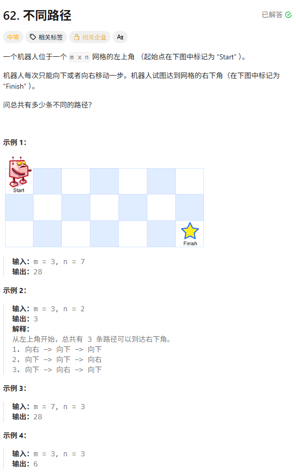
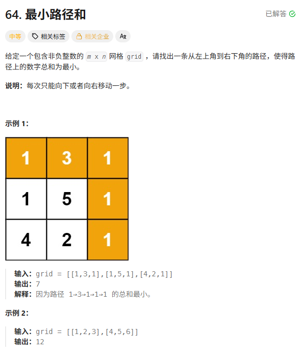
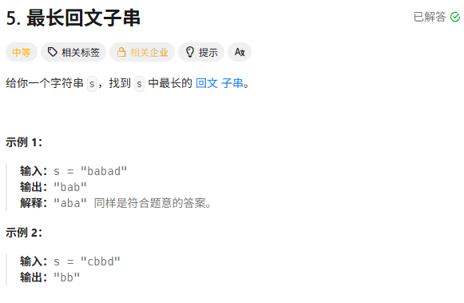
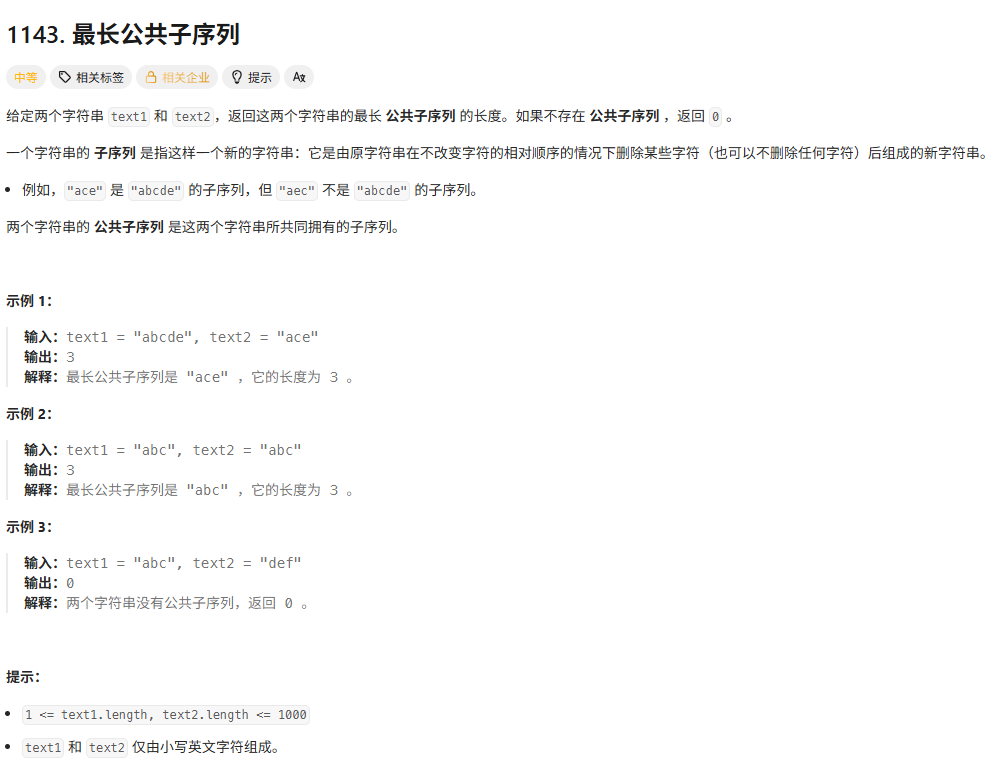
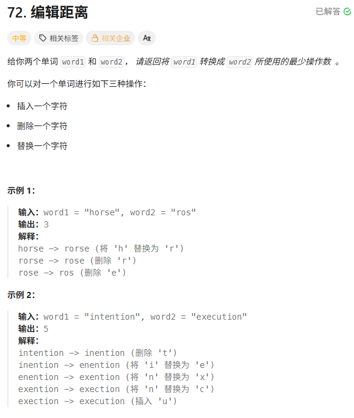

> [!NOTE]
>
> 多维动态规划

# 不同路径



**`dp[i][j]`**：表示到达坐标 $(i, j)$ 的位置共有多少条不同的路径。

```c++
int uniquePaths(int m, int n) {
            // 1. dp[i][j] 代表到达该点的路径总数
            vector<vector<int>> dp(m, vector<int>(n, 0));
            
            // 3. 初始化第一行和第一列
            for (int i = 0; i < m; i++) dp[i][0] = 1;
            for (int j = 0; j < n; j++) dp[0][j] = 1;
            
            // 4. 遍历顺序：从左到右，从上到下
            for (int i = 1; i < m; i++) {
                for (int j = 1; j < n; j++) {
                    // 2. 状态转移：左边来的路径 + 上边来的路径
                    dp[i][j] = dp[i - 1][j] + dp[i][j - 1];
                }
            }
            
            return dp[m - 1][n - 1];
        }
```

```c++
int uniquePaths(int m, int n) {
    vector<int> dp(n, 1); // 初始全为 1（相当于初始化了第一行）
    for (int i = 1; i < m; i++) {
        for (int j = 1; j < n; j++) {
            // 当前位置 = 上方(旧的dp[j]) + 左方(新的dp[j-1])
            dp[j] += dp[j - 1];
        }
    }
    return dp[n - 1];
}
```

# 最小路径和

**`dp[i][j]`**：表示从左上角 $(0, 0)$ 到达坐标 $(i, j)$ 的**最小路径总和**。

初始化：

**起点**：`dp[0][0] = grid[0][0]`。

**第一行**：只能从左边一直往右走。`dp[0][j] = dp[0][j-1] + grid[0][j]`（前缀和）。

**第一列**：只能从上面一直往下走。`dp[i][0] = dp[i-1][0] + grid[i][0]`（前缀和）。



```c++
int minPathSum(vector<vector<int>>& grid) {
    int m = grid.size();
    int n = grid[0].size();

    // 1. dp[i][j] 代表到达该点的最小路径和
    vector<vector<int>> dp(m, vector<int>(n, 0));

    // 3. 初始化
    dp[0][0] = grid[0][0];
    // 初始化第一行
    for (int j = 1; j < n; j++) dp[0][j] = dp[0][j - 1] + grid[0][j];
    // 初始化第一列
    for (int i = 1; i < m; i++) dp[i][0] = dp[i - 1][0] + grid[i][0];

    // 4. 遍历填充
    for (int i = 1; i < m; i++) {
        for (int j = 1; j < n; j++) {
            // 2. 状态转移：取上方和左方的最小值 + 当前格子的值
            dp[i][j] = min(dp[i - 1][j], dp[i][j - 1]) + grid[i][j];
        }
    }

    return dp[m - 1][n - 1];
}
```

# 最长回文子串



```c++
string longestPalindrome(string s) {
    int n = s.size();
    if (n < 2) return s;

    int maxLen = 1;
    int begin = 0;
    // 1. dp[i][j] 表示 s[i..j] 是否为回文
    vector<vector<bool>> dp(n, vector<bool>(n, false));

    // 3. 初始化：所有长度为 1 的子串都是回文
    for (int i = 0; i < n; i++) dp[i][i] = true;

    // 4. 遍历：左边界 i，右边界 j
    // 注意：为了保证 dp[i+1][j-1] 已知，我们采取先枚举列，再枚举行
    for (int j = 1; j < n; j++) {
        for (int i = 0; i < j; i++) {
            if (s[i] != s[j]) {
                dp[i][j] = false;
            } else {
                // 如果头尾相等，且长度 <= 3，或者是中间部分也是回文
                if (j - i < 3) {
                    dp[i][j] = true;
                } else {
                    dp[i][j] = dp[i + 1][j - 1];
                }
            }

            // 如果是回文且更长，记录下来
            if (dp[i][j] && j - i + 1 > maxLen) {
                maxLen = j - i + 1;
                begin = i;
            }
        }
    }
    return s.substr(begin, maxLen);
}
```

# 最长公共子序列



**`dp[i][j]`**：表示字符串 `text1` 的**前** `i` 个字符和 `text2` 的**前** `j` 个字符的最长公共子序列的长度。

如果是包含i和j 返回`dp[m-1][n-1]`的话，第0行和0列就无法正确初始化了。

```c++
int longestCommonSubsequence(string text1, string text2) {
    int m = text1.size();
    int n = text2.size();

    vector<vector<int>> dp(m + 1, vector<int>(n + 1, 0));

    for (int i = 1; i <= m; i++) {
        for (int j = 1; j <= n; j++) {
            if (text1[i - 1] == text2[j - 1])
                dp[i][j] = dp[i - 1][j - 1] + 1;
            else
                dp[i][j] = max(dp[i - 1][j], dp[i][j - 1]);
        }
    }

    return dp[m][n];
}
```

# 编辑距离



**替换**：把 `word1[i-1]` 换成 `word2[j-1]`。

- 此时这一位对齐了，剩下的问题变成 `word1` 前 `i-1` 个和 `word2` 前 `j-1` 个。
- 成本：`dp[i-1][j-1] + 1`

**删除**：把 `word1[i-1]` 删掉。

- 删掉后，`word1` 只剩下 `i-1` 个字符，而 `word2` 还需要 `j` 个字符来对齐。
- 成本：`dp[i-1][j] + 1`

**插入：在 `word1` 末尾加一个字符使其等于 `word2[j-1]`。

- 此时 `word2` 的最后一位对齐了，剩下的问题变成 `word1` 依然有 `i` 个字符，而 `word2` 只剩下 `j-1` 个。
- 成本：`dp[i][j-1] + 1`

```c++
int minDistance(string word1, string word2) {
    int m = word1.size();
    int n = word2.size();

    // 1. dp[i][j] 表示 word1[0...i-1] 到 word2[0...j-1] 的编辑距离
    vector<vector<int>> dp(m + 1, vector<int>(n + 1));

    // 3. 初始化：当一个字符串为空时
    for (int i = 0; i <= m; i++) dp[i][0] = i; // 删掉所有 word1
    for (int j = 0; j <= n; j++) dp[0][j] = j; // 插入所有 word2

    // 4. 遍历
    for (int i = 1; i <= m; i++) {
        for (int j = 1; j <= n; j++) {
            // 2. 状态转移
            if (word1[i - 1] == word2[j - 1]) {
                // 字符相等，不增加操作
                dp[i][j] = dp[i - 1][j - 1];
            } else {
                // 字符不等，选 替换、删除、插入 中最省钱的
                // dp[i-1][j-1]: 替换
                // dp[i-1][j]:   删除
                // dp[i][j-1]:   插入
                dp[i][j] = min({dp[i - 1][j - 1], dp[i - 1][j], dp[i][j - 1]}) + 1;
            }
        }
    }
    return dp[m][n];
}
```

```c++
int minDistance(string word1, string word2) {
    int m = word1.size(), n = word2.size();
    vector<int> dp(n + 1);
    for (int j = 0; j <= n; j++) dp[j] = j;

    for (int i = 1; i <= m; i++) {
        int pre = dp[0]; // pre 记录左上方的值
        dp[0] = i;       // 更新当前行的第一列
        for (int j = 1; j <= n; j++) {
            int temp = dp[j]; // 存下上方的旧值，供下一次循环作 pre
            if (word1[i - 1] == word2[j - 1]) {
                dp[j] = pre;
            } else {
                dp[j] = min({pre, dp[j], dp[j - 1]}) + 1;
            }
            pre = temp;
        }
    }
    return dp[n];
}
```

于 `dp[i][j]` 依赖左上方、左方和上方，压缩过程需要一个额外的变量 `pre` 来存储**旧的左上方对角线值**。逻辑与 LCS 的空间优化完全一致。
