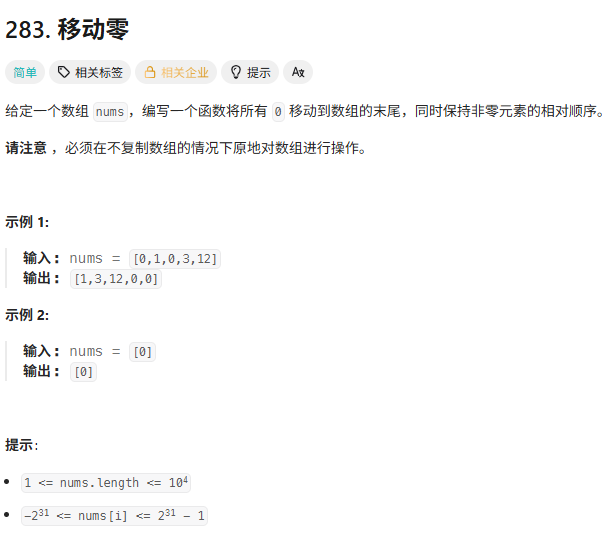
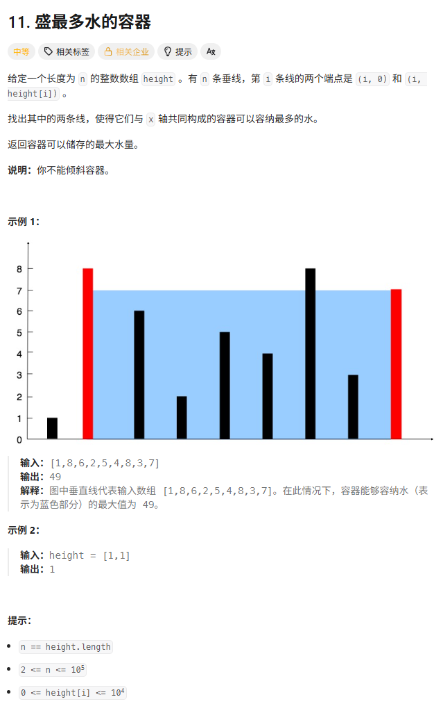
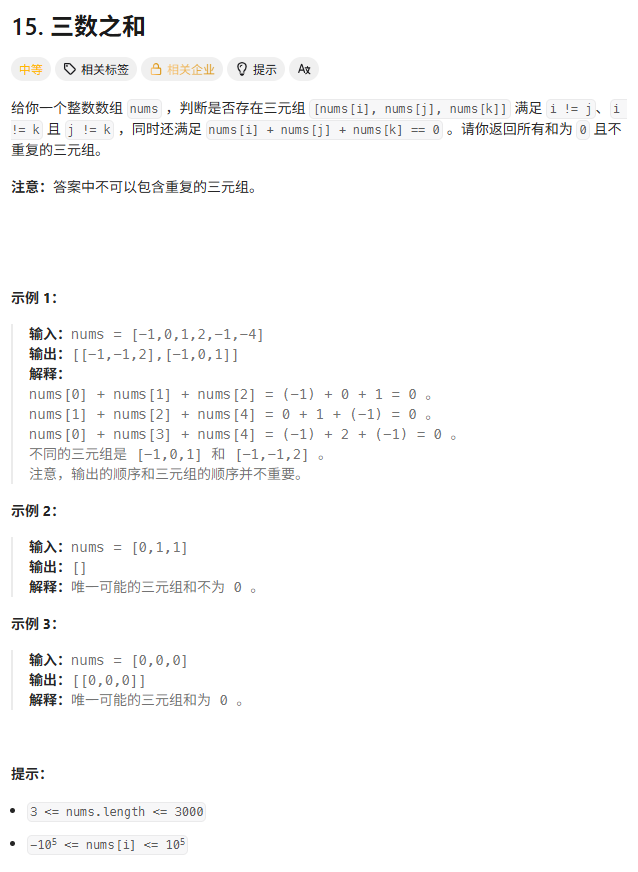
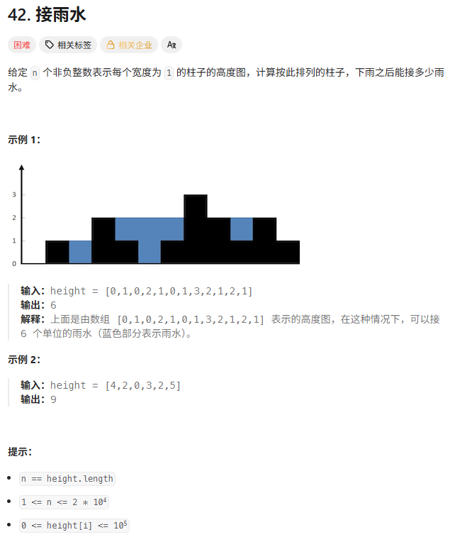

> [!NOTE]
>
> 双指针

**快慢指针 (Slow/Fast)：** 用于原地修改数组（如去重、移动元素）。两个指针同向而行。

**对撞指针 (Left/Right)：** 用于查找某种组合（如二分查找、两数之和有序版、盛水容器）。两个指针相向而行，在中间相遇停止。

# 移动零



slow：下一个非零数应该存放的位置（slow永远指向第一个0的位置）

fast：探路寻找非零数

非0永远只会和0交换，不会跳过另一个非0元素。

slow++很妙别忘了

```c++
void moveZeroes(vector<int>& nums) {
    // slow 记录【下一个非零元素】该放的位置
    for (int slow = 0, fast = 0; fast < nums.size(); fast++) {
        if (nums[fast] != 0) {
            // 只要发现非零数，就和 slow 位置交换
            // 如果 fast == slow (即前面没有0时)，自己跟自己换，不影响顺序
            swap(nums[slow], nums[fast]);
            slow++;
        }
    }
}
```

# 盛水最多的容器



每一次移动(left-right)就会变小1

想要面积变大，高度必须变高

如果移动高的柱子，面积一定变小

只有移动矮的柱子，面积才有可能变大

```c++
int maxArea(vector<int>& height) {
    int left = 0;
    int right = height.size() - 1;
    int max_area = 0;

    while (left < right) {
        // 1. 计算【当前】面积
        // 长板效应：高度由矮的那根决定
        int h = min(height[left], height[right]);
        int w = right - left;
        int current_area = h * w;

        // 2. 更新最大值
        max_area = max(max_area, current_area);

        // 3. 移动指针（贪心策略：哪边矮，哪边往里缩）
        // 试图找到一根更高的柱子来弥补宽度的损失
        if (height[left] < height[right]) {
            left++;
        } else {
            right--;
        }
    }
    return max_area;
}
```

# 三数之和

字节面试



为什么排序后要直接从后面找呢？因为如果从前面找有解，那前面从后找一定提前得到解了。

n-2是为了保证三数问题成立。

为什么if(sum==target)后还要left++和right--？如果没有重复元素，也要 ++和--，有的话更不用说要跳过重复的。

为什么找到不break？因为可能还有其它解，如-7和2+5，和1+6

```c++
vector<vector<int>> threeSum(vector<int>& nums) {
    // 1. 排序是前提
    sort(nums.begin(), nums.end());
    vector<vector<int>> ans;
    int n = nums.size();

    // 遍历每一个元素作为“第一个数”
    for (int i = 0; i < n - 2; i++) {
        // 【剪枝】如果当前数字大于0，因为已经排序，后面不可能凑出0了
        if (nums[i] > 0) break;

        // 【外层去重】如果当前数字和上一个一样，跳过
        if (i > 0 && nums[i] == nums[i - 1]) continue;

        int target = -nums[i];
        int left = i + 1;
        int right = n - 1;

        while (left < right) {
            int sum = nums[left] + nums[right];

            if (sum == target) {
                ans.push_back({nums[i], nums[left], nums[right]});

                // 【内层去重】关键点：找到答案后，跳过所有重复的元素
                while (left < right && nums[left] == nums[left + 1]) left++;
                while (left < right && nums[right] == nums[right - 1]) right--;

                // 此时 left 和 right 指向的是最后一个重复元素，还需要再走一步
                left++;
                right--;
            } 
            else if (sum < target) {
                left++; // 小了，变大点
            } 
            else {
                right--; // 大了，变小点
            }
        }
    }
    return ans;
}
```

# 接雨水hard

单调栈/双指针



## 双指针

> 短板决定容量，高墙提供保障

某一格的水深 = min(max_left, max_right) - height[i]

定义双指针 `left` 在头，`right` 在尾。 同时维护两个变量：

- `max_l`: `left` 走过的路上的最高柱子。

- `max_r`: `right` 走过的路上的最高柱子。

我们比较 `height[left]` 和 `height[right]`（或者比较 `max_l` 和 `max_r`，效果一样）：

**如果 `max_l < max_r`：**

- 对于 `left` 当前指向的位置，它的左边最高柱子确定是 `max_l`。
- 它的右边最高柱子是谁？**不知道**。
- **但是！** 我们知道右边哪怕最远端都有一个 `max_r` 比 `max_l` 高。所以，中间不管有没有更高的山峰，`left` 这个位置的水位**瓶颈**一定已经被锁死在 `max_l` 了。
- **结论：** 我们可以安全地计算 `left` 位置的水量，并让 `left` 右移。

**如果 `max_l >= max_r`：**

- 同理，对于 `right` 指向的位置，右边瓶颈是 `max_r`。左边有一个比它高的 `max_l` 挡着。
- **结论：** 我们可以安全地计算 `right` 位置的水量，并让 `right` 左移。

> 不论是从左边开始还是右边开始 每次都记录左侧和右侧的局部最大值
>
> 因为if(height[left]<height[right]) else这个判断 保证了水不会流走 
>
> 所以遍历的时候保证每次都用局部最大值计算当前格子的接水量 因为是局部最大值的问题也不会导致水接少了

```c++
int trap(vector<int>& height) {
    int left = 0;
    int right = height.size() - 1;

    int max_l = 0;
    int max_r = 0;
    int ans = 0;

    while (left < right) {
        // 每次只处理“短板”的那一侧
        // 为什么要写 height[left] < height[right]？
        // 其实这里判断 max_l < max_r 也是完全一样的逻辑
        // 但判断 height 可以少维护一步变量，代码更简洁
        if (height[left] < height[right]) {
            // --- 处理左边 ---
            if (height[left] >= max_l) {
                // 遇到了更高的墙，存不了水，更新墙的高度
                max_l = height[left];
            } else {
                // 比墙矮，能接水！
                // 瓶颈就是 max_l（因为右边肯定有比 max_l 更高的，不用管具体是谁）
                ans += max_l - height[left];
            }
            left++;
        } else {
            // --- 处理右边 ---
            if (height[right] >= max_r) {
                max_r = height[right];
            } else {
                ans += max_r - height[right];
            }
            right--;
        }
    }
    return ans;
}
```

## 前后缀

前后缀就是保存每个格子左右的最大值，取左右最大值的最小值。

这个算法里左边最大值和右边最大值，如果自己是局部最高，那此刻最大值就是自己。

```c++
#include <vector>
#include <algorithm>
using namespace std;

class Solution {
public:
    int trap(vector<int>& height) {
        int n = height.size();
        if (n <= 2) return 0;

        vector<int> leftMax(n), rightMax(n);

        // 计算每个单元格左边最大值
        leftMax[0] = height[0];
        for (int i = 1; i < n; ++i) {
            leftMax[i] = max(leftMax[i - 1], height[i]);
        }

        // 计算每个单元格右边最大值
        rightMax[n - 1] = height[n - 1];
        for (int i = n - 2; i >= 0; --i) {
            rightMax[i] = max(rightMax[i + 1], height[i]);
        }

        // 计算每个单元格总水量
        int water = 0;
        for (int i = 0; i < n; ++i) {
            water += min(leftMax[i], rightMax[i]) - height[i];
        }

        return water;
    }
};
```

## 单调栈