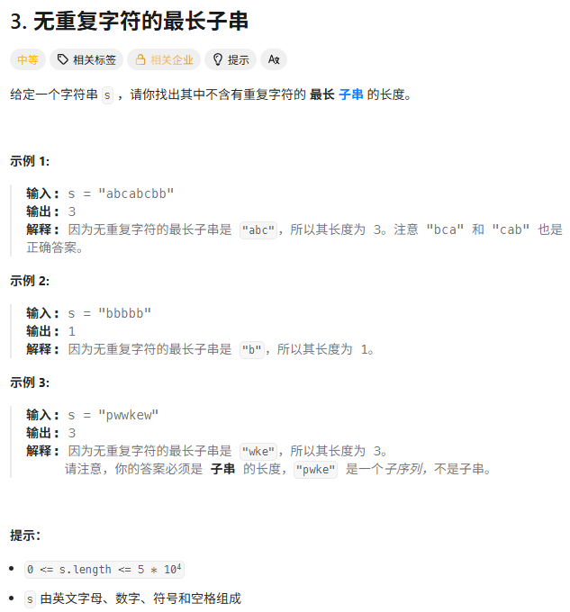
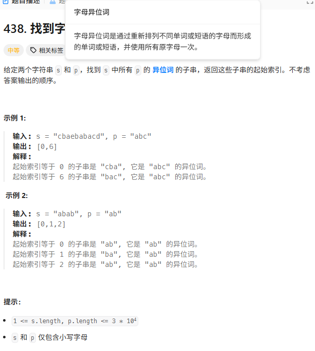

> [!NOTE]
>
> 滑动窗口

# 无重复字符的最长子串



```c++
int lengthOfLongestSubstring(string s) {
    // 1. 使用 vector 替代 map，记录字符上一次出现的索引
    // 初始化为 -1，表示该字符还没出现过
    vector<int> dict(128, -1);

    int max_len = 0;
    int left = 0; 

    // 2. 滑动窗口：right 主动扩张
    for (int right = 0; right < s.length(); right++) {
        char ch = s[right];

        // 3. 如果当前字符以前出现过，更新 left
        // 关键点：max(left, ...) 防止 left 倒退
        // 只有当重复字符在当前窗口内（dict[ch] >= left）时，left 才需要跳
        if (dict[ch] != -1) {
            left = max(left, dict[ch] + 1);
        }

        // 4. 更新当前字符的最新位置
        dict[ch] = right;

        // 5. 记录最大长度
        max_len = max(max_len, right - left + 1);
    }

    return max_len;
}
```

注意这里是`dict[ch]!=-1`而不是`dict[s[left]!=-1`

注意`left = max(left, dict[ch]+1)`

# 找到字符串中所有字母异位词



```c++
vector<int> findAnagrams(string s, string p) {
    int n = s.size();
    int m = p.size();

    // 1. 边界处理：如果 s 比 p 还短，肯定找不到
    if (n < m) return {};

    // 2. 准备指纹数组 (26个字母)
    // p_count: 目标指纹
    // window_count: 当前窗口的指纹
    vector<int> p_count(26, 0);
    vector<int> window_count(26, 0);

    // 3. 预处理 p 的指纹
    for (char c : p) {
        p_count[c - 'a']++;
    }

    vector<int> ans;

    // 4. 滑动窗口
    // 我们只需要一个循环，right 主动走，left 被动跟
    for (int right = 0; right < n; right++) {
        // 【入窗】：右边字符进来，计数 +1
        window_count[s[right] - 'a']++;

        // 【出窗】：当窗口长度超过 m 时，左边字符要移出去
        // 窗口长度 = right - left + 1。如果不许超过 m，即 >= m 时就要移除最左边的
        // 最左边的下标是 right - m
        if (right >= m) {
            window_count[s[right - m] - 'a']--;
        }

        // 【比对】：C++ 可以直接比较两个 vector
        if (window_count == p_count) {
            // 如果相等，说明找到了异位词
            // 起始下标就是当前 right 减去窗口长度再加1 (即 right - m + 1)
            ans.push_back(right - m + 1);
        }
    }

    return ans;
}
```

滑动窗口模板

```c++
for (right ...)
{
    加入右边;

    if (窗口超长)
        删除左边;

    判断窗口;
}
```

