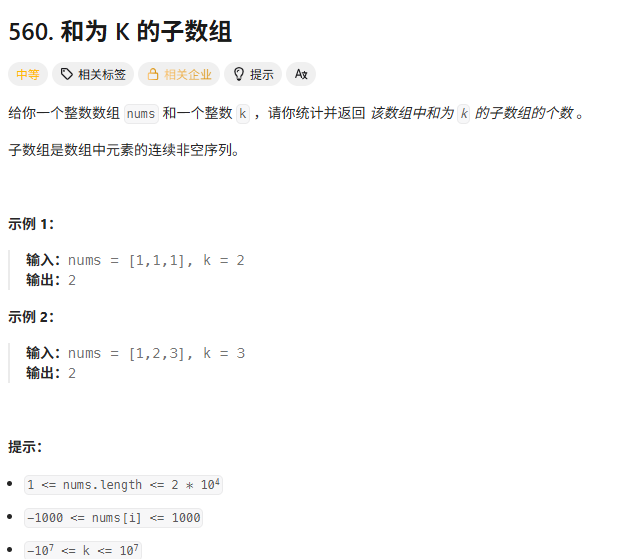
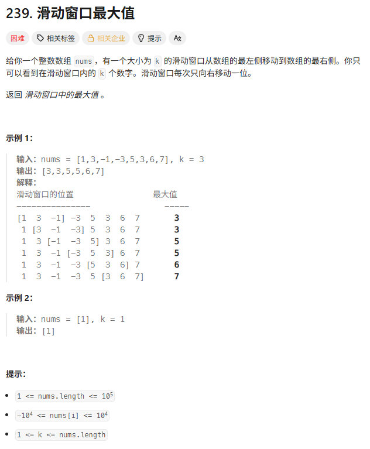
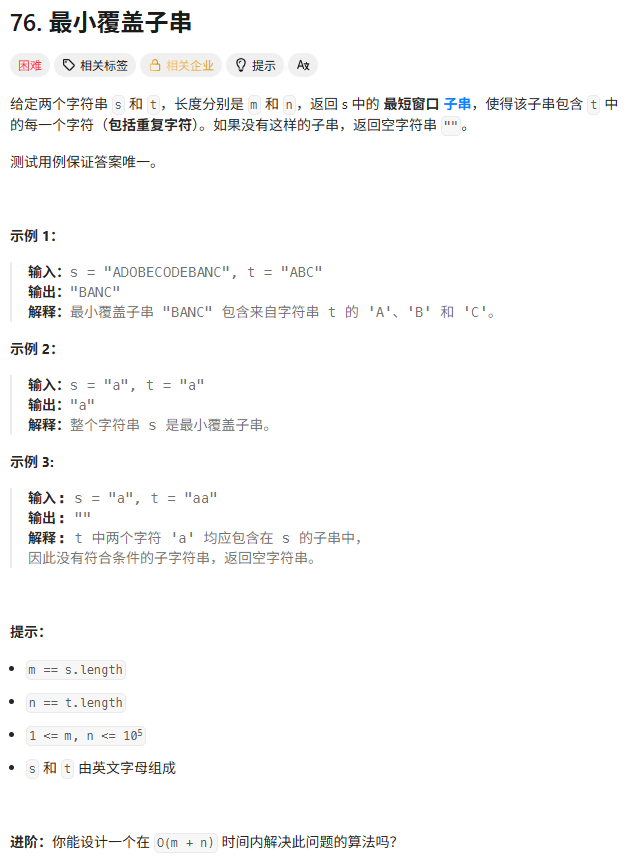

> [!NOTE]
>
> 子串

# 和为K的子数组



```c++
int subarraySum(vector<int>& nums, int k) {
    // map<前缀和, 出现的次数>
    unordered_map<int, int> mp;

    // 【关键点】初始化：和为0的情况出现过1次（处理从头开始的子数组）
    mp[0] = 1;

    int pre = 0;
    int count = 0;

    for (int x : nums) {
        pre += x; // 计算当前前缀和

        // 核心公式：寻找 pre[j-1] == pre[i] - k
        // 如果 map 里有这个值，说明前面有 n 个位置可以作为子数组的起点
        if (mp.count(pre - k)) {
            count += mp[pre - k];
        }

        // 记录当前前缀和，以此造福后面的计算
        mp[pre]++;
    }

    return count;
}
```

**公式**：`count += map[current_sum - k]`。

**初始化**：`map[0] = 1` 

为什么是count+=mp[pre-k]而不是count++？

当前前缀和为pre，前面前缀和为n的子串前缀和为k的有n个，所以要count+=n。

举个例子[3, 4, -2, 2, 1, 4, 2]的前缀和为[3, 7, 5, 7, 8, 12, 14]当到数字4前缀和为12时，希望字串和为5，找前缀和为7的字串。[3, 4]和[3, 4, -2, 2]的前缀和都为7，所以[-2, 2, 1, 4]和[1, 4]的和都为5，所以要加map[7]=2而不是count++。

> 看到子数组和

- **子数组和 + “有负数”** -> **前缀和 + 哈希表**。
- **子数组和 + “全正数”** -> **滑动窗口**。

# 滑动窗口的最大值hard



```c++
vector<int> maxSlidingWindow(vector<int>& nums, int k) {
    // 双端队列，存的是【下标】
    // 保证队列内的数值对应的 nums[i] 是单调递减的
    deque<int> q;
    vector<int> ans;

    for (int i = 0; i < nums.size(); i++) {
        // 1. 【入队前残酷淘汰】：保持单调递减
        // 如果新来的 nums[i] 比队尾的元素大，说明队尾永远不可能是最大值了，踢掉
        while (!q.empty() && nums[q.back()] < nums[i]) {
            q.pop_back();
        }

        // 新元素入队
        q.push_back(i);

        // 2. 【检查过期】：队头是不是已经滑出窗口了？
        // 当前窗口范围是 [i - k + 1, i]
        // 如果队头下标 < i - k + 1，说明过期了
        if (q.front() == i - k) {
            q.pop_front();
        }

        // 3. 【记录结果】：当窗口完全形成后开始记录
        if (i >= k - 1) {
            // 单调队列的队头永远是当前窗口的最大值
            ans.push_back(nums[q.front()]);
        }
    }
    return ans;
}
```

这道题最难想到的就是用双端队列

# 最小覆盖子串hard

腾讯一面



```c++
string minWindow(string s, string t) {
    // 1. 记录债务表
    vector<int> need(128, 0);
    for (char c : t) need[c]++;

    // need_cnt: 还需要凑齐多少个有效字符
    int need_cnt = t.size();

    int left = 0;
    int right = 0;

    // 记录结果的起始位置和长度（初始化为最大值）
    int start = 0;
    int min_len = INT_MAX;

    // 2. 滑动窗口：扩张
    for (right = 0; right < s.size(); right++) {
        char r_char = s[right];

        // 如果当前字符是我们要的（need > 0），则有效计数减1
        if (need[r_char] > 0) {
            need_cnt--;
        }

        // 不管是不是要的，都要登记入账（让 need 减小）
        // 如果 need 变成负数，说明窗口里这个字符多余了
        need[r_char]--;

        // 3. 滑动窗口：收缩
        // 当债还要完时 (need_cnt == 0)，尝试缩小窗口
        while (need_cnt == 0) {
            // 更新最小覆盖子串的记录
            int cur_len = right - left + 1;
            if (cur_len < min_len) {
                min_len = cur_len;
                start = left;
            }

            // 准备踢掉左边的字符
            char l_char = s[left];

            // 把字符归还给 need 数组
            need[l_char]++;

            // 如果归还后 need > 0，说明我们踢掉了一个【关键字符】
            // 导致窗口不再合法，必须跳出循环继续找
            if (need[l_char] > 0) {
                need_cnt++;
            }

            left++;
        }
    }

    return min_len == INT_MAX ? "" : s.substr(start, min_len);
}
```

