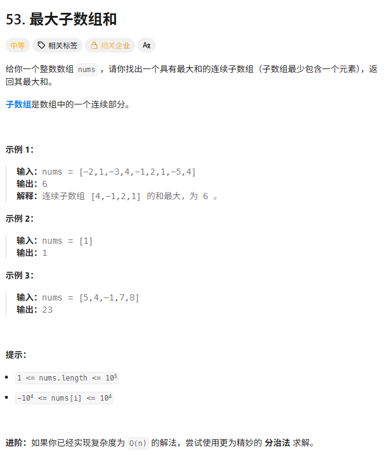
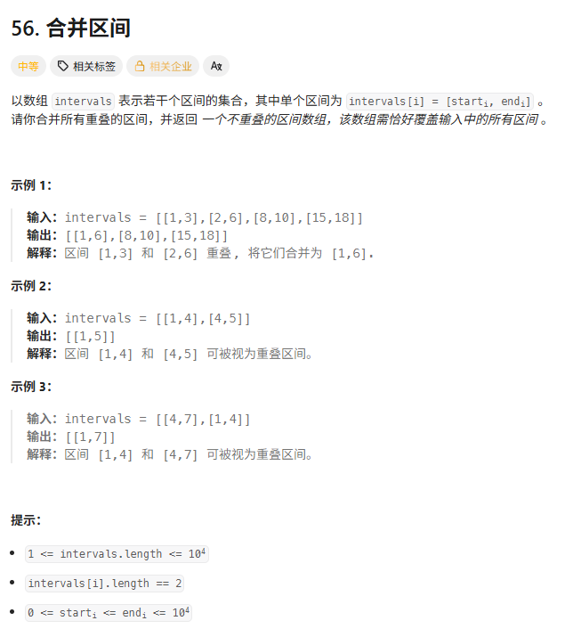
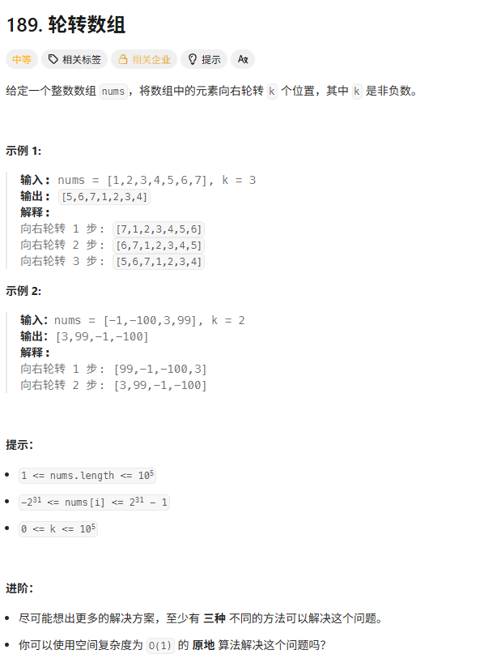
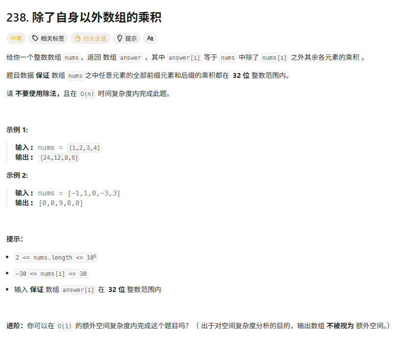
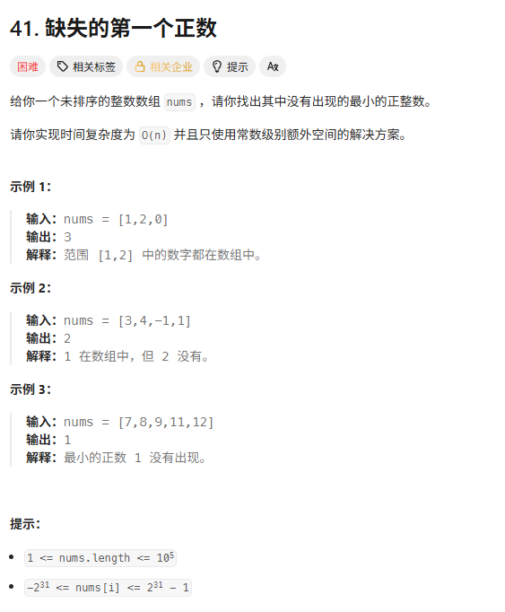

> [!NOTE]
>
> 普通数组

# 最大子数组和

字节一面



```c++
int maxSubArray(vector<int>& nums) {
    // pre: 以当前元素结尾的最大子数组和
    // maxAns: 全局最大的子数组和
    int pre = 0;
    int maxAns = nums[0];

    for (int x : nums) {
        // 核心决策：是自立门户(x)，还是继承家业(pre + x)？
        // 只要之前的和 pre > 0，pre + x 就一定比 x 大，反之则 x 大
        pre = max(x, pre + x);

        // 记录历史最高峰
        maxAns = max(maxAns, pre);
    }
    return maxAns;
}
```

`pre`会不断收集和为正的子序列 并将这个子序列的值更新到`Maxans` 

当`pre`变负时 下一个正的子序列会以下一个正的数字为开头：这样在一堆负数中隔离出了各个和为正的子序列 并不断比较选出它们的最大值 。

若是动态规划模板：

如果 `dp[i-1] > 0`（前面是正资产），那就接上它：`nums[i] + dp[i-1]`。

如果 `dp[i-1] <= 0`（前面是负债），那就不要它：`nums[i]`。

$$dp[i] = \max(nums[i], dp[i-1] + nums[i])$$

```c++
// 原始 DP 写法
vector<int> dp(n);
dp[0] = nums[0];
int maxAns = dp[0];

for (int i = 1; i < n; i++) {
    // 这一行就是状态转移方程
    dp[i] = max(nums[i], dp[i-1] + nums[i]); 
    maxAns = max(maxAns, dp[i]);
}
```

# 区间合并



```c++
vector<vector<int>> merge(vector<vector<int>>& intervals) {
    if (intervals.empty()) return {};

    // 1. 必须按照左端点排序
    // vector 的默认排序就是先比第一个元素，再比第二个，完全符合需求
    sort(intervals.begin(), intervals.end());

    vector<vector<int>> merged;
    // 先把第一个放入，作为比较的基准
    merged.push_back(intervals[0]);

    for (int i = 1; i < intervals.size(); i++) {
        // 使用引用，直接修改 merged 里的最后一个元素，避免拷贝
        vector<int>& last = merged.back();

        // 2. 核心逻辑：判断是否有交集
        if (last[1] >= intervals[i][0]) {
            // 有交集 -> 合并
            // 右边界取两者的最大值
            last[1] = max(last[1], intervals[i][1]);
        } else {
            // 无交集 -> 另起炉灶
            merged.push_back(intervals[i]);
        }
    }

    return merged;
}
```

```c++
vector<vector<int>> func(vector<vector<int>>& intervals) {

    if(intervals.empty()) return {};

    vector<vector<int>> ans;

    auto lmd = [](const vector<int>& a, const vector<int>& b) {
        return a[0] < b[0];
    };

    sort(intervals.begin(), intervals.end(), lmd);

    int left = intervals[0][0];
    int right = intervals[0][1];

    for (int i = 1; i < intervals.size(); i++) {

        int nextleft = intervals[i][0];
        int nextright = intervals[i][1];

        if (right >= nextleft) {       // 有重叠
            right = max(right, nextright);
        }
        else {                         // 无重叠
            ans.push_back({left, right});
            left = nextleft;
            right = nextright;
        }
    }

    ans.push_back({left, right});

    return ans;
}
```

# 轮转数组



```c++
// 手写 reverse 辅助函数（虽然可以直接用 std::reverse，但手写能展示基本功）
// 翻转 nums 中 [start, end] 闭区间的元素
void myReverse(vector<int>& nums, int start, int end) {
    while (start < end) {
        swap(nums[start], nums[end]);
        start++;
        end--;
    }
}

void rotate(vector<int>& nums, int k) {
    int n = nums.size();
    // 1. 预处理 k，防止 k 超过数组长度
    k = k % n;

    // 如果 k 是 0，不需要操作
    if (k == 0) return;

    // 2. 第一次翻转：整体翻转
    // [1, 2, 3, 4, 5, 6, 7] -> [7, 6, 5, 4, 3, 2, 1]
    // std::reverse(nums.begin(), nums.end()); // 也可以用这个
    myReverse(nums, 0, n - 1);

    // 3. 第二次翻转：翻转前 k 个
    // [7, 6, 5, ...] -> [5, 6, 7, ...]
    // std::reverse(nums.begin(), nums.begin() + k);
    myReverse(nums, 0, k - 1);

    // 4. 第三次翻转：翻转剩余部分
    // [..., 4, 3, 2, 1] -> [..., 1, 2, 3, 4]
    // std::reverse(nums.begin() + k, nums.end());
    myReverse(nums, k, n - 1);
}
```

或者（迭代器的区间是左闭右开）

```c++
void rotate(vector<int>& nums, int k) {
    int n = nums.size();
    k = k % n;
	reverse(nums.begin(), nums.begin() + n-k);
	reverse(nums.begin() + n-k, nums.end());
	reverse(nums.begin(), nums.end());
}
```

# 除自身以外数组的乘积



```c++
vector<int> productExceptSelf(vector<int>& nums) {
    int n = nums.size();
    vector<int> left(n, 1);
    vector<int> right(n, 1);
    left[0] = 1;
    right[n - 1] = 1;
    vector<int> ans;
    for (int i = 1; i < n; i++) {
        left[i] = left[i - 1] * nums[i - 1];
    }
    for (int i = n - 2; i >= 0; i--) {
        right[i] = right[i + 1] * nums[i + 1];
    }
    for (int i = 0; i < n; i++) {
        ans.push_back(left[i] * right[i]);
    }
    return ans;
}
```

```c++
vector<int> productExceptSelf(vector<int>& nums) {
    int n = nums.size();
    vector<int> ans(n);

    // 1. 第一轮：计算左侧所有元素的乘积
    // ans[i] 表示 i 左边所有元素的乘积
    ans[0] = 1; // 第0个元素左边没有数，初始化为1
    for (int i = 1; i < n; i++) {
        ans[i] = ans[i - 1] * nums[i - 1];
    }

    // 2. 第二轮：计算右侧所有元素的乘积，并直接乘到 ans 上
    // R 是一个动态变量，表示 i 右边所有元素的乘积
    int R = 1;
    for (int i = n - 1; i >= 0; i--) {
        // 最终结果 = 左侧积 * 右侧积
        ans[i] = ans[i] * R;

        // 更新 R，让它包含当前的 nums[i]，为下一个位置（i-1）做准备
        R *= nums[i];
    }

    return ans;
}
```

# 缺失的第一个正数hard



原地哈希这个思路来看确实是hard

```c++
int firstMissingPositive(vector<int>& nums) {
    int n = nums.size();

    // 1. 原地交换，把 nums[i] 放到 nums[i]-1 的位置上
    for (int i = 0; i < n; i++) {
        // 核心循环：
        // 条件1: nums[i] 是正数且不超过 n (有坑位)
        // 条件2: nums[i] 当前不在正确的位置上 (需要搬家)
        // 条件3: 目标坑位 (nums[nums[i]-1]) 上还没有正确的数字 (避免死循环，处理重复值)
        while (nums[i] >= 1 && nums[i] <= n && nums[nums[i] - 1] != nums[i]) {
            // 把 nums[i] 扔到它该去的地方
            swap(nums[i], nums[nums[i] - 1]);
        }
    }

    // 2. 扫描查找第一个不对劲的位置
    for (int i = 0; i < n; i++) {
        if (nums[i] != i + 1) {
            return i + 1; // 发现位置 i 缺了数字 i+1
        }
    }

    // 3. 如果所有位置都对 (例如 [1, 2, 3])，那缺的就是 n+1
    return n + 1;
}
```

但是如果直接用`unordered_set`

```c++
int func(vector<int>& nums) {
    unordered_set<int> hash_set;
    for (int num : nums) {
        if (num > 0)
            hash_set.insert(num);
    }
    int n = nums.size();
    for (int i = 1; i <= n; i++) {
        if (!hash_set.contains(i)) {
            return i;
        }
    }
    return n + 1;
}
```

很简单但是耗时很久 
