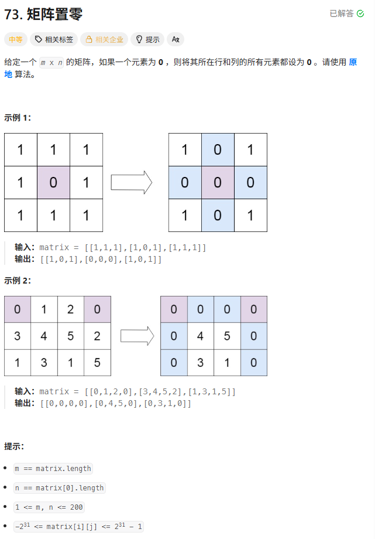
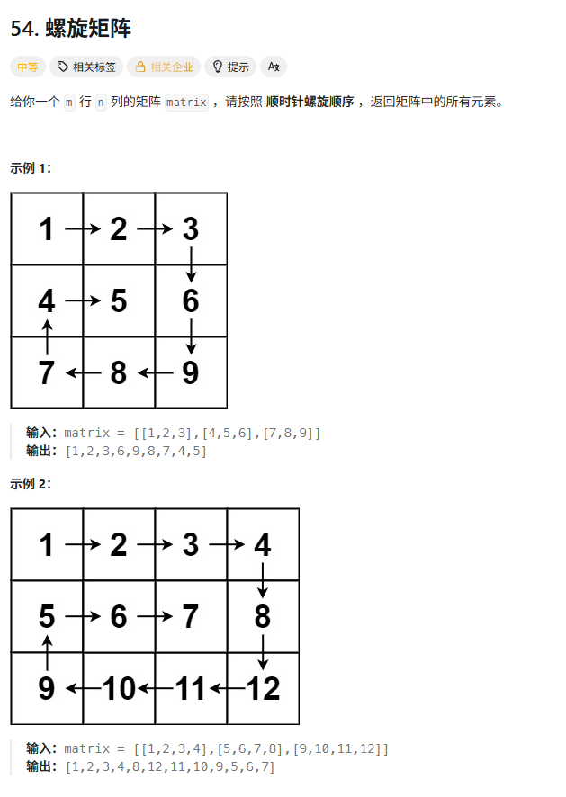
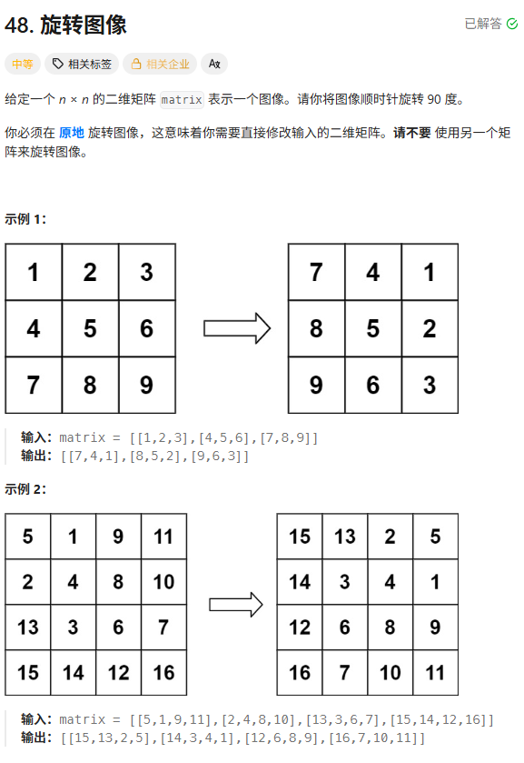
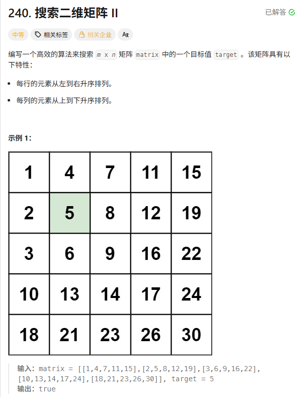
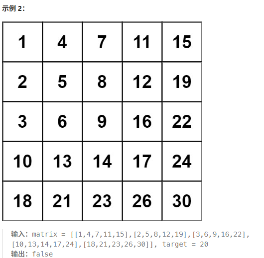

> [!NOTE]
>
> 矩阵

# 矩阵置0



```c++
void setZeroes(vector<vector<int>>& matrix) {
    int m = matrix.size();
    int n = matrix[0].size();

    // 1. 既然要利用第一行和第一列做标记，那先得看看它们自己本来有没有0
    bool row0_flag = false;
    bool col0_flag = false;

    // 检查第一列
    for (int i = 0; i < m; i++) {
        if (matrix[i][0] == 0) {
            col0_flag = true;
            break;
        }
    }
    // 检查第一行
    for (int j = 0; j < n; j++) {
        if (matrix[0][j] == 0) {
            row0_flag = true;
            break;
        }
    }

    // 2. 使用第一行和第一列记录内部的 0
    for (int i = 1; i < m; i++) {
        for (int j = 1; j < n; j++) {
            if (matrix[i][j] == 0) {
                matrix[i][0] = 0; // 行头变0
                matrix[0][j] = 0; // 列头变0
            }
        }
    }

    // 3. 根据表头的标记，把内部置为 0
    for (int i = 1; i < m; i++) {
        for (int j = 1; j < n; j++) {
            // 只要行头或列头有一个是0，我就变0
            if (matrix[i][0] == 0 || matrix[0][j] == 0) {
                matrix[i][j] = 0;
            }
        }
    }

    // 4. 最后处理第一行和第一列
    if (row0_flag) {
        for (int j = 0; j < n; j++) matrix[0][j] = 0;
    }
    if (col0_flag) {
        for (int i = 0; i < m; i++) matrix[i][0] = 0;
    }
}
```

#  螺旋矩阵



模拟题

```c++
vector<int> spiralOrder(vector<vector<int>>& matrix) {
    if (matrix.empty()) return {};
    vector<int> res;

    // 定义四个边界
    int top = 0;
    int bottom = matrix.size() - 1;
    int left = 0;
    int right = matrix[0].size() - 1;

    while (true) {
        // 1. 从左到右
        for (int i = left; i <= right; i++) res.push_back(matrix[top][i]);
        // 走完第一行，上边界下移。如果越界，说明走完了
        if (++top > bottom) break;

        // 2. 从上到下
        for (int i = top; i <= bottom; i++) res.push_back(matrix[i][right]);
        // 走完最右列，右边界左移
        if (--right < left) break;

        // 3. 从右到左
        for (int i = right; i >= left; i--) res.push_back(matrix[bottom][i]);
        // 走完最下行，下边界上移
        if (--bottom < top) break;

        // 4. 从下到上
        for (int i = bottom; i >= top; i--) res.push_back(matrix[i][left]);
        // 走完最左列，左边界右移
        if (++left > right) break;
    }

    return res;
}
```

也可以模拟实际在矩阵中走

```c++
vector<int> spiralOrder(vector<vector<int>>& matrix) {
    if (matrix.empty()) return {};
    int m = matrix.size();
    int n = matrix[0].size();

    vector<int> res;
    // 需要一个 visited 数组防止走回头路
    vector<vector<bool>> visited(m, vector<bool>(n, false));

    // 定义方向：右，下，左，上
    int dr[] = {0, 1, 0, -1};
    int dc[] = {1, 0, -1, 0};

    int r = 0, c = 0; // 当前坐标
    int di = 0;       // 当前方向 index (0:右)

    for (int i = 0; i < m * n; i++) {
        res.push_back(matrix[r][c]);
        visited[r][c] = true;

        // 1. 试探下一步
        int nr = r + dr[di];
        int nc = c + dc[di];

        // 2. 撞墙检测：越界 或者 已访问
        if (nr < 0 || nr >= m || nc < 0 || nc >= n || visited[nr][nc]) {
            // 撞墙了！换方向 (右转 90 度)
            di = (di + 1) % 4;
            // 重新计算下一步
            nr = r + dr[di];
            nc = c + dc[di];
        }

        // 3. 真正移动
        r = nr;
        c = nc;
    }

    return res;
}
```

# 旋转图像



```c++
void rotate(vector<vector<int>>& matrix) {
    int n = matrix.size();

    // 1. 沿主对角线进行镜像翻转 (Transpose)
    // 注意：j 从 i+1 开始，只遍历对角线右上方的元素，避免重复交换
    for (int i = 0; i < n; i++) {
        for (int j = i + 1; j < n; j++) {
            swap(matrix[i][j], matrix[j][i]);
        }
    }

    // 2. 每一行进行左右翻转
    for (int i = 0; i < n; i++) {
        // 使用 STL 的 reverse 极其优雅
        reverse(matrix[i].begin(), matrix[i].end());

        // 如果不能用 STL，就手写双指针：
        // int left = 0, right = n - 1;
        // while(left < right) swap(matrix[i][left++], matrix[i][right--]);
    }
}
```

直接莽

```c++
// 这种写法就是直接应用了旋转公式，没有用翻转技巧
// 但是下标计算极度容易写错，你可以感受一下这个压迫感
class Solution {
public:
    void rotate(vector<vector<int>>& matrix) {
        int n = matrix.size();
        // 我们只需要遍历 1/4 的矩阵区域（左上角），就能带动所有点旋转
        for (int i = 0; i < (n + 1) / 2; i++) {
            for (int j = 0; j < n / 2; j++) {
                // 1. 保存左上角
                int temp = matrix[i][j];
                // 2. 左下 -> 左上
                matrix[i][j] = matrix[n - 1 - j][i];
                // 3. 右下 -> 左下
                matrix[n - 1 - j][i] = matrix[n - 1 - i][n - 1 - j];
                // 4. 右上 -> 右下
                matrix[n - 1 - i][n - 1 - j] = matrix[j][n - 1 - i];
                // 5. 左上(temp) -> 右上
                matrix[j][n - 1 - i] = temp;
            }
        }
    }
};
```

# 搜索二维矩阵Ⅱ





请盯着矩阵的右上角看。

假设你站在 $(0, n-1)$ 这个位置，你发现了什么？

- **向左看**：所有数字都比你 **小**。
- **向下看**：所有数字都比你 **大**。

这不就是一颗 **二叉搜索树 (BST)** 吗？

- **根节点**：右上角元素。
- **左子树**：向左走（变小）。
- **右子树**：向下走（变大）。

#### 1核心算法：Z 字形查找

我们从右上角 $(row=0, col=n-1)$ 出发，把当前元素 `curr` 与 `target` 对比：

1. **如果 `curr > target`**：
   - 当前数太大了。
   - 因为列是递增的，所以**当前数下方的所有数肯定也比 `target` 大**。
   - **结论**：这一 **列** (col) 都可以废弃了。**向左移** (`col--`)。
2. **如果 `curr < target`**：
   - 当前数太小了。
   - 因为行是递增的，所以**当前数左边的所有数肯定也比 `target` 小**。
   - **结论**：这一 **行** (row) 都可以废弃了。**向下移** (`row++`)。
3. **如果 `curr == target`**：
   - **找到了！** 返回 `true`。

这样，每一步我们都能**排除一行或者一列**。最多走 $M + N$ 步，复杂度 $O(M+N)$。

```c++
bool searchMatrix(vector<vector<int>>& matrix, int target) {
    if (matrix.empty()) return false;

    int m = matrix.size();
    int n = matrix[0].size();

    // 从右上角开始：row = 0, col = n - 1
    int row = 0;
    int col = n - 1;

    // 只要没走出边界，就继续找
    while (row < m && col >= 0) {
        int curr = matrix[row][col];

        if (curr == target) {
            return true; // 找到了
        } 
        else if (curr > target) {
            // 当前值比目标大 -> 目标肯定在左边
            // (当前列下方的值只会更大，所以排除当前列)
            col--;
        } 
        else { // curr < target
            // 当前值比目标小 -> 目标肯定在下边
            // (当前行左边的值只会更小，所以排除当前行)
            row++;
        }
    }

    return false; // 走出边界还没找到
}
```

