> [!NOTE]
>
> 链表

# 相交链表

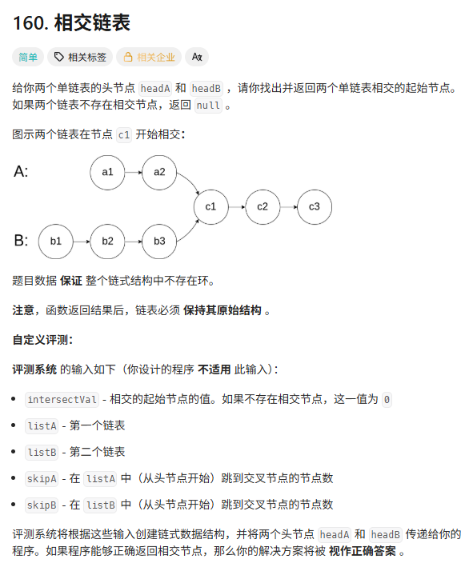

**思路：**

- `pA` 走完链表 A 之后，**立刻跳到链表 B 的头**继续走。
- `pB` 走完链表 B 之后，**立刻跳到链表 A 的头**继续走。

**之后：**

- `pA` 的路线：走完 A (4步) -> 走 B 的非公共部分 (3步) -> **到达交点**。总共 7 步。
- `pB` 的路线：走完 B (5步) -> 走 A 的非公共部分 (2步) -> **到达交点**。总共 7 步。

**原理：**

假设 A 的私有长度是 $a$，B 的私有长度是 $b$，公共长度是 $c$。

- `pA` 走的路径长：$a + c + b$

- `pB` 走的路径长：$b + c + a$

  因为 $a + c + b = b + c + a$，所以他们一定会在**第二次进入公共部分时相遇**。

第一次的错误写法

```c++
ListNode* getIntersectionNode(ListNode* headA, ListNode* headB) {
	if (headA == nullptr || headB == nullptr) return nullptr;
	ListNode* fA = headA;
	ListNode* fB = headB;
	while (fA != fB) {
		if (fA->next == nullptr) {
			fA = headB;
		}
		else {
			fA = fA->next;
		}
		if (fB->next == nullptr) {
			fB = headA;
		}
		else {
			fB = fB->next;
		}


	}
	return fA;
}
```

第一次为什么错了？当两个链表没交点时会无限循环。

正确写法

```c++
ListNode* getIntersectionNode(ListNode* headA, ListNode* headB) {
    ListNode* fA = headA;
    ListNode* fB = headB;

    while (fA != fB) {
        fA = (fA == nullptr) ? headB : fA->next;
        fB = (fB == nullptr) ? headA : fB->next;
    }

    return fA;
}
```

这个写法允许

```c++
A: a1 → a2 → a3 → null → b1 → b2 → null
B: b1 → b2 → null → a1 → a2 → a3 → null
```

# 翻转链表

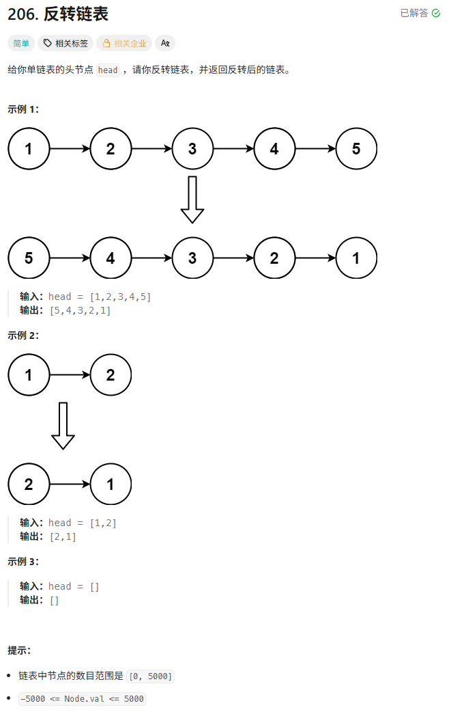

头插法

```c++
ListNode* reverseList(ListNode* head) {
    // 1. 边界条件防御
    if (head == nullptr || head->next == nullptr) return head;

    // 2. 创建虚拟头节点 (哨兵)
    // 它的 next 永远指向当前反转后的链表头部
    ListNode* dummy = new ListNode(-1); 
    dummy->next = head;

    // 3. 定义两个指针
    // prev: 永远指向原本的头节点 (现在的尾巴)，它像一个锚点，位置不变，负责"向后看"
    // curr: 永远指向 prev 后面的那个节点 (也就是我们要移动到最前面的那个节点)
    ListNode* prev = head;
    ListNode* curr = prev->next;

    // 4. 开始头插
    while (curr != nullptr) {
        // 第一步：先把 curr 从链表中摘除 (让 prev 连上 curr 的后面)
        prev->next = curr->next;
        
        // 第二步：把 curr 插入到 dummy 后面 (插队)
        curr->next = dummy->next;
        dummy->next = curr;

        // 第三步：更新 curr，准备处理下一个
        // 注意：prev 不需要动！prev->next 自动就指向了新的"下一个待处理节点"
        curr = prev->next; 
    }

    // 5. 取回结果，记得释放内存
    ListNode* newHead = dummy->next;
    delete dummy; 
    return newHead;
}
```

遍历法

```c++
ListNode* reverseList(ListNode* head) {
    ListNode* prev = nullptr;
    ListNode* curr = head;

    while (curr != nullptr) {
        ListNode* nextTemp = curr->next;
        curr->next = prev;
        prev = curr;
        curr = nextTemp;
    }
    return prev;
}
```

**递归法**

```c++
ListNode* reverseList(ListNode* head) {
    if (!head || !head->next) return head;

    ListNode* newHead = reverseList(head->next);

    head->next->next = head;
    head->next = nullptr;

    return newHead;
}
```

# 回文链表

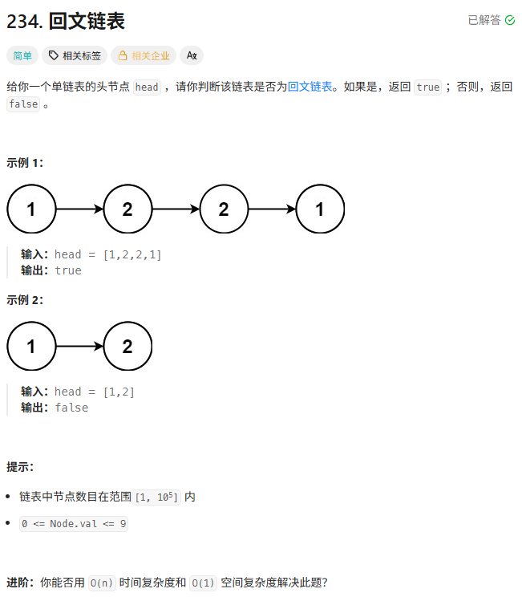

```c++
bool isPalindrome(ListNode* head) {
    if (head == nullptr || head->next == nullptr) return true;

    // 1. 快慢指针找中点
    ListNode* slow = head;
    ListNode* fast = head;
    while (fast != nullptr && fast->next != nullptr) {
        slow = slow->next;
        fast = fast->next->next;
    }
    // 此时 slow 指向中间位置（如果是奇数长度，slow 在正中间；偶数长度，slow 在后半段的起始）
    // 严格来说，对于奇数情况，slow 在正中间，不影响比较（因为反转后半段是从 slow 开始或者 slow->next）
    // 这里的策略是：直接反转以 slow 为头的子链表

    // 2. 反转后半部分链表
    ListNode* secondHalf = reverseList(slow);
    ListNode* p2 = secondHalf;
    ListNode* p1 = head;

    // 3. 比较前半部分和后半部分
    bool result = true;
    // 只需判断 p2 是否走完（因为后半段长度 <= 前半段）
    while (result && p2 != nullptr) {
        if (p1->val != p2->val) {
            result = false;
        }
        p1 = p1->next;
        p2 = p2->next;
    }

    // 4. (可选) 恢复链表结构 - 这是一个良好的工程习惯，虽然题目没强制要求
    // reverseList(secondHalf);

    return result;
}
```

或者直接这样写

```c++
ListNode* reverse(ListNode* head) {
    ListNode* prev = nullptr;
    ListNode* curr = head;

    while (curr) {
        ListNode* next = curr->next;
        curr->next = prev;
        prev = curr;
        curr = next;
    }
    return prev;
}

bool isPalindrome(ListNode* head) {
    if (!head || !head->next)
        return true;

    ListNode* slow = head;
    ListNode* fast = head;

    // 找中点
    while (fast->next && fast->next->next) {
        slow = slow->next;
        fast = fast->next->next;
    }

    // 反转后半部分
    ListNode* second = reverse(slow->next);

    // 比较
    ListNode* p1 = head;
    ListNode* p2 = second;

    while (p2) {
        if (p1->val != p2->val)
            return false;
        p1 = p1->next;
        p2 = p2->next;
    }

    return true;
}
```

奇数长度时：

```c++
1 → 2 → 3 → 2 → 1
1 → 2 → [3] → 2 → 1
          ↑
         slow
```

3不需要参与比较

偶数长度时：

```c++
1 → 2 → 2 → 1
1 → [2] → 2 → 1
      ↑
     slow
```

**递归做**

这道题使用快慢指针是为了得到链表的尾部信息，因为链表不能从后往前访问。

但是，递归可以先到链表的尾部，再从后往前返回。

此时需要一个全局的左指针。

```c++
class Solution {
public:
    ListNode* left;

    bool dfs(ListNode* right) {
        if (right == nullptr) return true;

        // 递归到底
        bool res = dfs(right->next);
        if (!res) return false;

        // 回溯时比较
        if (left->val != right->val) return false;

        // 左指针前进
        left = left->next;

        return true;
    }

    bool isPalindrome(ListNode* head) {
        left = head;
        return dfs(head);
    }
};
```

# 环形链表

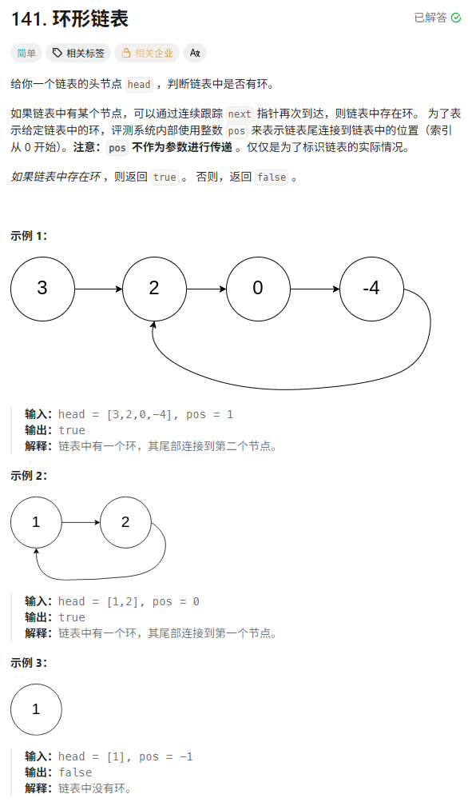

哈希做法

```c++
bool hasCycle(ListNode* head) {
	unordered_set<ListNode*> hash_set;
	ListNode* start = head;
	while (start != nullptr) {
		if (hash_set.contains(start)) {
			return true;
		}
		hash_set.insert(start);
		start = start->next;
	}
	return false;
}
```

快慢指针做法

```c++

```

# 环形链表Ⅱ

智谱一面

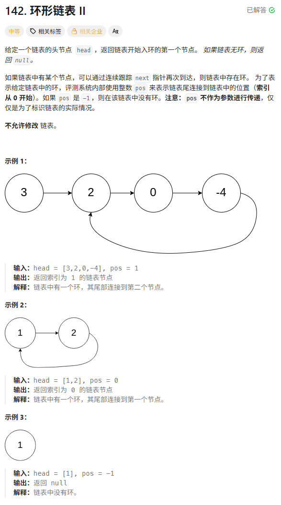

## 解方程

**核心思路：数学推导 (a = c)**

我们将链表分为三段距离：

- **$a$**：从头节点到环入口的直线距离。
- **$b$**：从环入口到相遇点的距离（在环内）。
- **$c$**：从相遇点回到环入口的距离（环剩下的部分）。
- **环的总长度**：$L = b + c$。

**第一次相遇（快慢指针）**

当 `fast` 和 `slow` 相遇时：

1. **`slow` 走的距离**：$S = a + b$（注意：slow 进环后肯定能在第一圈被追上，不可能绕圈）。
2. **`fast` 走的距离**：$F = a + b + n(b + c)$（fast 已经在环里转了 $n$ 圈了）。
3. **核心约束**：快指针速度是慢指针的 2 倍，所以 $F = 2S$。

**列方程：**

$$2(a + b) = a + b + n(b + c)$$

**化简：**

$$a + b = n(b + c)$$

$$a = n(b + c) - b$$

这里的 $n(b + c)$ 就是 $n$ 圈。为了好理解，我们假设 $n=1$（fast 只多转了一圈就追上了），那么公式简化为：

$$a = (b + c) - b$$

$$a = c$$

**得到结论从头节点走到环入口的距离 ($a$)，竟然等于“从相遇点继续走到环入口的距离 ($c$)**

**Phase 1 (判断有无环)**：

- 先用 `slow` 和 `fast` 跑，如果没相遇就返回 `null`。
- 如果在某点相遇了，**把 `fast` 指针按住不动（或者用一个新指针 `ptr` 记录这个位置）**。

**Phase 2 (找入口)**：

- 把 `slow` 指针**扔回链表头 `head`**。
- **关键点**：现在让 `slow` 和 `fast` **同时走，且每次都只走 1 步**。
- 根据 $a = c$，它们必将在 **环入口** 相遇。

正解：

```c++
ListNode *detectCycle(ListNode *head) {
    ListNode* slow = head;
    ListNode* fast = head;

    // Phase 1: 寻找相遇点
    while (fast != nullptr && fast->next != nullptr) {
        slow = slow->next;
        fast = fast->next->next;

        if (slow == fast) {
            // 相遇了！进入 Phase 2

            // 1. 将其中一个指针扔回起点
            ListNode* ptr1 = head;
            ListNode* ptr2 = slow; // 另一个指针保留在相遇点

            // 2. 两人同时走，每次一步
            while (ptr1 != ptr2) {
                ptr1 = ptr1->next;
                ptr2 = ptr2->next;
            }

            // 3. 相遇的地方就是入口
            return ptr1;
        }
    }

    // 跑到底了都没相遇，说明没环
    return nullptr;
}
```

千万不要写成这样，因为这样比较的不是地址是值。

```c++
ListNode* detectCycle(ListNode* head) {
    ListNode* slow = head;
    ListNode* fast = head;
    while (fast != nullptr && fast->next != nullptr) {
        slow = slow->next;
        fast = fast->next->next;
        if (slow->val == fast->val) {
            ListNode* p1 = head;
            ListNode* p2 = fast;
            while (p1->val != p2->val) {
                p1 = p1->next;
                p2 = p2->next;
            }
            return p1;
        }
    }
    return nullptr;
}
```

# 合并两个有序列表

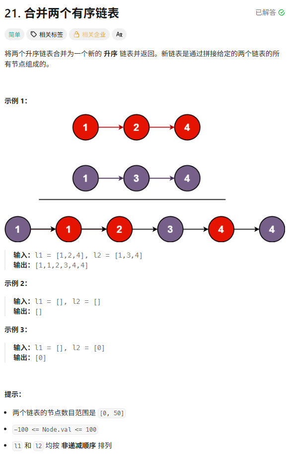

不能写为：这样会发生未定义

```c++
ListNode* dummy;
ListNode* tail = head;
```

迭代法

```c++
// 写法一：迭代法 (推荐，逻辑最清晰)
ListNode* mergeTwoLists_Iterative(ListNode* list1, ListNode* list2) {
    // 1. 创建虚拟头节点，避免处理头部的特殊情况
    ListNode* dummy = new ListNode(-1);
    ListNode* tail = dummy; // tail 永远指向当前合并链表的末尾

    // 2. 谁小谁排前面
    while (list1 != nullptr && list2 != nullptr) {
        if (list1->val <= list2->val) {
            tail->next = list1;   // 接入 list1
            list1 = list1->next;  // list1 指针后移
        } else {
            tail->next = list2;   // 接入 list2
            list2 = list2->next;  // list2 指针后移
        }
        tail = tail->next;        // tail 也要跟上
    }

    // 3. 处理剩余部分 (直接把剩下的一串接过来，不需要循环)
    if (list1 != nullptr) {
        tail->next = list1;
    } else if (list2 != nullptr) {
        tail->next = list2;
    }

    return dummy->next;
}
```

**递归法**

这道题用递归的写法好理解

每次从l1和l2头部选一个更小的，在递归处理剩余的。

```c++
ListNode* mergeTwoLists(ListNode* l1, ListNode* l2) {
    if (!l1) return l2;
    if (!l2) return l1;

    if (l1->val < l2->val) {
        l1->next = mergeTwoLists(l1->next, l2);
        return l1;
    } else {
        l2->next = mergeTwoLists(l1, l2->next);
        return l2;
    }
}
```

# 两数相加

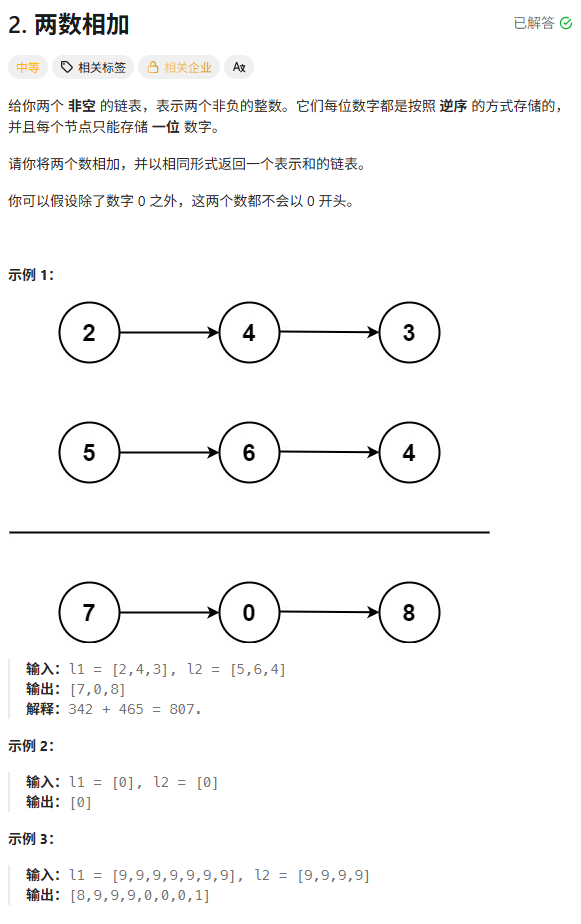

和高精度加法一个思路

```c++
ListNode* addTwoNumbers(ListNode* l1, ListNode* l2) {
    ListNode* dummy = new ListNode(-1); // 虚拟头节点，方便操作
    ListNode* curr = dummy;
    int carry = 0; // 进位

    // 只要 l1 还没走完，或者 l2 还没走完，或者还有进位没处理
    // 就可以继续生成新节点
    while (l1 != nullptr || l2 != nullptr || carry != 0) {
        // 1. 获取两个链表当前位的值（如果为空则取0）
        int val1 = (l1 != nullptr) ? l1->val : 0;
        int val2 = (l2 != nullptr) ? l2->val : 0;

        // 2. 计算当前位的和
        int sum = val1 + val2 + carry;

        // 3. 更新进位 和 当前位最终数字
        carry = sum / 10;
        int digit = sum % 10;

        // 4. 创建新节点挂在后面
        curr->next = new ListNode(digit);
        curr = curr->next;

        // 5. 指针后移 (注意判空)
        if (l1 != nullptr) l1 = l1->next;
        if (l2 != nullptr) l2 = l2->next;
    }

    return dummy->next;
}
```

**递归做法**

```c++
ListNode* add(ListNode* l1, ListNode* l2, int carry) {
    if (!l1 && !l2 && carry == 0) return nullptr;

    int x = l1 ? l1->val : 0;
    int y = l2 ? l2->val : 0;

    int sum = x + y + carry;

    ListNode* node = new ListNode(sum % 10);

    node->next = add(
        l1 ? l1->next : nullptr,
        l2 ? l2->next : nullptr,
        sum / 10
    );

    return node;
}

ListNode* addTwoNumbers(ListNode* l1, ListNode* l2) {
    return add(l1, l2, 0);
}
```

# 删除链表的倒数第n个结点

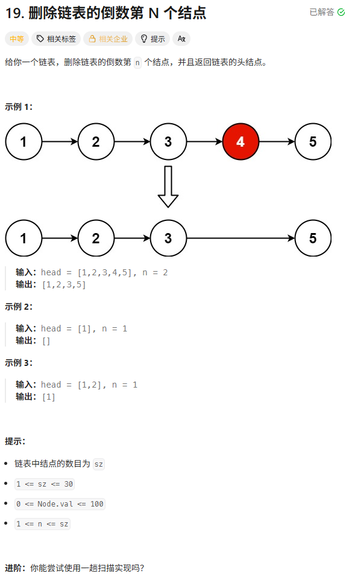

快慢指针

```c++
ListNode* removeNthFromEnd(ListNode* head, int n) {
    // 1. 创建虚拟头节点 (Dummy Node)
    // 这样做的好处是：即使删除的是第一个节点 (倒数第 L 个)，
    // slow 指针也能停在 dummy 上，操作逻辑完全一致。
    ListNode* dummy = new ListNode(-1);
    dummy->next = head;

    ListNode* fast = dummy;
    ListNode* slow = dummy;

    // 2. 让 fast 先走 n + 1 步
    // 为什么是 n+1？因为我们想让 slow 停在被删节点的前一个位置
    for (int i = 0; i <= n; i++) {
        // 题目保证 n 是有效的，但工程上最好判空 fast
        fast = fast->next;
    }

    // 3. 同时移动，直到 fast 走到末尾
    while (fast != nullptr) {
        fast = fast->next;
        slow = slow->next;
    }

    // 4. 此时 slow 就在倒数第 n 个节点的前面
    // 执行删除操作
    ListNode* toDelete = slow->next;
    slow->next = slow->next->next;

    // 5. 释放内存 (C++ 良好习惯)
    delete toDelete;

    ListNode* ans = dummy->next;
    delete dummy; // 别忘了释放哨兵
    return ans;
}
```

为什么走n步？slow指针停在删除结点的前一个结点

为什么用dummy？把头节点变为普通结点，防止删除第一个元素逻辑不同。

翻转做法

```c++
ListNode* removeNthFromEnd(ListNode* head, int n) {
	ListNode* dummy = new ListNode(-1);
	dummy->next = reverseList(head);
	ListNode* curr = dummy;
	int cnt = 1;
	while (cnt != n) {
		curr = curr->next;
		cnt++;
	}
	ListNode* willdel = curr->next;
	curr->next = curr->next->next;
	delete willdel;
	ListNode* ans = reverseList(dummy->next);
	delete dummy;
	return ans;
}
```

**栈做法**

这个其实也很直观

都入栈 之后出栈n次 栈顶元素就是n-1个元素 也就是n的前一个

```c++
ListNode* removeNthFromEnd(ListNode* head, int n) {
    ListNode* dummy = new ListNode(-1);
    dummy->next = head;
    ListNode* curr = dummy;
    stack<ListNode*> st;
    while (curr!=nullptr) {
        st.push(curr);
        curr = curr->next;
    }
    for (int i = 0; i < n; i++) {
        st.pop();
    }
    curr = st.top();
    curr->next = curr->next ? curr->next->next : nullptr;
    return dummy->next;
}
```

# 两两交换链表中的结点

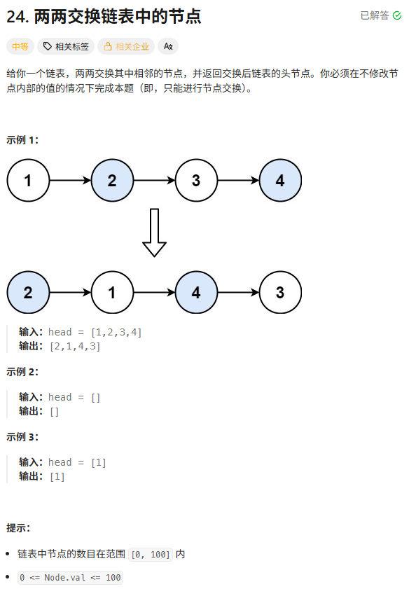

三步改链：

**牵头**：让 `temp` 指向 `node2` (`temp->next = node2`)。

**接尾**：让 `node1` 指向 `node3` (`node1->next = node2->next`)。

**回手**：让 `node2` 指向 `node1` (`node2->next = node1`)。

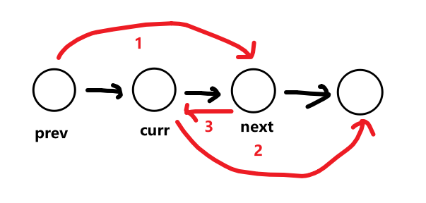

```c++
// 写法一：迭代法 (推荐面试使用，O(1) 空间，逻辑清晰)
    ListNode* swapPairs_Iterative(ListNode* head) {
    ListNode* dummy = new ListNode(-1);
    dummy->next = head;

    ListNode* temp = dummy;

    // 只有当后面还有至少两个节点时，才进行交换
    while (temp->next != nullptr && temp->next->next != nullptr) {
        // 1. 定位要交换的两个节点
        ListNode* node1 = temp->next;
        ListNode* node2 = temp->next->next;

        // 2. 三步修改指针 (画图最清晰)
        temp->next = node2;       // 步骤1: 前驱指向第2个
        node1->next = node2->next;// 步骤2: 第1个指向第3个 (这一步如果不先做，node3就丢了)
        node2->next = node1;      // 步骤3: 第2个指向第1个

        // 3. 准备下一轮
        // 此时原来的 node1 变成了这一对的后一个，也就是下一对的前驱
        temp = node1;
    }

    ListNode* ans = dummy->next;
    delete dummy;
    return ans;
}
```

```c++
ListNode* swapPairs(ListNode* head) {
    ListNode dummy(-1);
    dummy.next = head;

    ListNode* prev = &dummy;

    while (prev->next && prev->next->next) {

        ListNode* curr = prev->next;
        ListNode* next = curr->next;

        curr->next = next->next;
        next->next = curr;
        prev->next = next;

        prev = curr;
    }

    return dummy.next;
}
```

递归法

```c++
ListNode* swapPairs(ListNode* head) {
    if (!head || !head->next) return head;
    ListNode* next = head->next;

    head->next = swapPairs(next->next);
    next->next = head;
    return next;
}
```

## 递归的两种分类

**第一类：线性递归 (Linear Recursion) —— “一条绳子走到黑”**

**你的感觉**：“向后摊开，再向前收敛”。

这就是我们在**链表**中遇到的情况。

- **结构**：单线条。
- **动作**：
  1. **递（Dive）**：像把一个弹簧压到底，或者像钻进一个深井，必须先一路走到终点（Base Case）。
  2. **归（Surface）**：触底反弹，利用函数的返回值，一层一层地往回传，边传边处理。
- **典型场景**：反转链表、阶乘计算 `f(n) = n * f(n-1)`。

**形象比喻：俄罗斯套娃** 你必须先把娃娃一层层打开（递归展开），直到最小的那个（Base Case）。然后你再一层层盖回去（递归收敛），在盖回去的过程中，你才有机会对每一层做点手脚（比如 `head->next->next = head`）。

------

**第二类：树形递归 / 分治 (Tree Recursion / Divide and Conquer) —— “两翼包抄”**

**你的感觉**：“从两个方向摊开，从两个方向往中间收敛”。

这就是你以前可能遇到的 **归并排序 (Merge Sort)**、**二叉树遍历** 或者 **斐波那契数列**。

- **结构**：分支状（像树根一样炸开）。
- **动作**：
  1. **分（Divide）**：大问题切成两半（甚至更多半），分别丢给两个递归函数去跑。
  2. **治（Conquer）**：两个分支各自跑完，拿着结果回来汇报。
  3. **合（Combine）**：站在当前节点，把左右手拿回来的结果拼在一起。
- **典型场景**：归并排序、快速排序、二叉树的后序遍历。

| **特性**            | **线性递归 (Linear)**    | **分治/树形递归 (Tree/Divide & Conquer)** |
| ------------------- | ------------------------ | ----------------------------------------- |
| **你的感觉**        | **弹簧/深井** (后摊前收) | **树杈** (两边摊中间收)                   |
| **子问题数量**      | 1 个 (`f(n-1)`)          | 2 个或更多 (`f(n/2)`)                     |
| **Call Stack 形状** | 一条直线 (`              | `)                                        |
| **典型应用**        | 链表反转、阶乘           | 归并排序、二叉树遍历                      |
| **空间复杂度**      | $O(N)$ (栈深)            | $O(\log N)$ (如果是平衡树)                |

# k个一组翻转链表hard

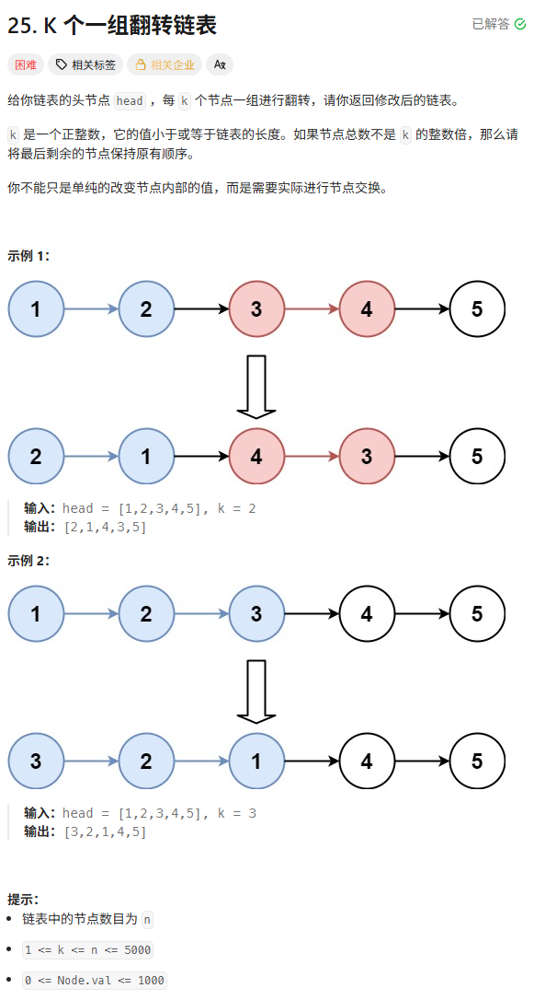

遍历法

```c++
ListNode* reverseKGroup(ListNode* head, int k) {
    // 虚拟头节点，作为第 0 组的尾巴，方便处理第 1 组
    ListNode* dummy = new ListNode(-1);
    dummy->next = head;

    // pre 永远指向"上一组的尾巴"
    ListNode* pre = dummy;

    while (true) {
        // 1. 检查剩余节点是否有 k 个
        ListNode* end = pre;
        for (int i = 0; i < k; i++) {
            end = end->next;
            // 如果不足 k 个，直接结束，不反转
            if (end == nullptr) {
                ListNode* ans = dummy->next;
                delete dummy;
                return ans;
            }
        }

        // 此时：
        // pre 是上一组结尾
        // start 是本组开始 (pre->next)
        // end 是本组结束
        // nextGroup 是下一组开始 (end->next)

        ListNode* start = pre->next;
        ListNode* nextGroup = end->next;

        // 2. 断开链表，准备反转
        end->next = nullptr;

        // 3. 反转当前组 (pre->next 指向新的头)
        pre->next = reverse(start);

        // 4. 接上下一组
        // 反转后，start 变成了本组的尾巴，它应该连接 nextGroup
        start->next = nextGroup;

        // 5. 指针推进：pre 跳到本组的尾巴 (即 start)
        pre = start;
    }
}
```

注意这里是k-1 或者end从prev开始 或者从`prev->next`开始k-1

```c++
ListNode* reverseKGroup(ListNode* head, int k) {
		ListNode* dummy = new ListNode(-1);
        dummy->next = head;
		ListNode* prev = dummy;
		while (true) {
			ListNode* start = prev->next;
			ListNode* end = start;
			for (int i = 0; i < k-1; i++) {
				end = end->next;
				if (!end) return dummy->next;
			}
			ListNode* nextgroup = end->next;
			end->next = nullptr;
			prev->next = reverse(start);
			start->next = nextgroup;
			prev = start;
		}
		return dummy->next;
}
```

递归法

```c++
ListNode* reverseKGroup(ListNode* head, int k) {
    // 1. 【侦查】往后找 k 个节点
    ListNode* cursor = head;
    for (int i = 0; i < k; i++) {
        // 如果不足 k 个，说明到了链表最后，保持原样直接返回
        if (cursor == nullptr) {
            return head;
        }
        cursor = cursor->next;
    }

    // 此时 cursor 指向的是"下一组的开头"
    // 也就是说，我们要翻转的区间是 [head, cursor) -> 左闭右开

    // 2. 【翻转】反转当前这 k 个节点
    // 这里我们可以直接复用反转链表的逻辑
    // 只不过以前是反转到 null 结束，现在是反转到 cursor 结束
    ListNode* newHead = reverse(head, cursor);

    // 3. 【甩锅】递归处理剩下的，并连接起来
    // 此时 head 变成了当前组的尾巴，它的 next 应该指向下一组递归的结果
    head->next = reverseKGroup(cursor, k);

    // 4. 【交差】返回新的头
    return newHead;
}
```

**递归做法**

```c++
ListNode* func(ListNode* head, int k) {
	ListNode* curr = head;
	ListNode* end = curr;
	for (int i = 0; i < k - 1; i++) {
		if (!end) return head;
		end = end->next;
	}
	if (!end) return head;
	ListNode* prev = nullptr;
	ListNode* nextgroup = end->next;
	while (curr != nextgroup) {
		ListNode* nextnode = curr->next;
		curr->next = prev;
		prev = curr;
		curr = nextnode;
	}
	head->next = func(nextgroup, k);
	return prev;
}
```

# 随机链表的复制

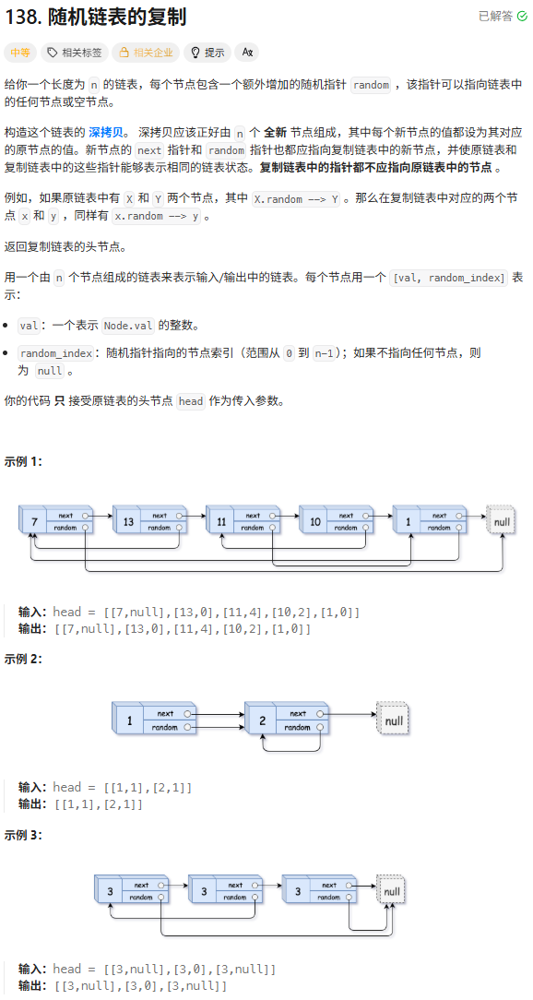

O(1)最优做法

```c++
Node* copyRandomList(Node* head) {
    if (head == nullptr) return nullptr;

    // Step 1: 复制每个节点，并插入到原节点后面
    // 1 -> 2 -> 3  ==>  1 -> 1' -> 2 -> 2' -> 3 -> 3'
    Node* curr = head;
    while (curr != nullptr) {
        Node* newNode = new Node(curr->val);
        newNode->next = curr->next;
        curr->next = newNode;
        curr = newNode->next; // 跳两步，去处理下一个原节点
    }

    // Step 2: 处理 random 指针
    curr = head;
    while (curr != nullptr) {
        // curr->next 就是克隆节点
        if (curr->random != nullptr) {
            // 克隆节点的 random = 原节点 random 的 next (也就是原节点 random 的克隆)
            curr->next->random = curr->random->next;
        }
        // 跳两步
        curr = curr->next->next;
    }

    // Step 3: 拆分链表 (恢复原链表，提取新链表)
    curr = head;
    Node* newHead = head->next;
    Node* currNew = newHead;

    while (curr != nullptr) {
        // 恢复原链表: 1 -> 1' -> 2  ==>  1 -> 2
        curr->next = curr->next->next;

        // 恢复新链表: 1' -> 2 -> 2' ==> 1' -> 2'
        if (currNew->next != nullptr) {
            currNew->next = currNew->next->next;
        }

        // 两个指针都往后走
        curr = curr->next;
        currNew = currNew->next;
    }

    return newHead;
}
```

哈希

```c++
Node* copyRandomList(Node* head) {
	if (head == nullptr) return nullptr;
	unordered_map<Node*, Node*> hash_map;
	Node* curr = head;
	while (curr != nullptr)
	{
		hash_map[curr] = new Node(curr->val);
		curr = curr->next;
	}
	//for(pair<const Node*, Node*> ele:hash_maplian)
	for (auto& ele : hash_map) {
		Node* original = ele.first;
		Node* copy = ele.second;
		copy->next = (original->next) ? hash_map[original->next] : nullptr;
		copy->random = (original->random) ? hash_map[original->random] : nullptr;
	}
	return hash_map[head];
}
```

这样子写如果没有 直接新建一条hash_map[nullptr]=nullptr

```c++
Node* copyRandomList(Node* head) {
    if (head == nullptr) return nullptr;

    // 1. 定义哈希表: <原节点地址, 新节点地址>
    unordered_map<Node*, Node*> map;

    // 2. 第一遍遍历：只负责创建节点，存入 map
    Node* curr = head;
    while (curr != nullptr) {
        map[curr] = new Node(curr->val);
        curr = curr->next;
    }

    // 3. 第二遍遍历：负责连接 next 和 random
    curr = head;
    while (curr != nullptr) {
        // 取出新节点
        Node* newNode = map[curr];

        // 连接 next: 查表找 old->next 对应的 new 节点
        newNode->next = map[curr->next]; 

        // 连接 random: 查表找 old->random 对应的 new 节点
        newNode->random = map[curr->random];

        curr = curr->next;
    }

    // 4. 返回原头节点对应的新头节点
    return map[head];
}
```

# 排序链表

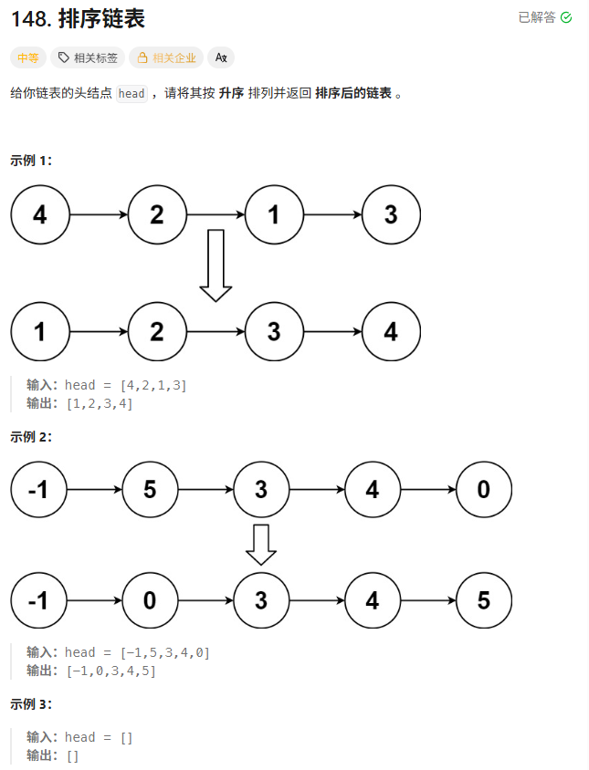

```c++
ListNode* sortList(ListNode* head) {
    // 1. Base Case: 如果为空或只有一个节点，不需要排序
    if (head == nullptr || head->next == nullptr) {
        return head;
    }

    // 2. 【分】找到中点，切断链表
    // 技巧：fast 从 head->next 开始，这样 slow 会停在前半段的末尾
    ListNode* slow = head;
    ListNode* fast = head->next;

    while (fast != nullptr && fast->next != nullptr) {
        slow = slow->next;
        fast = fast->next->next;
    }

    // 此时 slow 是中点（前半段尾巴），mid 是后半段开头
    ListNode* mid = slow->next;
    slow->next = nullptr; // 切断！

    // 3. 【治】递归排序左右两半
    ListNode* left = sortList(head);
    ListNode* right = sortList(mid);

    // 4. 【合】合并两个有序链表 (复用 No.21 的逻辑)
    return mergeTwoLists(left, right);
}

// 直接复用 No.21 的合并代码
ListNode* mergeTwoLists(ListNode* l1, ListNode* l2) {
    ListNode* dummy = new ListNode(-1);
    ListNode* tail = dummy;

    while (l1 != nullptr && l2 != nullptr) {
        if (l1->val <= l2->val) {
            tail->next = l1;
            l1 = l1->next;
        } else {
            tail->next = l2;
            l2 = l2->next;
        }
        tail = tail->next;
    }

    if (l1 != nullptr) tail->next = l1;
    if (l2 != nullptr) tail->next = l2;

    ListNode* ans = dummy->next;
    delete dummy;
    return ans;
}
```

# 合并K个升序列表hard

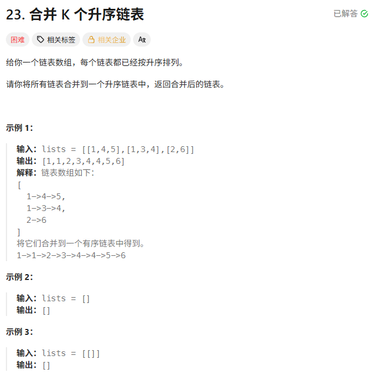

使用最小堆来做

```c++
// 1. 定义仿函数 (Comparator)
// C++ 的 priority_queue 默认是大顶堆 (大的在上面)
// 我们需要小顶堆，所以这里要返回 "大于" (a > b)，让小的沉不下去，浮上来
struct Compare {
    bool operator()(ListNode* a, ListNode* b) {
        return a->val > b->val;
    }
};

ListNode* mergeKLists(vector<ListNode*>& lists) {
    // 定义优先队列: <类型, 底层容器, 比较器>
    priority_queue<ListNode*, vector<ListNode*>, Compare> pq;

    // 2. 初始化：把所有链表的头节点放入堆中
    for (ListNode* list : lists) {
        if (list != nullptr) {
            pq.push(list);
        }
    }

    // 3. 开始合并
    ListNode* dummy = new ListNode(-1);
    ListNode* tail = dummy;

    while (!pq.empty()) {
        // 取出最小的
        ListNode* minNode = pq.top();
        pq.pop();

        // 挂到结果链表后面
        tail->next = minNode;
        tail = tail->next;

        // 如果这个节点后面还有人，把它推入堆中
        if (minNode->next != nullptr) {
            pq.push(minNode->next);
        }
    }

    return dummy->next;
}
```

仿函数使用lambda也是完全OK的

```c++
auto lmd = [](ListNode* a, ListNode* b) {
    return a->val > b->val;
};

priority_queue<ListNode*, vector<ListNode*>, decltype(lmd)> pq(lmd);
```

使用两两归并来做：

```c++
ListNode* mergeKLists(vector<ListNode*>& lists) {
    if (lists.empty()) return nullptr;
    return merge(lists, 0, lists.size() - 1);
}

// 1. 分治主逻辑 (类似于归并排序)
ListNode* merge(vector<ListNode*>& lists, int left, int right) {
    // Base Case: 只剩一个链表，直接返回
    if (left == right) return lists[left];

    // 计算中点
    int mid = left + (right - left) / 2;

    // 递归合并左半部分
    ListNode* l1 = merge(lists, left, mid);
    // 递归合并右半部分
    ListNode* l2 = merge(lists, mid + 1, right);

    // 合并两部分结果
    return mergeTwoLists(l1, l2);
}

// 2. 复用 No.21 的合并两个有序链表 (完全不用改)
ListNode* mergeTwoLists(ListNode* list1, ListNode* list2) {
    ListNode* dummy = new ListNode(-1);
    ListNode* tail = dummy;

    while (list1 != nullptr && list2 != nullptr) {
        if (list1->val <= list2->val) {
            tail->next = list1;
            list1 = list1->next;
        } else {
            tail->next = list2;
            list2 = list2->next;
        }
        tail = tail->next;
    }

    if (list1 != nullptr) tail->next = list1;
    if (list2 != nullptr) tail->next = list2;

    ListNode* ans = dummy->next;
    delete dummy;
    return ans;
}
```

# LRU缓存

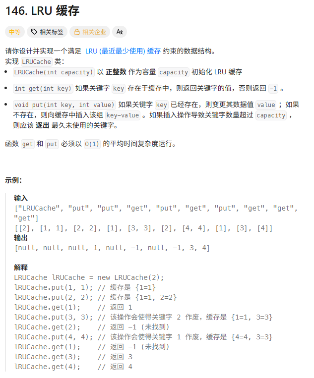

这道题面经中出场次数太多了

**`get(key)`**: 必须 $O(1)$。$\rightarrow$ 这意味着必须用 **哈希表**。

**`put(key, value)`**: 必须 $O(1)$。

- 如果满了，要删除“最近最少使用”的元素。
- 这就涉及到“维护顺序”。哈希表是无序的，无法维护顺序。
- **链表** 可以维护顺序，但链表查找是 $O(N)$。

**哈希表 + 双向链表**

我们构建一个混合体：

- **双向链表**：用来存具体的数据节点 `(key, value)`。
  - **约定**：靠头的是“最近使用过的 (Hot)”，靠尾的是“最近最少使用的 (Cold/LRU)”。
- **哈希表**：存储 `key -> Node*` 的映射。
  - 让我们能直接通过 key 瞬间抓到链表里的那个节点地址，不需要遍历链表。

**为什么要用“双向”链表？**

这是面试常问点。

当我们通过哈希表找到节点 `node` 后，我们需要把它移动到头部。

移动意味着：先**删除**，再**插入**。

- 在单链表中，删除 `node` 需要知道它的**前驱** (`prev`)，这需要 $O(N)$ 遍历。
- 在**双向链表**中，`node->prev` 直接就能找到前驱，删除操作是严格的 $O(1)$。

几个原子函数

**`removeNode(Node\* node)`**：把一个节点从链表中摘下来（孤立它）。

**`addToHead(Node\* node)`**：把一个节点插到虚拟头节点之后。

**`moveToHead(Node\* node)`**：组合拳 = `removeNode` + `addToHead`。

为了避免处理 `head` 或 `tail` 为空的恶心边界情况，我们直接定义两个哨兵：`dummyHead` 和 `dummyTail`。链表永远长这样： `dummyHead <-> Node1 <-> Node2 <-> ... <-> dummyTail`


```c++
class LRUCache {
    private:
    // 1. 定义双向链表节点
    struct Node {
        int key, val;
        Node *prev, *next;
        Node(int k, int v) : key(k), val(v), prev(nullptr), next(nullptr) {}
    };

    // 2. 核心数据结构
    int capacity;
    unordered_map<int, Node*> map; // Key -> Node地址
    Node* dummyHead; // 虚拟头
    Node* dummyTail; // 虚拟尾

    // --- 原子操作封装 (核心中的核心) ---

    // 作用：从链表中移除节点 (断开连接，但不 delete 内存)
    void removeNode(Node* node) {
        node->prev->next = node->next;
        node->next->prev = node->prev;
    }

    // 作用：把节点插入到头部 (dummyHead 后面)
    void addToHead(Node* node) {
        node->prev = dummyHead;
        node->next = dummyHead->next;

        dummyHead->next->prev = node; // 原来的第一个节点认新大哥
        dummyHead->next = node;       // dummyHead 认新大哥
    }

    // 作用：把一个已存在的节点移到头部
    void moveToHead(Node* node) {
        removeNode(node);
        addToHead(node);
    }

    // 作用：删除尾部节点 (淘汰最久未使用的)
    Node* removeTail() {
        Node* node = dummyTail->prev; // 真正的最后一个节点
        removeNode(node);
        return node;
    }

    public:
    LRUCache(int capacity) : capacity(capacity) {
        dummyHead = new Node(-1, -1);
        dummyTail = new Node(-1, -1);
        // 初始化链表: Head <-> Tail
        dummyHead->next = dummyTail;
        dummyTail->prev = dummyHead;
    }

    // 析构函数 (良好习惯，虽然刷题不写也行，但面试写了加分)
    ~LRUCache() {
        Node* curr = dummyHead;
        while (curr) {
            Node* next = curr->next;
            delete curr;
            curr = next;
        }
    }

    int get(int key) {
        // 1. 查表
        if (map.find(key) == map.end()) {
            return -1;
        }

        // 2. 找到了，这个节点变"热"了，移到头部
        Node* node = map[key];
        moveToHead(node);

        return node->val;
    }

    void put(int key, int value) {
        if (map.find(key) != map.end()) {
            // Case 1: Key 已存在 -> 更新 value，移到头部
            Node* node = map[key];
            node->val = value;
            moveToHead(node);
        } else {
            // Case 2: Key 不存在 -> 创建新节点
            Node* newNode = new Node(key, value);

            // 判断容量
            if (map.size() >= capacity) {
                // 满了！淘汰尾部
                Node* tail = removeTail();
                map.erase(tail->key); // 既然淘汰了，map里也要删 (注意：这里需要Node存key的原因)
                delete tail;          // 释放内存
            }

            // 插入新节点到头部，并存入 map
            addToHead(newNode);
            map[key] = newNode;
        }
    }
};
