> [!NOTE]
>
> 二叉树

# 二叉树的递归遍历

```c++
void dfs(TreeNode* root) {
    if (root == nullptr) return;

    // ① 这里是前序位置

    dfs(root->left);

    // ② 这里是中序位置

    dfs(root->right);

    // ③ 这里是后序位置
}
```

```c++
void preorder(TreeNode* root) {
    if (!root) return;

    ans.push_back(root->val);  // 前序位置
    preorder(root->left);
    preorder(root->right);
}
```

```c++
void inorder(TreeNode* root) {
    if (!root) return;

    inorder(root->left);
    ans.push_back(root->val);  // 中序位置
    inorder(root->right);
}
```

```c++
void postorder(TreeNode* root) {
    if (!root) return;

    postorder(root->left);
    postorder(root->right);
    ans.push_back(root->val);  // 后序位置
}
```

# 二叉树的迭代遍历

前序遍历

```c++
vector<int> preorderTraversal(TreeNode* root) {
    vector<int> ans;
    if (!root) return ans;

    stack<TreeNode*> st;
    st.push(root);

    while (!st.empty()) {
        TreeNode* node = st.top();
        st.pop();

        ans.push_back(node->val);

        if (node->right) st.push(node->right);
        if (node->left)  st.push(node->left);
    }

    return ans;
}
```

中序遍历

因为要遍历最左边的左子树 所以要用while寻找 其它都一样

```c++
vector<int> inorderTraversal(TreeNode* root) {
    vector<int> ans;
    stack<TreeNode*> st;
    TreeNode* curr = root;

    while (curr || !st.empty()) {

        while (curr) {
            st.push(curr);
            curr = curr->left;
        }

        curr = st.top();
        st.pop();

        ans.push_back(curr->val);

        curr = curr->right;
    }

    return ans;
}
```

后续遍历 使用前序的根->右->左迭代 之后翻转顺序

```c++
vector<int> postorderTraversal(TreeNode* root) {
    vector<int> res;
    if (root == nullptr) return res;

    stack<TreeNode*> st;
    st.push(root);

    while (!st.empty()) {
        // 1. 弹出节点
        TreeNode* node = st.top();
        st.pop();
        res.push_back(node->val);

        // 2. 这里的逻辑和前序相反
        // 前序是：先右入栈，再左入栈 (为了先拿左)
        // 这里是：先左入栈，再右入栈 (为了先拿右)
        // 结果顺序变成：根 -> 右 -> 左
        if (node->left) st.push(node->left);
        if (node->right) st.push(node->right);
    }

    // 3. 最后反转数组
    // 根->右->左  ==反转==>  左->右->根 (后序)
    reverse(res.begin(), res.end());
    return res;
}
```

# 二叉树的统一遍历

```c++
// 统一格式迭代法 - 中序遍历
vector<int> inorderTraversal(TreeNode* root) {
    vector<int> res;
    stack<TreeNode*> st;
    if (root) st.push(root);

    while (!st.empty()) {
        TreeNode* node = st.top();
        st.pop();

        if (node != nullptr) {
            // ⚠️ 遇到普通节点，说明还没处理它的子节点
            // 按照 中序 (左->根->右) 的相反顺序入栈：右->根->左
            
            if (node->right) st.push(node->right);  // 右
            
            st.push(node);                          // 根
            st.push(nullptr); // 🎯 关键：给根节点打上"已处理"标记(压入个空指针)
            
            if (node->left) st.push(node->left);    // 左
            
        } else {
            // 🎯 遇到 nullptr，说明栈顶下一个元素是"已处理"的，直接输出
            res.push_back(st.top()->val);
            st.pop();
        }
    }
    return res;
}
```

若改为前序

```c++
if (node->right) st.push(node->right);
if (node->left) st.push(node->left);
st.push(node); st.push(nullptr); // 根放最后进栈，最先出栈
```

若改为后续

```c++
st.push(node); st.push(nullptr); // 根最先进栈，最后出栈
if (node->right) st.push(node->right);
if (node->left) st.push(node->left);
```

这个 `nullptr` 不是随便压的，它的数学意义是：
$$
\text{标记：该节点下一次出栈时可以访问}
$$
换句话说：

> 人为制造了“第二次访问节点”的时机

这就完全模拟了递归。

---

> [!IMPORTANT]
>
> 好了 既然问题都解决了 那么接下来开始做题

# 二叉树的最大深度

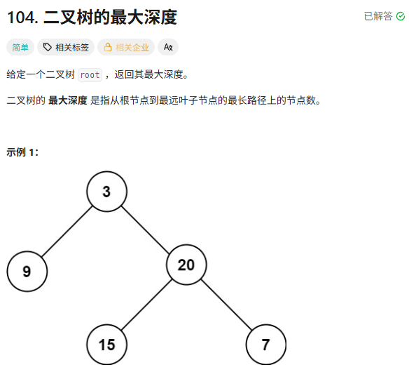

递归

```c++
int maxDepth(TreeNode* root) {
            // 1. 终止条件：空节点深度为 0
            if (root == nullptr) return 0;
            
            // 2. 递归获取左右子树的深度
            int leftDepth = maxDepth(root->left);
            int rightDepth = maxDepth(root->right);
            
            // 3. 处理当前层：取最大值 + 1
            return max(leftDepth, rightDepth) + 1;
        }
```

层次遍历

```c++
// 迭代法 (层序遍历)
int maxDepthBFS(TreeNode* root) {
    if (root == nullptr) return 0;
    
    queue<TreeNode*> q;
    q.push(root);
    int depth = 0;
    
    while (!q.empty()) {
        int size = q.size(); // 关键：记录当前这一层有多少个节点
        
        // 把当前这一层的所有节点都处理掉
        for (int i = 0; i < size; i++) {
            TreeNode* node = q.front();
            q.pop();
            
            // 把下一层的节点加入队列
            if (node->left) q.push(node->left);
            if (node->right) q.push(node->right);
        }
        
        // 这一层处理完了，深度 +1
        depth++;
    }
    
    return depth;
}
```

# 翻转二叉树

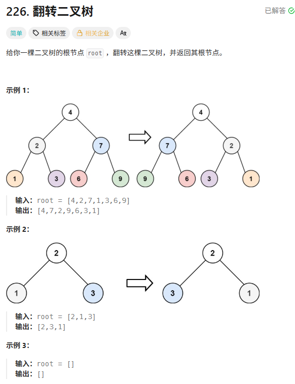

递归做法

```c++
TreeNode* invertTree(TreeNode* root) {
    // 1. 终止条件
    if (root == nullptr) return nullptr;

    // 2. 核心操作：交换左右孩子 (前序位置)
    swap(root->left, root->right);

    // 3. 递归处理子节点
    invertTree(root->left);
    invertTree(root->right);

    return root;
}
```

层次遍历做法

```c++
TreeNode* invertTree(TreeNode* root) {
	queue<TreeNode*> q;
	if (root) q.push(root);
	while (!q.empty()) {
		TreeNode* curr = q.front();
		q.pop();
		if (curr->left)q.push(curr->left);
		if (curr->right) q.push(curr->right);
		if (curr) {
			swap(curr->left, curr->right);
		}
	}
	return root;
}
```

# 对称二叉树

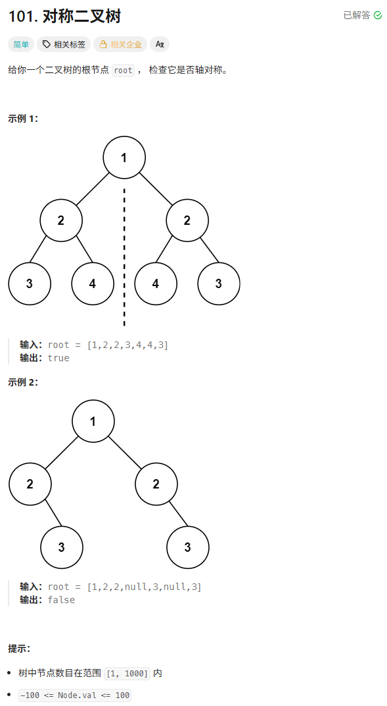

```c++
// 方法一：递归法 (推荐面试写这个，逻辑最清晰)
bool checkRecursive(TreeNode* p, TreeNode* q) {
    // 1. 两个都空，说明到底了且一致
    if (!p && !q) return true;
    // 2. 一个空一个不空，或者值不一样，肯定不对称
    if (!p || !q || p->val != q->val) return false;

    //如果这俩结点没问题 对比它们下一层
    // 3. 递归比较：
    // p的左 vs q的右 (外侧)
    // p的右 vs q的左 (内侧)
    return checkRecursive(p->left, q->right) && 
        checkRecursive(p->right, q->left);
}
```

```c++
// 方法二：迭代法 (使用队列)
bool checkIterative(TreeNode* u, TreeNode* v) {
    queue<TreeNode*> q;
    q.push(u); 
    q.push(v);

    while (!q.empty()) {
        u = q.front(); q.pop();
        v = q.front(); q.pop();

        // 两个都空，继续看队列里下一对
        if (!u && !v) continue;
        // 不对称的情况
        if ((!u || !v) || (u->val != v->val)) return false;

        // 成对入队 (注意顺序)
        q.push(u->left);
        q.push(v->right); // 外侧

        q.push(u->right);
        q.push(v->left);  // 内侧
    }
    return true;
}
```

这道题不能通过中序遍历结果来判断

# 二叉树的直径

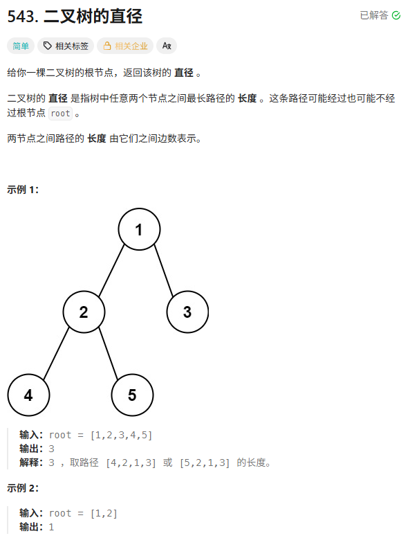

```c++
int diameterOfBinaryTree(TreeNode* root) {
    maxDia = 0;
    maxDepth(root);
    return maxDia;
}

// 这个函数的定义依然是：计算以 root 为根的树的最大深度
int maxDepth(TreeNode* node) {
    if (node == nullptr) return 0;

    // 1. 递归算左右深度
    int leftH = maxDepth(node->left);
    int rightH = maxDepth(node->right);

    // 2. 【暗度陈仓】：顺便计算一下穿过当前节点的最长路径
    // 路径长度 = 左臂长 + 右臂长
    // 试图更新全局最大值
    maxDia = max(maxDia, leftH + rightH);

    // 3. 返回值：告诉父节点我有多深
    // 父节点只能用我的一条腿，所以是 max(L, R) + 1
    return max(leftH, rightH) + 1;
}
```

```c++
int recursive(TreeNode* root, int& ans) {
    if (root == nullptr)
        return 0;
    int left = recursive(root->left, ans);
    int right = recursive(root->right, ans);
    ans = max(ans, left + right);
    return max(left, right) + 1;
}

int diameterOfBinaryTree(TreeNode* root) {
    int ans = 0;
    recursive(root, ans);
    return ans;
}
```

# 将有序数组转为二叉树

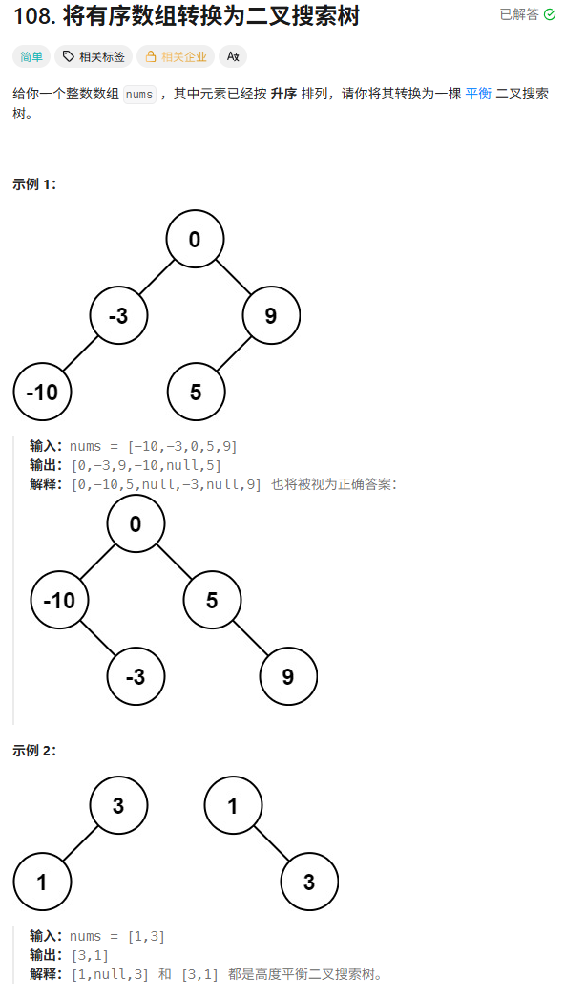

```c++
TreeNode* sortedArrayToBST(vector<int>& nums) {
    // 调用辅助函数，传入整个数组的下标范围
    return build(nums, 0, nums.size() - 1);
}

TreeNode* build(vector<int>& nums, int left, int right) {
    // 1. Base Case: 区间无效，返回空指针
    if (left > right) return nullptr;

    // 2. 找中间位置 (防溢出写法，虽然这题数据量不大)
    int mid = left + (right - left) / 2;

    // 3. 构建根节点
    TreeNode* root = new TreeNode(nums[mid]);

    // 4. 递归构建左右子树
    // 左子树范围: [left, mid-1]
    root->left = build(nums, left, mid - 1);
    // 右子树范围: [mid+1, right]
    root->right = build(nums, mid + 1, right);

    return root;
}
```

# 验证二叉搜索树

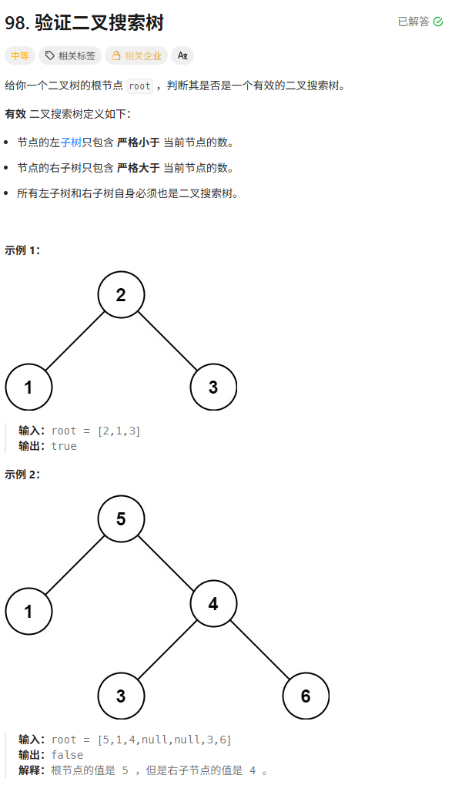

```c++
bool helper(TreeNode* node, long long lower, long long upper) {
    if (!node) return true;

    if (node->val <= lower || node->val >= upper)
        return false;

    return helper(node->left, lower, node->val) &&
        helper(node->right, node->val, upper);
}

bool isValidBST(TreeNode* root) {
    return helper(root, LLONG_MIN, LLONG_MAX);
}
```

# 二叉搜索树中第K小的元素

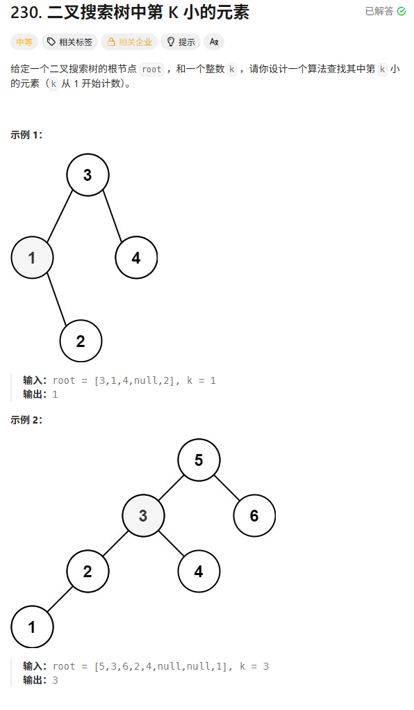

看中序遍历结果 但是这种做法太丢分了

```c++
vector<int> ans;
void inorder(TreeNode* root) {
    if (root == nullptr)
        return;
    if (root->left)
        inorder(root->left);
    ans.push_back(root->val);
    if (root->right)
        inorder(root->right);
}
int kthSmallest(TreeNode* root, int k) {
    inorder(root);
    return ans[k - 1];
}
```

中序遍历 边遍历边数

```c++
int kthSmallest(TreeNode* root, int k) {
    stack<TreeNode*> st;
    TreeNode* curr = root;

    // 标准的中序遍历迭代模版
    while (curr != nullptr || !st.empty()) {
        // 1. 一路向左
        while (curr != nullptr) {
            st.push(curr);
            curr = curr->left;
        }

        // 2. 弹出栈顶 (当前最小的元素)
        curr = st.top();
        st.pop();

        // --- 核心修改开始 ---
        k--; // 数一个数
        if (k == 0) {
            return curr->val; // 数到了！直接返回，后面的不看了
        }
        // --- 核心修改结束 ---

        // 3. 转向右子树
        curr = curr->right;
    }

    return -1; // Should not reach here
}
```

统一模板写法

```c++
int kthSmallest(TreeNode* root, int k) {
    stack<TreeNode*> st;
    if (root) st.push(root);

    while (!st.empty()) {
        TreeNode* node = st.top();
        st.pop();

        // --- 分支 1: 遇到普通节点 (还没处理子树) ---
        if (node != nullptr) {
            // 按照中序相反顺序入栈: 右 -> 根 -> 左

            // 1. 右子树先入栈 (最后处理)
            if (node->right) st.push(node->right);

            // 2. 根节点入栈，并打上 nullptr 标记 (中间处理)
            st.push(node);
            st.push(nullptr); // 🎯 标记：下次见到它就要处理了

            // 3. 左子树后入栈 (最先处理)
            if (node->left) st.push(node->left);
        } 
        // --- 分支 2: 遇到标记 (说明该处理栈顶元素了) ---
        else {
            // 弹出真正的节点
            node = st.top();
            st.pop();

            // --- 核心业务逻辑 ---
            k--; // 找到了一个从小到大排队的数
            if (k == 0) {
                return node->val; // 就是你了！
            }
            // ------------------
        }
    }
    return -1; // 题目保证 k 有效，这行代码理论上走不到
}
```

# 二叉树的右视图

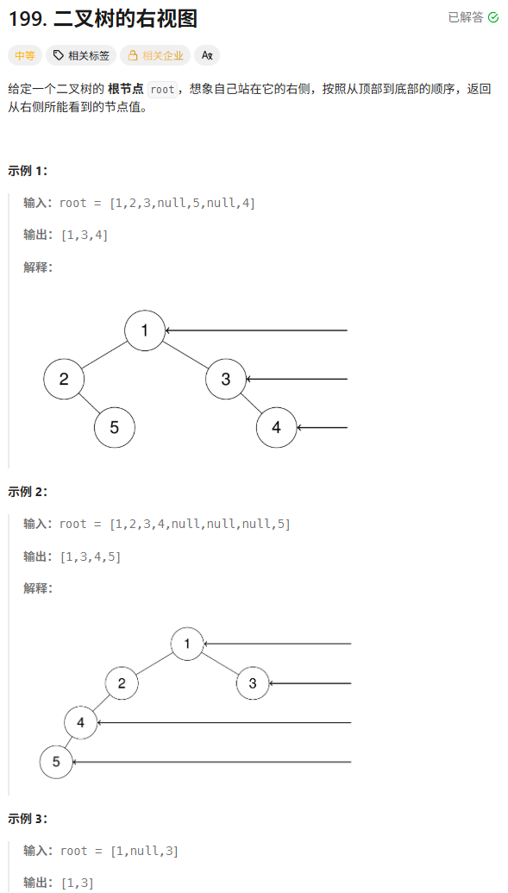

```c++
vector<int> rightSideView(TreeNode* root) {
    vector<int> result;
    if (!root) return result;

    queue<TreeNode*> q;
    q.push(root);

    while (!q.empty()) {
        // 1. 锁死当前层的数量
        int n = q.size();

        // 2. 遍历当前层
        for (int i = 0; i < n; i++) {
            TreeNode* node = q.front();
            q.pop();

            // 3. 核心判断：如果是当前层的最后一个节点，存入结果
            if (i == n - 1) {
                result.push_back(node->val);
            }

            // 4. 继续把孩子加入队列 (先左后右)
            if (node->left) q.push(node->left);
            if (node->right) q.push(node->right);
        }
    }
    return result;
}
```

# 二叉树展开为链表

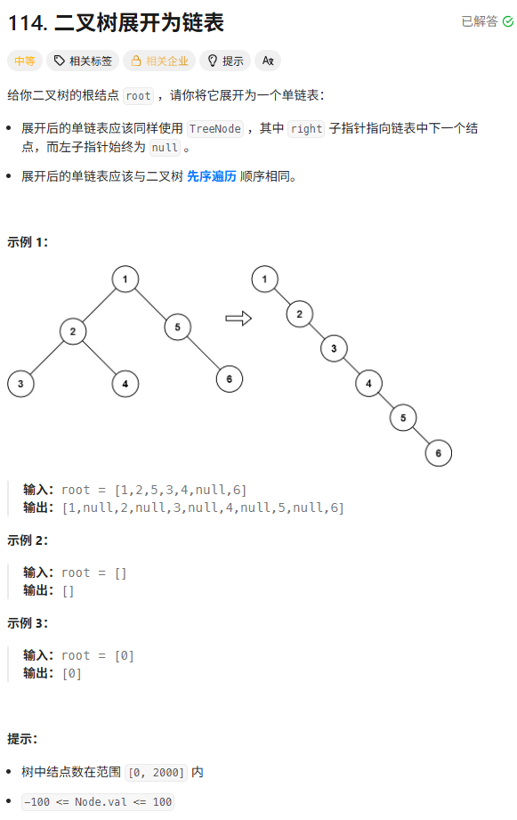

直接中序遍历 暴力做法

```c++
void preorder(TreeNode* root) {
	if (!root) return;
	ans.push_back(root);
	if (root->left) preorder(root->left);
	if (root->right) preorder(root->right);
}

void flatten(TreeNode* root) {
	if (!root) return;
	preorder(root);
	for (int i = 0; i < ans.size() - 1; i++) {
		ans[i]->right = ans[i + 1];
		ans[i]->left = nullptr;
	}
	ans[ans.size() - 1]->right = nullptr;
}
```

**优雅的递归法**

**逆前序遍历**：

右→左→根

为什么？

因为我们希望在处理当前节点时：

prev=已经构建好的链表头prev = 已经构建好的链表头prev=已经构建好的链表头

```c++
TreeNode* prev = nullptr;

void flatten(TreeNode* root) {
    if (!root) return;

    flatten(root->right);
    flatten(root->left);

    root->right = prev;
    root->left = nullptr;
    prev = root;
}
```

**优雅的迭代算法**

```c++
void flatten(TreeNode* root) {
    TreeNode* cur = root;

    while (cur) {
        if (cur->left) {
            // 1️⃣ 找左子树最右节点
            TreeNode* pre = cur->left;
            while (pre->right) {
                pre = pre->right;
            }

            // 2️⃣ 原右子树接到最右节点后面
            pre->right = cur->right;

            // 3️⃣ 左子树移到右边
            cur->right = cur->left;

            // 4️⃣ 清空左子树
            cur->left = nullptr;
        }

        // 向前推进
        cur = cur->right;
    }
}
```

```c++
	1
   / \
  2   5
 / \
3   4
//之后      
	1
   /
  2
 / \
3   4
     \
      5
//之后
1
 \
  2
 / \
3   4
     \
      5
```

# 从前序和中序遍历序列构造二叉树

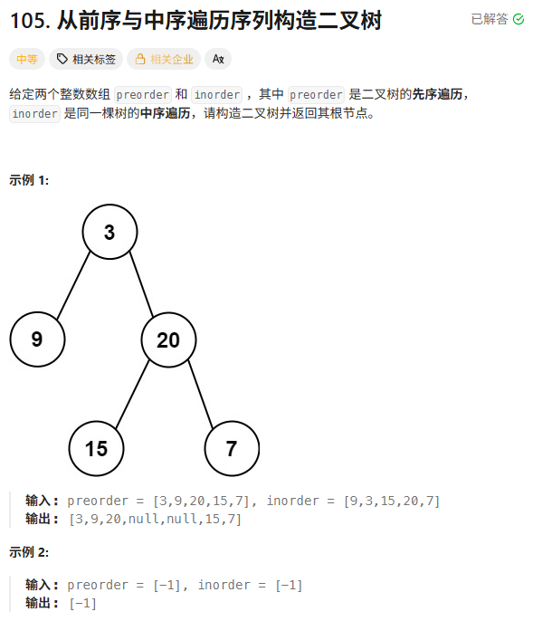

```c++
// 这里的 map 用来快速查找 inorder 中的根节点位置
unordered_map<int, int> indexMap;

TreeNode* buildTree(vector<int>& preorder, vector<int>& inorder) {
    int n = preorder.size();
    // 1. 预处理：构建哈希表，实现 O(1) 查找
    for (int i = 0; i < n; i++) {
        indexMap[inorder[i]] = i;
    }

    // 2. 开启递归，传入左右边界
    // 初始范围：两个数组都是 [0, n-1]
    return myBuild(preorder, 0, n - 1, inorder, 0, n - 1);
}

// 辅助函数：根据索引范围构建树
TreeNode* myBuild(vector<int>& preorder, int preStart, int preEnd, 
                  vector<int>& inorder, int inStart, int inEnd) {

    // Base Case: 如果开始索引大于结束索引，说明没有元素了
    if (preStart > preEnd) return nullptr;

    // 1. 找到根节点的值 (前序遍历的第一个)
    int rootVal = preorder[preStart];

    // 2. 在中序遍历中找到根节点的位置 (使用 Map)
    int inRootIndex = indexMap[rootVal];

    // 3. 建立根节点
    TreeNode* root = new TreeNode(rootVal);

    // 4. 计算左子树的节点数量 (关键数学题！)
    // 在中序遍历中，根节点左边的都是左子树
    int leftSize = inRootIndex - inStart;

    // 5. 递归构建左右子树 (最容易晕的地方)

    // 构造左子树：
    // Preorder: [根 | 左子树 | 右子树]
    // -> 左子树范围：preStart + 1 到 preStart + leftSize
    // Inorder:  [左子树 | 根 | 右子树]
    // -> 左子树范围：inStart 到 inRootIndex - 1
    root->left = myBuild(preorder, preStart + 1, preStart + leftSize, 
                         inorder, inStart, inRootIndex - 1);

    // 构造右子树：
    // Preorder: [根 | 左子树 | 右子树]
    // -> 右子树范围：从 (preStart + leftSize + 1) 开始一直到最后
    // Inorder:  [左子树 | 根 | 右子树]
    // -> 右子树范围：从 inRootIndex + 1 一直到最后
    root->right = myBuild(preorder, preStart + leftSize + 1, preEnd, 
                          inorder, inRootIndex + 1, inEnd);

    return root;
}
```

# 路径总和Ⅲ

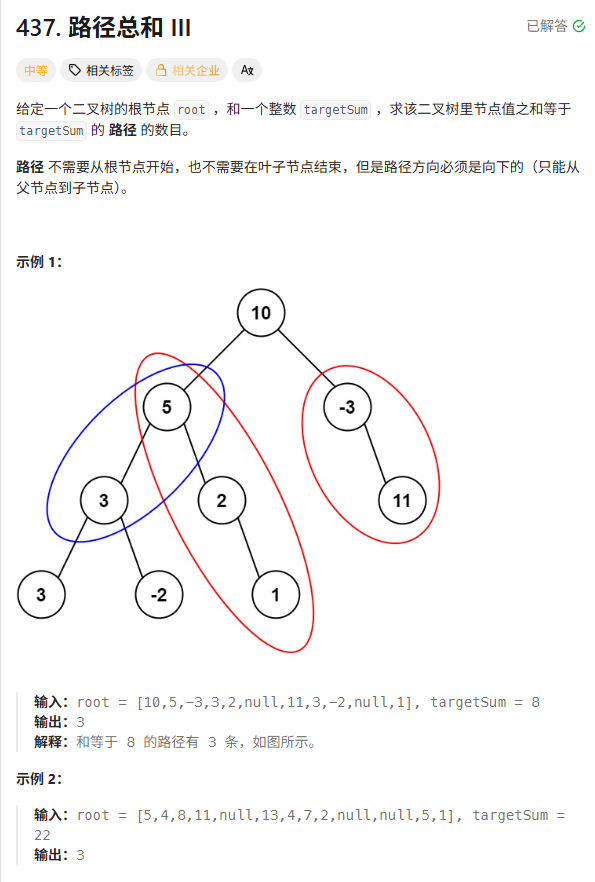

```c++
// key: 前缀和, value: 该前缀和出现的次数
unordered_map<long long, int> prefixMap;
int count = 0;

int pathSum(TreeNode* root, int targetSum) {
    // 初始化：前缀和为 0 的路径有 1 条 (就是什么节点都不选的时候)
    prefixMap[0] = 1;
    dfs(root, 0, targetSum);
    return count;
}

void dfs(TreeNode* node, long long currSum, int target) {
    if (node == nullptr) return;

    // 1. 更新当前路径的前缀和
    currSum += node->val;

    // 2. 核心公式：找找有没有 oldSum 满足: currSum - oldSum = target
    // 即: oldSum = currSum - target
    if (prefixMap.count(currSum - target)) {
        count += prefixMap[currSum - target];
    }

    // 3. 将当前的前缀和加入 Map，供子节点查询
    prefixMap[currSum]++;

    // 4. 递归处理左右子树
    dfs(node->left, currSum, target);
    dfs(node->right, currSum, target);

    // 5. 【回溯】：离开当前节点前，要把自己的前缀和移除
    // 因为换别的分支走的时候，是不能利用当前节点这条路径的
    prefixMap[currSum]--;
}
```

# 二叉树的公共祖先

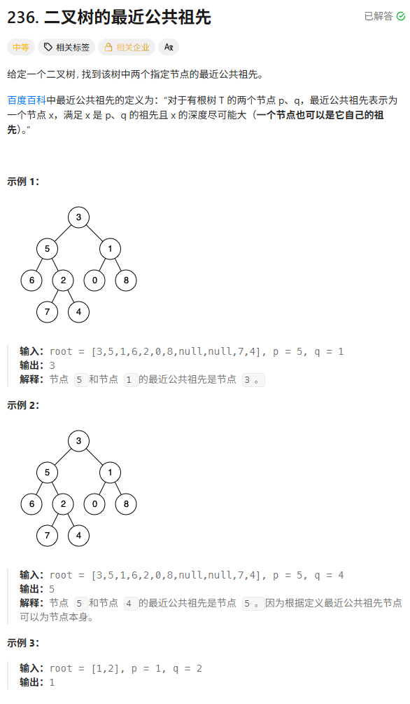

```c++
TreeNode* lowestCommonAncestor(TreeNode* root, TreeNode* p, TreeNode* q) {
    // 1. Base Case (终止条件)
    // 如果越过了叶子节点，返回空
    if (root == nullptr) return nullptr;

    // 如果我自己就是 p 或者 q
    // 那我就直接把自己返回上去，告诉长官：“找到一个了！”
    // 注意：这里不需要继续往下找了。如果 p 是 q 的祖先，这里返回 p 之后，q 根本不会被遍历到，
    // 但逻辑依然成立（LCA 就是 p）。
    if (root == p || root == q) return root;

    // 2. 递归 (去左右两边找)
    TreeNode* left = lowestCommonAncestor(root->left, p, q);
    TreeNode* right = lowestCommonAncestor(root->right, p, q);

    // 3. 决策 (处理返回值)

    // 情况 A: 左右都有返回值 (不为空)
    // 说明 p 和 q 一个在左，一个在右 -> 我就是 LCA
    if (left != nullptr && right != nullptr) {
        return root;
    }

    // 情况 B: 只有一边有返回值
    // 谁不空就返回谁 (传话筒，把结果透传上去)
    // 如果都为空，这里也会返回 nullptr
    if (left != nullptr) return left;
    return right;
}
```

# 二叉树中的最大路径和hard

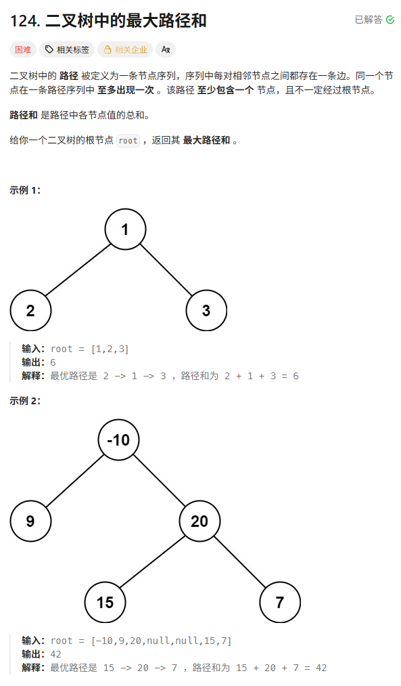

```c++
int maxSum = INT_MIN; // ⚠️ 注意初始化为最小值

int maxPathSum(TreeNode* root) {
    maxGain(root);
    return maxSum;
}

// 函数定义：计算以 node 为起点，向下延伸的最大路径和 (只能选一条腿)
int maxGain(TreeNode* node) {
    if (node == nullptr) return 0;

    // 1. 递归计算左右子树的贡献
    // ⚠️ 关键点：如果子树贡献是负数，咱们就不要了，当成 0
    int leftGain = max(maxGain(node->left), 0);
    int rightGain = max(maxGain(node->right), 0);

    // 2. 【挑战全局】：计算经过当前节点作为拐点的路径和
    // 倒 V 字型：左腿 + 我 + 右腿
    int priceNewPath = node->val + leftGain + rightGain;

    // 更新全局最大值
    maxSum = max(maxSum, priceNewPath);

    // 3. 【汇报上级】：返回给父节点的最大贡献
    // 只能选一条腿：我 + max(左, 右)
    return node->val + max(leftGain, rightGain);
}
```

