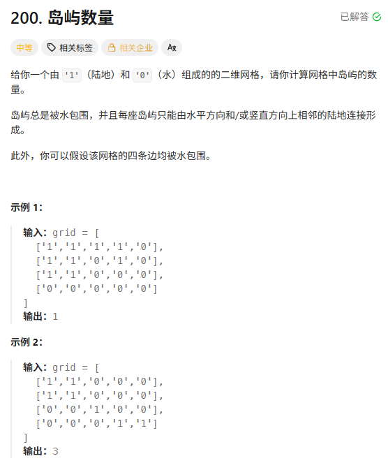
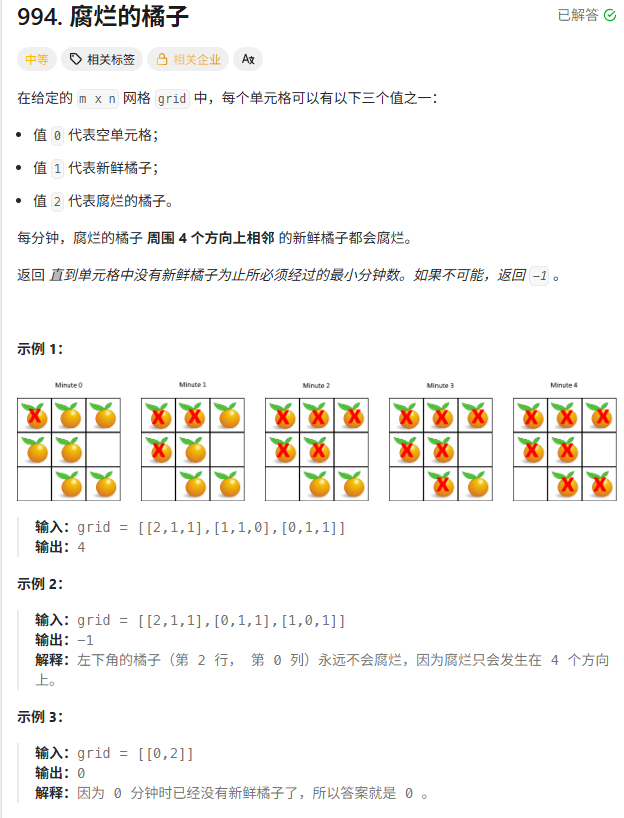
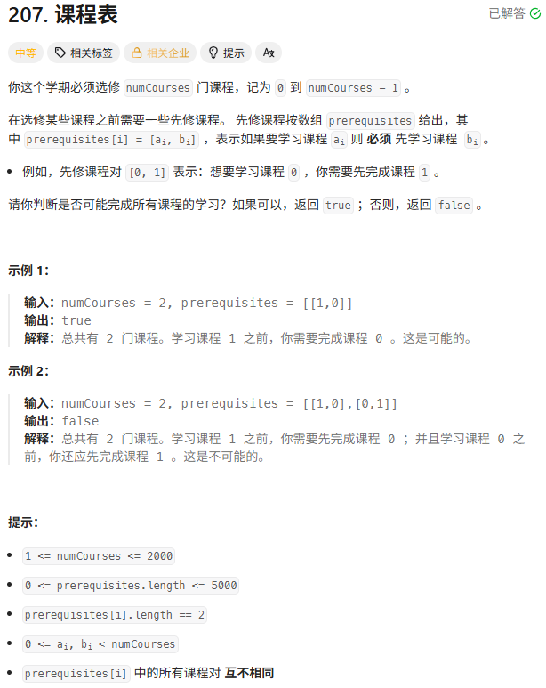
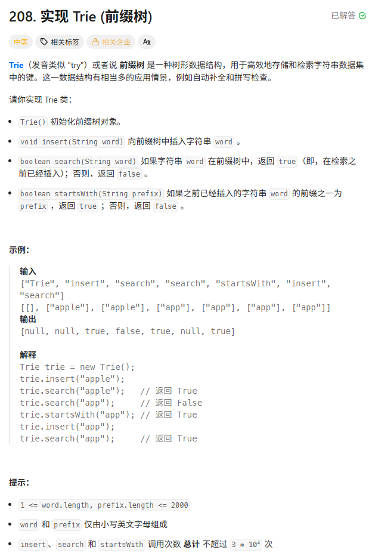

> [!NOTE]
>
> 图论

# 岛屿数量



DFS做法

```c++
int numIslands(vector<vector<char>>& grid) {
    int count = 0;
    int rows = grid.size();
    int cols = grid[0].size();

    // 1. 遍历每个格子
    for (int i = 0; i < rows; i++) {
        for (int j = 0; j < cols; j++) {
            // 2. 发现新大陆
            if (grid[i][j] == '1') {
                count++; // 记录岛屿
                // 3. 启动 DFS，炸沉这个岛
                dfs(grid, i, j);
            }
        }
    }
    return count;
}

// 辅助函数：把与 (i, j) 相连的所有陆地都变成水
void dfs(vector<vector<char>>& grid, int i, int j) {
    int rows = grid.size();
    int cols = grid[0].size();

    // 1. Base Case (越界检查 + 非陆地检查)
    // 如果超出了网格范围，或者已经是水('0')了，直接返回
    if (i < 0 || j < 0 || i >= rows || j >= cols || grid[i][j] == '0') {
        return;
    }

    // 2. 标记已访问 (沉岛操作)
    grid[i][j] = '0'; 

    // 3. 递归访问上下左右四个邻居
    dfs(grid, i - 1, j); // 上
    dfs(grid, i + 1, j); // 下
    dfs(grid, i, j - 1); // 左
    dfs(grid, i, j + 1); // 右
}
```

BFS做法

```c++
int numIslands(vector<vector<char>>& grid) {
    int count = 0;
    int rows = grid.size();
    int cols = grid[0].size();

    for (int i = 0; i < rows; i++) {
        for (int j = 0; j < cols; j++) {
            if (grid[i][j] == '1') {
                count++;
                bfs(grid, i, j); // 这里换成 bfs
            }
        }
    }
    return count;
}

void bfs(vector<vector<char>>& grid, int r, int c) {
    queue<pair<int, int>> q;
    q.push({r, c});
    grid[r][c] = '0'; // ⚠️ 进队瞬间就要标记，防止重复进队

    // 方向数组，方便写循环
    int dirs[4][2] = {{-1, 0}, {1, 0}, {0, -1}, {0, 1}};

    while (!q.empty()) {
        auto [currR, currC] = q.front();
        q.pop();

        // 检查四个方向
        for (auto& dir : dirs) {
            int newR = currR + dir[0];
            int newC = currC + dir[1];

            // 越界检查 + 陆地检查
            if (newR >= 0 && newR < grid.size() && 
                newC >= 0 && newC < grid[0].size() && 
                grid[newR][newC] == '1') {

                q.push({newR, newC});
                grid[newR][newC] = '0'; // ⚠️ 发现就炸沉，防止别人也把它加进队列
            }
        }
    }
}
```

注意 若`if (newR >= 0 && newR < grid.size() && newC >= 0 && newC < grid[0].size() && grid[newR][newC] == '1')`

写为`if (grid[newR][newC] == '1' && newR >= 0 && newR < grid.size() && newC >= 0 && newC < grid[0].size())`则数组越界报错

# 腐烂的橘子



```c++
int orangesRotting(vector<vector<int>>& grid) {
    int rows = grid.size();
    int cols = grid[0].size();
    queue<pair<int, int>> q;
    int freshCount = 0; // 统计新鲜橘子数量，用来最后判断有没有烂完

    // 1. 初始化：找出所有一开始就烂的橘子，并统计新鲜橘子
    for(int i=0; i<rows; i++) {
        for(int j=0; j<cols; j++) {
            if(grid[i][j] == 2) {
                q.push({i, j}); // 多源起点
            } else if(grid[i][j] == 1) {
                freshCount++;
            }
        }
    }

    // 如果一开始就没有新鲜橘子，直接返回 0
    if(freshCount == 0) return 0;

    int minutes = 0;
    int dirs[4][2] = {{-1, 0}, {1, 0}, {0, -1}, {0, 1}};

    // 2. 开始 BFS 扩散
    while(!q.empty()) {
        int size = q.size(); // 🔒 锁死当前这一层的数量 (批处理)
        bool rottenInThisRound = false; // 标记这一分钟有没有新橘子腐烂

        for(int i=0; i<size; i++) {
            auto [r, c] = q.front();
            q.pop();

            for(auto& dir : dirs) {
                int nr = r + dir[0];
                int nc = c + dir[1];

                // 越界 或者 不是新鲜橘子 -> 跳过
                if(nr < 0 || nc < 0 || nr >= rows || nc >= cols || grid[nr][nc] != 1) {
                    continue;
                }

                // 传染！
                grid[nr][nc] = 2;     // 变成烂橘子
                q.push({nr, nc});     // 加入队列，下分钟它去传染别人
                freshCount--;         // 新鲜橘子少一个
                rottenInThisRound = true;
            }
        }

        // 只有这一轮真的传染了橘子，时间才+1
        if(rottenInThisRound) minutes++;
    }

    // 3. 检查是不是所有橘子都烂了
    return freshCount == 0 ? minutes : -1;
}
};
```

# 课程表



```c++
bool canFinish(int numCourses, vector<vector<int>>& prerequisites) {
    // 1. 数据结构准备
    // 邻接表: graph[i] 存放修完 i 之后可以去修的课程列表
    vector<vector<int>> graph(numCourses);
    // 入度数组: indegrees[i] 存放课程 i 需要先修几门课
    vector<int> indegrees(numCourses, 0);

    // 2. 建图 & 统计入度
    for (const auto& relation : prerequisites) {
        int course = relation[0]; // 要修的课
        int pre = relation[1];    // 先修课

        graph[pre].push_back(course); // pre -> course
        indegrees[course]++;          // course 的门槛 +1
    }

    // 3. 将所有入度为 0 的课程入队 (起始节点)
    queue<int> q;
    for (int i = 0; i < numCourses; i++) {
        if (indegrees[i] == 0) {
            q.push(i);
        }
    }

    // 4. BFS 拓扑排序
    int finishedCount = 0;
    while (!q.empty()) {
        int curr = q.front();
        q.pop();
        finishedCount++; // 成功修完一门

        // 遍历当前课程的后续课程
        for (int nextCourse : graph[curr]) {
            indegrees[nextCourse]--; // 门槛减一

            // 如果门槛变成 0，说明条件满足，可以修了
            if (indegrees[nextCourse] == 0) {
                q.push(nextCourse);
            }
        }
    }

    // 5. 判断是否所有课程都修完了
    return finishedCount == numCourses;
}
```

# 实现Trie(前缀树)

