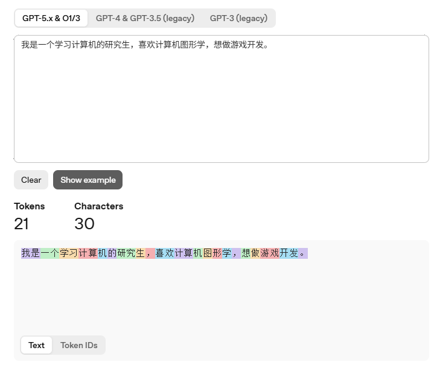
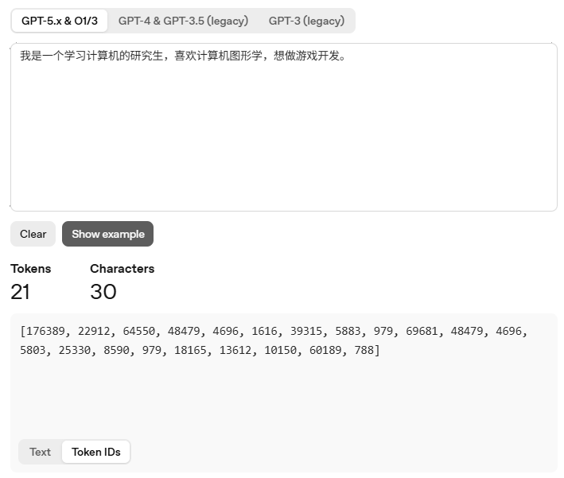
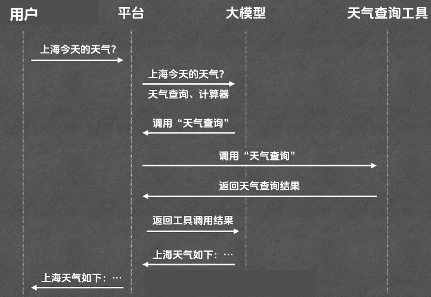

# LLM

Large Language Model：底层是Google提出的Transformer模型

工作原理：

本质类似文字接龙游戏

**大模型：会预测下一个词的概率模型**

在已有上下文的情况下，预测下一个最有可能的词。

# Token

Tokenizer：负责编码和解码

编码：把文字变为数字

1. 切分：将用户输入切分成最小片段：Token
2. 映射：将每个token映射到数字上，这个数字叫Token ID

解码：把数字变为文字

1. 映射：将tokenID变为文字

**Token**是大模型处理文本的最基本单元

Token和词并不是一一对应的关系

对英文来说helpful为help和ful两个token。

# Context

大模型本质是个数学函数，给输入就有输出，那它如何拥有记忆？

每次给大模型发问题时，会把之前的整段对话历史一起发过去。是大模型每次处理任务时接收到的信息总和。

Context：大模型每次处理任务时的信息总和。

Context除了输出的每一个Token，还有工具列表和system prompt等信息。

Context Window：Context能容纳的最大的Token数量

模型本身是无记忆的，有记忆其实是每次都重喂一遍历史。

为了让模型由记忆，必须把所有历史token都带着吗？

- 选择性保留，如果不保留context会线性增长，成本会爆炸，速度会变慢，也会超过context window。
- 所以不是记住所有，而是记住最重要的。

常见策略：

- Sliding Window滑动窗口：只保留最近的对话，简单成本可控，但是会导致早期信息丢失，
- Summarization摘要压缩：将旧的内容压缩总结，但是这样会有信息损失
- RAG检索式记忆：将历史存入数据库（向量库），当用户提问检索相关内容时，只把相关部分放入context。

# RAG

Retrieval-Augmented Generation检索增强生成

1. 先从资料库里**检索**相关内容
2. 再基于这些内容来**生成**答案

# Prompt

大模型接收的具体需求和指令。

User Prompt：用户自己输入的提示词。说明具体任务。

System Prompt：系统提示词，由开发者在后台配置。说明人设和做事规则。

# Tool 

Tool就相当于调接口

用户——平台——大模型——工具

# MCP

工具接入每个平台都不一样，chatGPT、Gemini、Claude都不同

如果有一个统一的标准，工具的开发者只需要写一次代码就可以在所有平台上用了。

Model Context Protool模型上下文协议

工具开发者只需要按MCP的标准开发一次，支持MCP的平台就可以使用了。

# Agent

能够自主规划自主调用工具直至完成用户需求的系统为Agent

如：Claude Code，Codex，Gemini CLI

构建模式如ReAct、Plane And Execute

# Agent Skill

提前写好给Agent的文档，将这个agent skill文件：

1. 存到`.claude/skills`

2. 此目录下`mkdir`，与agent skill名字相同。

3. 新建文件`SKILL.md`

# 关于游戏的思考