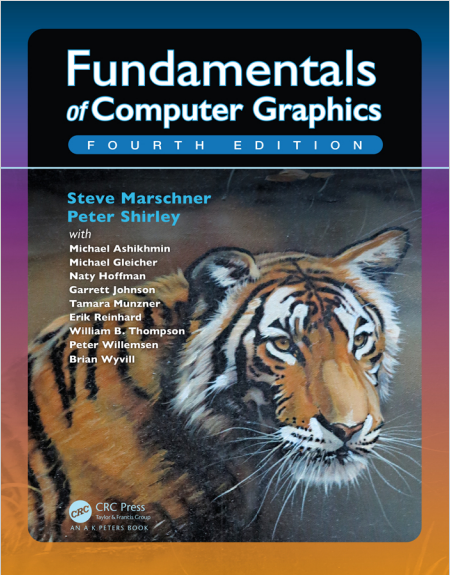

# Fundamentals of Computer Graphics
> <a href="/books/Fundamentals of Computer Graphics, Fourth Edition ( PDFDrive ).pdf" target="_blank">点击开始阅读</a>

---

---

计算机图形学入门必读经典著作
<!-- 

    <iframe class="pdf-frame" src="/books/Fundamentals of Computer Graphics, Fourth Edition ( PDFDrive ).pdf"></iframe>

 -->