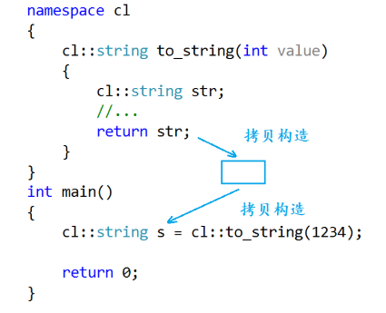
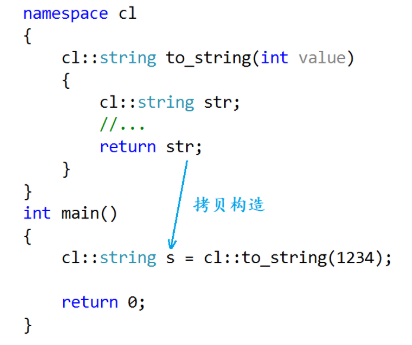
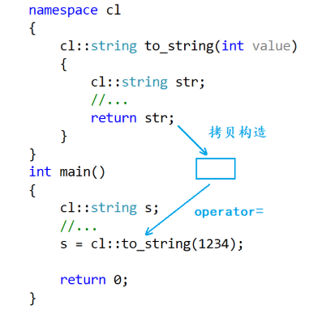

> [!NOTE]
>
> 右值引用和移动语义

# 左值和右值

**左值**

- **本质**：指向一个**持久**的内存地址（有名字的变量）。
- **寿命**：在它所属的作用域结束前，它一直存在。
- **操作**：你可以用 `&` 取它的地址，也可以给它赋值。
- **例子**：`int i = 10;` 中的 `i`，或者 `points[0]`。

**右值**

- **本质**：**临时**的、没有名字的值。它们通常存储在寄存器或临时栈内存中。
- **寿命**：表达式结束，它们就“死”了。
- **操作**：你**不能**对它取地址（比如 `&10` 或 `&(a+b)` 是非法的）。
- **例子**：字面量 `10`、表达式结果 `a + b`、返回值的函数 `get_point()`。

左值是一个表示数据的表达式，如变量名或解引用的指针。

- 左值可以被取地址，也可以被修改（const修饰的左值除外）。
- 左值可以出现在赋值符号的左边，也可以出现在赋值符号的右边

右值也是一个表示数据的表达式，如字母常量、表达式的返回值、函数的返回值（不能是左值引用返回）等等。

- 右值不能被取地址，也不能被修改。
- 右值可以出现在赋值符号的右边，但是不能出现在赋值符号的左边。

右值本质就是一个临时变量或常量值，比如代码中的10就是常量值，表达式x+y和函数fmin的返回值就是临时变量，这些都叫做右值。

这些临时变量和常量值并没有被实际存储起来，这也就是为什么右值不能被取地址的原因，因为只有被存储起来后才有地址。

但需要注意的是，这里说函数的返回值是右值，指的是传值返回的函数，因为传值返回的函数在返回对象时返回的是对象的拷贝，这个拷贝出来的对象就是一个临时变量。

# 左值引用和右值引用

左值引用就是对左值的引用，给左值取别名，通过“&”来声明

```c++
//以下的p、b、c、*p都是左值
int* p = new int(0);
int b = 1;
const int c = 2;

//以下几个是对上面左值的左值引用
int*& rp = p;
int& rb = b;
const int& rc = c;
int& pvalue = *p;
```

右值引用就是对右值的引用，给右值取别名，通过“&&”来声明

```c++
double x = 1.1, y = 2.2;

//以下几个都是常见的右值
10;
x + y;
fmin(x, y);

//以下几个都是对右值的右值引用
int&& rr1 = 10;
double&& rr2 = x + y;
double rr3 = fmin(x, y);
```

右值是不能取地址的，但是给右值取别名后，会导致右值被存储到特定位置，这时这个右值可以被取到地址，并且可以被修改，如果不想让被引用的右值被修改，可以用const修饰右值引用。

```c++
double x = 1.1, y = 2.2;
int&& rr1 = 10;
const double&& rr2 = x + y;

rr1 = 20;
rr2 = 5.5; //报错
```

**右值引用可以引用左值吗？**

- 右值引用只能引用右值，不能引用左值。
- 但是右值引用可以引用move以后的左值。

**左值引用可以引用右值吗？**

- 左值引用不能引用右值，因为这涉及权限放大的问题，右值是不能被修改的，而左值引用是可以修改。
- 但是const左值引用可以引用右值，因为const左值引用能够保证被引用的数据不会被修改。

## 深入分析右值引用

那么什么叫右值取别名之后，会导致右值存储到特定位置，此时可以取地址了呢？

何意味？

> 10是什么？

- `10` 是一个 prvalue

- 它本身没有身份

- 表达式 `10` 不能写：

```c++
&10;   // 错
```

> 10绑定到右值引用时发生了什么？

```c++
int&& r = 10;
```

编译器会做一个非常重要的步骤：

对 prvalue 进行 **临时对象物化**

等价于：

```markdown
产生一个匿名临时对象 temp
temp 的值是 10
然后 r 绑定到 temp
```

也就是说

```c++
10   (prvalue)
   ↓ 物化
[临时对象 temp]
   ↓
r 绑定
```

总结：

```c++
int&& r = 10;
```

- `10` 仍然是 prvalue

- 物化出来的临时对象是一个对象

- `r` 是一个有名字的变量

| 表达式 | 值类别  |
| ------ | ------- |
| 10     | prvalue |
| r      | lvalue  |

虽然 r 的类型是 `int&&`，但表达式 `r` 是左值。

> [!IMPORTANT]
>
> **任何有名字的变量表达式都是左值**

所以对r取地址，取地址的不是10

- r 是左值

- 左值可以取地址

```c++
& r
int&& r = 10;
cout << &r;   // 合法
```

这取的是那个被物化出来的临时对象的地址。

```markdown
原来的 prvalue 没变
只是它被物化成一个对象
然后这个对象被一个左值引用变量绑定

右值没有变成左值
只是生成了一个对象
而你用一个左值去引用它
```

做个测试！

```c++
int&& r = 10;
int&& rr = 10;

cout << &r << endl;
cout << &rr << endl;
```

这两个地址一般是不同的。

说明：**每个 10 都物化成不同的临时对象。**

如果真的是“字面量 10 的地址”，那应该相同。

但不会相同。

> 那真正的10存放在哪里？常量区？

错！

```c++
int x = 10;
//底层可能是
mov eax, 10
```

这里的10是：直接编码在指令里的立即数，根本不在内存中。

```c++
int&& r = 10;
//底层可能是
sub rsp, 4
mov dword ptr [rsp], 10
```

编译器会做：

1. 在栈上为临时对象分配空间
2. 把值 10 写进去

10 直接作为机器指令的立即数写入栈内存，而不是从”常量区“拷贝

会过来想 不可能存在常量 因为之前的例子r和rr地址不同

# 左值引用的使用场景

- 左值引用做参数，防止传参时进行拷贝操作。
- 左值引用做返回值，防止返回时对返回对象进行拷贝操作。
  - 比如vec3类实现重载了赋值运算符，返回引用，所以可以+=

# 左值引用的短板

- 左值引用做参数，能够完全避免传参时不必要的拷贝操作。

- 左值引用做返回值，并不能完全避免函数返回对象时不必要的拷贝操作。

  - 如果函数返回的对象是一个局部变量，该变量出了函数作用域就被销毁了，这种情况下不能用左值引用作为返回值，只能以传值的方式返回，这就是左值引用的短板。
  - 比如下面这个例子，s是个局部变量，函数结束后销毁，返回的是悬空引用。

  ```c++
  std::string& func() {
      std::string s = "hello";
      return s;   // ❌
  }
  ```

所以：

左值引用只适用于：**返回“已有对象”**

而不是：**生成“新的值”**

# 右值引用的应用

## 移动构造

移动构造是参数为右值引用类型的构造函数，移动构造本质就是将传入右值的资源窃取过来，占为己有，这样就避免了进行深拷贝，所以它叫做移动构造。就是**窃取别人的资源来构造自己**的意思。

没有增加移动构造之前，由于拷贝构造采用的是const左值引用接收参数，因此无论拷贝构造对象时传入的是左值还是右值，都会调用拷贝构造函数。

增加移动构造之后，由于移动构造采用的是右值引用接收参数，因此如果拷贝构造对象时传入的是右值，那么就会调用移动构造函数（最匹配原则）。

## 编译器优化

当在函数中按值返回局部对象时，会先用局部对象拷贝构造一个新的临时对象，然后再用这个临时对象拷贝构造我们接收返回值的对象。



对深拷贝的类来说会进行两次深拷贝，所以大部分编译器对此进行了优化，优化为调用一次拷贝构造函数。



C++11之后这个编译优化仍然起到了作用，如果编译器不优化这里应该调用两次移动构造，第一次调用移动构造用返回的局部string对象构造出一个临时对象，第二次调用移动构造用这个临时对象构造接收返回值的对象。
而经过编译器优化后，最终这两次移动构造就被优化成了一次，也就是直接将返回的局部string对象的资源移动给了接收返回值的对象。

但是 如果不是用函数的返回值来构造对象，而是使用赋值运算符的话



当函数返回局部对象时，会先用这个局部对象拷贝构造出一个临时对象，然后再调用赋值运算符重载函数将这个临时对象赋值给接收函数返回值的对象。

编译器并没有对这种情况进行优化，因此在C++11标准出来之前，对于深拷贝的类来说这里就会存在两次深拷贝，因为深拷贝的类的赋值运算符重载函数也需要以深拷贝的方式实现。

但在深拷贝的类中引入C++11的移动构造后，这里仍然需要再调用一次赋值运算符重载函数进行深拷贝，因此**深拷贝的类不仅需要实现移动构造，还需要实现移动赋值。**

对于返回局部对象的函数，就算**只是调用函数而不接收该函数的返回值，也会存在一次拷贝构造或移动构造**，因为函数的返回值不管你接不接收都必须要有，而当函数结束后该函数内的局部对象都会被销毁，所以就算不接收函数的返回值也会调用一次拷贝构造或移动构造生成临时对象。

## 移动赋值

移动赋值是一个赋值运算符重载函数，该函数的参数是右值引用类型的，移动赋值也是将传入右值的资源窃取过来，占为己有，这样就避免了深拷贝，所以它叫移动赋值。**窃取别人的资源来赋值给自己**的意思。

在没有增加移动赋值之前，由于原有operator=函数采用的是const左值引用接收参数，因此无论赋值时传入的是左值还是右值，都会调用原有的operator=函数。

增加移动赋值之后，由于移动赋值采用的是右值引用接收参数，因此如果赋值时传入的是右值，那么就会调用移动赋值函数（最匹配原则）。

## STL中容器

C++11之后STL的容器都增加了移动构造和移动赋值。

如push_back和emplace

```c++
list<std::string> lt;
std::string s("1111");

lt.push_back(s); //调用string的拷贝构造

lt.push_back("2222");             //调用string的移动构造
lt.push_back(std::string("3333")); //调用string的移动构造
lt.push_back(std::move(s));       //调用string的移动构造
```

## 右值引用引用左值

需要用右值引用去引用一个左值时，可以通过move函数将左值转换为右值。

```c++
template<class _Ty>
inline typename remove_reference<_Ty>::type&& move(_Ty&& _Arg) _NOEXCEPT
{
	//forward _Arg as movable
	return ((typename remove_reference<_Ty>::type&&)_Arg);
}
```

- move函数中_Arg参数的类型不是右值引用，而是万能引用。万能引用跟右值引用的形式一样，但是右值引用需要是确定的类型。
- 一个左值被move以后，它的资源可能就被转移给别人了，因此要慎用一个被move后的左值。

# 完美转发

## 万能引用

模板中的&&不代表右值引用，而是万能引用，其既能接收左值又能接收右值。

```c++
template<class T>
void PerfectForward(T&& t)
{
	//...
}
```

右值引用和万能引用的区别就是，右值引用需要是确定的类型，而万能引用是根据传入实参的类型进行推导，如果传入的实参是一个左值，那么这里的形参t就是左值引用，如果传入的实参是一个右值，那么这里的形参t就是右值引用。

```c++
void Func(int& x)
{
	cout << "左值引用" << endl;
}
void Func(const int& x)
{
	cout << "const 左值引用" << endl;
}
void Func(int&& x)
{
	cout << "右值引用" << endl;
}
void Func(const int&& x)
{
	cout << "const 右值引用" << endl;
}
template<class T>
void PerfectForward(T&& t)
{
	Func(t);
}
int main()
{
	int a = 10;
	PerfectForward(a);       //左值
	PerfectForward(move(a)); //右值

	const int b = 20;
	PerfectForward(b);       //const 左值
	PerfectForward(move(b)); //const 右值

	return 0;
}
```

由于PerfectForward函数的参数类型是万能引用，因此既可以接收左值也可以接收右值，而我们在PerfectForward函数中调用Func函数，就是希望调用PerfectForward函数时传入左值、右值、const左值、const右值，能够匹配到对应版本的Func函数。

但实际调用PerfectForward函数时传入左值和右值，最终都匹配到了左值引用版本的Func函数，调用PerfectForward函数时传入const左值和const右值，最终都匹配到了const左值引用版本的Func函数。

根本原因就是，**右值被引用后会导致右值被存储到特定位置，这时这个右值可以被取到地址，并且可以被修改，所以在PerfectForward函数中调用Func函数时会将t识别成左值**。

也就是说，右值经过一次参数传递后其属性会退化成左值，如果想要在这个过程中保持右值的属性，就需要用到完美转发。

## 完美转发

上文说到

```c++
void process(int& x)  { /* 处理左值 */ }
void process(int&& x) { /* 处理右值 */ }

template<typename T>
void wrapper(T&& arg) {
    process(arg); // 这里的 arg 永远是左值！
}

int main() {
    wrapper(10); // 10 是右值，但传进 wrapper 后，arg 有了名字，变成了左值
}
```

**所有的命名变量（包括引用）都是左值。**

使你传入的是右值 `10`，在 `wrapper` 内部，`arg` 作为一个命名的变量，会被编译器当做左值处理，导致它始终调用 `process(int&)`。我们损失了原始参数的“左/右值属性”。

```c++
template<class T>
void PerfectForward(T&& t)
{
	Func(std::forward<T>(t));
}
```

经过完美转发后，调用PerfectForward函数时传入的是右值就会匹配到右值引用版本的Func函数，传入的是const右值就会匹配到const右值引用版本的Func函数，这就是完美转发的价值。

只要想保持右值的属性，在**每次右值传参时都需要进行完美转发**，实际STL库中也是通过完美转发来保持右值属性的。

## 引用折叠

| **原始类型** | **叠加上去的引用** | **最终结果** |
| ------------ | ------------------ | ------------ |
| `T&` (左引)  | `&` (左引)         | `T&`         |
| `T&` (左引)  | `&&` (右引)        | `T&`         |
| `T&&` (右引) | `&` (左引)         | `T&`         |
| `T&&` (右引) | `&&` (右引)        | **`T&&`**    |

**核心规律**：只有当两个都是右引用时，结果才是右引用；只要有一个是左引用，结果就是左引用。

`std::forward` 的本质其实就是一个 **`static_cast`（静态类型转换）**。它的源码（简化版）看起来是这样的：

```c++
template<typename T>
T&& forward(typename std::remove_reference<T>::type& arg) noexcept {
    return static_cast<T&&>(arg);
}
```

这里的魔力在于模板参数 `T`：

- **如果原始参数是左值**：`T` 会被推导为 `int&`。 根据引用折叠，`static_cast<int& &&>` 变成了 `static_cast<int&>`。 **结果**：依然是左值。
- **如果原始参数是右值**：`T` 会被推导为 `int`（或者是 `int&&`）。 `static_cast<int&&>` 保持不变。 **结果**：恢复成了右值。

虽然它们底层都是 `static_cast`，但意图完全不同：

- **`std::move`**：不管三七二十一，**强转为右值**。它是为了“打劫”资源。
- **`std::forward`**：**保留原始属性**。如果原来是左值就转回左值，原来是右值就转回右值。它是为了“中转”参数。

# std::move

`std::move` 其实并不移动任何东西。它的底层就是一个 **`static_cast<T&&>`**。 它的作用是：**强制把一个左值（持久变量）转换成右值。**

当你对一个变量使用 `std::move` 时，你是在告诉编译器：“这个变量我以后不用了，你可以把它当成垃圾（临时对象）随手捡走，拿它的资源去填充别人。”

```c++
std::vector<Point3D> v1 = {p1, p2, p3};
// v2 偷走了 v1 的内存，v1 变为空
std::vector<Point3D> v2 = std::move(v1);
```

# lvalue、xvalue与prvalue

lvalue：有 identity（身份）的表达式

identity 的意思：

- 有确定内存位置
- 生命周期可追踪
- 可以被多次引用

prvalue(pure rvalue)：纯计算结果，无身份

- 没有 identity
- 不保证有存储位置
- 只有在需要时才物化

```c++
10
x + 1
std::string("hello")
```

xvalue(eXpiring value)：有 identity，但“资源可被安全窃取”的表达式

- 有内存
- 有 identity
- 即将被销毁或资源可转移

```c++
std::move(x)
return std::move(x);
```

如果只分：

- lvalue
- rvalue

那就无法区分：

1. 一个“纯值”
2. 一个“即将被移动的对象”

```c++
std::string s = "hello";
//右边是prvalue
```

```c++
std::string t = std::move(s);
//右边是xvalue
```

| 类型    | 有 identity | 可移动     | 是否已有对象 |
| ------- | ----------- | ---------- | ------------ |
| lvalue  | 有          | 不默认移动 | 有           |
| prvalue | 没有        | 不涉及     | 可能还没对象 |
| xvalue  | 有          | 可以移动   | 一定有对象   |

**联系std::move**

它把：$\text{lvalue} \rightarrow \text{xvalue}$

注意：

- 它不会产生 prvalue
- 它不会删除对象
- 它不会改地址

为什么不产生prvalue?

- prvalue 表示“值”
- xvalue 表示“可移动对象”

移动构造函数需要的是：T(T&&)

即：一个已有对象的右值引用

如果是 prvalue：可能还没有对象。

**联系std::forward**

```c++
template<typename T>
void f(T&& arg)
```

如果传入左值 → T 推导为 T&

如果传入右值 → T 推导为 T

arg 永远是 lvalue 表达式

需要恢复原始值类别，于是$std::forward<T>(arg)$：

- 如果 T 是左值引用 → 返回 lvalue

- 如果 T 不是 → 返回 xvalue