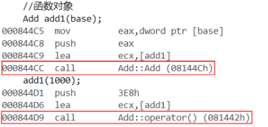
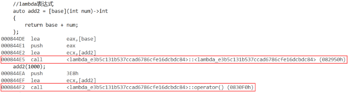

> [!NOTE]
>
> lambda表达式

lambda表达式是一个匿名函数，恰当使用lambda表达式可以让代码变简洁。

# lambda语法

`[捕获列表] (参数列表) mutable -> 返回类型 { 函数体 }`

- **`[]` 捕获列表**：Lambda 与外界变量沟通的桥梁（核心）。
- **`()` 参数列表**：和普通函数参数一致。
- **`mutable`**（可选）：允许在 Lambda 内部修改**按值捕获**的变量。
- **`-> 返回类型`**（可选）：通常可以省略，让编译器通过 `auto` 推导。

关于捕获列表[]：

- **`[x]`**：按值捕获变量 `x`（拷贝一份）。
- **`[&x]`**：按引用捕获变量 `x`（不拷贝，直接改原变量）。
- **`[=]`**：按值捕获（父）作用域内的**所有**局部变量。
- **`[&]`**：按引用捕获（父）作用域内的**所有**局部变量。
- **`[this]`**：在类成员函数中使用，捕获当前对象的指针。

说明：

- 父作用域指的是包含lambda函数的语句块。
- 语法上捕捉列表可由多个捕捉项组成，并以逗号分割。比如[=, &a, &b]。
- 捕捉列表不允许变量重复传递，否则会导致编译错误。比如[=, a]重复传递了变量a。
- 在块作用域以外的lambda函数捕捉列表必须为空，即全局lambda函数的捕捉列表必须为空。
- 在块作用域中的lambda函数仅能捕捉父作用域中的局部变量，捕捉任何非此作用域或者非局部变量都会导致编译报错。
- lambda表达式之间不能相互赋值，即使看起来类型相同。


# lambda的使用

## 利用捕获列表进行捕获

```c++
int main()
{
	int a = 10, b = 20;
	auto Swap = [&]
	{
		int tmp = a;
		a = b;
		b = tmp;
	};
	Swap(); //交换a和b
	return 0;
}
```

实际上只用到a和b，没有必要把父作用域的所有变量都进行捕获。

```c++
int main()
{
	int a = 10, b = 20;
	auto Swap = [&a, &b]
	{
		int tmp = a;
		a = b;
		b = tmp;
	};
	Swap(); //交换a和b
	return 0;
}
```

（实际当我们以`[&]`或`[=]`的方式捕获变量时，编译器也不一定会把父作用域中所有的变量捕获进来，编译器可能只会对lambda表达式中用到的变量进行捕获，没有必要把用不到的变量也捕获进来，这个主要看编译器的具体实现。）

## 按值方式捕获

如果以传值方式进行捕捉，那么首先编译不会通过，因为传值捕获到的变量默认是不可修改的，如果要取消其常量性，就需要在lambda表达式中加上mutable，并且此时参数列表不可省略。

```c++
int main()
{
	int a = 10, b = 20;
	auto Swap = [a, b]()mutable
	{
		int tmp = a;
		a = b;
		b = tmp;
	};
	Swap(); //交换a和b？
	return 0;
}

```

由于是按值捕获，所以对a和b的修改不会影响到外面的a和b，与函数按值传参一个道理。

默认情况下，Lambda 生成的 `operator()` 是 `const` 的，你不能修改**按值捕获**进来的变量。

```c++
int count = 0;
auto func = [count]() mutable {
    count++; // 只有加了 mutable 才能改，注意改的是 Lambda 内部的副本
    std::cout << count;
};
//下面这样写 只传入count不改写是没问题的
auto func = [count](){
    std::cout << count;
};
```

# lambda的底层

实际编译器在底层对于lambda表达式的处理方式，完全就是按照函数对象的方式处理的。

**函数对象**

函数对象就是我们平常所说的仿函数，就是在类中对`()`运算符进行了重载的类对象。

```c++
class Add
{
    public:
    Add(int base)
        :_base(base)
        {}
    int operator()(int num)
    {
        return _base + num;
    }
    private:
    int _base;
};
int main()
{
    int base = 1;

    //函数对象
    Add add1(base);
    add1(1000);

    //lambda表达式
    auto add2 = [base](int num)->int
    {
        return base + num;
    };
    add2(1000);
    return 0;
}
```

在上面的例子中，add1对象就叫函数对象，add1可以像函数一样使用。

而利用auto将lambda表达式赋值给add2对象后，add2对象和add1都可以像普通函数那样使用了。

通过反汇编，可以看到：



- 创建函数对象add1时会调用Add类的构造函数
- 使用函数对象add1时会调用Add类的`()`运算符重载



在观察lambda表达式的反汇编时会发现：

- 借助auto将lambda表达式赋值给add2对象时，会调用`<lambda_uuid>`类的构造函数。
- 在使用add2对象时，会调用`<lambda_uuid>`类的`()`运算符重载函数。

因为：本质就是**lambda表达式在底层被转换为了仿函数**。

- 当我们定义一个lambda表达式后，编译器会自动生成一个类，在该类中对`()`运算符进行重载，实际lambda函数体的实现就是这个仿函数的`operator()`的实现。
- 在调用lambda表达式时，参数列表和捕获列表的参数，最终都传递给了仿函数的`operator()`。

所以：

当你写下一个 Lambda 时，编译器在底层为你生成了一个**匿名的 struct/class**。

```c++
int offset = 10;
auto add_offset = [offset](int x) { return x + offset; };
```

实际上编译器会生成类似这样：

```c++
class __Lambda_unique_name {
    int offset; // 捕获的变量变成了成员变量
    public:
    __Lambda_unique_name(int os) : offset(os) {}
    int operator()(int x) const { return x + offset; } // 重载了 () 运算符
};
```

# lambda表达式之间不能相互赋值

就算是两个一模一样的lambda表达式：

- 因为lambda表达式底层的处理方式和仿函数是一样的，在VS下，lambda表达式在底层会被处理为函数对象，该函数对象对应的类名叫做<lambda_uuid>。
- 类名中的uuid叫做通用唯一识别码（Universally Unique Identifier），简单来说，uuid就是通过算法生成一串字符串，保证在当前程序当中每次生成的uuid都不会重复。
- lambda表达式底层的类名包含uuid，这样就能保证每个lambda表达式底层类名都是唯一的。

因此每个lambda表达式的类型都是不同的，这也就是lambda表达式之间不能相互赋值的原因。

```c++
int main()
{
    int a = 10, b = 20;
    auto Swap1 = [](int& x, int& y)->void
    {
        int tmp = x;
        x = y;
        y = tmp;
    };
    auto Swap2 = [](int& x, int& y)->void
    {
        int tmp = x;
        x = y;
        y = tmp;
    };
    cout << typeid(Swap1).name() << endl; //class <lambda_797a0f7342ee38a60521450c0863d41f>
    cout << typeid(Swap2).name() << endl; //class <lambda_f7574cd5b805c37a13a7dc214d824b1f>
    return 0;
}
```

# 闭包特性分析

**不带捕获的lambda表达式可以用函数指针表示，而带捕获的lambda表达式不行。**

不带捕获的 Lambda 可以转为函数指针，是因为编译器为其生成了**静态转换函数**，其逻辑不依赖实例状态；而带捕获的 Lambda 属于**有状态的闭包**，其执行依赖于成员变量（捕获的上下文），而标准的函数指针无法存储或传递这些状态数据

详细解释：

**对于普通函数**

对于普通函数，它是一段固定的机器码指令，存在于代码段，没有状态。

```c++
int add(int a, int b) {
    return a + b;
}
```

函数指针只能指向纯代码，不能带任何额外数据。

**不带捕获的 Lambda：纯代码**

如果不带捕获，编译器生成的匿名类中**没有成员变量**。它是一个空类。

- 它的 `operator()` 不依赖于任何特定的实例状态。
- 编译器会特意为这种 Lambda 生成一个**静态转换函数**。（不在这个匿名类里）
- **内存表现**：它就像一个普通的全局函数，地址是固定的，可以直接赋值给函数指针。

```c++
auto lambda = [](int x) { return x * x; };
// 编译器生成的类里有一个：
// static int _static_call(int x) { return x * x; }
// 以及：
// operator int(*)(int)() { return &_static_call; }
```

因为是 `static` 方法，它不依赖 `this` 指针，所以可以完美退化为函数指针。

**带捕获的 Lambda：结构体对象**

一旦有了捕获，这个 Lambda 就不再只是代码了，它变成了一个实实在在的**对象**。

- 捕获的变量变成了类里的**成员变量**。
- 执行逻辑时，必须知道这些成员变量的值（即必须知道 `this` 指针在哪里）。
- **内存表现**：它是一个包含数据的变量（闭包）。函数指针只指向代码段，它没有地方存放这些捕获到的“数据”。

```c++
int factor = 10;
auto lambda = [factor](int x) { return x * factor; };
// 编译器生成的类里：
// int factor; 
// int operator()(int x) const { return x * this->factor; }
```

如果要调用这个函数，必须传入 `this` 指针（即闭包对象的地址）才能找到 `factor`。而传统的函数指针 `int(*)(int)` 的参数列表里并没有位置留给 `this` 指针。

**提一嘴，std::function既可以接收普通函数，又可以接收带捕获的lambda表达式。**

`std::function` 内部实现了一种叫 **类型擦除** 的技术。它会自己开辟一小块内存来存放闭包对象（如果闭包太大则在堆上分配），从而弥补了原生函数指针无法存储数据的缺陷。

```c++
#include <functional>

int offset = 5;
// std::function 可以容纳带捕获的闭包
std::function<int(int)> func = [offset](int x) { return x + offset; };

// 这种写法虽然比函数指针重，但非常灵活
```

**顺便一提普通函数指针无法指向成员函数指针**

**普通函数：**

```c++
int add(int a, int b);
```

$add:(int,int)→int$

对应的函数指针是

```c++
int (*fp)(int,int);
```

在内存中：一个代码地址

**成员函数：**

```c++
struct A {
    int x;
    int foo(int a);
};
```

编译器会变为

```c++
int foo(A* this, int a);
```

$foo:(A∗,int)→int$

如果写：

```c++
int (*fp)(int);
fp = &A::foo;  // ❌
```

类型完全不匹配

```c++
int (*)(int)
int (A::*)(int)
//不是一回事
```

那么，既然这种情况下struct A的函数有this指针

```c++
int (*fp)(A*, int);
fp = &A::foo;   // 可以吗？
```

❌ 仍然不可以。

但这是 **调用时的语义模型**， 不是类型模型。

$int(∗)(A∗,int)$：一个普通函数，接收 (A*, int)

$int (A::*)(int)$：A类的成员函数

二者在 C++ 类型系统中 **没有任何隐式转换关系**，即便某些ABI在简单实现下可能看起来是一个地址，C++标准仍然禁止转换。

**成员函数指针语法规则：**

```c++
返回值 (类名::*指针名)(参数)
```

成员函数指针不是普通地址，因为在多继承，虚继承，虚函数等情况里，成员函数调用时可能需要：

- 调整this指针
- 查虚函数表
- 做偏移修正

因此成员函数指针可能是一个结构体，而不是单一地址。

可以暂时理解为$pmf=函数地址+可能的 this 偏移信息$
